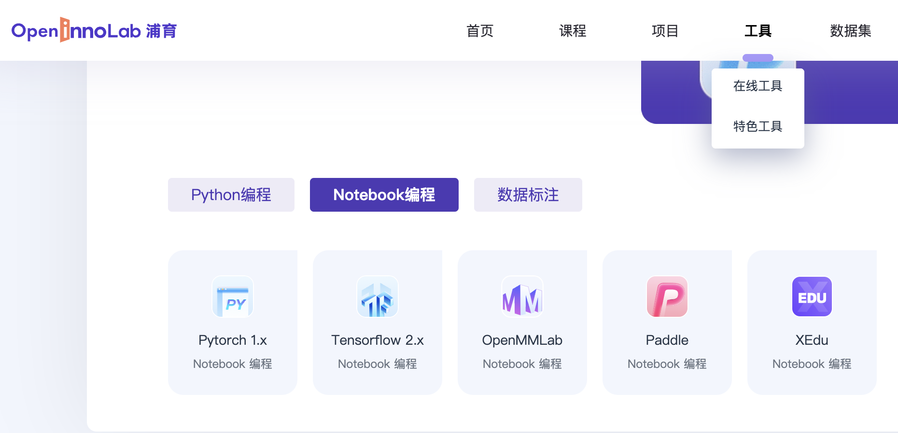

# XEdu的朋友圈

## 预装XEdu的AI实训平台

学习人工智能离不开实训平台（指可以在线训练模型的平台）。目前

### 1. 浦育平台（天然融合）

浦育平台天然支持XEdu。在浦育平台选择“在线工具”，在“人工智能工坊”中能看到“XEdu”。

地址：https://www.openinnolab.org.cn/

### 2. OpenHydra（学校教学强推!!!）

OpenHydra是一个适合中小学的开源人工智能教学平台。

因为学校机房的主机可能性能不强，但是又无法采购合适的intel新电脑或者nvidia显卡主机，尽管可以用浦育平台算力缓解燃眉之急，只需要浏览器就可以实现编程。但是受限于学校出口带宽等种种原因，AI教学依然受限，为此我们给出了一个新思路。可以用配置服务器的形式，为学校AI教学采购一款带GPU算力的服务器。有了服务器硬件之后，如何安装python环境，让学生能够像使用浦育平台一样使用校内等本地服务器算力呢？就请出我们的重磅嘉宾：**水螅矩阵（OpenHydra）** 一款开源的GPU算力分配系统。

[开源助力AI教育丨九州未来@2024 GDC主题工作坊圆满举办](https://zhuanlan.zhihu.com/p/688916114)

项目开源在[GitHub](https://github.com/openhydra/open-hydra) ，欢迎有能力的社区公民参与贡献！

### OpenHydra的能力

这套系统可以让一台服务器提供满足班级授课的python运行环境，同时内置了XEdu等多种预装环境，以及多套分层AI教学课程。当系统启动后，教师和学生可以登陆网页进行管理和使用。

学生登陆后，将可以启动EasyTrain、JupyterLab、VS Code等多种AI学习环境，使用浏览器即可完成Python程序运行（程序都运行在服务器系统上）。OpenHydra的强大之处在于让不同的学生可以同时使用一台服务器的资源进行计算，而这一切，仅仅基于浏览器就可以实现。

教师可以为系统添加更多的数据集、课程、算力、用户等必要的资源，同时，也可以对资源的分配进行控制。可以配置系统为纯CPU模式，也可以指定每个学生可以拥有的内存空间大小、显存空间大小，以及学生的预装python环境。

官方B站账号：[OpenHydra](https://space.bilibili.com/3546379869751358)

[OpenHydra平台操作指南](https://www.bilibili.com/video/BV1Hx421y7A8/?share_source=copy_web&vd_source=ca47cf8d0af314fd89055e7dc8d5dd86)

<iframe src="//player.bilibili.com/player.html?aid=1751384700&bvid=BV1Hx421y7A8&cid=1461907700&p=1" scrolling="no" border="0" frameborder="no" framespacing="0" allowfullscreen="true"> </iframe>

### OpenHydra的安装

最简单的安装教程参见：[U盘模式为服务器安装ISO](https://github.com/openhydra/open-hydra/blob/main/docs/iso-installation-guide.md)

简单总来来说，安装只有三步：

1. 烧录镜像（下载iso之后，Windows系统可以rufus进行烧录）

ISO镜像下载地址，见[U盘模式为服务器安装ISO](https://github.com/openhydra/open-hydra/blob/main/docs/iso-installation-guide.md) 。

视频演示见[OpenhydraUSB烧制指南](https://www.bilibili.com/video/BV1xH4y157pL/?share_source=copy_web&vd_source=ca47cf8d0af314fd89055e7dc8d5dd86) 。

<iframe src="//player.bilibili.com/player.html?aid=1051549108&bvid=BV1xH4y157pL&cid=1468597565&p=1" scrolling="no" border="0" frameborder="no" framespacing="0" allowfullscreen="true"> </iframe>

2. 配置系统（将U盘插入服务器，然后配置安装设置）

视频演示见[Openhydra安装教程](https://www.bilibili.com/video/BV1LK421x7Vc/?share_source=copy_web&vd_source=ca47cf8d0af314fd89055e7dc8d5dd86)

3. 等待系统安装完成（系统中间提示重启的时候，需要拔下U盘后手动确认，之后就等待系统安装完成即可）

视频演示见[Openhydra安装教程](https://www.bilibili.com/video/BV1LK421x7Vc/?share_source=copy_web&vd_source=ca47cf8d0af314fd89055e7dc8d5dd86)

### 3. Mo

## 预装XEdu的AI编程工具

### 1.Mind+

### 2.mPython

## 预装XEdu的AI硬件

### 1.行空板

