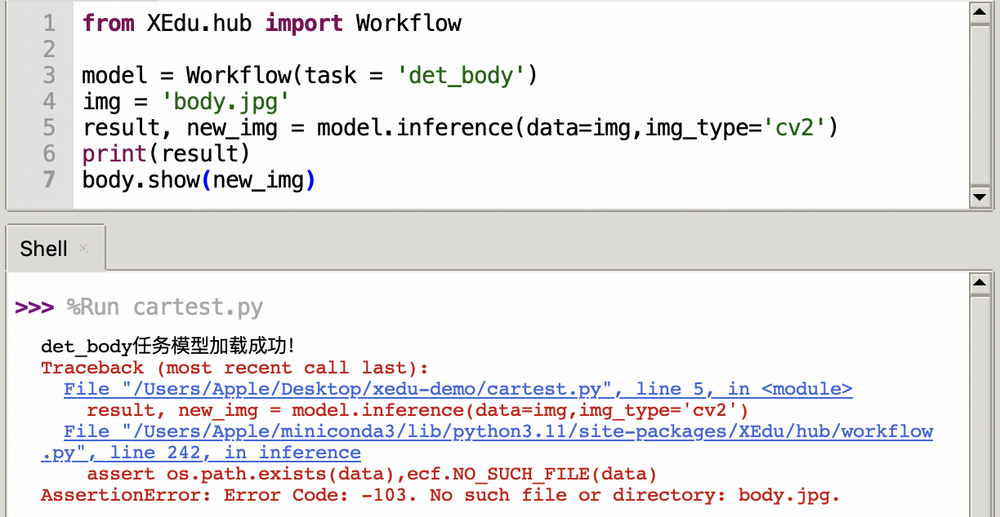

# XEdu的常见错误

## 令人困扰的错误
对于AI的初学者来说，并不像极客那样熟练掌握代码，或者热衷于解决一大堆的报错，每每遇到红色的输出就发慌。



其实我们也深受其害，有时候一个不经意的小错误，都可能造成数十行的报错提示，解决起来要花不少精力。因此，我们贴心的在XEdu底层开发时设计了错误检查的功能，把初学者常犯的错误用我们自己设计的错误提示体系来解释，希望能够让用户得到更精简且易懂的解释。当然，这里仅检查初学者常犯的错误，并不保证全面。

例如上面的错误，给出了提示`Error Code: -103. No such file or directory: body.jpg.`，虽然提示是英文的，但是不难看出，其实就是缺少对应的推理图片，可能是图片名称输错了，或者是图片不在对应的路径下，也可能是图片的后缀名不一致等等。当然，如果还是不清楚，可以拿着`103`这个编号（下文称为错误码），到下面的错误提示查询目录进行查询，可以看到中文的解释。

有了这样清晰明了的错误提示，再学习AI就不会那么心慌了。

## 错误提示设计理念
为了能够形成一套有效的错误检查语义体系，我们参考了经典的错误提示设计方案，定义了基本错误反馈。错误描述用英文（考虑到国际化）描述，同时输出错误码。为方便用户查找对应中文含义，可以在此页面Crtl+F调出网页搜索功能，输入错误吗，如“101”，就可以快速跳转到对应的错误释义。代码和目录编号一致，“1.1”的错误代码为“101”。

错误码格式为三段式：错误码+错误现象+原因阐述或解决方案。其中第三段不一定有保证完全匹配。

标准错误输出信息：Error Code: -编号,错误英文提示
示例：Error Code: -101, No such dataset file:XX/XXX/XXX/
## 错误提示查询目录
### 1.文件路径错误
#### 1.1 数据集的路径错误
不存在的目录，检查路径是否拼写正确。

英文提示设计：No such dataset directory:XX/XXX/XXX/
```
- Error Code: -101. No such dataset directory: xxx
```
#### 1.2 权重文件的路径错误
不存在的权重文件，检查路径是否拼写正确。

英文提示设计：No such checkpoint file:XX/XXX/XXX.pth
```
- Error Code: -102. No such checkpoint file: xxx
```
#### 1.3 要推理文件的路径错误
不存在的推理文件，检查路径是否拼写正确。

英文提示设计：No such file:XX/XXX/XXX.jpg
```
- Error Code: -103. No such file or directory: xxx
```
### 2.文件类型错误
#### 2.1 数据集的类型错误
只能是目录，而且目录文件要符合要求。

如果是imagenet：需要检查文件夹名称+txt名称，如果不存在，给出下载地址。指定的图片类别数量必须和数据集一致。val.txt行数也与实际图片数量一致。

如果是coco，类似检查。

英文提示设计：Dateset file type error

case1：传入参数类型不是字符串
```
- Error Code - 201. Dataset file type error, which should be <class 'str'> instead of <class 'int'>
```
case 2：数据集路径存在，且为字符串，但其中文件缺失
```
- Error Code - 201. Dataset file type error. No such file: '../dataset/cls/hand_gray/classes.txt'
```
case 3：验证集图片数和val.txt中不一致
```
- Error Code - 201. Dataset file type error. The number of val set images does not match that in val.txt.
```
case 4: 数据集中图片损坏

图片类型为gif的，也属于损坏。
```
- Error Code -201. The image file ../../dataset/xx.jpg is damaged.
```
#### 2.2 权重文件的类型错误
这里要注意区分权重文件的格式，这里要求选择后缀为pth的文件。

英文提示设计：Checkpoint file type error
```
- Error Code: -202. Checkpoint file type error: xxx
```
#### 2.3 要推理文件的类型错误
要求是图片类型的文件，如jpg、png、bmp等受支持的文件格式。

英文提示设计：File type error
```
- Error Code: -203. Inferable file type error: xxx. Ensure your file is in one of the following formats: jpg, png, jpeg, jiff or bmp.
```
### 3.参数值错误（等于号右边）
#### 3.1 device设置错误
设备名称目前只能是是cpu和cuda，并且需要以字符串形式输入。

英文提示设计：No such argument.
```
- Error Code: -301. No such argument: xxx
```
```
- Error Code: -301. Your device doesn't support cuda.
```
#### 3.2 主干网络名称错误
目前只支持‘LeNet’、‘MobileNet’、‘ResNet18’、‘ResNet50’等网络，可以用cls.sota()来查看。

英文提示设计：No such argument
```
- Error Code: -302. No such argument: xxx. Currently xxx is available.
```
#### 3.3 validate设置错误
只能是True和False。

英文提示设计：No such argument.
```
- Error Code: -303. No such argument: xxx
```
#### 3.4 推理图片格式错误
变量类型必须是str（图片路径）或list【str】（多张图）或numpyarray（点阵图）。（bug目前可视化仅支持路径）
```
- Error Code: - 304. No such argument: (1, 'asd') which is <class 'tuple'>
```
#### 3.5 fast_infer之前，未正确使用load_checkpoint载入权重

### 4.网络连接相关错误
敬请期待，后续会开发网络相关功能。
### 5. 参数名称错误（等于号左边）
#### 5.1 传入的参数名称错误
无此参数，请重新输入。

英文提示设计：No such parameter.
```
- Error Code: - 501. No such parameter: xxx
```

### 6. 代码逻辑错误
#### 6.1 未知图像展示
需要先做图像可视化，再展示。

英文提示设计：No rendered image to show.
```
- Error Code: - 601. No rendered image to show. Please inference() before show().
```
#### 6.2 未知数据推理
需要先载入数据，然后再推理。

英文提示设计：No context to inference. 
```
- Error Code: - 602. No context to inference. Please load_context() before inference().
```

### 7. 数据处理错误
#### 7.1 标注数据丢失
对于目标检测任务，缺少了标注的json文件，可能需要检查路径或重新标注。

英文提示设计：Annotation for xxx is missed.
```
- Error Code: - 701. Annotation for xxx is missed. Please check annotation file(.json) and relabel it.
```
