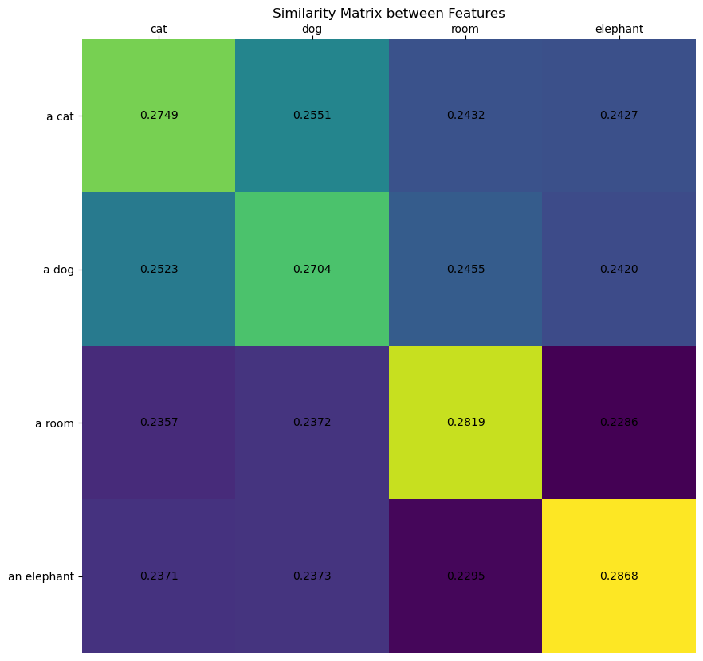
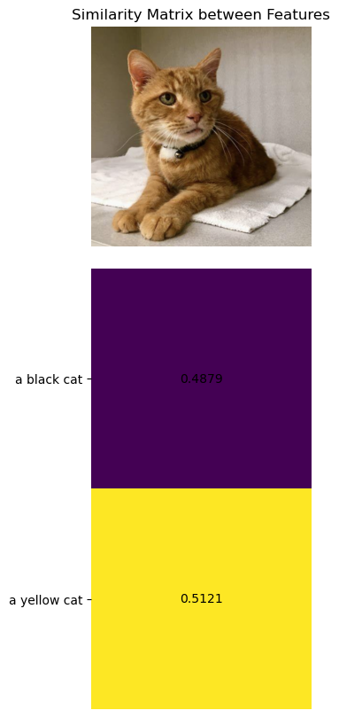
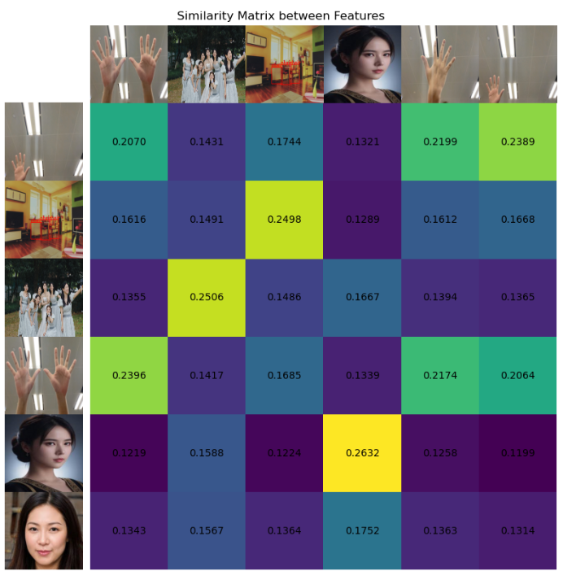

# XEdu的常见函数

## XEdu.utils中的函数

在XEdu-python库中，我们封装了一系列数据处理函数，可以帮助你方便地完成AI推理和部署。这些函数被封装在XEdu.utils中，你可以这样引入它们：

```python
from XEdu.utils import *
```

或者具体写明引入的函数

```python
from XEdu.utils import softmax, cosine_similarity, get_similarity, visualize similarity
```

下面对函数展开使用介绍。

### 归一化指数函数：softmax

1.函数说明

softmax函数是一个常用的非线性函数，它用于将一个numpy数组映射到0到1之间的数值，同时让所有数值之和为1。神经网络最终输出的结果是一串数字，如果想要把数字映射为各类概率，那么使用softmax函数再好不过了。

2.使用示例

```python
from XEdu.utils import *
import numpy as np
data = np.array([[1,2],[3,3]])
output = softmax(data)
print(output)
# [[0.2689414213699951, 0.7310585786300049], [0.5, 0.5]]
```

在这个例子中，需要处理两组数据，[1,2]和[3,3]，对于第一组数据，按照softmax算法（一种指数算法）进行映射，得到输出是[0.2689414213699951, 0.7310585786300049]，而第二组数据两个数值相等，得到就是平均分配的[0.5, 0.5]。每一组数据经过处理之后的和是1。

3.参数说明

输入参数：

`x`：numpy array，对数据尺寸没有要求。

输出结果：

list，形状与输入相同，数组映射到0到1之间的数值，同时所有数值之和为1。

4.函数实现揭秘

```python
def softmax(x):
    x1 = x - np.max(x, axis = 1, keepdims = True) #减掉最大值防止溢出    
    x1 = np.exp(x1) / np.sum(np.exp(x1), axis = 1, keepdims = True)
    return x1.tolist()
```

### 余弦相似性计算：cosine_similarity

1.函数说明

该函数可以比较两个向量特征（如embedding序列）的相似度，这里的相似度是以余弦相似度为计算指标的，在高中我们就学习过余弦定理，这里的余弦相似度公式也是类似的，具体计算可以参考[这里](https://zhuanlan.zhihu.com/p/43396514)。

输出的数据范围（计算结果）为-1到1。-1意味着两个向量指向的方向正好截然相反，1表示它们的指向是完全相同的，0通常表示它们之间是独立的。

2.使用示例

```python
from XEdu.utils import *
output = cosine_similarity(txt_embeddings1,txt_embeddings2)
print(output)
# [[0.86931829 0.94491118 0.94491118]
#  [0.98270763 0.94491118 0.83152184]]
```

3.参数说明

`embeddings_1`：一个numpy数组，数据维度为(N, D)，表示N个具有D维的embedding；

`embeddings_2`：另一个numpy数组，数据维度为(M, D)，表示M个具有D维的embedding；

4.函数实现揭秘

该函数实际是利用了numpy的矩阵乘法运算符`@`，numpy的矩阵乘法运算符`@`可以直接实现两个矩阵的点积，从而计算两个embedding序列的余弦相似度。最终输出的结果尺度为(N, M)。

```python
def cosine_similarity(embeddings_1: np.ndarray, embeddings_2: np.ndarray) -> np.ndarray:
    """Compute the pairwise cosine similarities between two embedding arrays.

    Args:
        embeddings_1: An array of embeddings of shape (N, D).
        embeddings_2: An array of embeddings of shape (M, D).

    Returns:
        An array of shape (N, M) with the pairwise cosine similarities.
    """

    for embeddings in [embeddings_1, embeddings_2]:
        if len(embeddings.shape) != 2:
            raise ValueError(
                f"Expected 2-D arrays but got shape {embeddings.shape}."
            )

    d1 = embeddings_1.shape[1]
    d2 = embeddings_2.shape[1]
    if d1 != d2:
        raise ValueError(
            "Expected second dimension of embeddings_1 and embeddings_2 to "
            f"match, but got {d1} and {d2} respectively."
        )

    def normalize(embeddings):
        return embeddings / np.linalg.norm(embeddings, axis=1, keepdims=True)

    embeddings_1 = normalize(embeddings_1)
    embeddings_2 = normalize(embeddings_2)

    return embeddings_1 @ embeddings_2.T
```

5.更多用法

结合XEduHub`wf(task='embedding_image')`或者`wf(task='embedding_text')`的任务中，对数据进行embedding操作之后，可以计算不同数据之间的相似度，就可以使用该函数。embedding会在[图像嵌入和文本嵌入](https://xedu.readthedocs.io/zh/master/xedu_hub/introduction.html#id92)中用到，具体案例可参见：[教程1-7](https://www.openinnolab.org.cn/pjlab/project?id=65518e1ae79a38197e449843&sc=62f33550bf4f550f3e926cf2#public)

对两组文本转换出的向量进行相似度比较，可以得到一个比较矩阵，代表每两个字符串之间的相似度，我们可以看到对角线上的词相似度是最高的。下面这个例子将让你有更好的理解：

```python
from XEdu.hub import Workflow as wf # 导入库
from XEdu.utils import *
txt_emb = wf(task='embedding_text')# 实例化模型
txts1 = ['cat','dog'] # 指定文本1
txts2 = ['a cat','a dog','a room','an elephant'] # 指定文本2
txt_embeddings1 = txt_emb.inference(data=txts1) # 获得向量1
txt_embeddings2 = txt_emb.inference(data=txts2) # 获得向量2
print(txt_embeddings1.shape)
# (2, 512) 两组文本中的字符串数量无需一致，但都会转换为512个特征
output = cosine_similarity(txt_embeddings1,txt_embeddings2) # 计算向量1和向量2的余弦相似度
print(output)
# [[0.94926983 0.86368805 0.7956152  0.8016052 ]
#  [0.89295036 0.9511493  0.8203819  0.82089627]]
print(softmax(output))
# [[0.27485617995262146, 0.25231191515922546, 0.23570789396762848, 0.2371240258216858], 
#  [0.25507545471191406, 0.2703610360622406, 0.23722068965435028, 0.2373427450656891]]
```

图片之间也可以计算相似度，给定的列表中，需要指明各图片的文件所在路径。

```python
from XEdu.hub import Workflow as wf # 导入库
from XEdu.utils import *
img_emb = wf(task='embedding_image') # 实例化模型
image_embeddings1 = img_emb.inference(data='demo/cat.png') # 模型推理
image_embeddings2 = img_emb.inference(data='demo/dog.png') # 模型推理
output = cosine_similarity(image_embeddings1,image_embeddings2) # 计算向量1和向量2的余弦相似度
print(output)
print(softmax(output))
```

### get_similarity

1.函数说明

cosine_similarity函数能够计算两个embedding向量的余弦相似度，而get_similarity则提供了更丰富的选择，该函数可以选择相似度的比较算法，可选'cosine', 'euclidean', 'manhattan', 'chebyshev', 'pearson'，默认是'cosine'（method='cosine'），输出概率映射结果。

2.使用示例

```python
from XEdu.utils import * # 导入库
logits = get_similarity(image_embeddings, txt_embeddings,method='cosine') # 计算余弦相似度
print(logits) # 输出相似度计算结果
# [[0.48788464069366455, 0.5121153593063354]]
```

可以看出，使用这个函数是对前面cosine_similarity和softmax的统一封装，这里经历了计算相似度，然后进行归一化的过程。

3.参数说明

输入参数：

`embeddings_1`：一个numpy数组，数据维度为(N, D)，表示N个具有D维的embedding；

`embeddings_2`：另一个numpy数组，数据维度为(M, D)，表示M个具有D维的embedding；

`method`：计算方法，可选'cosine', 'euclidean', 'manhattan', 'chebyshev', 'pearson'，默认是'cosine'（method='cosine'）；

`use_softmax`：是否进行归一化，默认为True，即进行归一化。

输出结果：

list，形状与输入相同，数组映射到0到1之间的数值，同时所有数值之和为1。

4.函数实现揭秘

该函数实际是利用了numpy的矩阵乘法运算符`@`，numpy的矩阵乘法运算符`@`可以直接实现两个矩阵的点积，从而计算两个embedding序列的余弦相似度。最终输出的结果尺度为
输入还可以指定计算方法method，可选'cosine', 'euclidean', 'manhattan', 'chebyshev', 'pearson'，默认是'cosine'（method='cosine'）。

对于相似度计算结果可选择是否进行归一化，默认是进行归一化（use_softmax=True）。

```python
def get_similarity(embeddings_1: np.ndarray, embeddings_2: np.ndarray,method:str='cosine',use_softmax:bool=True) -> np.ndarray:
    """Compute pairwise similarity scores between two arrays of embeddings.
    Args:
        embeddings_1: An array of embeddings of shape (N, D) or (D,).
        embeddings_2: An array of embeddings of shape (M, D) or (D,).
        method: The method used to compute similarity. Options are 'cosine', 'euclidean', 'manhattan', 'chebyshev', 'pearson'. Default is 'cosine'.
        use_softmax: Whether to apply softmax to the similarity scores. Default is True.

    Returns:
        An array with the pairwise similarity scores. If both inputs are 2-D,
            the output will be of shape (N, M). If one input is 1-D, the output
            will be of shape (N,) or (M,). If both inputs are 1-D, the output
            will be a scalar.
    """
    if embeddings_1.ndim == 1:
        # Convert to 2-D array using x[np.newaxis, :]
        # and remove the extra dimension at the end.
        return get_similarity(
            embeddings_1[np.newaxis, :], embeddings_2
        )[0]

    if embeddings_2.ndim == 1:
        # Convert to 2-D array using x[np.newaxis, :]
        # and remove the extra dimension at the end.
        return get_similarity(
            embeddings_1, embeddings_2[np.newaxis, :]
        )[:, 0]
    if method == 'cosine':
        similarity =  cosine_similarity(embeddings_1, embeddings_2) * 100
    elif method == 'euclidean':
        distance = np.array([[np.linalg.norm(i - j) for j in embeddings_2] for i in embeddings_1]) * 100
        sigma = np.mean(distance)  # Or choose sigma in some other way
        similarity = np.exp(-distance ** 2 / (2 * sigma ** 2)) * 100
    elif method == 'pearson':
        similarity = np.array([[np.corrcoef(i, j)[0,1] for j in embeddings_2] for i in embeddings_1]) * 100
    else:
        raise ValueError(
            f"Expected method to be cosine,euclidean and pearson but got {method}."
        )
    if use_softmax:
        return softmax(similarity)
    else:
        return similarity

```

5.更多用法

同样的，结合XEduHub`wf(task='embedding_image')`或者`wf(task='embedding_text')`的任务中，对数据进行embedding操作之后，可以计算不同数据之间的相似度，就可以使用该函数。embedding会在[图像嵌入和文本嵌入](https://xedu.readthedocs.io/zh-cn/master/xedu_hub/introduction.html#id92)中用到，具体案例可参见：[教程1-7](https://www.openinnolab.org.cn/pjlab/project?id=65518e1ae79a38197e449843&sc=62f33550bf4f550f3e926cf2#public)

可计算图文、文文、图图的相似度。

### cosine_similarity 函数和get_similarity函数的联系

get_similarity 函数实际上是对 cosine_similarity 函数的扩展和泛化。它不仅支持余弦相似度，还支持其他距离测量方法，并提供了可选的 softmax 应用，使其功能更为丰富和灵活。在 get_similarity 中使用 'cosine' 方法时，它会调用 cosine_similarity 函数来计算余弦相似度，同时还有是否进行归一化的处理。因此 cosine_similarity 可以视为 get_similarity 的一个特定实现。

### 相似度计算结果可视化：visualize_similarity

1.函数说明

为了能够更加直观地展示相似度计算之后的结果，这里还提供了可视化相似度的方法，调用这个函数，可以将数值映射为不同颜色深度的图像，方便对比。一般配合前面介绍的两个similarity计算函数使用。

2.使用示例

```python
# 文本-文本比较相似度
from XEdu.hub import Workflow as wf
from XEdu.utils import * 
txt_emb = wf(task='embedding_text')# 实例化模型
txts1 = ['cat','dog','room','elephant'] # 指定文本
txts2 = ['a cat','a dog','a room','an elephant'] # 指定文本
txt_embeddings1 = txt_emb.inference(data=txts1) # 模型推理
txt_embeddings2 = txt_emb.inference(data=txts2) # 模型推理

logits = get_similarity(txt_embeddings1, txt_embeddings2,method='cosine') # 计算余弦相似度
print(logits)
visualize_similarity(logits,txts1,txts2) # 可视化相似度矩阵
```


从图中可以看出，对不同词向量之间进行的对比，对角线上的几个词的相似度是最高的。

3.参数说明

输入参数：

`similarity`: 前面通过cosine_similarity或get_similarity计算得到的相似度矩阵；

`x`: List[str]，原始图片或文本的列表；

`y`: List[str]，原始图片或文本的列表。

`figsize`:可视化时展示原始图片（如有传入）的尺寸，默认为(10,10)。

输出结果：

一个matplotlib格式的图片。

4.函数实现揭秘

```
def visualize_similarity(similarity, x,y,figsize=(10,10)):
    """Visualize the similarity matrix.

    Args:
        similarity: similarity scores matrix. List|ndarray of shape (N, M) or (M, N).
        x: A list of images or texts for each row of the similarity matrix.  List[str]
        y: A list of images or texts for each column of the similarity matrix.  


    Returns:
        A matplotlib figure object.
    """
    # 中文字体，y轴文本/图像
    # plt.rcParams['font.sans-serif']=['times'] #用来正常显示中文标签
    # plt.rcParams['axes.unicode_minus'] = False #用来正常显示负号

    # 图像尺寸

    plt.figure(figsize=figsize)
    if isinstance(similarity, list):
        similarity = np.array(similarity).T
    else:
        similarity = similarity.T
    if isinstance(x[0], str) and os.path.exists(x[0]):
        x_im = True
        images = [plt.imread(image,0) for image in x]
    else:
        x_im = False
        images = x
    if isinstance(y[0], str) and os.path.exists(y[0]):
        y_im = True
        texts = [plt.imread(image,0) for image in y]
    else:
        y_im = False
        texts = y

    count = len(similarity)
    plt.imshow(similarity, vmin=max(0.0, np.min(similarity)), vmax=np.max(similarity), cmap='viridis', interpolation='nearest')
    # plt.colorbar()
    if x_im and y_im:
        plt.xticks([])
        plt.yticks([])
        for i, image in enumerate(texts):
            plt.imshow(image, extent=( -1.6, -0.6,i + 0.5, i - 0.5,), origin="lower")
        for i, image in enumerate(images):
            plt.imshow(image, extent=(i - 0.5, i + 0.5, 6.5, 5.5), origin="lower")
    if y_im and not x_im: # y轴是图片，x轴是文本
        plt.yticks([]) # 去掉y轴刻度
        for i, image in enumerate(texts):
            plt.imshow(image, extent=( -1.6, -0.6,i + 0.5, i - 0.5,), origin="lower")
        plt.tick_params(axis='x', which='both', bottom=False, top=True, labelbottom=False,labeltop=True,pad=0)
        plt.xticks(range(len(images)), images,position=(0,1),)#,fontproperties='SimHei')#, fontsize=18)
    if not y_im and x_im: # y轴是文本，x轴是图片
        plt.yticks(range(count), texts)# , fontsize=18)
        plt.xticks([])
        for i, image in enumerate(images):
            plt.imshow(image, extent=(i - 0.5, i + 0.5, -1.6, -0.6), origin="lower")
    if not x_im and not y_im: # x轴和y轴都是文本
        plt.yticks(range(count), texts)# , fontsize=18)
        plt.tick_params(axis='x', which='both', bottom=False, top=True, labelbottom=False,labeltop=True,pad=0)
        plt.xticks(range(len(images)), images,position=(0,1),)#,fontproperties='SimHei')#, fontsize=18)

    for x in range(similarity.shape[1]):
        for y in range(similarity.shape[0]):
            plt.text(x, y, f"{similarity[y, x]:.4f}", ha="center", va="center")#, size=12)

    for side in ["left", "top", "right", "bottom"]:
        plt.gca().spines[side].set_visible(False)
    if x_im and y_im:
        plt.xlim([-1.6,len(similarity[1]) - 0.5])
        plt.ylim([-0.5, len(similarity) + 0.5])
    elif x_im and not y_im:
        plt.xlim([-0.5, len(similarity[1]) - 0.5])
        plt.ylim([len(similarity)  - 0.5, -1.6])
    elif y_im and not x_im:
        plt.ylim([-0.5, len(similarity) - 0.5])
        plt.xlim([-1.6,len(similarity[1]) - 0.5])
        
    plt.title("Similarity Matrix between Features")
    plt.show()
    return plt
```

5.更多用法

图文相似度比较可视化结果：



图图相似度比较可视化结果：

