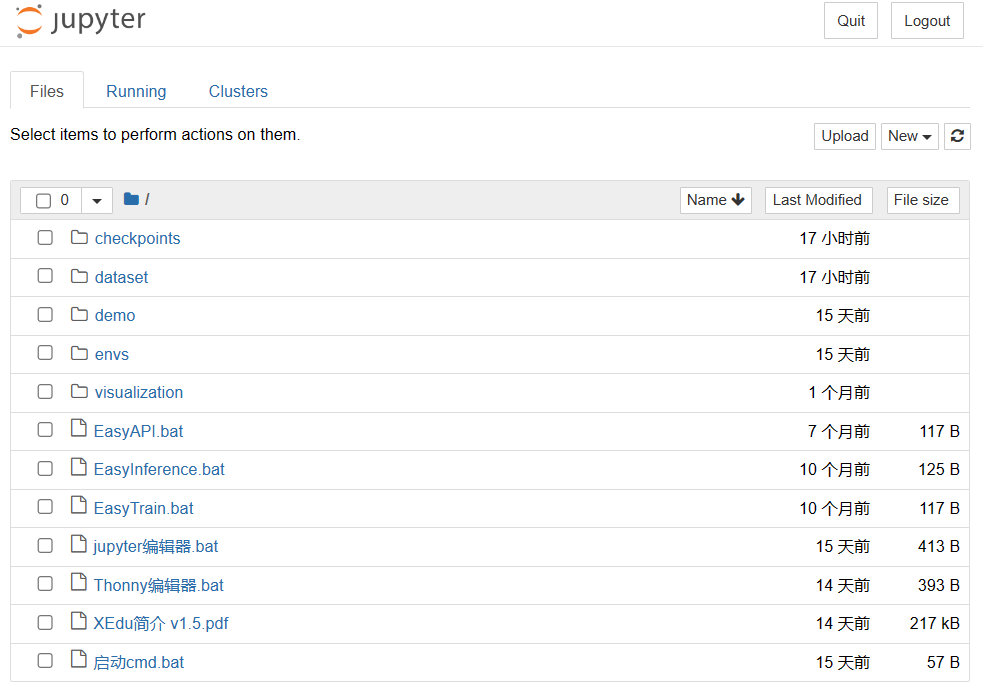
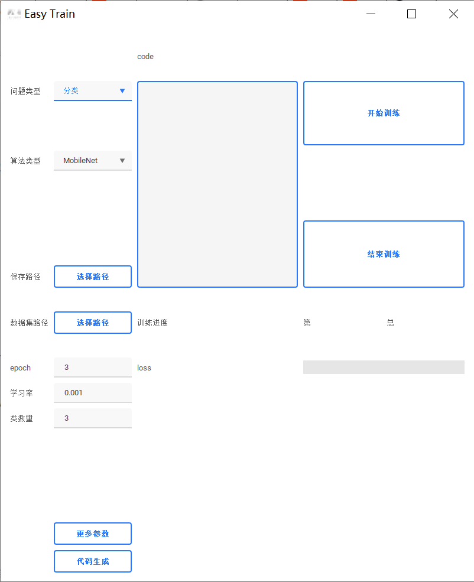
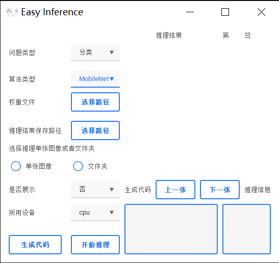

# XEdu的安装和下载

可选的安装方式
==============

为了满足广大中小学师生的需求，XEdu安装方式分为一键安装包安装和pip安装。一键安装包版包含MMEdu、BaseML、BaseNN三个模块的基础功能，同时内置了一套EasyDL系列工具，分"EasyTrain.bat"、"EasyInference.bat"和"EasyAPI.bat"这三个可视化工具，定期更新。pip安装方式需用户自己分模块安装，各模块更新同步工具开发进度。后续还将推出docker容器镜像，敬请期待。

初学者安装强推!!!不会让人失望的一键安装包
=========================================

即刻体验XEdu一键安装包，开始！
------------------------------

下载工具：XEdu一键安装包

下载方式

飞书网盘：https://p6bm2if73b.feishu.cn/drive/folder/fldcn67XTwhg8qIFCl8edJBZZQb

百度网盘:<https://pan.baidu.com/s/1UDt-GwHriCB_rewl8kCrUA?pwd=2022>
提取码:2022

第一步：双击运行，将自解压为XEdu文件夹（注意！避免踩坑推荐安装到纯英文路径下）。


第二步：您可以根据个人喜好，选择自己习惯的IDE。

1）使用XEdu自带的Thonny。

Thonny是一款好用的Python轻量级IDE。其最突出的两个特点便是是简洁性和交互性。打开根目录下的"Thonny编辑器.bat"文件快捷方式即可打开Thonny。使用Thonny打开"demo"文件夹中的py文件，如"MMEdu\_cls\_demo.py"，点击"运行"的"将文件作为脚本运行"即可运行代码，界面如下图所示。


2）使用XEdu自带的Jupyter。

Jupyter
Notebook是基于网页的用于交互计算的应用程序。其可被应用于全过程计算：开发、文档编写、运行代码和展示结果。它相对简单，对用户也更加友好，适合初学者。

打开根目录下的"jupyter编辑器.bat"，即自动启动浏览器并显示界面，如下图所示。



使用常用工具栏对代码进行操作，如"运行"，可以在单元格中编写文本或者代码，执行代码的结果也将会在每个单元下方呈现。可以逐个运行单元格，每点击一次，仅运行一个单元格。单元格左侧\[\*\]内的星号变为数字，表示该单元格运行完成。此时可打开"demo"文件夹中的ipynb文件，如"MMEdu\_cls\_notebook.ipynb"。


3）使用cmd安装用户库。

python中最常用的库管理工具pip，可以使用cmd命令行来运行，打开根目录下的"启动cmd.bat"可以打开cmd命令行界面，如下图所示。


在其中输入想要安装的库文件即可，如"pip install rarfile"。

4）使用其他IDE。

如果您需要使用其他IDE，那么需要您自己配置Python编译器，配置方法如下。

-   配置环境路径

①打开您的IDE，如PyCharm、Thonny等。

②配置Python编译器，路径为解压路径下的"envs"文件夹下的"interpreter"文件夹中的"python.exe"文件。

-   执行demo文件

用IDE打开解压路径下的py文件，如"cls\_demo.py"，点击"运行"。运行效果应和Thonny一样。

第四步："EasyTrain.bat"、"EasyInference.bat"、"EasyAPI.bat"体验。

XEdu一键安装包内置了一套EasyDL系列工具，分"EasyTrain.bat"、"EasyInference.bat"和"EasyAPI.bat"这三个可视化工具。

双击即可体验，体验时操作根据界面完成即可。

①双击"EasyTrain.bat"，根据界面完成训练；



②双击"EasyInference.bat"，根据界面完成推理；



③双击"EasyAPI.bat"，根据界面完成服务部署。


更多EasyDL系列工具详见[EasyDL系列无代码工具](https://xedu.readthedocs.io/zh/latest/easydl.html#easydl)。

揭秘一键安装包功能
------------------

XEdu一键安装版是一个压缩包，解压后即可使用。

XEdu的根目录结构如下：

``` {.plain}
XEdu
├── checkpoints
├── dataset
├── demo
├── envs
├── visualization
├── EasyAPI.bat
├── EasyInference.bat
├── EasyTrain.bat
├── jupyter编辑器.bat
├── Thonny编辑器.bat
├── 启动cmd.bat
├── XEdu简介 v1.5.pdf
```

接下来对每层子目录进行介绍。

**checkpoints目录：**

存放各个模块的预训练模型的权重文件，分别放在以模块名称命名的文件夹下，如"cls\_model"。

**dataset目录：**

存放为各个模块任务准备的数据集，分别放在以模块名称命名的文件夹下，如"cls"。同时提供了部分数据集的说明文档，如"添加猫狗数据集.txt"，文档提供了数据集下载链接、使用说明、添加数据集流程等。

**demo目录：**

存放各个模块的测试程序，如"cls\_demo.py"，并提供了测试图片。测试程序包括`py`文件和`ipynb`文件，可支持各种"Python
IDE"和"jupyter
notebook"运行，可运行根目录的"Thonny编辑器.bat"和"jupyter编辑器.bat"后打开测试程序。

**envs目录：**

存放XEdu各模块运行所需的环境和中小学课程常用的库。

**visualization目录：**

存放可视化界面。

**EasyAPI.bat：**

支持无代码WebAPI部署的可视化工具。

主要功能包括：1）选择功能（图像分类、目标检测）；2）选择算法和权重文件；3）启动Web服务（生成代码）；4）提供HttpPost（基于request）的范例；5）测试。

**EasyInference.bat：**

支持无代码推理的可视化工具。

主要功能包括：1）选择功能（图像分类、目标检测）；2）选择算法和权重文件；3）选择输入图片；4）开始推理（出现推理原始信息和解释）；5）查看代码（查看相应的Python推理代码）。

**EasyTrain.bat：**

支持无代码训练的可视化工具。

主要功能包括：1）选择功能（图像分类、目标检测）；2）选择算法（列出支持的算法-如列出文件夹名称等实现方法）；3）选择数据集（分类数量之类的设置）；4）选择模型文件保存位置；5）开始训练（看到训练进度和可视化折线图，
支持配置训练参数，支持继续训练）；6）查看代码（查看相应的Python训练代码）。

**jupyter编辑器.bat：**

双击打开即运行jupyter notebook，初始化完成后第二次可直接打开。

**Thonny编辑器.bat：**

双击打开即运行Thonny，一款轻量级Python IDE。

**XEdu简介 v1.5.pdf：**

XEdu一键安装包说明文档。

使用pip安装
===========

XEdu的MMEdu、BaseML、BaseNN等各模块库均已支持pip安装并会持续迭代。

### 1. pip安装MMEdu

#### 1.1 准备工作

强烈推荐你在Anaconda的基础上安装MMEdu，可以避免很多的版本冲突问题。

#### 1）安装Anaconda

若您已经安装好conda，该步骤可跳过。

**下载**

首先打开Anaconda官网：https://www.anaconda.com/

点击`Download`开始下载，下载完成后得到exe文件。

**安装**

双击exe文件即可开始安装（一般下载完成后会自动打开安装界面无需点击exe文件，若没有自动打开安装页面再点击此exe文件）。

打开安装界面后，依次选择`Next` -\> `I Agree` -\> `All Users` -\> `Next`
-\> `Next` -\> `Add Anaconda3 to the system PATH environment variable`
-\> `Install` -\> `Next` -\> `Next` -\> `Finish`

#### 2）安装python编辑器

若您已经安装好合适的python编辑器，该步骤可跳过。

此处以安装Thonny为例，其他编辑器例如Pycharm，VScode等也支持，用户自行配置好Python编译器即可。

**下载**

首先打开Thonny官网：https://thonny.org/

右上角选择合适的操作系统点击下载，此处以windows为例

**安装**

双击exe文件即可开始安装（一般下载完成后会自动打开安装界面无需点击exe文件，若没有自动打开安装页面再点击此exe文件）

打开安装界面后，依次选择`Install for me only` -\> `Next` -\> `Next` -\>
`Next` -\> `Next` -\> `Next` -\> `Install` -\> `Finish`

**运行**

在安装好Thonny之后，在第一次运行的时候，会提示选择界面语言和初始设置，选择'Standard'模式即可。

**配置Thonny的Python解释器**

点击Thonny主界面右下角的Python版本号，可以选择对应的Python解释器，第一次配置点击`Configure inter preter`，弹出的窗口中，第一个下拉栏选择`可选的python3解释器或虚拟环境`，
第二个下拉栏找到自己之前安装的anaconda环境中的python解释器位置。点击确认即可使用该python解释器。

### 1.2 安装MMEdu(CPU版本)

#### 1）Linux安装MMEdu

点击鼠标右键，打开终端。

终端中输入pip install MMEdu即可安装。

``` {.powershell}
$ pip install MMEdu
```

注：为避免出现版本冲突，建议新建一个conda环境，并在新环境中执行以上命令（注：要求python\<3.9）。

``` {.powershell}
$ conda create -n your_env_name python=3.8
$ conda activate your_env_name
$ pip install MMEdu
```

注：请将命令中的"your\_env\_name"换成你喜欢的名称，如"mmedu"。

#### 2）Windows安装MMEdu

同时按下win+r，输入cmd，回车，打开一个命令行窗口。

在命令行中使用pip安装即可。

``` {.powershell}
$ pip install MMEdu -f https://download.openmmlab.com/mmcv/dist/cpu/torch1.8.0/index.html
```

注：为避免出现版本冲突，建议新建一个conda环境，并在新环境中执行以上命令（注：要求python\<3.9）。

``` {.powershell}
$ conda create -n your_env_name python=3.8
$ conda activate your_env_name
$ pip install MMEdu -f https://download.openmmlab.com/mmcv/dist/cpu/torch1.8.0/index.html
```

如使用MMEdu的MMDet模块出现问题，可见后文[关于pip安装MMEdu的详细说明](https://xedu.readthedocs.io/zh/master/mmedu/installation.html#pip)。

### 1.3 安装MMEdu(GPU版本)

首先安装对应自己cuda版本的pytorch，安装命令可在以下网址中进行查询：https://pytorch.org/get-started/locally/

可以在命令行中使用`nvidia-smi`指令查询自己的cuda版本。

例如，若cuda版本为10.1，想要安装1.8.1版本的pytorch，则安装命令为：

``` {.powershell}
$ pip install torch==1.8.1+cu101 torchvision==0.9.1+cu101 torchaudio==0.8.1 -f https://download.pytorch.org/whl/torch_stable.html
```

其次，根据torch版本和cuda版本安装mmcv。

``` {.powershell}
$ pip install mmcv-full -f https://download.openmmlab.com/mmcv/dist/{cu_version}/{torch_version}/index.html
```

其中 `{cu_version}` 和 `{torch_version}`
根据自身需求替换成实际的版本号。

例如想安装和 `CUDA 10.1`、`PyTorch 1.8.0` 兼容的
`mmcv-full`，使用如下替换过的命令

``` {.powershell}
$ pip install mmcv-full==1.4.5 -f https://download.openmmlab.com/mmcv/dist/cu101/torch1.8.0/index.html
```

最后安装MMEdu。

``` {.powershell}
$ pip install MMEdu
```

### 2. pip安装BaseML

`pip install baseml` 或 `pip install BaseML`

### 3. pip安装BaseNN

----------------

`pip install basenn` 或 `pip install BaseNN`

docker容器镜像
==============

敬请期待

如何快速查看XEdu各模块库的版本
==============================

打开python终端，执行以下命令即可查看XEdu各模块库的版本。当前最新版本是0.04。


注：目前版本MMEdu仅支持CPU。

如何卸载XEdu各模块库
====================

如果XEdu某模块库出现异常情况，可以尝试使用`uninstall`命令卸载，然后再使用install命令安装。参考代码：

    $ pip uninstall MMEdu
    $ pip uninstall BaseNN
    $ pip uninstall BaseML
