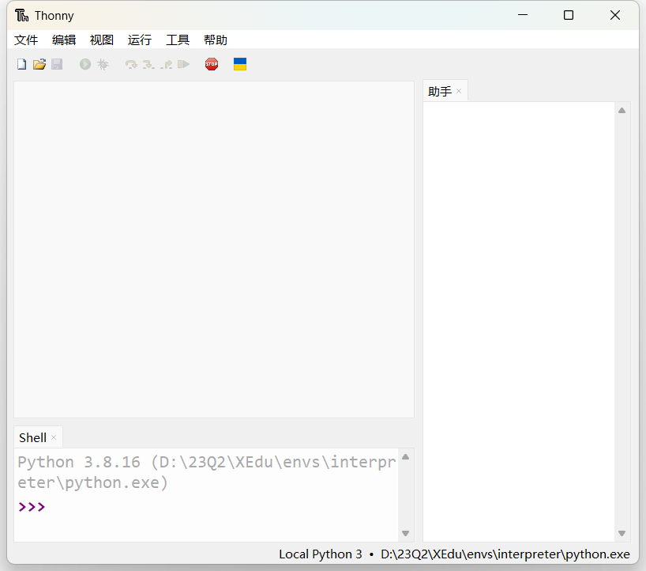
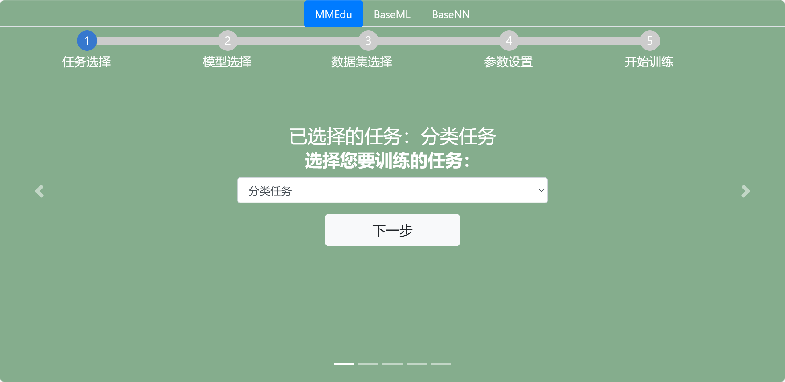

# XEdu的安装和下载

可选的安装方式
--------------

为了满足广大中小学师生的需求，XEdu安装方式分为一键安装包安装、pip安装和docker安装。一键安装包版包含MMEdu、BaseML、BaseNN三个模块的基础功能，以及XEduHub、BaseDT、BaseDeploy等工具库，同时内置了一套EasyDL系列工具，分"EasyTrain.bat"、"EasyInference.bat"和"EasyAPI.bat"这三个可视化工具，定期更新。pip安装方式需用户自己分模块安装，各模块更新同步工具开发进度。此外，还推出了docker容器镜像可供选择。

初学者安装强推!!!不会让人失望的一键安装包
-----------------------------------------

### 即刻体验XEdu一键安装包，开始！

下载工具：XEdu一键安装包

下载方式

飞书网盘：[https://p6bm2if73b.feishu.cn/drive/folder/fldcn67XTwhg8qIFCl8edJBZZQb](https://p6bm2if73b.feishu.cn/drive/folder/fldcn67XTwhg8qIFCl8edJBZZQb)

浦源CDN加速：[https://download.openxlab.org.cn/models/yikshing/bash/weight/xedu16](https://download.openxlab.org.cn/models/yikshing/bash/weight/xedu16)

第一步：双击运行，将自解压为XEdu文件夹（注意！避免踩坑推荐安装到纯英文路径下）。


第二步：您可以根据个人喜好，选择自己习惯的IDE。

1）使用XEdu自带的Thonny。

Thonny是一款好用的Python轻量级IDE。其最突出的两个特点便是是简洁性和交互性。打开根目录下的"Thonny编辑器.bat"文件快捷方式即可打开Thonny。使用Thonny打开"demo"文件夹中的py文件，如"MMEdu\_cls\_demo.py"，点击"运行"的"将文件作为脚本运行"即可运行代码，界面如下图所示。



2）使用XEdu自带的Jupyter。

Jupyter
Notebook是基于网页的用于交互计算的应用程序。其可被应用于全过程计算：开发、文档编写、运行代码和展示结果。它相对简单，对用户也更加友好，适合初学者。

打开根目录下的"jupyter编辑器.bat"，即自动启动浏览器并显示界面，如下图所示。


使用常用工具栏对代码进行操作，如"运行"，可以在单元格中编写文本或者代码，执行代码的结果也将会在每个单元下方呈现。可以逐个运行单元格，每点击一次，仅运行一个单元格。单元格左侧\[\*\]内的星号变为数字，表示该单元格运行完成。此时可打开"demo"文件夹中的ipynb文件，如"MMEdu\_cls\_notebook.ipynb"。


3）使用cmd安装用户库。

python中最常用的库管理工具pip，可以使用cmd命令行来运行，打开根目录下的"启动cmd.bat"可以打开cmd命令行界面，如下图所示。


在其中输入想要安装的库文件即可，如"pip install rarfile"。

4）使用其他IDE。

如果您需要使用其他IDE，那么需要您自己配置Python编译器，配置方法如下。

-   配置环境路径

①打开您的IDE，如PyCharm、Thonny等。

②配置Python编译器，路径为解压路径下的"envs"文件夹下的"interpreter"文件夹中的"python.exe"文件。

-   执行demo文件

用IDE打开解压路径下的py文件，如"cls\_demo.py"，点击"运行"。运行效果应和Thonny一样。

第四步：EasyDL系列体验。

XEdu一键安装包内置了一套EasyDL系列工具，分"EasyTrain.bat"、"EasyInference.bat"、"EasyConvert.bat"和"EasyAPI.bat"这四个可视化工具。

进入EasyDL文件夹，双击即可体验，体验时操作根据界面完成即可。

①双击"EasyTrain.bat"，根据界面完成训练；EasyTrain提供了MMEdu和BaseNN模型的训练流程。



②双击"EasyInference.bat"，根据界面完成推理；


③双击"EasyConvert.bat"，根据界面完成模型转换。


④双击"EasyAPI.bat"，根据界面完成服务部署。


更多EasyDL系列工具详见[EasyDL系列无代码工具](https://xedu.readthedocs.io/zh/latest/easydl.html#easydl)。

### 揭秘一键安装包功能

XEdu一键安装版是一个压缩包，解压后即可使用。

XEdu的根目录结构如下：

``` {.plain}
XEdu
├── checkpoints
├── datasets
├── EasyDL
├── envs
├── utils
├── XEdu示例代码
├── 教学资源
├── bug解决脚本.bat
├── jupyter编辑器.bat
├── IDLE.bat
├── jupyter编辑器.bat
├── PythonTutor代码可视化.bat
├── Thonny编辑器.bat
├── XEdu简介 v1.6.pdf
├── 启动cmd.bat
```

接下来对每层子目录进行介绍。

**checkpoints目录：**

存放各个模块的预训练模型的权重文件，分别放在以模块名称命名的文件夹下，如"cls\_model"。

**datasets目录：**

存放为各个模块任务准备的数据集，分别放在以模块名称命名的文件夹下，如"cls"。同时提供了部分数据集的说明文档，如"添加猫狗数据集.txt"，文档提供了数据集下载链接、使用说明、添加数据集流程等。

**envs目录：**

存放XEdu各模块运行所需的环境和中小学课程常用的库。

**utils目录：**

存放EasyDL系列功能的源码。

**XEdu示例代码目录：**

存放各个模块的测试程序，如"cls\_demo.py"，并提供了测试图片。测试程序包括`py`文件和`ipynb`文件，可支持各种"Python
IDE"和"jupyter notebook"运行，可运行根目录的"Thonny编辑器.bat"和"jupyter编辑器.bat"等后打开测试程序。

**EasyDL**

存放可视化工具。

**几个bat文件**

内置特色功能软件。双击打开运行后使用，包括Python编辑器和cmd启动。

**XEdu简介 v1.6.pdf：**

XEdu一键安装包说明文档。

使用pip安装
-----------

XEdu的MMEdu、BaseML、BaseNN等各模块库均已支持pip安装并会持续迭代。

### 1. pip安装MMEdu

#### 1.1 准备工作

强烈推荐你在Anaconda的基础上安装MMEdu，可以避免很多的版本冲突问题。

#### 1）安装Anaconda

若您已经安装好conda，该步骤可跳过。

**下载**

首先打开Anaconda官网：[https://www.anaconda.com/](https://www.anaconda.com/)

点击`Download`开始下载，下载完成后得到exe文件。

**安装**

双击exe文件即可开始安装（一般下载完成后会自动打开安装界面无需点击exe文件，若没有自动打开安装页面再点击此exe文件）。

打开安装界面后，依次选择`Next` -\> `I Agree` -\> `All Users` -\> `Next`
-\> `Next` -\> `Add Anaconda3 to the system PATH environment variable`
-\> `Install` -\> `Next` -\> `Next` -\> `Finish`

#### 2）安装python编辑器

若您已经安装好合适的python编辑器，该步骤可跳过。

此处以安装Thonny为例，其他编辑器例如Pycharm，VScode等也支持，用户自行配置好Python编译器即可。

**下载**

首先打开Thonny官网：[https://thonny.org/](https://thonny.org/)

右上角选择合适的操作系统点击下载，此处以windows为例

**安装**

双击exe文件即可开始安装（一般下载完成后会自动打开安装界面无需点击exe文件，若没有自动打开安装页面再点击此exe文件）

打开安装界面后，依次选择`Install for me only` -\> `Next` -\> `Next` -\>
`Next` -\> `Next` -\> `Next` -\> `Install` -\> `Finish`

**运行**

在安装好Thonny之后，在第一次运行的时候，会提示选择界面语言和初始设置，选择'Standard'模式即可。

**配置Thonny的Python解释器**

点击Thonny主界面右下角的Python版本号，可以选择对应的Python解释器，第一次配置点击`Configure inter preter`，弹出的窗口中，第一个下拉栏选择`可选的python3解释器或虚拟环境`，
第二个下拉栏找到自己之前安装的anaconda环境中的python解释器位置。点击确认即可使用该python解释器。

### 1.2 安装MMEdu(CPU版本)

#### 1）Linux安装MMEdu

点击鼠标右键，打开终端。

终端中输入pip install MMEdu即可安装。

``` {.powershell}
$ pip install MMEdu
```

注：为避免出现版本冲突，建议新建一个conda环境，并在新环境中执行以上命令（注：要求python\<3.9）。

``` {.powershell}
$ conda create -n your_env_name python=3.8
$ conda activate your_env_name
$ pip install MMEdu
```

注：请将命令中的"your\_env\_name"换成你喜欢的名称，如"mmedu"。

#### 2）Windows安装MMEdu

同时按下win+r，输入cmd，回车，打开一个命令行窗口。

在命令行中使用pip安装即可。

``` {.powershell}
$ pip install MMEdu -f https://download.openmmlab.com/mmcv/dist/cpu/torch1.8.0/index.html
```

注：为避免出现版本冲突，建议新建一个conda环境，并在新环境中执行以上命令（注：要求python\<3.9）。

``` {.powershell}
$ conda create -n your_env_name python=3.8
$ conda activate your_env_name
$ pip install MMEdu -f https://download.openmmlab.com/mmcv/dist/cpu/torch1.8.0/index.html
```

如使用MMEdu的MMDet模块出现问题，可见后文[关于pip安装MMEdu的详细说明](https://xedu.readthedocs.io/zh/master/mmedu/installation.html#pip)。

### 1.3 安装MMEdu(GPU版本)

首先安装对应自己cuda版本的pytorch，安装命令可在以下网址中进行查询：[https://pytorch.org/get-started/locally/](https://pytorch.org/get-started/locally/)

可以在命令行中使用`nvidia-smi`指令查询自己的cuda版本。

例如，若cuda版本为10.1，想要安装1.8.1版本的pytorch，则安装命令为：

``` {.powershell}
$ pip install torch==1.8.1+cu101 torchvision==0.9.1+cu101 torchaudio==0.8.1 -f https://download.pytorch.org/whl/torch_stable.html
```

其次，根据torch版本和cuda版本安装mmcv。

``` {.powershell}
$ pip install mmcv-full -f https://download.openmmlab.com/mmcv/dist/{cu_version}/{torch_version}/index.html
```

其中 `{cu_version}` 和 `{torch_version}`
根据自身需求替换成实际的版本号。

例如想安装和 `CUDA 10.1`、`PyTorch 1.8.0` 兼容的
`mmcv-full`，使用如下替换过的命令

``` {.powershell}
$ pip install mmcv-full==1.4.5 -f https://download.openmmlab.com/mmcv/dist/cu101/torch1.8.0/index.html
```

最后安装MMEdu。

``` {.powershell}
$ pip install MMEdu
```

### 2. pip安装BaseML

`pip install baseml` 或 `pip install BaseML`

### 3. pip安装BaseNN

----------------

`pip install basenn` 或 `pip install BaseNN`

docker容器镜像
--------------

首先需要确保您的电脑系统盘（C盘）空间剩余空间超过5GB，实际建议有10GB及以上空间，便于后续训练使用。如果想要调整存储空间位置，可以参考[这里修改安装路径](https://blog.csdn.net/ber_bai/article/details/120816006)，[这里修改数据路径](https://zhuanlan.zhihu.com/p/410126547)，后文安装过程中也有具体叙述。

### 1.安装Docker软件

这里以Windows11系统（专业版）为例，其他系统可以在网上查找相关教程自行安装Docker，如[菜鸟教程](https://www.runoob.com/docker/windows-docker-install.html)。

Windows11系统中，可以先安装Docker Desktop图形化管理软件，下载链接为：[https://www.docker.com/products/docker-desktop/](https://www.docker.com/products/docker-desktop/)。建议不开启WSL2，否则可能与电脑其他软件存在冲突（除非电脑中已经使用了WSL2虚拟机，那么这里勾选开启）。


注：如软件安装空间不足，可以把安装路径指向一个新的路径：可以参考[这里修改安装路径](https://blog.csdn.net/ber_bai/article/details/120816006)

用管理员权限打开CMD，然后输入`mklink /j "C:\Program Files\Docker" "D:\Program Files\Docker"`。这样，软件看似安装在原目录，实则安装在了"D:\Program Files\Docker"。当然也可修改为其他盘。

### 2.启动Docker服务

安装完Docker Desktop，运行启动它，界面如下所示。

看到左下角显示Engine running说明启动成功。

### 3.拉取镜像

#### 3.1准备工作：检查磁盘剩余存储空间

首先需要检查电脑系统盘（C盘）空间剩余空间是否超过6GB，实际建议有10GB及以上。如果空间足够，可以跳转到[3.2](https://xedu.readthedocs.io/zh/master/about/installation.html#id14)，如空间容器和镜像存储空间不足，旧版本Docker Desktop可以直接在软件中设置新的存储路径，但新版就不行了，下面介绍新版的用法。参考来源：[修改存储路径](https://zhuanlan.zhihu.com/p/410126547)。

##### 1）列出待迁移数据

退出Docker Desktop软件，以防冲突。打开CMD，输入`wsl --list -v`，把所有相关的数据文件列出来，稍后需要挨个迁移。


此时，返回的信息是如上图所示，那么需要迁移的数据有：`docker-desktop-data STOPPED 2`，`docker-desktop STOPPED 2`。有的只出现一条，那么只要迁移这一个就好。接下来，以把数据迁移到D盘为例进行说明。

##### 2）新建保存目录

在D盘新建目录用于保存迁移过去的数据，例如我后续希望相关数据都迁移到"D:\Program Files\Docker"，那么我就得新建这个目录，保证路径"D:\Program Files\Docker"存在。

##### 3）导出数据

在CMD中输入：`wsl --export docker-desktop-data "D:\Program Files\Docker\docker-desktop-data.tar"`。如果有其它要导出，指令类似。例如我们还需要导出`docker-desktop`，那么运行完上一句，继续输入：`wsl --export docker-desktop "D:\Program Files\Docker\docker-desktop.tar"`。

##### 4）注销WSL中原来的数据

在CMD中输入：`wsl --unregister docker-desktop-data`。如果有其它要注销，指令类似。例如我们还需要注销`docker-desktop`，那么运行完上一句，继续输入：`wsl --unregister docker-desktop`。

##### 5）导入数据到新的存储路径

在CMD中输入：`wsl --import docker-desktop-data "D:\Program Files\Docker\data" "D:\Program Files\Docker\docker-desktop-data.tar" --version 2`。这里的"D:\Program Files\Docker\data"是新的存储路径，这个文件夹会自动创建。

若还需要迁移`docker-desktop`，运行完上一句，继续输入：`wsl --import docker-desktop "D:\Program Files\Docker\data" "D:\Program Files\Docker\docker-desktop.tar" --version 2`。

##### 6）重启Docker Desktop

此时已经完成了容器文件的存储位置迁移。如果有问题，可以尝试重启电脑。如果正常迁移完成，可以删除导出的tar文件，即`D:\Program Files\Docker\docker-desktop-data.tar`。如需迁移到其他盘，也可参照此方式完成，只需要修改盘符即可。

#### 3.2拉取镜像

Docker分为容器（Container）和镜像（Image），（有时还会额外有一类叫Dockerfile）。首先需要从云端获取镜像，类似于安装操作系统的镜像，这个镜像是和原版一模一样的。然后可以启动容器，容器可以由用户自主修改。

拉取镜像的命令如下：
`docker pull xedu/xedu:v3s`
打开电脑的命令行（CMD）窗口，输入上面的命令行。

这一步会拉取xedu的镜像文件到本地磁盘，因此务必保证您的电脑系统盘空间剩余空间超过5GB，实际建议有10GB及以上空间，便于后续训练使用。如果想要调整存储空间位置，可以参考上面空间不足的解决办法。刚开始拉取没有相应，可以等待一会儿，就会出现下面的拉取进度的界面。


等待拉取完成，所用时间取决于网速（大约30分钟-2小时之间），您也可以参考相关教程配置国内镜像源来加快拉取速度。如：[这个办法](https://blog.csdn.net/moluzhui/article/details/132287258)。

### 4.启动docker容器（Container）

在CMD输入：
`docker run -it -p 5000:5000 -p 8888:8888 --mount type=bind,source=D:/share,target=/xedu/share xedu/xedu:v3s`，首次使用会询问是否绑定磁盘，选择Yes。运行成功界面如下：


接下来就可以用电脑访问 **[127.0.0.1:8888](http://127.0.0.1:8888)** 访问jlab，通过 **[127.0.0.1:5000](http://127.0.0.1:5000)** 访问easytrain。（电脑中的文件想要拷贝进docker，可以放到D盘share文件夹）。美中不足的是，这两个网址需要自行打开浏览器后输入。如果显示效果不佳，可能是浏览器不兼容，建议下载[最新版的chrome浏览器](https://www.google.com/intl/zh-CN/chrome/)。


#### 可能用到的docker命令
- 查看现有的容器
  `docker ps -a`
- 暂停容器
  `docker stop 34`。
  假设使用ps查看到容器ID是1234567890，还有另一个容器ID是1243567890，我们在指定的时候，只要输入其中的任意一小段，可以区分开不同的容器即可，例如可以用`34`或者`1234`之类来区分这两个不同的容器。
- 再次启动容器
  `docker start 34`
- 进入容器的命令行窗口
  `docker exec 34 -it bash`
### 5.结束容器

在刚才的命令行窗口中，输入CTRL+C，再输入y，即可结束容器。


### 6.重启容器

已完成容器的安装，再次重启容器只需启动Docker服务，再完成5.启动容器的操作即可。

如何快速查看XEdu各模块库的版本
------------------------------

打开python终端，执行以下命令即可查看XEdu各模块库的版本。当前最新版本是0.1.21。


注：目前版本MMEdu仅支持CPU。

如何卸载XEdu各模块库
--------------------

如果XEdu某模块库出现异常情况，可以尝试使用`uninstall`命令卸载，然后再使用install命令安装。参考代码：

    $ pip uninstall MMEdu -y
    $ pip uninstall BaseNN -y
    $ pip uninstall BaseML -y
