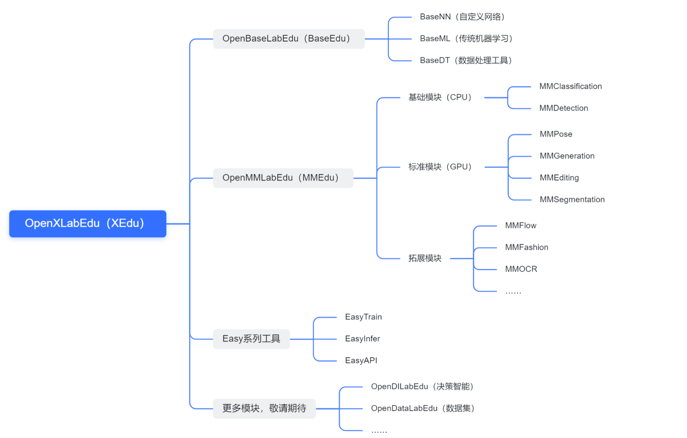

# XEdu的定位与规划

## 定位：XEdu是一个怎样的工具

XEdu的全名为OpenXLabEdu，是基于OpenXLab的教育版，也是为AI教育设计的一套完整的学习与开发工具。OpenXLab是上海人工智能实验室开源的AI工具集合。

XEdu核心工具为深度学习工具库XEduHub、计算机视觉库MMEdu，加上神经网络库BaseNN和传统机器学习库BaseML，后期规划还会增加OpenDILabEdu和OpenDataLabEdu等，覆盖实验室开源的所有AI工具，涉及AI初学者可能的AI技术所有领域。

XEdu关注AI模型，关注初学者用AI解决真实问题，适合用于中小学AI教育、大学AI通识课、中高职AI入门课程等。从数据采集到模型训练、模型部署，XEdu在每一个环节都提供了合适的工具。XEdu团队坚信只要有合适的工具，AI初学者能够驾驭各种AI工具，去解决身边的问题。

- [如何用XEdu借助AI解决真实问题](../how_to_use/introduction.html)

**XEdu的愿景**

“接地气，望云端”，开源科创团队期望XEdu是一款适合AI学习入门，同时又能编写出可以“真正运行”的AI代码的人工智能开发工具，让学生能够通过完成各种AI实验，亲历从收集数据到训练深度学习模型的过程，并能够通过训练AI模型、部署智能信息系统的方式，解决生活中的真实问题。

## XEdu的三大特点

### 1.应用先行，逐层深入

XEdu的核心工具MMEdu内置SOTA模型，让学生把机器学习、深度学习作为解决问题的有效工具，先应用，再理解，以应用激发兴趣，吸引学生逐步研究背后的原理。就如学习互联网一样，不需要先讲ISO七层协议，更不需要先研究香农公式，而是先打开浏览器获取信息，打开EMail交流信息，再慢慢走向底层协议的理解。

### 2.代码最简，部署方便

XEdu将AI工具分解为“训练”和“部署”两种核心功能。无论是BaseML、BaseNN还是MMEdu，全部采用一致的语法完成训练、推理和转换、部署。核心代码公式化，学生可以举一反三，快速迁移。

XEdu的基础工具BaseDT，则是一个整合了常见数据处理工具的基础库。借助这个库，用一行代码即可完成数据的预处理，让AI应用的代码更加简洁。XEduHub则内置常见的AI模型，用四行代码就能完成推理工作，并同时支持机器学习和深度学习模型。

### 3.兼容并蓄，灵活扩展

虽然语法上做到最简，但XEdu兼容原生工具的各种功能，如BaseNN和BaseML分别保留了Pytorch和Sklearn的功能，MMEdu则保留了OpenMMLab的各种参数，尤其是模型训练的所有常见参数，让学生在不同阶段都可以使用OpenXLab的系列工具进行学习。在不久的将来，用BaseNN可以搭建MMEdu的模型，多个工具形成一个强大的AI工具包，支持AI学习的绝大多数内容。

## 了解XEdu的规划

### 1.数据处理工具

1-1 [数据处理工具库：BaseDT](https://xedu.readthedocs.io/zh-cn/master/basedt.html)

不同的模型对数据有特定的要求，比如LeNet-5是28×28，MobileNet是224×224。BaseDT集成了各种数据处理工具，能快速实现各种模型的预处理，也能快速完成数据集的划分，还能实现对数据集的格式检查和转换。

### 2.模型训练工具

2-1 [计算机视觉开发库：MMEdu](https://xedu.readthedocs.io/zh-cn/master/mmedu.html)

MMEdu全称为OpenMMLabEdu，是著名的计算机视觉开发工具OpenMMLab的教育版本。 

2-2 [神经网络开发库：BaseNN](https://xedu.readthedocs.io/zh-cn/master/basenn.html)

BaseNN是神经网络库，能够使用类似Keras的语法搭建神经网络模型，不仅可以逐层搭建全连接神经网络，还支持MobielNet、ResNet、RNN、TransFormer等。

2-3 [传统机器学习开发库：BaseML](https://xedu.readthedocs.io/zh-cn/master/baseml.html)

BaseML是传统机器学习库，类似Sklearn，使用了与MMEdu同样的语法，代码更加简洁。

### 3.模型应用与部署工具

3-1 [深度学习工具库：XEduHub](https://xedu.readthedocs.io/zh-cn/master/xedu_hub.html)

XEduHub是一个集合了各种各样深度学习工具的模块，云端丰富的开源模型结合本地自主训练模型，可以让用户高效地完成深度学习任务。是第一款用统一语法同时支持机器学习模型和深度学习模型的模型推理库。

3-2 [大模型应用库：XEduLLM](https://xedu.readthedocs.io/zh-cn/master/xedu_llm.html)

XEduLLM是一个方便初学者应用各种大模型的模块，用统一的语法即可访问不同的大模型服务商，用简短的代码实现工作流并开发智能体应用。XEduLLM为一线课堂教学做了优化，教师能够将个人的API Key“共享”给一个班级的学生使用，未来将增加一键启动本地模型的功能。

3-3 [模型部署库：BaseDeploy](https://xedu.readthedocs.io/zh-cn/master/basedeploy.html)

BaseDeploy关注模型部署，关注AI模型在各种开源硬件上的部署。目前BaseDeploy仅仅实现了模型推理，更多的功能在开发中。

### 4.其他相关工具

4-1 [EasyDL系列无代码工具](https://xedu.readthedocs.io/zh-cn/master/easydl.html)

一系列方便初学者的小工具，可以在无代码的情况下完成模型的训练、推理、转换和部署，甚至可以搭建一个WebAPI服务器，类似百度AI开放平台。

### 5.其他规划中的库

规划中的库还有OpenDILabEdu（决策智能）和OpenDataLabEdu（数据中心），从名称可以看出源自上海人工智能实验室的各种工具。

