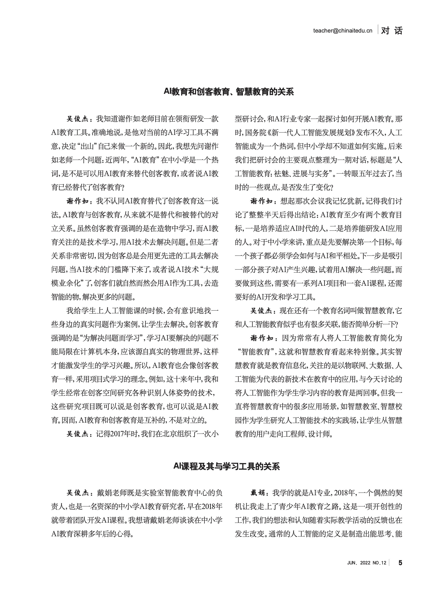
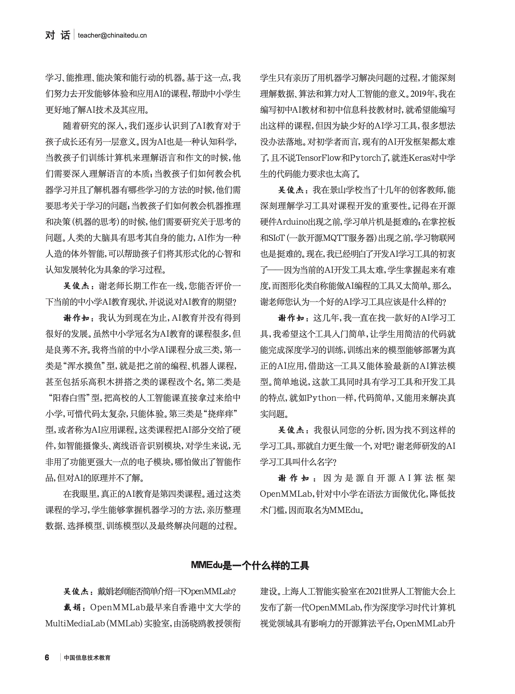
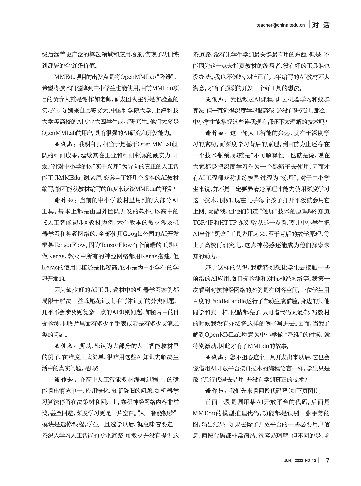
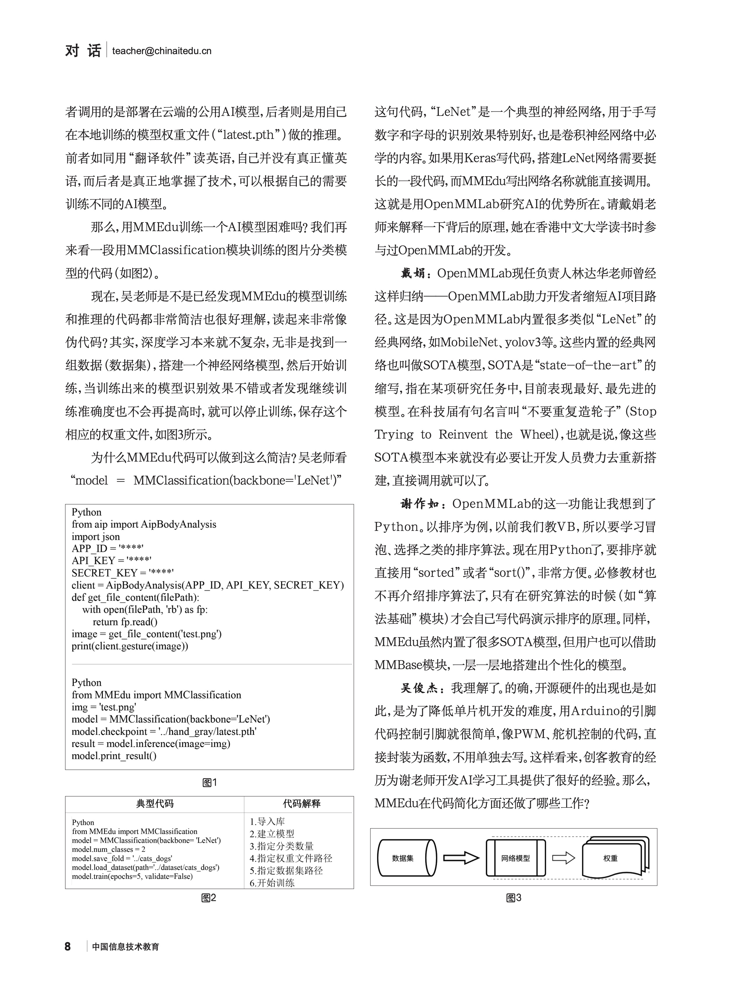
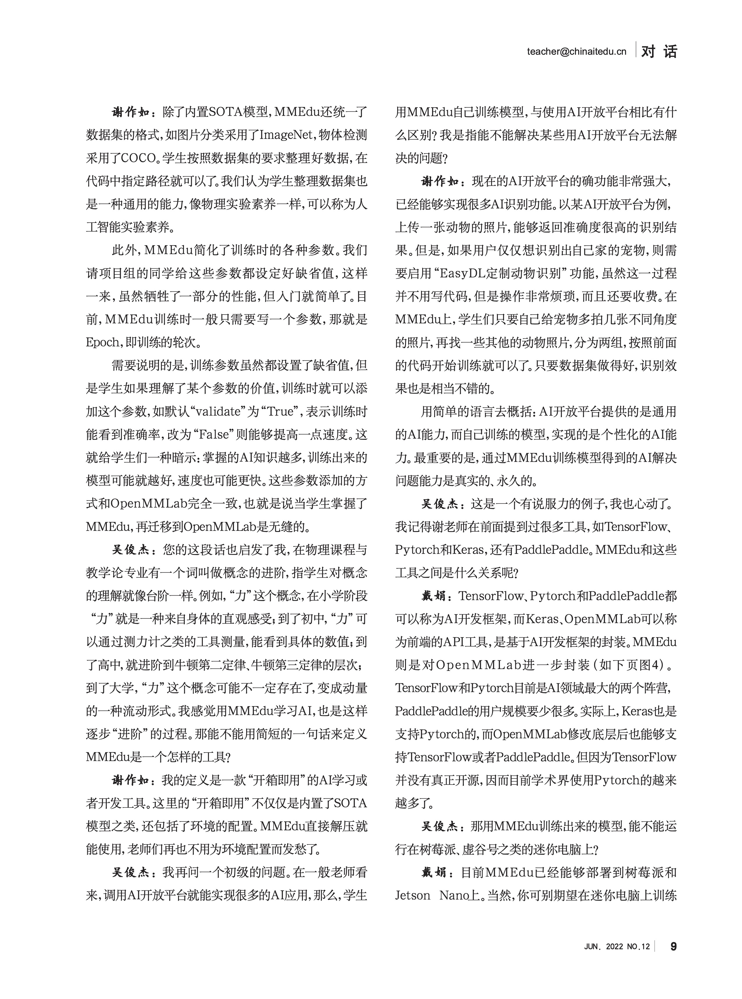
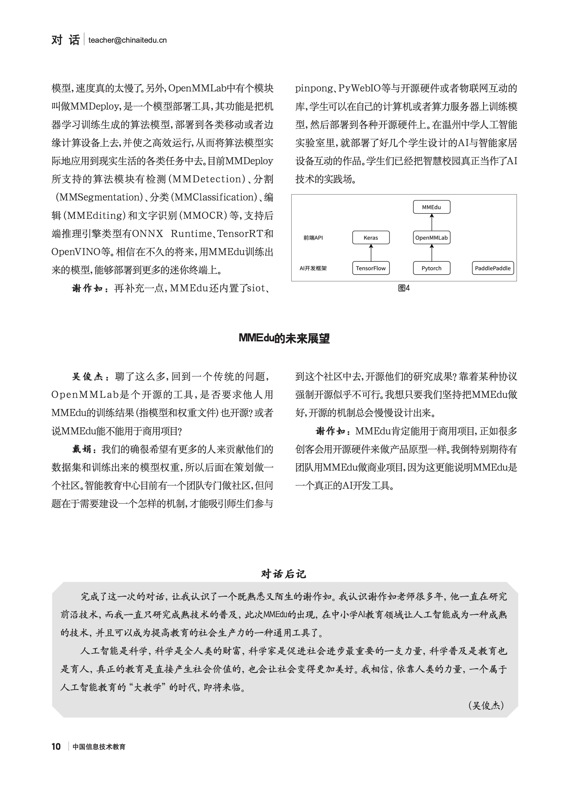

# XEdu的故事

## 从MMEdu到XEdu

XEdu项目因MMEdu的升级而来，而MMEdu的诞生却有很多版本，但所有的版本都围绕着“中小学AI教育”展开。

### 版本一

上海人工智能实验室成立初期，智能中心负责人戴娟找上海交大谈国智班（实验室和交大共同培养的人工智能班）的相关事宜。他们不约而同的关注到中小学的人工智能教育，都认为要在中小学推广人工智能教育，就需要更加接地气的AI学习与开发工具。于是开始有意识地选择一些技术门槛较低，又比较有趣的AI工具，尝试降维后给中小学生使用。

经过几次迭代，他们最后选择了OpenMMLab进行降维。因为OpenMMLab是一个非常全面的计算机视觉算法包，内置了很多SOTA模型，也是实验室重点维护的开源项目。更重要的是，戴娟在求学期间就参与过OpenMMLab的开发和维护工作。

……

### 版本二

2020年，清华大学出版社的义务教育阶段信息技术教材开始修订，其中九年级分册要涉及人工智能。经过一番调研，几位主编发现当前小学教材一般用Mind+，高中教材则绝大多数使用了Keras，那么初中呢？似乎也只能选择Keras。结果教材编写出来后，老师们都认为太难，代码中有些专用名词很难理解。尤其是要训练深度学习模型，就要从零开始逐层搭建网络。这对初中生来说入门门槛太高。

2021年7月，教材副主编谢作如（原浙江省温州中学老师，现温州科技高级中学）在世界人工智能大会见到戴娟，聊起“中小学需要好的AI开发工具”这一话题。戴娟说实验室有好多工具，但不知道是否适合中小学，也不知道应该往哪一个方向优化。两人在AI教育上观点一致，只可惜讨论时间不够，于是约好下次来温州继续讨论。

很快地，戴娟将实验室的工具整理了一个列表，来温州向谢作如一一展示。谢作如则一下子看中了内置SOTA模型的OpenMMLab。但他认为OpenMMLab需要重新封装，设计更加简单的语法，为中小学生“降维”（指降低技术门槛）。同年11月，他们组建了一个名称为“开源科创”的开发团队，以贾彦灏、王博伦等实验室智能教育中心实习生为核心，开始了OpenMMLab的“降维”工作。

MMEdu的正式启动时间是2022年1月。陆雅楠和邱奕盛的加入让小团队的研发力量大增。这个小团队分为算法和教研两个小组。开源科创团队深度对比了Keras、FastAI、ModelArts等的AI开发工具，总结了深度学习的一般流程，认为AI模型训练和AI模型推理（AI应用开发）工作应该分离，而AI模型训练应该是公式化的操作，可以设计一套非常简洁的代码，以降低技术门槛。

MMEdu很快就推出了第一版，邀请了上百名国内的骨干教师进行内部测试，得到大家的好评，其中山东的于方军老师提了很多建议。6月份，MMEdu开始通过实验室暑期夏令营的工作进行大规模测试，约3000学生开始线上学习，反馈良好。随着开发的深入，一些新的需求也逐步明晰起来。因为MMEdu面向计算机视觉，内置的都是视觉方向的SOTA模型，无法搭建一些简单的经典网络，如全连接神经网络，再加上当前教材中又不可避免要讲经典机器学习，于是又增加了BaseNN和BaseML。这些工具合并起来，取了一个共同的名称——XEdu（全称为OpenXLab-Edu），和实验室大工具总名称的XLab对应。

2023年9月，XEdu迎来了新伙伴——XEduhub。XEduhub面向模型推理，不仅做到用统一的语法支持机器学习、深度学习的模型推理，又内置各种常见的预训练模型，成为了中小学生研究科创项目的必备工具。

## 为什么要开发XEdu

中小学的AI教育需要低门槛的框架或者工具。受限于认知水平，中小学生很难去理解AI的底层，尤其是数学原理。而当前的AI教育往往“满足于”给学生介绍AI发展史、专家系统、知识图谱和一些经典的机器学习原理，学生无法用学到的知识去解决一些真实问题。有人戏称这样的AI教育不过是在教屠龙技——因为世上已经无龙可屠，那么学了跟没学一样。

在2022年之前，中小学的AI课程中如果涉及到用代码训练AI模型，一般都选择了keras。虽然Keras有着种种不尽人意的地方，却找不到更好的替代品——至少比TensorFlow已经简单多了。但是Keras最大的问题在于代码过于底层，如搭建神经网络需要一层一层搭建，连搭建LeNet（一个最经典最基础的卷积神经网络模型）都要写好多代码，实际上学生只能照着教学或者范例抄一遍，并不能真正理解。那么，这样抄一遍的意义又在哪里？

经过多次的研讨，开源科创团队对当前中小学的AI教育进行了总结，认为其存在如下问题：

1）AI学习工具应该同时具备开发能力，能解决真实问题。如果AI教育仅仅满足于讲原理，做实验，那么学习内容离真实应用太遥远，无法用于解决真实问题。简而言之，学了跟没学一样。有些AI工具虽然能解决问题，却又封装过度，如OpenCV和MediaPipe，只能算AI应用工具，不属于AI开发工具。 

2）AI学习工具应该是一个全链路工具，贯穿整个流程。从收集数据、清洗数据，到搭建（选择）算法、训练模型，最后到应用模型、部署模型，AI学习工具应该支持每一个流程的学习，是一套工具链。当然，这个工具链并非从零开始自己开发，而是整合各种开源工具。此外，这套工具能支持中小学AI教育的所有内容，不能在一本教材中涉及太多工具，导致实施门槛很高。

3）AI学习工具应该凸显机器学习，尤其是深度学习。“数据、算法和算力”誉为人工智能时代的三驾马车。这句话凸显了深度学习在新一代人工智能中的地位。这个AI学习工具应该接地气、望云端，既要能快速训练模型、应用模型，又要能研究底层算法，支持学生的探究实验。

XEdu的定位是面向中小学AI教育的开发和学习工具。为了能形成共识，开发团队特意以“对话”的形式，展开一次讨论，并将讨论过程发表于《中国信息技术教育》杂志。

## 杂志专稿：中小学需要怎样的AI学习工具

2022年春，北京师范大学吴俊杰博士受《中国信息技术教育》杂志社委托，以“中小学AI教育需要怎样的工具“为主题，邀请XEdu团队的戴娟和谢作如做了一期对话。

