# BaseDeploy：服务于XEdu的模型部署工具

模型部署是AI应用的重要一环，因其涉及的框架量大、推理代码风格不一等问题，往往会对初学者的上手造成一定的难度。为此，`XEdu`团队推出了模型部署工具`BaseDeploy`，其代码风格向`MMEdu`对齐，通过对推理核心代码的封装，目标是用户能够更加专注于科创作品功能的设计，而将AI模块作为接口的黑盒，能够对其返回的结果进行二次创作。

## 快速开始

`BaseDeploy`通过传入模型的路径加载为一个模型，通过`model.inference`即可完成模型的推理。

```python
from BaseDT.data import ImageData
import BaseDeploy as bd
dt = ImageData(img_path, backbone='训练的模型名称，例如MobileNet')
model = bd(model_path)
result = model.inference(dt, show=True)
```

- 图像分类

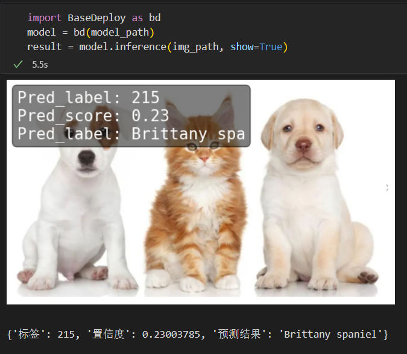


- 目标检测


## 基本功能
`BaseDeploy`提供多种便于模型部署的函数，包括了推理与相关库启动部署。

### 推理功能
`BaseDeploy`通过`model.inference`函数封装实现推理功能。 \

```python
model.inference(input_data, show, get_img, score, show_path)

input_data: 可以为图片路径，文件夹路径，BaseDT预处理后的路径，CV2摄像头拍摄的图片
show：是否在Jupyter界面中显示图片，默认为：False
get_img：得到回传图片做二次操作，默认为：None，可选参数为`pil`和`cv2`
score：置信度，无论是分类任务还是检测任务，高于score的置信度的图片才被绘制，默认为0.65
show_path：是否显示图片路径，默认为False
```

#### 文件夹推理
`BaseDeploy`提供对文件夹中的图片推理的功能
```python
import BaseDeploy as bd
model = bd(model_path)
result = model.inference(folder_path)
```
- 图像分类

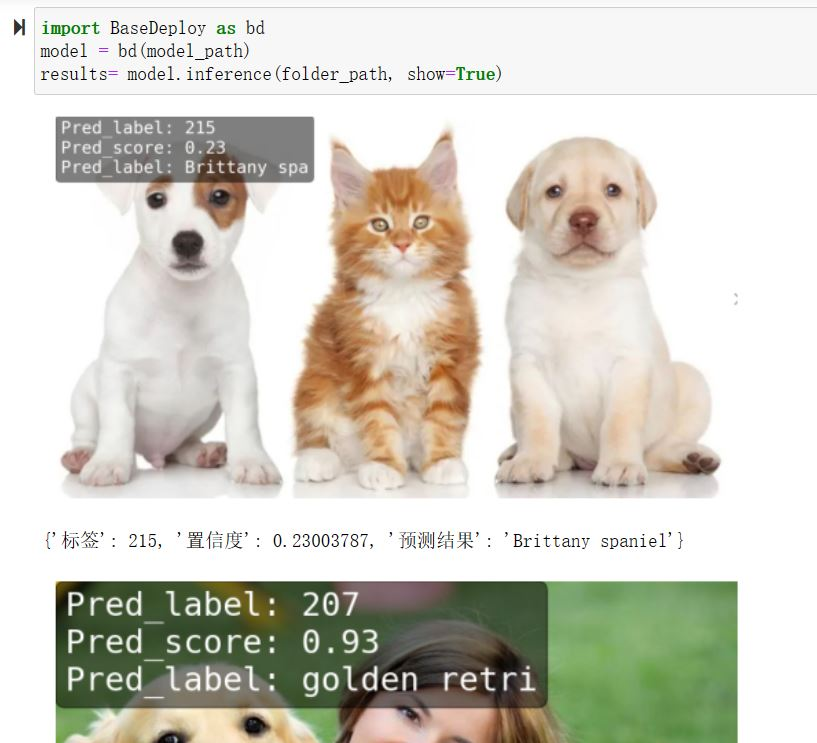


- 目标检测

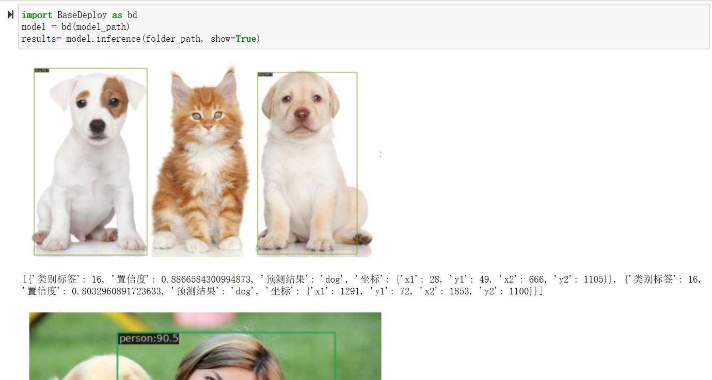

#### 图片路径显示
将`show_path`设置为True，即可以`文件名+推理结果`作为最终的消息回显（该功能仅对以路径形式传入的方式有效）
```python
import BaseDeploy as bd
model = bd(model_path)
result = model.inference(folder_path, show=True, show_path=True)
```

- 图像分类


- 目标检测


#### 图像回传
`get_img`参数默认为None，可选参数为`pil`和`cv2`，目的是用户可以通过得到的图片二次创作。
```python
import BaseDeploy as bd
model = bd(model_path)
result, img = model.inference(img_path, get_img='pil')

from matplotlib import pyplot as plt
plt.imshow(img)
plt.axis('off')
plt.show()
```
##### PIL方式
PIL方式适合Jupyter中进行交互，下面是一个
- 图像分类

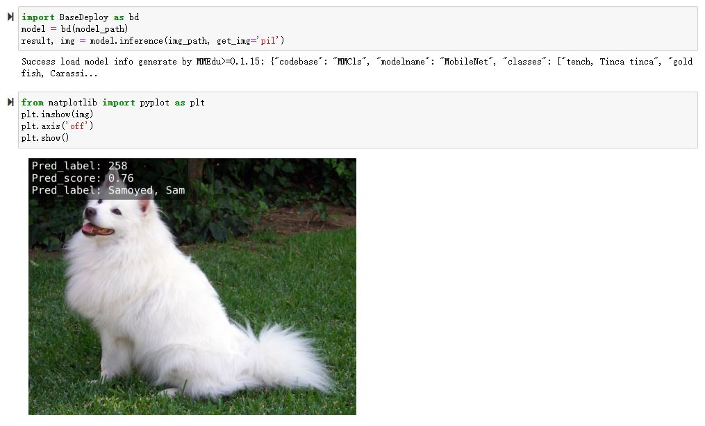


- 目标检测


##### cv2方式
cv2方式适合调用屏幕显示等操作。
```python
import BaseDeploy as bd
model = bd(model_path)
result, img = model.inference(img_path, get_img='cv2')

import cv2
cv2.imshow("Image", img)
cv2.waitKey(0)
cv2.destroyAllWindows()
```
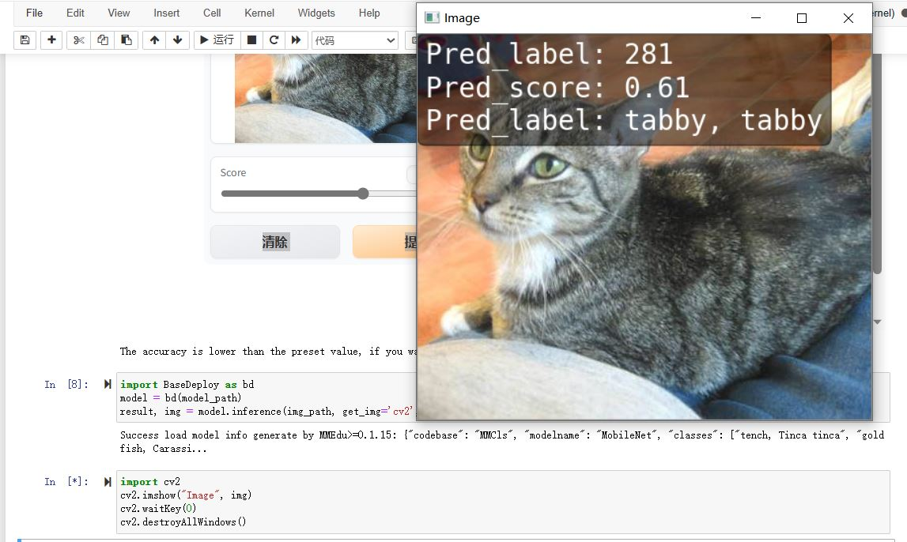


- 目标检测


#### 未知ONNX模型的解析
`BaseDeploy`为适配图像任务，可自动解析未经`XEdu`标记的ONNX模型的输入张量尺寸，并进行图像预处理和输出后处理，输出结果将不会带有类别信息。

```python
import BaseDeploy as bd
model = bd(model_path)
result = model.inference(img_path, show=True)
```
- 图像分类

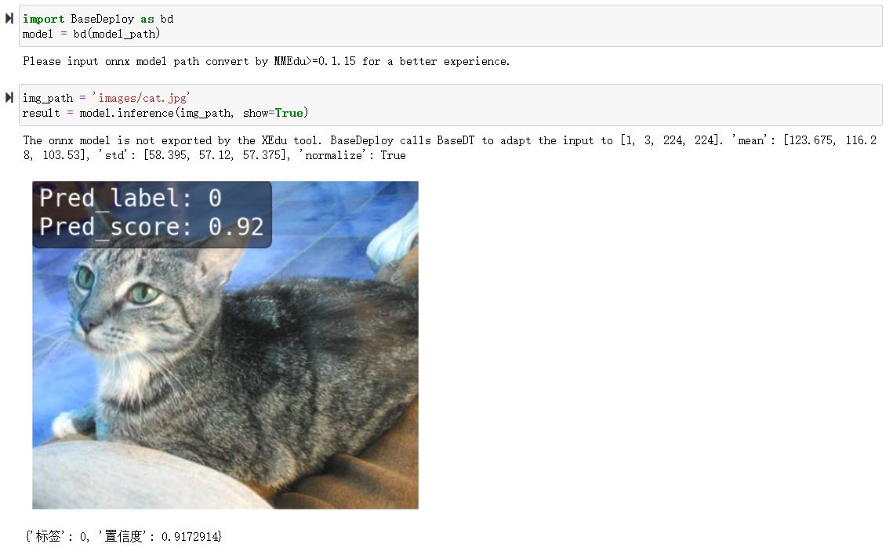


- 目标检测


此外，`BaseDeploy`还提供`diy_inference`函数，供用户推理特殊的ONNX模型，其推理的前处理和后处理需要用户自行实现。

```python
import BaseDeploy as bd
model = bd(model_path)
result = model.diy_inference(input_data)
```
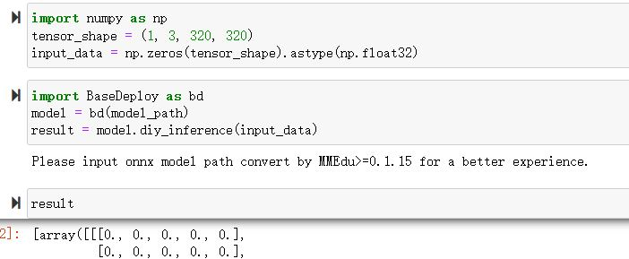

## 与其他库配合的部署
`BaseDeploy`通过`model.run()`调用内置的多种部署工具，包括`Gradio`，`EasyAPI`，`SIOT`和`PywebIO`等，实现模型即黑箱的功能，把AI推理简单的视作一个函数。

### Gradio
Gradio 是一种简单易用的Web界面工具，它可以让你快速地将模型部署到Web应用程序中。`BaseDeploy`通过对`Gradio`进行封装，一键启动。为了保证`BaseDeploy`的轻量性，`Gradio`库在安装时并不会被同步安装，如想使用该功能在使用前请使用`pip3 install gradio`进行依赖库的安装。
#### 如何使用
`BaseDeploy`支持在载入模型后使用`run_gradio`函数一键启动，启动后输入界面可选择两个参数，一是点击后选择路径，二是设置`score`，低于`score`的图片将不会被绘制，详情可见运行后日志。
```python
import BaseDeploy as bd
model = bd(model_path)
model.run_gradio()
```

- 图像分类
  

  

- 目标检测
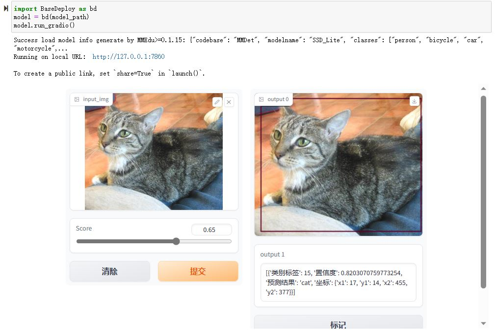

### FastAPI
`FastAPI` 是一个Python Web 框架，用于构建高性能的 Web 应用程序和 API。它是基于 Python 类型提示和异步编程的优势，提供了快速、易于使用和具有强大功能的开发体验。`BaseDeploy`通过对`FastAPI`的集成，可一键启动接口，并支持json或file的回传形式，用户可自行选择。\
值得注意的是，由于`FastAPI`本身的限制，目前暂不支持在`Jupyter`中调用该函数。
#### 如何使用
- 基本方法

```python
import BaseDeploy as bd
model = bd(model_path)
model.run_fastapi()
```

- 拓展功能

`run_fastapi`函数的可设置参数有：`port`和`mode`。下面是这两参数的使用解释\
port：设置启动`FastAPI`的端口号，默认为：`1956`。
mode: 设置`FastAPI`的运行模式，可选参数为`json`和`img`，代表回传的内容为推理结果或推理后绘制的图片，于用户角度即为绘制图像操作在上位机还是下位机完成。
score：设置绘图阈值，若高于阈值，才进行绘图操作，默认为：`0.65`。


运行后出现下图所示的内容，即代表`FastAPI`启动成功。
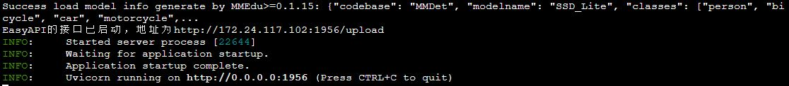

#### 如何调用接口
在用户端如需调用`EasyAPI`启动的接口，仅需设置接口地址`url`和图片路径`img_path`。
```python
import requests
url = "http://192.168.31.38:1956/upload"
img_path = ''
files = {'files': open(img_path, 'rb')}
result = requests.post(url=url, files=files)
```

- 图像分类

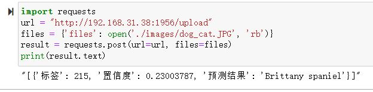


- 目标检测


### SIOT

`SIoT`为“虚谷物联”项目的核心软件，是为了帮助中小学生理解物联网原理，并且能够基于物联网技术开发各种创意应用。因为其重点关注物联网数据的收集和导出，是采集科学数据的最好选择之一。

`BaseDeploy`通过对`SIoT`进行封装，支持一键将后端推理从本地迁移至启动SIoT推理服务的程序。

#### 如何使用

要想使用`SIoT`，需要一个`SIoT服务端`的`IP地址`，以及使用`BaseDeploy`启动监听和传输推理的服务。

- 服务端
服务端需要按照`BaseDeploy`的导入模型的方式定义一个模型，并使用`use_siot`函数启动siot的消息监听功能。

```python
import BaseDeploy as bd
model = bd(model_path)
model.run_siot(ip=ip_path, mode='infer')
```

- 用户端
用户端选用`SIoT`进行推理，不再需要导入`ONNX`模型，故在初始化时仅需将推理后端选为`SIoT`即可。

```python
import BaseDeploy as bd
model = bd(ip_path, backend='siot')
```

如上操作后，用户即可在用户端使用`model.inference`函数进行模型的推理了，使用方法遵循原有`inference`推理示例。

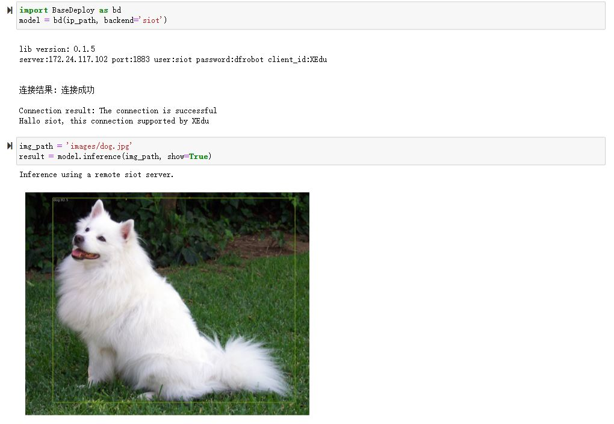


用户端对服务端进行访问时，服务端也会同步打印推理结果，便于用户检查连接状况等。

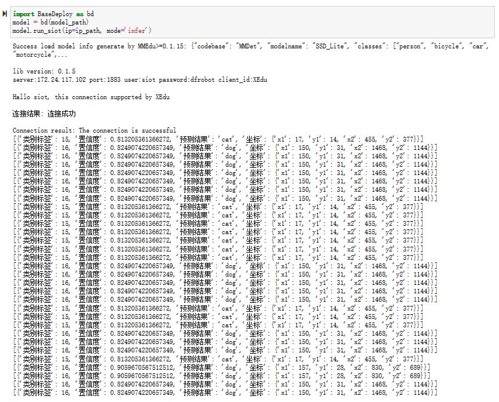

### PywebIO
`PyWebIO`是一个用于构建交互式Web应用程序的Python库。它提供了一组简单且直观的函数和装饰器，使得开发人员可以在Web浏览器中使用Python来创建丰富的用户界面和交互体验，而无需编写HTML、CSS或JavaScript代码。`BaseDeploy`通过对`PywebIO`的封装，支持一键启动推理服务界面。
值得注意的是，由于`Pywebio`本身的限制，目前暂不支持在`Jupyter`中调用该函数。
- 基本方法

```python
import BaseDeploy as bd
model = bd(model_path)
model.run_pywebio()
```

- 拓展功能

`run_pywebio`函数的可设置参数有：`port`。下面是参数的使用解释：

port：设置启动`PywebIO`的端口号，默认为：`1956`。

运行后出现下图所示的内容，即代表`PywebIO`启动成功。


- 推理示例


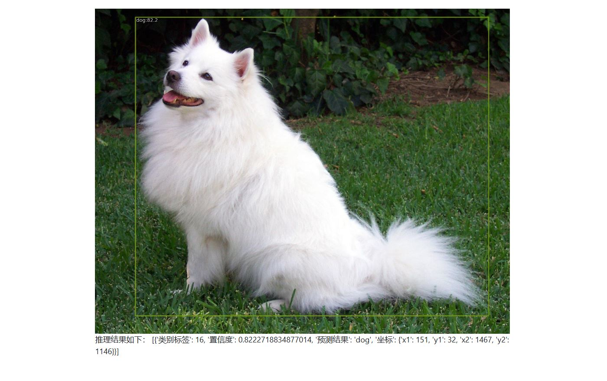


## 参考链接

Gradio：https://github.com/gradio-app/gradio

FastAPI：https://github.com/tiangolo/fastapi

SIOT：https://github.com/vvlink/SIoT

PywebIO：https://github.com/pywebio/PyWebIO

Flask：https://github.com/pallets/flask