BaseDeploy：服务于XEdu的模型部署工具
====================================

模型部署是AI应用的重要一环，因其涉及的框架量大、推理代码风格不一等问题，往往会对初学者的上手造成一定的难度。为此，\ ``XEdu``\ 团队推出了模型部署工具\ ``BaseDeploy``\ ，其代码风格向\ ``MMEdu``\ 对齐，通过对推理核心代码的封装，目标是用户能够更加专注于科创作品功能的设计，而将AI模块作为接口的黑盒，能够对其返回的结果进行二次创作。

快速开始
--------

``BaseDeploy``\ 通过传入模型的路径加载为一个模型，通过\ ``model.inference``\ 即可完成模型的推理。

示例代码一：

本段代码实现的功能是将\ ``BaseDT``\ 预处理好后的图片传入\ ``BaseDeploy``\ 推理函数进行推理，并将推理结果返回。

.. code:: python

   from BaseDT.data import ImageData
   import BaseDeploy as bd
   dt = ImageData(img_path, backbone='训练的模型名称，例如MobileNet')
   model = bd(model_path)
   result = model.inference(dt)

示例代码二：
本段代码实现的功能是将图片路径传入\ ``BaseDeploy``\ 推理函数进行推理，并将推理结果返回。

.. code:: python

   import BaseDeploy as bd
   model = bd(model_path)
   result = model.inference(img_path)

示例代码三：
本段代码实现的功能是将cv2调用摄像头拍摄的图片传入\ ``BaseDeploy``\ 推理函数进行推理，并将推理结果返回。

.. code:: python

   import cv2
   cap = cv2.VideoCapture(0)
   ret, img = cap.read()
   import BaseDeploy as bd
   model = bd(model_path)
   result = model.inference(img)

-  图像分类

.. image:: ../images/basedeploy/基本功能推理_图像分类.png
   :alt: image

-  目标检测

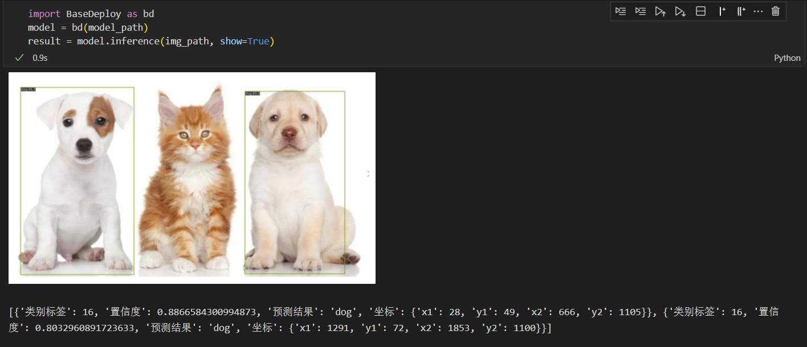

基本功能
--------

``BaseDeploy``\ 提供多种便于模型部署的函数，包括了推理与相关库启动部署。

推理功能
~~~~~~~~

``BaseDeploy``\ 对不同任务的模型进行统一的推理管理，对于用户来说仅需更换onnx模型的路径，\ ``BaseDeploy``\ 会自动匹配对应的任务类型，并将推理和显示的内部流程进行封装。

.. code:: python

   model.inference(input_data, show, get_img, score, show_path)

参数说明如下：

``input_data``:
可以为图片路径，文件夹路径，BaseDT预处理后的路径，CV2摄像头拍摄的图片。

``show``\ ：是否在Jupyter界面中显示图片，默认为：False。

``get_img``\ ：得到回传图片做二次操作，默认为：None，可选参数为\ ``pil``\ 和\ ``cv2``\ 。

``score``\ ：识别阈值，无论是分类任务还是检测任务，高于score的置信度的图片才会被输出到推理结果，默认为0.65。

``show_path``\ ：是否显示图片路径，默认为False

返回参数说明
^^^^^^^^^^^^

通过BaseDeploy的模型完成推理后，输出的格式为列表，列表中套字典

-  图像分类
   对于目标检测任务字典保存的键为\ ``标签``\ ，\ ``置信度``\ ，\ ``预测结果``\ ，推理结果result如下：

.. code:: python

   result = [{'标签': 215, '置信度': 0.23003787, '预测结果': 'Brittany spaniel'}]

result
为一个列表，其长度为1，列表中的值为字典，字典中包含这张图片推理后的标签、置信度和预测结果。

-  目标检测

对于目标检测任务字典保存的键为\ ``标签``\ ，\ ``置信度``\ ，\ ``预测结果``\ ，\ ``坐标``\ ，推理结果result如下：

.. code:: python

   result = [{'标签': 67, '置信度': 0.8131059408187866, '预测结果': 'cell phone', '坐标': {'x1': 229, 'y1': 113, 'x2': 352, 'y2': 441}}, {'标签': 67, '置信度': 0.7117214202880859, '预测结果': 'cell phone', '坐标': {'x1': 443, 'y1': 103, 'x2': 615, 'y2': 447}}, {'标签': 67, '置信度': 0.6600658297538757, '预测结果': 'cell phone', '坐标': {'x1': 25, 'y1': 142, 'x2': 144, 'y2': 479}}]

result
为一个列表，其长度为3，可通过result[0]，result[1]，result[2]得到，列表中的值为字典，字典中包含一个检测框中的标签、置信度、预测结果和检测框的四角坐标。
示例，打印result中的预测结果：

.. code:: python

   for item in result:
       print(item['预测结果'])

文件夹推理
^^^^^^^^^^

``BaseDeploy``\ 提供对文件夹中的图片推理的功能

.. code:: python

   import BaseDeploy as bd
   model = bd(model_path)
   result = model.inference(folder_path)

参数说明如下：

``model_path``\ ：ONNX模型的路径。

``folder_path``\ ：待推理的文件夹路径，文件夹中的文件需是图片。

-  图像分类

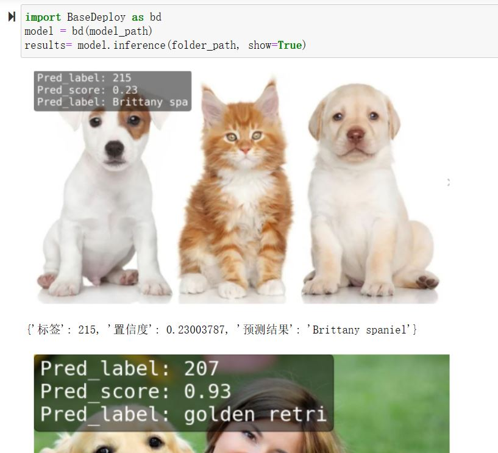

-  目标检测

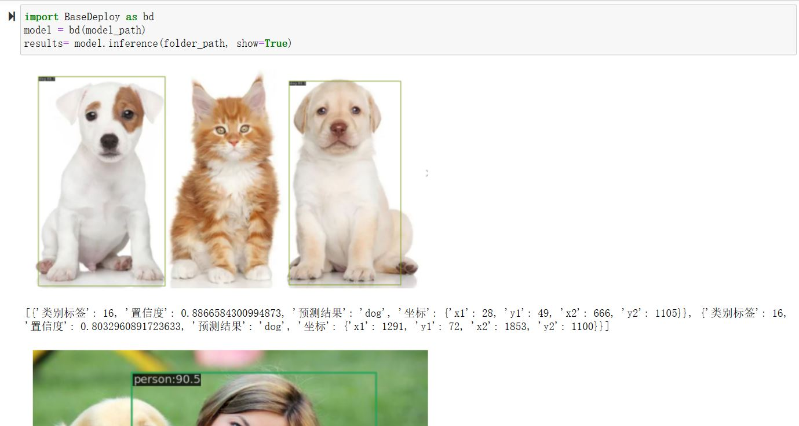

图片路径显示
^^^^^^^^^^^^

将\ ``show_path``\ 设置为True，即可以\ ``文件名+推理结果``\ 作为最终的消息回显（该功能仅对以路径形式传入的方式有效）

.. code:: python

   import BaseDeploy as bd
   model = bd(model_path)
   result = model.inference(folder_path, show=True, show_path=True)

-  图像分类

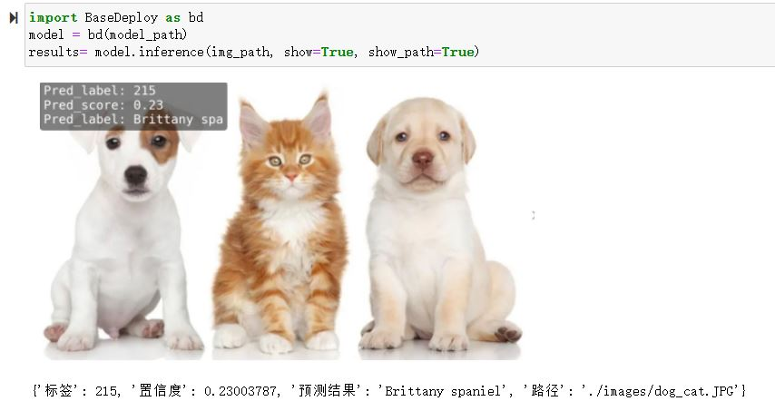

-  目标检测

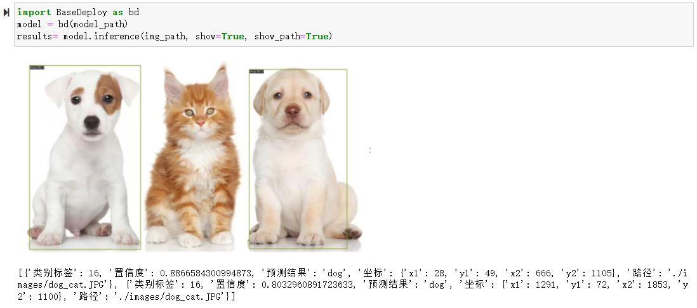

图像回传
^^^^^^^^

``get_img``\ 参数默认为None，可选参数为\ ``pil``\ 和\ ``cv2``\ ，目的是用户可以通过得到的图片二次创作。

.. code:: python

   import BaseDeploy as bd
   model = bd(model_path)
   result, img = model.inference(img_path, get_img='pil')

   from matplotlib import pyplot as plt
   plt.imshow(img)
   plt.axis('off')
   plt.show()

参数说明如下：

``model_path``\ ：ONNX模型的路径。

``img_path``\ ：待推理的图片路径。

``get_img``\ ：\ ``model.inference``\ 中内置的参数，设为\ ``pil``\ 表示回传的图片可供\ ``pil``\ 显示。

PIL方式
'''''''

PIL方式适合Jupyter中进行交互，下面是一个

-  图像分类

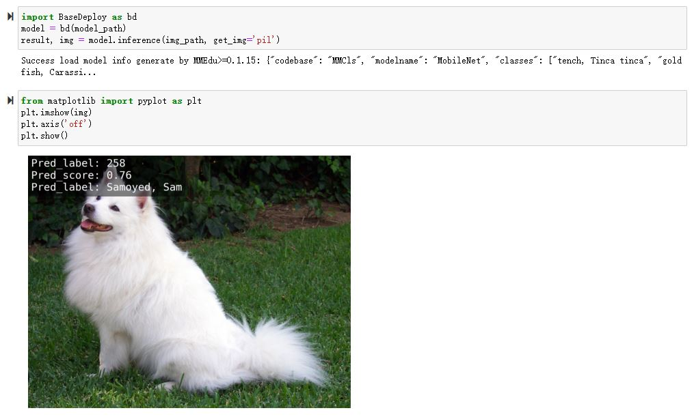

-  目标检测

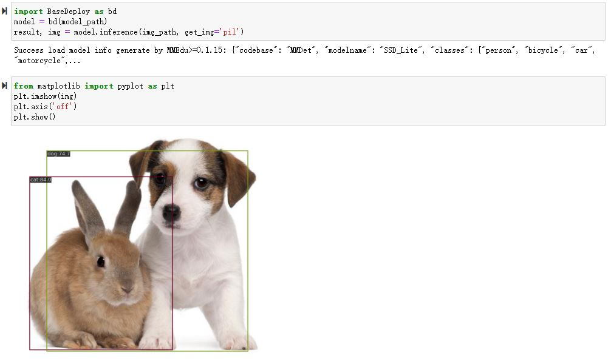

cv2方式
'''''''

cv2方式适合调用屏幕显示等操作。

.. code:: python

   import BaseDeploy as bd
   model = bd(model_path)
   result, img = model.inference(img_path, get_img='cv2')

   import cv2
   cv2.imshow("Image", img)
   cv2.waitKey(0)
   cv2.destroyAllWindows()

参数说明如下：

``model_path``\ ：ONNX模型的路径。

``img_path``\ ：待推理的图片路径。

``get_img``\ ：\ ``model.inference``\ 中内置的参数，设为\ ``cv2``\ 表示回传的图片可供\ ``cv2``\ 显示。

-  图像分类

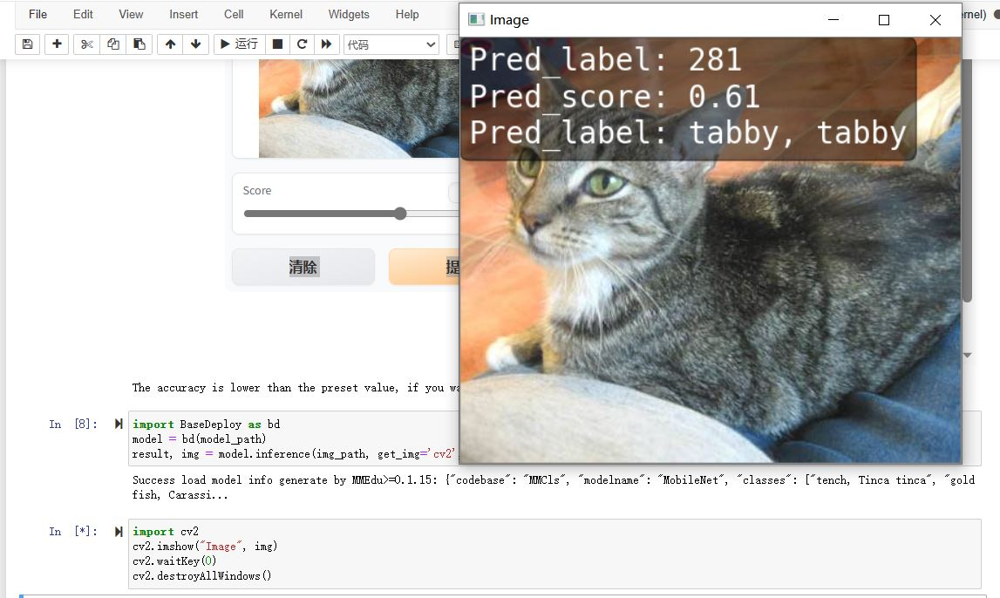

-  目标检测

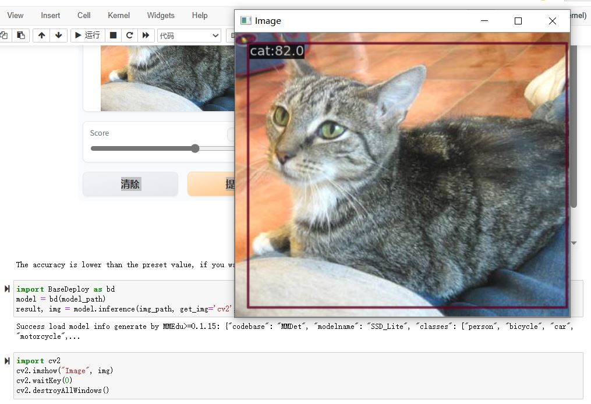

未知ONNX模型的解析
^^^^^^^^^^^^^^^^^^

``BaseDeploy``\ 为适配图像任务，可自动解析未经\ ``XEdu``\ 标记的ONNX模型的输入张量尺寸，并进行图像预处理和输出后处理，输出结果将不会带有类别信息。

.. code:: python

   import BaseDeploy as bd
   model = bd(model_path)
   result = model.inference(img_path)

参数说明如下：

``model_path``\ ：ONNX模型的路径，目前仅支持图像分类和目标检测的模型解析。

``img_path``\ ：待推理的图片路径。

-  图像分类

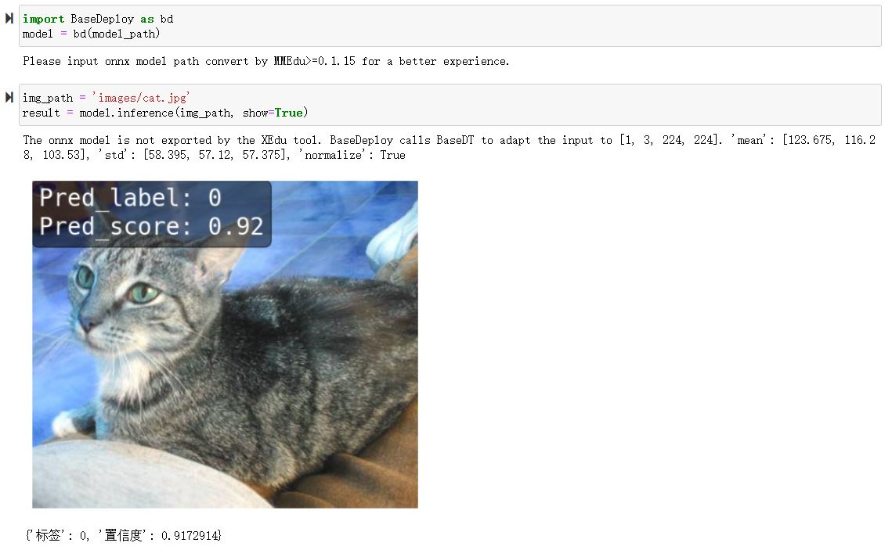

-  目标检测

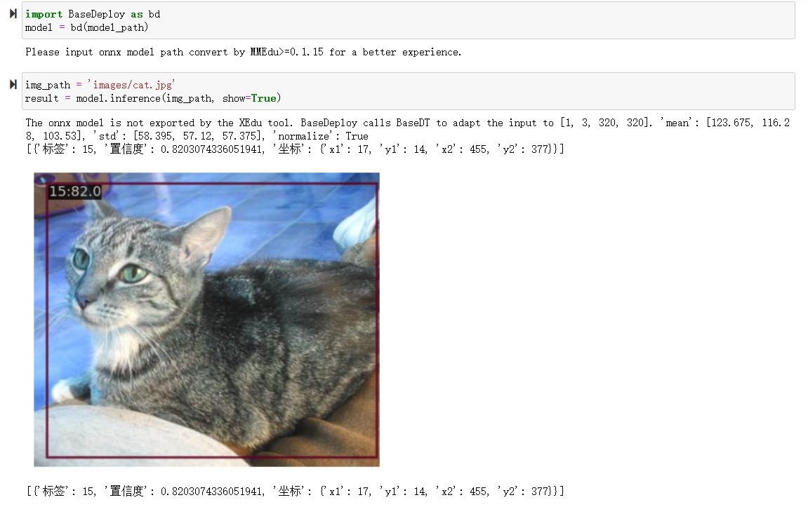

此外，\ ``BaseDeploy``\ 还提供\ ``diy_inference``\ 函数，供用户推理特殊的ONNX模型，其推理的前处理和后处理需要用户自行实现。

.. code:: python

   import BaseDeploy as bd
   model = bd(model_path)
   result = model.diy_inference(input_data)

参数说明如下：

``model_path``\ ：ONNX模型的路径。

``img_path``\ ：待推理的图片路径。

``input_data``\ ：用户自定义前处理好后的张量，请将其保持与模型输入节点需要的张量形状一致。

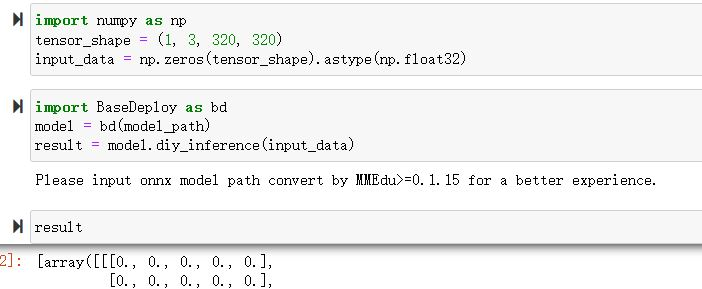

与其他库配合的部署
------------------

``BaseDeploy``\ 通过\ ``model.run()``\ 调用内置的多种部署工具，包括\ ``Gradio``\ ，\ ``EasyAPI``\ ，\ ``SIOT``\ 和\ ``PywebIO``\ 等，实现模型即黑箱的功能，把AI推理简单的视作一个函数。

Gradio
~~~~~~

Gradio
是一种简单易用的Web界面工具，它可以让你快速地将模型部署到Web应用程序中。\ ``BaseDeploy``\ 通过对\ ``Gradio``\ 进行封装，一键启动。为了保证\ ``BaseDeploy``\ 的轻量性，\ ``Gradio``\ 库在安装时并不会被同步安装，如想使用该功能在使用前请使用\ ``pip3 install gradio``\ 进行依赖库的安装。

如何使用
^^^^^^^^

``BaseDeploy``\ 支持在载入模型后使用\ ``run_gradio``\ 函数一键启动，启动后输入界面可选择两个参数，一是点击后选择路径，二是设置\ ``score``\ ，低于\ ``score``\ 的图片将不会被绘制，详情可见运行后日志。

.. code:: python

   import BaseDeploy as bd
   model = bd(model_path)
   model.run_gradio()

-  图像分类 |image|

-  目标检测 |image1|

FastAPI
~~~~~~~

| ``FastAPI`` 是一个Python Web 框架，用于构建高性能的 Web 应用程序和
  API。它是基于 Python
  类型提示和异步编程的优势，提供了快速、易于使用和具有强大功能的开发体验。\ ``BaseDeploy``\ 通过对\ ``FastAPI``\ 的集成，可一键启动接口，并支持json或file的回传形式，用户可自行选择。
| 值得注意的是，由于\ ``FastAPI``\ 本身的限制，目前暂不支持在\ ``Jupyter``\ 中调用该函数。

.. _如何使用-1:

如何使用
^^^^^^^^

-  基本方法

.. code:: python

   import BaseDeploy as bd
   model = bd(model_path)
   model.run_fastapi()

-  拓展功能

| ``run_fastapi``\ 函数的可设置参数有：\ ``port``\ 和\ ``mode``\ 。下面是这两参数的使用解释
| port：设置启动\ ``FastAPI``\ 的端口号，默认为：\ ``1956``\ 。 mode:
  设置\ ``FastAPI``\ 的运行模式，可选参数为\ ``json``\ 和\ ``img``\ ，代表回传的内容为推理结果或推理后绘制的图片，于用户角度即为绘制图像操作在上位机还是下位机完成。
  score：设置绘图阈值，若高于阈值，才进行绘图操作，默认为：\ ``0.65``\ 。

运行后出现下图所示的内容，即代表\ ``FastAPI``\ 启动成功。 |image2|

如何调用接口
^^^^^^^^^^^^

在用户端如需调用\ ``EasyAPI``\ 启动的接口，仅需设置接口地址\ ``url``\ 和图片路径\ ``img_path``\ 。

.. code:: python

   import requests
   url = "http://192.168.31.38:1956/upload"
   img_path = ''
   files = {'files': open(img_path, 'rb')}
   result = requests.post(url=url, files=files)

-  图像分类

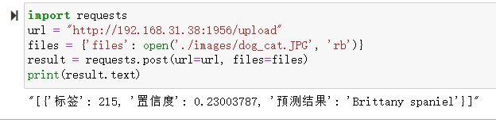

-  目标检测

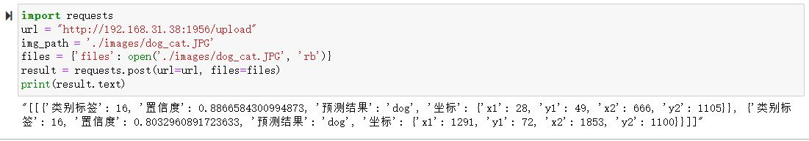

SIOT
~~~~

``SIoT``\ 为“虚谷物联”项目的核心软件，是为了帮助中小学生理解物联网原理，并且能够基于物联网技术开发各种创意应用。因为其重点关注物联网数据的收集和导出，是采集科学数据的最好选择之一。

``BaseDeploy``\ 通过对\ ``SIoT``\ 进行封装，支持一键将后端推理从本地迁移至启动SIoT推理服务的程序。

.. _如何使用-2:

如何使用
^^^^^^^^

要想使用\ ``SIoT``\ ，需要一个\ ``SIoT服务端``\ 的\ ``IP地址``\ ，以及使用\ ``BaseDeploy``\ 启动监听和传输推理的服务。

-  服务端
   服务端需要按照\ ``BaseDeploy``\ 的导入模型的方式定义一个模型，并使用\ ``use_siot``\ 函数启动siot的消息监听功能。

.. code:: python

   import BaseDeploy as bd
   model = bd(model_path)
   model.run_siot(ip=ip_path, mode='infer')

-  用户端
   用户端选用\ ``SIoT``\ 进行推理，不再需要导入\ ``ONNX``\ 模型，故在初始化时仅需将推理后端选为\ ``SIoT``\ 即可。

.. code:: python

   import BaseDeploy as bd
   model = bd(ip_path, backend='siot')

如上操作后，用户即可在用户端使用\ ``model.inference``\ 函数进行模型的推理了，使用方法遵循原有\ ``inference``\ 推理示例。

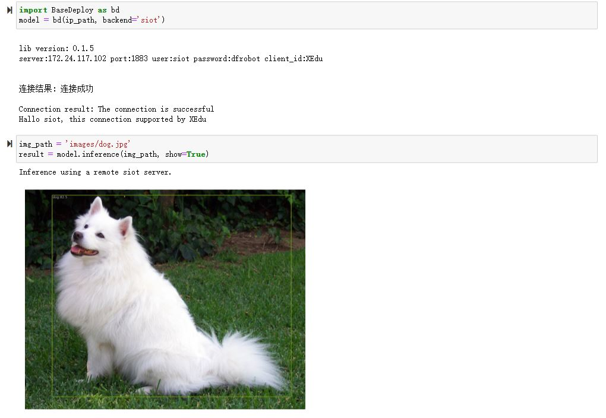

用户端对服务端进行访问时，服务端也会同步打印推理结果，便于用户检查连接状况等。

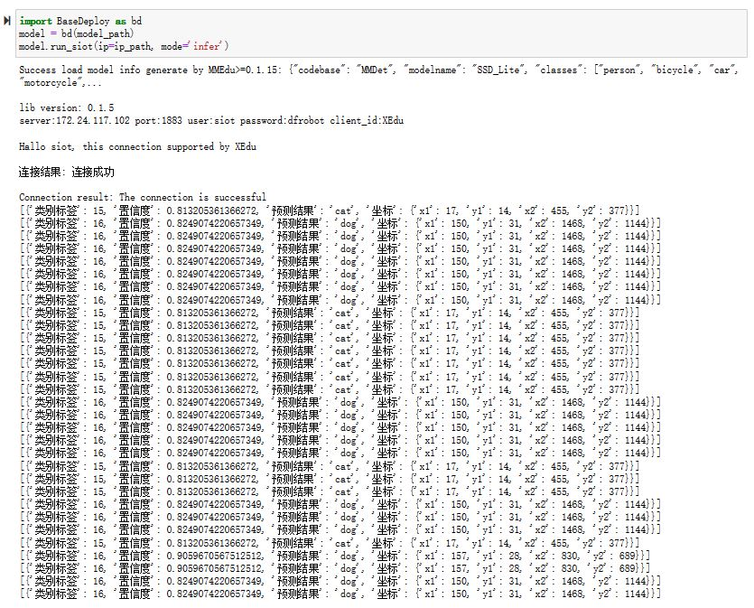

PywebIO
~~~~~~~

``PyWebIO``\ 是一个用于构建交互式Web应用程序的Python库。它提供了一组简单且直观的函数和装饰器，使得开发人员可以在Web浏览器中使用Python来创建丰富的用户界面和交互体验，而无需编写HTML、CSS或JavaScript代码。\ ``BaseDeploy``\ 通过对\ ``PywebIO``\ 的封装，支持一键启动推理服务界面。
值得注意的是，由于\ ``Pywebio``\ 本身的限制，目前暂不支持在\ ``Jupyter``\ 中调用该函数。

-  基本方法

.. code:: python

   import BaseDeploy as bd
   model = bd(model_path)
   model.run_pywebio()

-  拓展功能

``run_pywebio``\ 函数的可设置参数有：\ ``port``\ 。下面是参数的使用解释：

port：设置启动\ ``PywebIO``\ 的端口号，默认为：\ ``1956``\ 。

运行后出现下图所示的内容，即代表\ ``PywebIO``\ 启动成功。

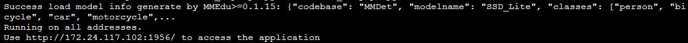

-  推理示例

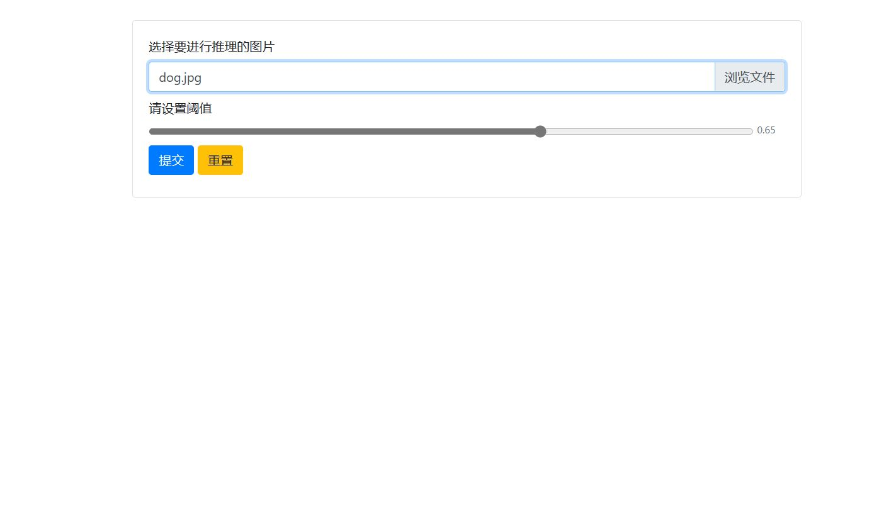

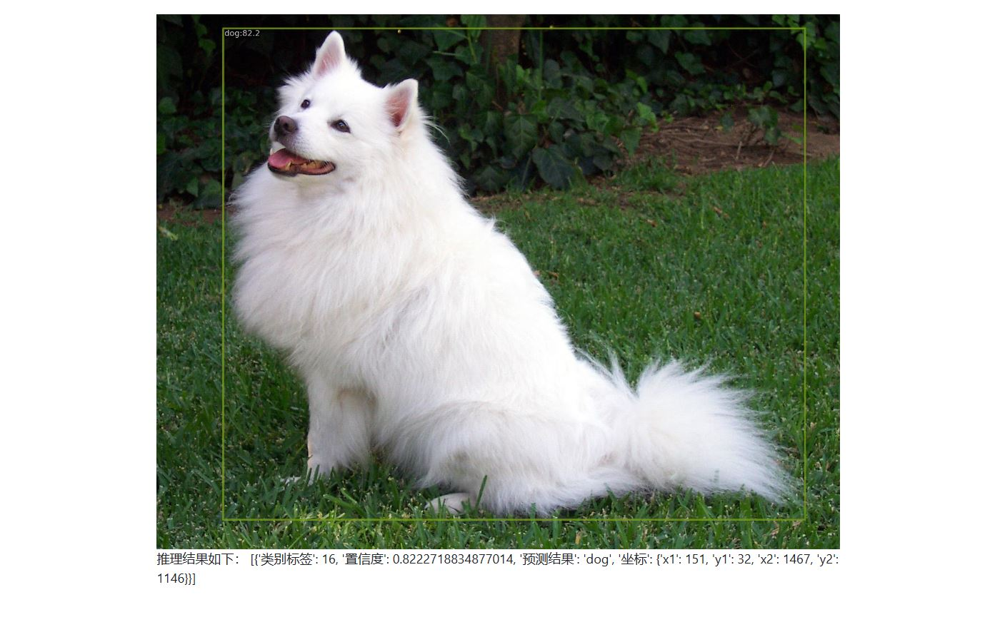

参考链接
--------

Gradio：\ https://github.com/gradio-app/gradio

FastAPI：\ https://github.com/tiangolo/fastapi

SIOT：\ https://github.com/vvlink/SIoT

PywebIO：\ https://github.com/pywebio/PyWebIO

Flask：\ https://github.com/pallets/flask

更多模型部署相关项目
--------------------

猫狗分类小助手：\ https://www.openinnolab.org.cn/pjlab/project?id=641039b99c0eb14f2235e3d5&backpath=/pjedu/userprofile%3FslideKey=project#public

千物识别小助手：\ https://www.openinnolab.org.cn/pjlab/project?id=641be6d479f259135f1cf092&backpath=/pjlab/projects/list#public

有无人检测小助手：\ https://www.openinnolab.org.cn/pjlab/project?id=641d3eb279f259135f870fb1&backpath=/pjlab/projects/list#public

树莓派与MMEdu：\ https://www.openinnolab.org.cn/pjlab/project?id=63bb8be4c437c904d8a90350&backpath=/pjlab/projects/list%3Fbackpath=/pjlab/ai/projects#public

MMEdu模型在线转换：\ https://www.openinnolab.org.cn/pjlab/project?id=63c756ad2cf359369451a617&sc=62f34141bf4f550f3e926e0e#public

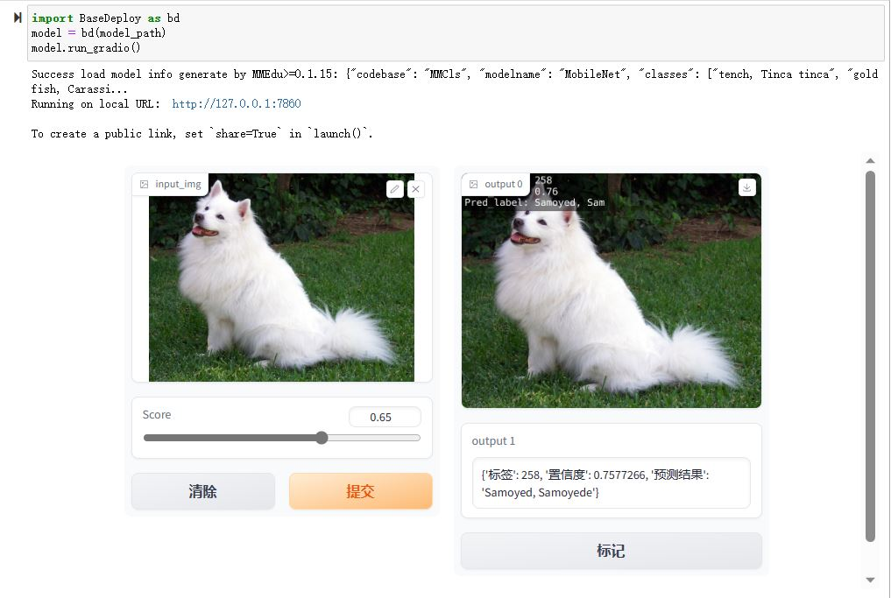
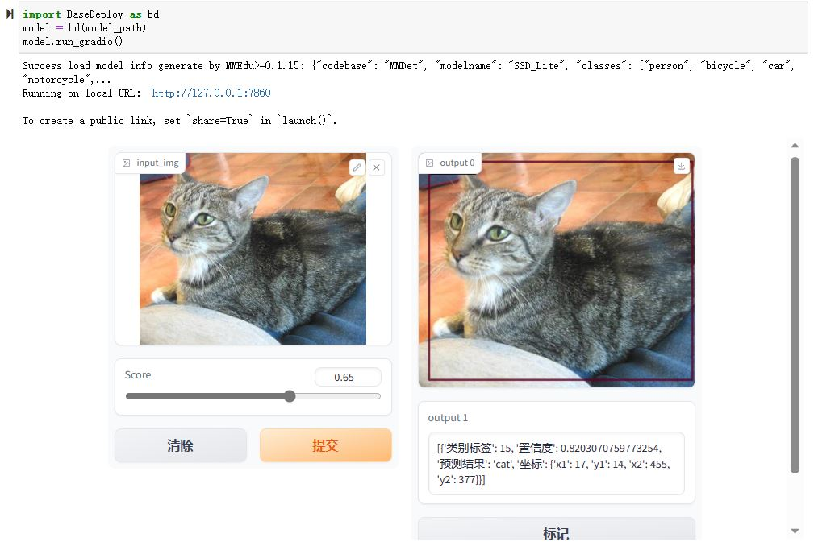
.. |image2| image:: ../images/basedeploy/EasyAPI_命令行启动.JPG
