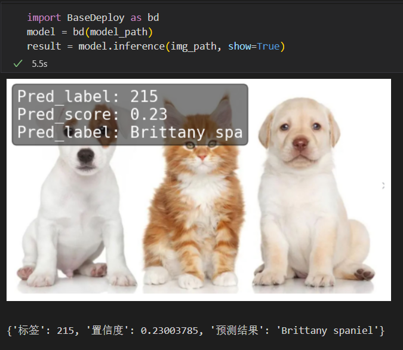

# 快速体验BaseDeploy

`XEdu`团队推出的模型部署工具`BaseDeploy`，其代码风格向`MMEdu`对齐，通过对推理核心代码的封装，目标是用户能够更加专注于科创作品功能的设计，而将AI模块作为接口的黑盒，能够对其返回的结果进行二次创作。

`BaseDeploy`通过传入[ONNX模型](https://xedu.readthedocs.io/zh/master/mmedu/model_convert.html#id4)的路径加载为一个模型，通过`model.inference`即可完成模型的推理，从而可实现借助BaseDeploy完成模型部署。

## 示例代码

示例代码一：

```python
from BaseDT.data import ImageData
import BaseDeploy as bd
model_path = './mymodel.onnx'
dt = ImageData(img_path, backbone='训练的模型名称，例如MobileNet')
model = bd(model_path)
pred_onx = model.inference(dt)
result = model.print_result(pred_onx)
```

本段代码实现的功能是将`BaseDT`预处理好后的图片传入`BaseDeploy`推理函数进行推理，并将推理结果返回。关于BaseDT处理图片的说明详见[BaseDT部分](https://xedu.readthedocs.io/zh/master/basedt/quick_start.html#id12)。

示例代码二：

```python
import BaseDeploy as bd
model_path = './mymodel.onnx'
model = bd(model_path)
pred_onx = model.inference(img_path)
result = model.print_result(pred_onx)
```

本段代码实现的功能是将图片路径传入`BaseDeploy`推理函数进行推理，并将推理结果返回。

示例代码三：

```python
import cv2
import BaseDeploy as bd
model_path = './mymodel.onnx'
cap = cv2.VideoCapture(0)
ret, img = cap.read()
model = bd(model_path)
pred_onx = model.inference(img)
result = model.print_result(pred_onx)
cap.release()
```

本段代码实现的功能是将cv2调用摄像头拍摄的图片传入`BaseDeploy`推理函数进行推理，并将推理结果返回。此处代码与[借助MMEdu完成模型转换](https://xedu.readthedocs.io/zh/master/mmedu/model_convert.html#mmedu)后生成的示例代码非常相似。

实现效果如下：


- 图像分类




- 目标检测


## 更多模型部署相关项目

猫狗分类小助手：[https://www.openinnolab.org.cn/pjlab/project?id=641039b99c0eb14f2235e3d5&backpath=/pjedu/userprofile%3FslideKey=project#public](https://www.openinnolab.org.cn/pjlab/project?id=641039b99c0eb14f2235e3d5&backpath=/pjedu/userprofile%3FslideKey=project#public)

千物识别小助手：[https://www.openinnolab.org.cn/pjlab/project?id=641be6d479f259135f1cf092&backpath=/pjlab/projects/list#public](https://www.openinnolab.org.cn/pjlab/project?id=641be6d479f259135f1cf092&backpath=/pjlab/projects/list#public)

有无人检测小助手：[https://www.openinnolab.org.cn/pjlab/project?id=641d3eb279f259135f870fb1&backpath=/pjlab/projects/list#public](https://www.openinnolab.org.cn/pjlab/project?id=641d3eb279f259135f870fb1&backpath=/pjlab/projects/list#public)

树莓派与MMEdu：[https://www.openinnolab.org.cn/pjlab/project?id=64992a4dc0b7072a267541f4&sc=635638d69ed68060c638f979#public](https://www.openinnolab.org.cn/pjlab/project?id=64992a4dc0b7072a267541f4&sc=635638d69ed68060c638f979#public)

MMEdu模型在线转换：[https://www.openinnolab.org.cn/pjlab/project?id=645110943c0e930cb55e859b&sc=635638d69ed68060c638f979#public](https://www.openinnolab.org.cn/pjlab/project?id=645110943c0e930cb55e859b&sc=635638d69ed68060c638f979#public)