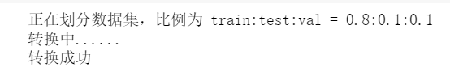
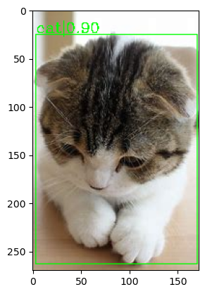

快速上手BaseDT
==============

简介
----

BaseDT不仅是一个功能强大的数据处理库，也是一个易于使用和扩展的库。它可以让你专注于模型的构建和训练，而不用担心数据处理的问题。

安装
----

``pip install basedt``\ 或\ ``pip install BaseDT``

数据的处理
----------

BaseDT提供了一个data模块，它包含了多个子模块和类，分别针对不同类型和格式的数据提供了处理功能。

1. 图片数据处理
~~~~~~~~~~~~~~~

.. code:: python

   from BaseDT.data import ImageData
   #图片路径，修改为对应路径
   img = r"D:\PythonProject\OpenDataLab-Edu\dataset\cat2.jpg" 
   data = ImageData(img, size=(256, 256), crop_size=(224,224), normalize=True)#
   data.show()

下图分别是原图片，resize大小至(256,
256)的图片，crop大小至(224,224)的图片和归一化的图片。

2. 文本数据处理
~~~~~~~~~~~~~~~

.. code:: python

   from BaseDT.data import TextData
   # 文本数据，字典类型
   texts = {'city': 'Dubai', 'temperature': 33}
   data = TextData(texts, vectorize = True)
   print(data.value)

可看到text中\ ``'city': 'Dubai'``\ 的\ ``'Dubai'``\ 向量化后变为1，\ ``'temperature': 33``\ 的33仍保留为原本数值。

3. 语音数据处理
~~~~~~~~~~~~~~~

敬请期待。

4. 通用数据处理
~~~~~~~~~~~~~~~

敬请期待。

5. 模型部署数据处理
~~~~~~~~~~~~~~~~~~~

.. code:: python

   from BaseDT.data import ImageData
   img = r"D:\PythonProject\OpenDataLab-Edu\dataset\cat2.jpg" #修改为对应路径
   data = ImageData(img, backbone = "MobileNet")
   tensor_value = data.to_tensor()

该代码表示使用“MobileNet”网络模型训练时的数据处理，并将数据转化为网络模型可处理的张量。

通过使用BaseDT库，我们可以大大简化网络模型部署时所需地数据处理过程，并且保证与训练时相同或类似地pipeline一致性。

数据集处理
----------

BaseDT提供了一个DataSet类，它可以让你对不同类型和格式的数据集进行处理。

1. 常用数据集下载
~~~~~~~~~~~~~~~~~

敬请期待。

2. 数据集格式检查
~~~~~~~~~~~~~~~~~

敬请期待。

3. 数据集格式转换
~~~~~~~~~~~~~~~~~

（1）针对网上下载的数据集，BaseDT可支持常见数据集格式（目前支持IMAGENET、VOC和COCO）的转换。

首先需将网上下载的原始数据集做初步整理，整理规范如下：

.. code:: python

   原数据集（目标检测）
   |---annotations
         |----xxx.json/xxx.xml/xxx.txt
   |---images
         |----xxx.jpg/png/....
   classes.txt

   原数据集（分类）
   |---images
       |---class1
             |----xxx.jpg/png/....
       |---class2
             |----xxx.jpg/png/....
       |---class3
             |----xxx.jpg/png/....
       |---classN
             |----xxx.jpg/png/....
   classes.txt

如是目标检测数据集，需将所有图片存放至images文件夹，所有标注文件（VOC格式的为xml文件、COCO格式的为json格式）存放至annotations文件夹，同时在根目录下新建一个classes.txt，写入类别信息。如是图像分类数据集，首先需将所有图片按照类别存放，然后将所有图片文件夹放入images文件夹，同时新建一个classes.txt，写入类别信息。通过此过程，也有助于初步了解网上下载的数据集。

整理完毕即可使用BaseDT数据集格式转换的代码完成数据集转换。需指定新数据集路径、原始数据集路径、原始数据集格式、划分比例（如不设置，则默认比例为训练集:测试集:验证集=7:1:2）。

::

   from BaseDT.dataset import DataSet
   ds = DataSet(r"my_dataset") # 指定为新数据集路径
   ds.make_dataset(r"G:\\测试数据集\\fruit_voc", src_format="VOC",train_ratio = 0.8, test_ratio = 0.1, val_ratio = 0.1) # 指定待转格式的原始数据集路径，原始数据集格式，划分比例，默认比例为train_ratio = 0.7, test_ratio = 0.1, val_ratio = 0.2

转换成功后，不仅将网上下载的数据集转换为了XEdu支持的数据集格式，并对训练集、测试集、验证集进行了重新划分。

（2）针对OpenInnoLab平台标注创建的数据集，也可以使用BaseDT直接转换为XEdu支持的数据集。

**注：需新建一个images文件夹用于存放图片
，再将images上传平台进行在线标注。**

.. code:: python

   from BaseDT.dataset import DataSet
   ds = DataSet(r"my_dataset") # 指定目标数据集
   ds.make_dataset(r"/data/HZQV42", src_format="INNOLAB",train_ratio = 0.8, test_ratio = 0.1, val_ratio = 0.1) # 仅需修改为待转格式的原始数据集路径（注意是整个数据集）

更多XEdu支持的数据集格式的介绍详见\ `数据集支持 <https://xedu.readthedocs.io/zh/latest/mmedu/introduction.html#id3>`__\ 部分。

数据的可视化
------------

BaseDT提供了一个plot模块，它可以让你对不同任务的数据进行可视化。

1. 绘制分类任务混淆矩阵
~~~~~~~~~~~~~~~~~~~~~~~

敬请期待。

2. 绘制目标检测任务的检测框
~~~~~~~~~~~~~~~~~~~~~~~~~~~

.. code:: python

   from BaseDT.plot import imshow_det_bboxes
   img = 'test.jpg'
   # imshow_det_bboxes(图像， 框和得分，标签， 类别， 得分阈值)
   imshow_det_bboxes(img, bboxes = [[3,25,170,263,0.9]],labels = [0], class_names = ["cat"], score_thr = 0.8)

3. 绘制分割任务的掩膜
~~~~~~~~~~~~~~~~~~~~~

敬请期待。

轻松调用I/O设备
---------------

BaseDT提供了一个io模块，用于支持数据的I/O设备的调用，它可以让你方便地从不同的来源获取和输出数据。型和格式的数据。

调用麦克风
~~~~~~~~~~

.. code:: python

   from BaseDT.io import MicroPhone
   # 创建麦克风对象
   microphone = MicroPhone()
   # 录音两秒
   audio_data = microphone.record_audio(time = 2)

录制的两秒音频图下如下图：

附录
----

敬请期待。
