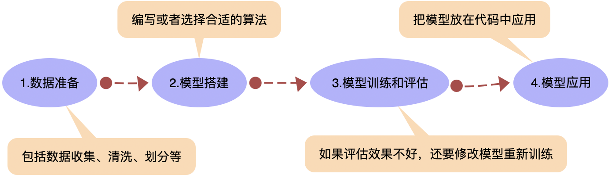
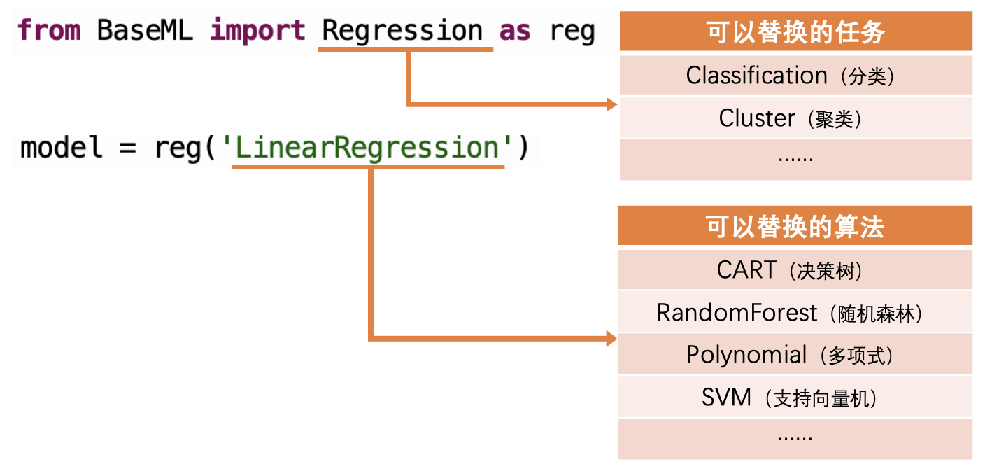
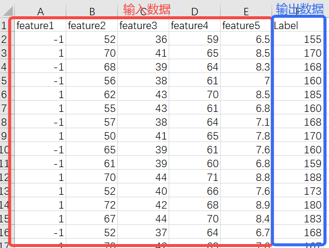
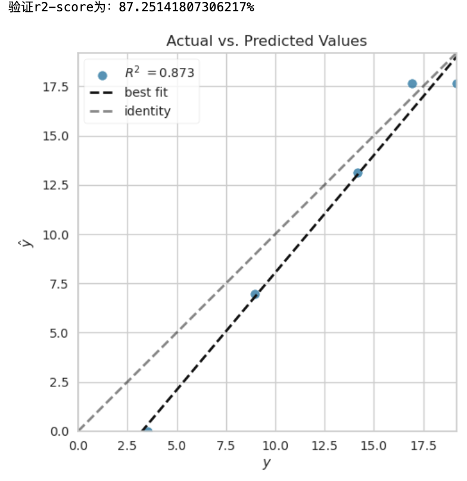

# BaseML功能详解

我们的传统机器学习（Mechine Learning）有很多算法，但总的来说，可以分为三大类：分类、回归和聚类。BaseML和sklearn不同之处，也就体现于此，sklearn尽管在拟合、预测等函数上对各模块做了统一，但并没有明确指出这样的三大类划分方式。这三类也有着特有的数据输入格式。

文档涉及的部分代码见XEdu帮助文档配套项目集：[https://www.openinnolab.org.cn/pjlab/project?id=64f54348e71e656a521b0cb5&sc=645caab8a8efa334b3f0eb24#public](https://www.openinnolab.org.cn/pjlab/project?id=64f54348e71e656a521b0cb5&sc=645caab8a8efa334b3f0eb24#public)

## 机器学习的基本流程

机器学习实际上分为两个阶段，首先是模型训练过程，即“学习”；然后是模型推理过程，即“应用”。典型的机器学习流程可以分为数据准备、模型搭建、模型训练与评估、模型应用等环节（如下图）。



### 1.数据准备

数据是描述客观事物或现象的符号记录，可以是数字、文字、图像、声音等形式。机器学习需要很多数据，我们称之为“数据集”。要训练怎样的模型，就要准备怎样的数据。例如要训练温度转换的模型，就要准备很多条类似“摄氏温度和华氏温度对应表”的数据。

### 2.模型搭建

搭建机器学习的模型，核心工作是实现一个具有特定功能的算法。实现机器学习的算法需要编写程序，难度较大。但好消息是Python有多个机器学习的库，这些库中内置了各种优秀的算法，只要根据需要选择合适的算法，就可以直接完成模型的搭建。

### 3.模型训练与评估

对于训练好的模型，需要评估一下其推理能力，类似人学习了某个课程后，还要做点单元小测试，看看掌握了多少。对回归任务来说，简单好用的评估指标之一是R平方值，对分类任务来说，一般选择准确率。通过比对推断结果与实际标注结果的差异，可以计算出评估指标。如果推理效果不好，要重新检查数据和模型，再次训练。

### 4.模型应用

当训练出来的模型的评估表现不错，那就可以保存模型。保存出来的模型文件，可以导入使用或供其他程序使用。其实模型应用环节和传统编程就差别不大了，只要输入一组新数据，就能输出预测结果。

## 机器学习典型算法一览表
点击对应的`回归`或`分类`，可连接至该算法更详细的说明文档。
<table class="docutils align-default">
<thead>
  <tr>
    <th>算法名称</th>
    <th>适合任务</th>
    <th>典型任务</th>
    <th class="wrapword">算法解释</th>
    <th class="wrapword">常用参数及其默认值</th>
  </tr>
</thead>
<tbody>
  <tr>
    <td>线性回归（LinearRegression）</td>
    <td><a href="https://scikit-learn.org/stable/modules/generated/sklearn.linear_model.LinearRegression.html#sklearn-linear-model-linearregression">回归</a></td>
    <td>适用于预测房价、预测销售额、贷款额度等。</td>
    <td class="wrapword">线性回归（Linear Regression）线性回归算法的核心思想是找到一条直线，使得这条直线能够最好地代表和预测数据。通常适用于连续值的预测，例如房价、贷款额度等。线性回归就像用直尺在散点图上画一条尽可能穿过所有点的直线，这条直线就能帮我们预测未来的值。</td>
    <td class="wrapword">fit_intercept=True, positive=False</td> 
  </tr>
</tbody>
<tbody>
  <tr>
    <td>最近邻分类（KNN, K-Nearest Neighbors）</td>
    <td><a href="https://scikit-learn.org/stable/modules/generated/sklearn.neighbors.KNeighborsClassifier.html#sklearn-neighbors-kneighborsclassifier">分类</a></td>
    <td class="wrapword">识别数字、判断邮件是否为垃圾邮件、图像识别等。</td>
    <td class="wrapword">最近邻分类算法核心思想是“近朱者赤”。如果要分析一个新数据点的类别，我们会寻找离它最近的K个邻居，哪类邻居多，就认为新数据点也属于该类。适用于数据集较小等情况，分类结果直观。假设你在一个聚会上不认识任何人，你可能会找和你最相似的人群加入。KNN算法也是这样工作的，它通过查找最相似（最近邻）的数据点来进行分类。</td>
    <td>n_neighbors=5, p=2（距离计算方式）</td>
  </tr>
</tbody>
<tbody>
  <tr>
    <td>支持向量机（SVM, Support Vector Machine）</td>
    <td><a href="https://scikit-learn.org/stable/modules/generated/sklearn.svm.SVC.html#sklearn-svm-svc">分类</a>/<a href="https://scikit-learn.org/stable/modules/generated/sklearn.svm.SVR.html#sklearn-svm-svr">回归</a></td>
    <td>文本分类、图像识别、股票市场分析等。</td>
    <td class="wrapword">支持向量机算法在一个高次元空间来思考问题，尤其适合处理多特征、非线性和少样本的学习问题。此外，它能够很好地适应干扰数据和异常值带来的模型误差。可用于分类和回归。此处使用支持向量机（SVM）完成分类任务。想象你有两种颜色的球分布在桌子上，SVM就是用一根棍子（在复杂情况下是一张弯曲的板）尽可能分开两种颜色的球。</td>
    <td class="wrapword">kernel='rbf', gamma='scale', tol=0.001, C=1.0</td>
  </tr>
</tbody>
<tbody>
  <tr>
    <td>决策树算法（CART）</td>
    <td><a href="https://scikit-learn.org/stable/modules/generated/sklearn.tree.DecisionTreeClassifier.html#sklearn-tree-decisiontreeclassifier">分类</a>/<a href="https://scikit-learn.org/stable/modules/generated/sklearn.tree.DecisionTreeRegressor.html#sklearn-tree-decisiontreeregressor">回归</a></td>
    <td>适用于客户分级、疾病诊断等。</td>
    <td class="wrapword">决策树算法将数据看作树的若干片叶子。在每一个树杈位置，决策树都根据特征的不同而划分，将不同的叶子分在不同的枝干上，算法根据最优划分方法，将误差降到最低。该算法解释性强，在解决各种问题时都有良好表现。此处使用决策树分类（CART）完成分类任务。想象你在做一个选择（比如选择餐馆），你可能会根据一系列问题（离家近不近？价格怎么样？）来决定。决策树算法就是通过一系列问题来达到决策的过程。</td>
    <td class="wrapword">criterion='squared_error', max_depth=None, min_samples_split=2, min_samples_leaf=1, min_weight_fraction_leaf=0.0, max_features=None</td>
  </tr>
</tbody>
<tbody>
  <tr>
    <td>随机森林算法（Random Forest）</td>
    <td><a href="https://scikit-learn.org/stable/modules/generated/sklearn.ensemble.RandomForestClassifier.html#sklearn-ensemble-randomforestclassifier">分类</a>/<a href="https://scikit-learn.org/stable/modules/generated/sklearn.ensemble.RandomForestRegressor.html#sklearn-ensemble-randomforestregressor">回归</a></td>
    <td>信用评分、医疗分析、股票市场行为等。</td>
    <td class="wrapword">随机森林算法是一种基于集成学习的算法，通过构建多棵决策树并将它们的预测结果进行集成，从而降低风险。它能够处理多特征数据，并自动选择最相关特征，从而提升模型准确率。如果你问很多朋友一个问题，并根据他们的回答来做决定，那么你就用了随机森林的思想。它建立了很多个决策树，并综合它们的意见来做出最终的决策。</td>
    <td class="wrapword">n_estimators=100, criterion='squared_error', max_depth=None, min_samples_split=2, min_samples_leaf=1, min_weight_fraction_leaf=0.0, max_features=1.0, bootstrap=True, oob_score=False, warm_start=False</td>
  </tr>
</tbody>
<tbody>
  <tr>
    <td>自适应增强算法（AdaBoost）</td>
    <td><a href="https://scikit-learn.org/stable/modules/generated/sklearn.ensemble.AdaBoostClassifier.html#sklearn-ensemble-adaboostclassifier">分类</a>/<a href="https://scikit-learn.org/stable/modules/generated/sklearn.ensemble.AdaBoostRegressor.html#sklearn-ensemble-adaboostregressor">回归</a></td>
    <td>人脸识别、客户流失预测、分类任务等。</td>
    <td class="wrapword">自适应增强算法（Adaptive Boosting，AdaBoost）是一种迭代算法，需要经历多个阶段，在每个阶段都增加一个新的智能体帮助判断，直到达到足够小的错误率。这种算法在各领域都表现出超凡的能力。想象一个团队里有很多成员，每个人在第一次做决策时可能不是很准确。但随着时间的推移，团队成员学习如何根据过去的错误来改进，使得整个团队的决策越来越好。</td>
    <td class="wrapword">n_estimators=50, learning_rate=1.0, loss='linear'</td>
  </tr>
</tbody>
<tbody>
  <tr>
    <td>多层感知机算法（MLP）</td>
    <td><a href="https://scikit-learn.org/stable/modules/generated/sklearn.neural_network.MLPClassifier.html#sklearn-neural-network-mlpclassifier">分类</a>/<a href="https://scikit-learn.org/stable/modules/generated/sklearn.neural_network.MLPRegressor.html#sklearn-neural-network-mlpregressor">回归</a></td>
    <td>适用于语音识别、手写识别、自然语言处理等。</td>
    <td class="wrapword">多层感知机算法是一种深度学习算法。它通过模拟大脑的神经元系统，将信号通过突触传递到与之相关的神经元中，如果传递正确，这样的传递就会被强化，从而逐渐构成模型。它可以自动学习到输入特征之间非常复杂的关系。但是，它的训练时间可能会较长，且依赖大量训练数据。想象你在通过多层不同的筛子来过滤沙子，每层筛子的网眼大小不同。沙子在通过每层筛子时都会被进一步细分。多层感知机就是通过多层处理（神经网络层）来从数据中学。</td>
    <td class="wrapword">hidden_layer_sizes=(100,), activation='relu', *, solver='adam', alpha=0.0001, batch_size='auto', learning_rate='constant', learning_rate_init=0.001, power_t=0.5, max_iter=200, shuffle=True, tol=0.0001, verbose=False, warm_start=False, momentum=0.9, nesterovs_momentum=True, early_stopping=False, validation_fraction=0.1, beta_1=0.9, beta_2=0.999, epsilon=1e-08, n_iter_no_change=10, max_fun=15000</td>
  </tr>
</tbody>
<tbody>
  <tr>
    <td>……</td>
    <td>……</td>
    <td>……</td>
    <td>……</td>
    <td>……</td>
  </tr>
</tbody>
</table>


## 代码详解

核心代码：

```
from BaseML import Regression as reg # 从库文件中导入回归任务模块
model = reg('LinearRegression') # 实例化线性回归模型
model.set_para(fit_intercept=True) # 设定模型参数
model.load_tab_data( './data_train.csv') # 载入训练数据
model.train() # 训练模型
model.valid('./data_val.csv',metrics='r2') # 载入验证数据并验证
model.save('mymodel. pkl') # 保存模型供应用
```
其中`设定模型参数`非必要，各参数都有默认值，具体见[上表](#id6)。
### 1. 导入包与搭建模型

库文件的导入只需要一行代码，根据机器学习的任务导入相应的库。“Regression”模块内置了回归任务的常见算法，“Classification”模块内置了分类任务的常见算法，“Cluster”模块则内置了聚类任务的常见算法。

在BaseML中使用不同算法：



第二句代码属于模型搭建，除了实例化模型，选择部分算法如需额外设置参数可添加参数设置的代码（涉及的参数见上文的机器学习典型算法一览表），一般有如下三种搭建形式，下面以搭建多层感知机算法为例进行说明，此算法一般需要设置隐藏层"hidden_layer_sizes"，hidden_layer_sizes":(100,200)表示2层神经元数量为100和200的隐藏层。如下是他的三种搭建形式。

```
# 第一种形式
param = {"hidden_layer_sizes":(100,200), }
model = reg("MLP",para=param)

# 第二种形式
model = reg("MLP")
model.para = {"hidden_layer_sizes":(100,200), "activation":'relu', "solver":'adam'}

# 第三种形式
model = reg("MLP")
model.set_para(hidden_layer_sizes=(100,200), activation='relu', solver='adam')
```

#### 拓展功能：查看各任务拥有的算法以及类注释

```
from BaseML import Regression as reg
reg.__doc__

from BaseML import Classification as cls
cls.__doc__

from BaseML import Cluster as clt
clt.__doc__
```

### 2. 数据载入

BaseML库支持各种形式载入数据。

#### （1）针对CSV数据

方法1：使用`load_tab_data`方法直接载入一个CSV文件（对CSV文件有严格格式要求：数据文件每行一条记录，输入数据（特征）列在前，输出数据（目标或标签）列在后，即最后一列为输出数据，其余列为输入数据）。

```
model.load_tab_data('data/Height_data_train.csv')
```

返回值是x_train, y_train, x_val, y_val: 训练集和验证集，如无则返回“None”。

参数说明：

`data_path`：CSV数据集路径，数据格式要求如下：



`train_val_ratio` ：训练集与验证集的比例，float类型，默认值为1.0，即默认不划分，全部作为训练集。

`shuffle`： 是否打乱数据，默认为True。

`random_seed`：随机数种子，用于复现代码效果。

方法2：使用`load_dataset`方法载入，需指定文件类型、特征列和标签列，可辅助做特征选择，此方法载入数据更加灵活。

```
# 载入数据集，并说明特征列和标签列
model.load_dataset('./lenses.csv', type ='csv', x_column = [1,2,3,4],y_column=[5])
```

参数说明：

`type`表示X和y的输入格式，可选项为‘csv'、‘numpy'、'pandas'、'list'、'txt'。

`x_column`表示特征列。

`y_column`表示标签列。

`split`：是否划分训练集、验证集，默认为True。

`shuffle`： 是否打乱数据，默认为True。

`scale`是否对数据进行归一化，默认为False。

`show`：显示5条数据。默认为True。

#### （2）针对图片数据

读取图像数据转换为Numpy数组后直接从变量载入数据。使用上文介绍过的载入数据更加灵活的`load_dataset`方法载入即可。

```
# 载入数据，并说明特征列和标签列
model.load_dataset(X=train_x, y=train_y,type ='numpy')
```

`X`表示数据特征，`y`表示标签。可再设置`x_column`和`y_column`参数，不设置则默认指定的X和y的所有列。

其他参数同上文。

#### 辅助工具：BaseML内置的图像处理模型`ImageLoader`

如需对图片进行处理后再载入，可借助BaseML内置的图像处理模型`ImageLoader`。

简单使用示例：

以读取ImageNet格式的MNIST数据集为例，进行说明。

```
from BaseML import IMGLoader
# 指定数据集路径
train_path = '/data/QX8UBM/mnist_sample/training_set'
test_path = '/data/QX8UBM/mnist_sample/test_set'
# 初始化图片加载器并载入数据集
img_set = IMGLoader.ImageLoader(train_path, test_path,size=28)
# 图像数字化处理
X_train, y_train, X_test, y_test = img_set.get_data(method='flatten')
```

```
# 载入数据，从变量载入
model.load_dataset(X=X_train, y=y_train,type ='numpy')
```

更多使用示例详见[后文](https://xedu.readthedocs.io/zh/master/baseml/tool.html#imageloader)。

### 3. 模型训练

```
# 模型训练
model.train()
```

### 4.模型评估

如载入的是文本数据且直接使用`load_tab_data`载入，评估时可直接载入一个数据集格式要求及输入列数量等和训练数据保持高度一致即可的验证集进行模型评估即可。

```
model.valid('data_val.csv',metrics='acc') # 载入验证数据并验证
```

参数说明：

`path`: 验证集的路径。

`metrics`：评估指标选择，默认为'acc(accuracy)'，还支持precision,recall,f1,auc,r2,mse,mae、Silhouette Score、Calinski-Harabasz Score、Davies-Bouldin Score等。分类任务一般选择'acc(accuracy)'，回归任务可以选择'r2'(R平方值)或'mse'(MSE值)，聚类任务一般选择Silhouette Score，评估指标的说明详见[后文](https://xedu.readthedocs.io/zh/master/baseml/introduction.html#id20)。

除了传入验证集的路径，还可在`valid`方法中传入x验证集的特征和y验证集的标签进行模型评估，此方式更加灵活。

```
# 模型评估
model.valid(x=val_x,y=val_y,metrics='acc') 
```

`valid`方法的返回值有2个，分别是评估指标计算结果和验证集的推理结果。

### 5. 评价指标可视化

```
model.metricplot() 
```

使用前面运行的代码中读取的验证集的特征val_x和验证集的标签val_y进行绘制，如无或想自行传入，可自行设置。



上图是线性回归任务绘制的可视化图，验证集已有的输出y为横坐标，通过模型推理得到的结果ŷ为纵坐标，如果两者构成的坐标点落在灰色虚线上，说明模型完全契合验证数据。而实际构成的点没有落在灰色虚线上，而是围绕黑色虚线分布，两条虚线相差越大，说明模型效果越差。

### 6. 模型推理

```
# 给定一组数据，推理查看效果
y=model.inference([[1,1,1,1]])
```

### 7. 模型的保存与加载

```python
# 保存模型
model.save('my_CART_model.pkl')
# 加载模型
model.load("my_CART_model.pkl")
```

参数为模型保存的路径。

模型保存后可加载模型进行模型测试，参考代码如下：

```
# 加载模型
model.load("my_CART_model.pkl")
# 给定一组数据，推理查看效果
y=model.inference(data)
```

### 8. 模型应用

模型应用是将训练好的模型部署到实际场景中，例如集成到网站或移动应用中。一般来说，一个训练模型的工具也会自带了推理功能，如在BaseML训练好模型并保存，下次使用时以同样的方式导入BaseML库并载入模型进行推理即可。还有种方式是借助一些通用的模型推理库，如XEdu工具的XEduHub库，支持推理各种工具训练的模型，此类库的安装一般比机器学习开发工具简单很多。也可以[借助XEduHub库完成推理](https://xedu.readthedocs.io/zh/master/xedu_hub/introduction.html#baseml)和应用，核心代码如下。

```
from XEdu.hub import Workflow as wf
baseml = wf(task='baseml',checkpoint='./model.pkl') # 指定使用的pkl模型
data = [[1, 1, 1, 1]]# 指定测试数据，根据训练模型时使用的数据来定
result= baseml.inference(data=data) # 进行模型推理
print(result)
```

## 附录

### 1. 分类、回归和聚类

如果预测任务是为了将观察值分类到有限的标签集合中，换句话说，就是给观察对象命名，那任务就被称为**分类**任务。另外，如果任务是为了预测一个连续的目标变量，那就被称为**回归**任务。

所谓**聚类**，即根据相似性原则，将具有较高相似度的数据对象划分至同一类簇，将具有较高相异度的数据对象划分至不同类簇。聚类与分类最大的区别在于，聚类过程为无监督过程，即待处理数据对象没有任何先验知识，而分类过程为有监督过程，即存在有先验知识的训练数据集。

### 2. 常见评估指标

**Precision (精确率)**：分类任务。用来衡量正类预测的准确性。想象一下，你用网捞鱼，精确率就是你捞上来的所有鱼中真正你想要的鱼的比例。在分类任务中，精确率表示的是被正确预测为正类（如真实的病例、真正的信号）的实例占所有预测为正类的实例的比例。

**Recall (召回率)**：分类任务。用来衡量模型捕捉正类实例的能力。召回率表示的是正确预测为正类的实例占所有实际正类的实例的比例。

**F1 Score (F1分数)**：分类任务。平衡精确率和召回率，尤其适用于不平衡数据集。精确率和召回率像是一对矛盾的兄弟，一个高，另一个往往就低。F1分数就是这两个兄弟的和平协议，它找到了两者之间的平衡点。F1分数是精确率和召回率的调和平均数，用于给出单个度量，在两者之间取得平衡。

**AUC (曲线下面积)**：分类任务。衡量模型区分两个类别（正类和负类）的能力。想象一下你画了一条线分隔好人和坏人，AUC衡量的就是这条线分隔好坏人能力的指标。AUC是接收者操作特性（ROC）曲线下的面积，值越高，表示模型区分正类和负类的能力越强。

**R2 (决定系数)**：回归任务。衡量模型解释数据变异的能力。这个指标告诉我们模型对现实数据的拟合程度如何。值为1意味着模型完美拟合数据，值为0意味着模型不比随机猜测好。你可以把它看作是评分你的模型对数据了解程度的考试成绩。

**MSE (均方误差)**：回归任务。衡量模型预测值和实际值差异的平方的平均值。如果你射箭，每次射箭偏离靶心的距离的平方的平均值，就是均方误差。它衡量的是模型预测值与实际值之间差异的平方的平均值。

**MAE (平均绝对误差)**：回归任务。衡量模型预测值和实际值差异的绝对值的平均值。同样的射箭比喻，每次射箭偏离靶心的距离的平均值，就是平均绝对误差。它是模型预测值与实际值之间差异的绝对值的平均值。

**Silhouette Score (轮廓系数)**：聚类任务。衡量簇的紧密性和分离度。这个指标像是给每个点打分，看它是不是跟自己组里的点挨得很近，同时跟其他组的点挨得很远。分数从-1到1，分数高说明聚类效果好。

**Calinski-Harabasz Score (CH指数)**：聚类任务。基于簇内和簇间离散度来评估聚类的质量。这个指标就像评价一个足球队的防守和进攻。防守紧凑表示同一个簇内的点很接近，进攻犀利表示不同簇的点相隔很远。CH指数越高，聚类效果越好。

**Davies-Bouldin Score (DB指数)**：聚类任务。评估簇的分离度，较低的值表示更好的分离效果。这个指标试图衡量簇内的相似性和簇间的差异。想象你有很多圈朋友，DB指数就像衡量每个圈子里的朋友有多相似，以及不同圈子。

### 3. 其他算法

#### 贝叶斯分类

贝叶斯分类算法常用于解决不确定问题，如人们普遍认为夜里下雨，第二天早晨草地会湿，实际到了早上草地可能就干了，也许是因为风的因素，解决这类问题往往需要根据人类已有的经验来计算某种状态出现的概率，这种方式叫做贝叶斯推理。 贝叶斯分类算法是基于贝叶斯定理的一种算法，即“简单”地假设每对特征之间相互独立。

贝叶斯定理：P(A|B)表示事件B发生的条件下事件A发生的概率，P(A|B)等于事件A发生的条件下事件B发生的概率乘以事件A发生的概率P(A)，再除以事件B发生的概率P(B)。

```
# 实例化模型，模型名称选择NaiveBayes
model=cls('NaiveBayes')
```

#### k均值

k均值（k-means）算法是一种基于数据间距离迭代求解的聚类算法，通过分析数据之间的距离，发现数据之间的内在联系和相关性，将看似没有关联的事物聚合在一起，并将数据划分为若干个集合，方便为数据打上标签，从而进行后续的分析和处理。k代表划分的集合个数，means代表子集内数据对象的均值。

```
# 实例化模型，模型名称选择'KMeans'
model = clt('KMeans')
```

参数`N_CLUSTERS`表示k的值，默认值为5。

#### 谱聚类

谱聚类（spectral clustering）算法主要思想是把所有的数据看做空间中的点，这些点之间可以用边连接起来。将聚类问题转为图分割问题：距离较远（或者相似度较低）的两个点之间的边权重值较低，而距离较近（或者相似度较高）的两个点之间的边权重值较高，将所有数据点组成的图分割成若干个子图，让不同的子图间边权重和尽可能的低，而子图内的边权重和尽可能的高，从而达到聚类的目的。

```
# 实例化模型，模型名称选择'SpectralClustering',
model = clt('SpectralClustering')
```

参数`N_CLUSTERS`表示子图的数量，默认值为5。

#### Agglomerative clustering

Agglomerative clutsering 是一种自底而上的层次聚类方法，它能够根据指定的相似度或距离定义计算出类之间的距离。首先将每个样本都视为一个簇，然后开始按一定规则，将相似度高的簇进行合并，直到所有的元素都归为同一类。

```
# 实例化模型，模型名称选择'Agglomerative clustering'
model = clt('Agglomerative clustering')
```

参数`N_CLUSTERS`表示聚类的数量，默认值为5。
