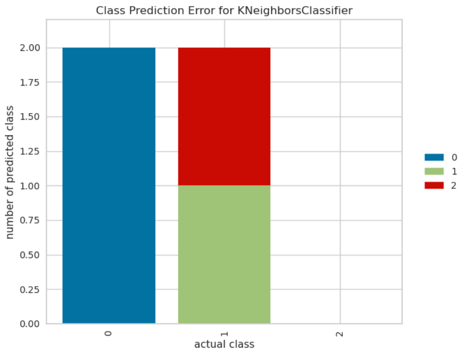

# BaseML项目案例集

## 探秘BaseML之MLP（多层感知机）

本案例选用了多套教材中的数据集，并都使用MLP算法对数据集进行训练，实现了**分类**和**回归**两大任务。

项目地址：[https://openinnolab.org.cn/pjlab/project?id=65f69017ace40851ae424258&sc=635638d69ed68060c638f979#public](https://openinnolab.org.cn/pjlab/project?id=65f69017ace40851ae424258&sc=635638d69ed68060c638f979#public)

### 分类任务实现代码举例
```python
from BaseML import Classification as cls # 从库文件中导入分类任务模块
model = cls('MLP') # 实例化MLP模型
model.set_para(hidden_layer_sizes=(10,10)) # 设定模型参数
                                             # 这里的输入和输出层神经元数量是自动识别的
                                             # 只需要设定隐藏层的神经元数量即可
data = model.load_tab_data('data/road-accessibility-status-analysis.csv',train_val_ratio=0.6) # 载入训练数据
print(data)
model.train(lr=0.01,epochs=100) # 训练模型
model.valid(metrics='acc') # 载入验证数据并验证
model.metricplot() 
```
输出如下：
```
Setting hidden_layer_sizes to (10, 10)
(array([[ 2., 83.],
       [ 1., 80.],
       [ 1., 90.],
       [ 1., 71.],
       [ 1., 87.],
       [ 2., 29.],
       [ 1., 47.]]), array([1., 1., 1., 2., 1., 1., 2.]), array([[ 1., 73.],
       [ 2., 75.],
       [ 2., 48.],
       [ 1., 68.],
       [ 1., 78.]]), array([2., 1., 1., 2., 2.]))
验证准确率为：80.0%
```
上面的代码通过metrics='acc'，计算了分类任务的准确性，并可以通过metricplot()将结果可视化。
### 回归任务实现代码举例
```python
from BaseML import Regression as reg # 从库文件中导入回归任务模块
model = reg('MLP') # 实例化MLP模型
model.set_para(hidden_layer_sizes=(10,10)) # 设定模型参数
                                             # 这里的输入和输出层神经元数量是自动识别的
                                             # 只需要设定隐藏层的神经元数量即可
data = model.load_tab_data('data/cake-size-to-price-prediction.csv',train_val_ratio=0.6) # 载入训练数据
print(data)
model.train(lr=0.01,epochs=100) # 训练模型
model.valid(metrics='r2') # 载入验证数据并验证
model.metricplot() 
```
输出如下：
```
Setting hidden_layer_sizes to (10, 10)
(array([[ 9.],
       [ 6.],
       [10.]]), array([69., 40., 77.]), array([[ 8.],
       [12.]]), array([56., 96.]))
验证r2-score为：98.95081251824811%
```
上面的代码通过metrics='r2'，计算了回归任务的R平方指标的值，并可以通过metricplot()将结果可视化。
## 基于决策树的道路智能决策

本案例来源于上海科教版《人工智能初步》人教地图56-58页。

数据集来源：上海科教版《人工智能初步》人教地图56-58页。

项目地址：[https://www.openinnolab.org.cn/pjlab/project?id=64140719ba932064ea956a3e&sc=635638d69ed68060c638f979#public](https://www.openinnolab.org.cn/pjlab/project?id=64140719ba932064ea956a3e&sc=635638d69ed68060c638f979#public)

### 项目核心功能

借助决策树算法完成道路智能决策，可通过学习和实验了解决策树的工作原理，掌握决策树分类任务编程的流程。

### 数据说明：

第0列：序号；

第1列：道路施工状况：(1) 未施工, (2) 施工；

第2列：预计车流量 ；

第3列：分类结果（道路能否通行）：(1) 不可通行, (2) 可通行。

### 实现步骤：

##### 1）模型训练

```python
# 导入库，从BaseML导入分类模块
from BaseML import Classification as cls
# 实例化模型，模型名称选则CART（Classification and Regression Trees）
model=cls('CART')
# 载入数据集，并说明特征列和标签列
model.load_dataset('./道路是否可通行历史数据f.csv', type ='csv', x_column = [1,2],y_column=[3])
# 模型训练
model.train()
```

##### 2）模型评估

```python
# 模型评估,使用载入数据时默认拆分出的验证集进行评估
model.valid()
# 模型评价指标可视化
model.metricplot()
```

##### 3）模型保存

```python
# 保存模型
model.save('my_CART_model.pkl')
```

##### 4）模型推理

```python
# 使用载入功能，复现效果
m=cls('CART')
m.load('my_CART_model.pkl') # 模型保存路径
y=m.inference([[2,  10]]) # 2代表施工中，10代表预计车流量为10
print(y)
print(label[y[0]-1])
```

## 用多层感知机算法实现手写体数字分类

本案例来源于《人工智能初步》广东教育出版社版75-80页。

项目地址：[https://openinnolab.org.cn/pjlab/project?id=6440e64606618727bee5c1ce&backpath=/pjlab/projects/list#public](https://openinnolab.org.cn/pjlab/project?id=6440e64606618727bee5c1ce&backpath=/pjlab/projects/list#public)

### 项目核心功能：

阿拉伯数字的字形信息量很小,不同数字写法字形相差又不大，使得准确区分某些数字相当困难。本项目解决的核心问题是如何利用计算机自动识别人手写在纸张上的阿拉伯数字。使用的数据集MNIST数据集包含 0~9 共10种数字的手写图片，每种数字有7000张图片，采集自不同书写风格的真实手写图片，整个数据集一共70000张图片。70000张手写数字图片使用`train_test_split`方法划分为60000张训练集（Training Set）和10000张测试集（Test Set）。项目核心功能是使用BaseML库搭建多层感知机实现手写数字识别。

### 实现步骤：

首先需对MNIST数据集进行图像数字化处理，使用BaseML自带的IMGLoader库。

```python
from BaseML import IMGLoader
# 指定数据集路径
train_path = '/data/QX8UBM/mnist_sample/training_set'
test_path = '/data/QX8UBM/mnist_sample/test_set'
# 初始化图片加载器并载入数据集
img_set = IMGLoader.ImageLoader(train_path, test_path,size=28)
# 图像数字化处理
X_train, y_train, X_test, y_test = img_set.get_data(method='flatten')
```

##### 1）模型训练

```python
# 导入库，从BaseML导入分类模块
from BaseML import Classification as cls
# 搭建模型，模型名称选择MLP（Multilayer Perceptron）
model=cls('MLP')
# 设置参数，hidden_layer_sizes":(100,100)表示2层神经元数量为100的隐藏层
model.para = {"hidden_layer_sizes":(100,100)}
# 载入数据，从变量载入
model.load_dataset(X=X_train, y=y_train,type ='numpy')
# 模型训练
model.train()
```

##### 2）模型评估

```python
# 读取验证数据进行评估
model.valid(x=X_val, y=y_val,metrics='acc')
# 评价指标可视化
model.metricplot(X_val,y_val)
```

##### 3）模型保存

```python
# 保存模型
model.save('checkpoints/mymodel.pkl')
```

##### 4）模型推理

```python
# 给定一张图片，推理查看效果
img = '/data/QX8UBM/mnist_sample/test_set/0/0.jpg' # 指定一张图片
img_cast = img_set.pre_process(img)
data = img_set.get_feature(img_cast,method = 'flatten')
print(data)
y = model.inference(data) #图片推理
print(y)
# 输出结果
label=['0', '1', '2', '3', '4', '5', '6', '7', '8', '9']
print(label[y[0]])
```

## 用k近邻为参观者推荐场馆

本案例来源于华师大出版社《人工智能初步》56-57页。

项目地址：[https://www.openinnolab.org.cn/pjlab/project?id=6417d0477c99492cf1aa8ba6&sc=635638d69ed68060c638f979#public](https://www.openinnolab.org.cn/pjlab/project?id=6417d0477c99492cf1aa8ba6&sc=635638d69ed68060c638f979#public)

### 项目核心功能：

使用BaseML来实现k近邻（knn）分类算法，为旅行者们推荐最适合他们的场馆。在项目实践中了解k近邻的工作原理，掌握使用BaseML进行k近邻分类的方法。

数据集来源：华师大出版社《人工智能初步》38页。

### 实现步骤：

首先导入库并进行文本特征数字化。

```python
# 导入需要的各类库，numpy和pandas用来读入数据和处理数据，BaseML是主要的算法库
import numpy as np
import pandas as pd
from BaseML import Classification as cls

# 构建字典键值对
yesno_dict = {'是':1,'否':0}
number_dict = {'多':1,'少':0}
weather_dict = {'雨':-1, '阴':0, '晴':1}

# 采用map进行值的映射
df['首次参观'] = df['首次参观'].map(yesno_dict)
df['参观人数'] = df['参观人数'].map(number_dict)
df['天气'] = df['天气'].map(weather_dict)
df['专业人士'] = df['专业人士'].map(yesno_dict)
```

##### 1）模型训练

```python
# 实例化模型，KNN默认值为k=5
model=cls('KNN')
# 载入数据集，并说明特征列和标签列
model.load_dataset(X = df, y = df, type ='pandas', x_column = [1,2,3,4],y_column=[5])
# 开始训练
model.train()
```

##### 2）模型评估

```python
# 模型评估,使用载入数据时默认拆分出的验证集进行评估
model.valid()
# 模型评价指标可视化
model.metricplot()
```



根据可视化生成的图例可以清晰呈现哪些类别预测错误以及预测的结果。

如上图，正确答案是类别0，全部预测正确；

而正确答案是类别1时有一半预测结果为2，一半预测正确，另一半预测错误；

正确答案是类别2的则全部预测错误。

##### 3）模型推理 

```python
# 给定一组数据，查看模型推理结果
test_data = [[0,1,0,1]]
test_y = model.inference(test_data)
print(test_y)
print(loc.inverse_transform(test_y))
```

拓展-修改k值进行训练：

```python
# 使用k = 3进行训练
model1=cls('KNN')
model1.para = {"n_neighbors":3}
model1.load_dataset(X = df, y = df, type ='pandas', x_column = [1,2,3,4],y_column=[5])
model1.train()
```


## 用线性回归预测蛋糕价格

本案例来源于人教地图版《人工智能初步》39-41页。

项目地址：[https://openinnolab.org.cn/pjlab/project?id=64141e08cb63f030543bffff&backpath=/pjlab/projects/list#public](https://openinnolab.org.cn/pjlab/project?id=64141e08cb63f030543bffff&backpath=/pjlab/projects/list#public)

### 项目核心功能：

使用线性回归预测蛋糕价格，案例场景贴近生活，可通过学习和实验了解线性回归的工作原理，掌握使用BaseML中的线性回归进行预测的方法。

数据集来源：人教地图版《人工智能初步》39-41页。

### 实现步骤：

##### 1）模型训练

```python
# 导入需要的各类库，numpy和pandas用来读入数据和处理数据，BaseML是主要的算法库
import numpy as np
import pandas as pd
from BaseML import Regression as reg
# 实例化模型
model = reg('LinearRegression')
# 载入训练数据
model.load_tab_data( '蛋糕尺寸与价格.csv') 
# 开始训练
model.train()
```

##### 2）模型评估

```python
# 计算R值进行评估
model.valid('蛋糕尺寸与价格.csv',metrics='r2')
```

##### 3）模型保存

```python
# 模型保存
model.save('mymodel.pkl')
```

##### 4）模型应用

```python
# 指定数据
df = pd.read_csv("蛋糕尺寸与价格.csv")
# 输出模型对于数据的预测结果
result = model.inference(df.values[:,0].reshape(-1,1))

# 可视化线性回归
import matplotlib.pyplot as plt
# 画真实的点
plt.scatter(df['蛋糕尺寸/英寸'], df['价格/元'], color = 'blue')
# 画拟合的直线
plt.plot(df.values[:,0].reshape(-1,1), result, color = 'red', linewidth = 4)
plt.xlabel('size')
plt.ylabel('value')
plt.show()
```


## 用k均值实现城市聚类分析

本案例来源于人民教育出版社《人工智能初步》（中国地图出版社）56-59页。

项目地址：[https://openinnolab.org.cn/pjlab/project?id=6440ce55d73dd91bcbcbb934&backpath=/pjedu/userprofile?slideKey=project#public](https://openinnolab.org.cn/pjlab/project?id=6440ce55d73dd91bcbcbb934&backpath=/pjedu/userprofile?slideKey=project#public)

### 项目核心功能：

使用BaseML中的Cluster模块进行聚类，使用matplotlib库对聚类结果进行可视化。该项目可根据同学所在位置，解决聚集点设定问题。可通过学习和实验了解KMeans的工作原理，掌握使用BaseML进行k均值（KMeans）聚类的方法。

数据集来源：自定义数据集。

### 实现步骤：

首先完成数据读取。

```python
import pandas as pd
# 观察数据情况
df = pd.read_csv("2016地区GDP.csv")
```

##### 1）模型训练

```python
# 实例化模型
model = clt('Kmeans')
model.set_para(N_CLUSTERS=5) 
# 指定数据集，需要显式指定类型. show可以显示前5条数据，scale表示要进行归一化。数量级相差大的特征需要进行归一化。
model.load_dataset(X = df, type='pandas', x_column=[1,2], shuffle=True,scale=True)
# 开始训练
model.train()
# 模型保存
model.save('mymodel.pkl')
```

##### 2）模型推理

```python
# 进行推理
result = model.inference()
print(result)
```

```python
# 输出最终的城市聚类文字结果
for index, row in df.iterrows():
    print('{0}属于第{1}个城市集群'.format(row['地区'],result[index])) # 输出每一行
```

可视化聚类结果的代码：

```python
# 可视化最终的城市集群结果
import matplotlib.pyplot as plt

# 画出不同颜色的城市集群点
plt.scatter(df.iloc[:, 1], df.iloc[:, 2], c=result, s=50, cmap='viridis')
# 画出聚类中心
centers = model.reverse_scale(model.model.cluster_centers_)
plt.scatter(centers[:, 0], centers[:, 1], c='black', s=100, alpha=0.5)
# 标出聚类序号
for i in range(model.model.cluster_centers_.shape[0]):
    plt.text(centers[:, 0][i],y=centers[:, 1][i],s=i, 
             fontdict=dict(color='red',size=10),
             bbox=dict(facecolor='yellow',alpha=0.5),
            zorder=0)
```

## Birch聚类算法和城市集群实验
项目地址：[https://www.openinnolab.org.cn/pjlab/project?id=66a358223d983e6b4e98df8d&sc=65ba47eb41dfce00376f4115#public](https://www.openinnolab.org.cn/pjlab/project?id=66a358223d983e6b4e98df8d&sc=65ba47eb41dfce00376f4115#public)

- 实验一：通过仿真数据理解Birch算法的优缺点
- 实验二：模拟层次聚类过程并理解层次的概念
- 实验三：应用Birch算法对城市经纬度进行聚类

### 实验数据集

- [sklearn仿真数据集系列](https://scikit-learn.org/stable/auto_examples/cluster/plot_cluster_comparison.html#sphx-glr-auto-examples-cluster-plot-cluster-comparison-py)
- [中国主要城市经纬度数据集](https://aistudio.baidu.com/datasetdetail/49718)

### 实验步骤
#### 实验一：通过仿真数据理解Birch算法的优缺点
Birch算法是聚类方法中的一种，能够在某些数据上表现更优异。希望通过这个实验，你可以总结出这类适用于这类方法的数据特点。

##### 步骤1：了解数据
这里我们准备了很多仿真数据集，仿真数据集意味着数据是由计算机生成的，而不是数据采集获得的。仿真数据可以根据需求任意设计。下面，我们就先通过可视化代码，查看仿真数据的分布情况。
```python
import pandas as pd
aniso = pd.read_csv(filename)
aniso.plot.scatter(x='x1',y='x2')
```
##### 步骤2：模型训练

我们先用Birch算法在数据上进行训练和训练效果可视化。
```python
from BaseML import Cluster as clt
import pandas as pd

filenames = [
    'aniso.csv',
    'blobs.csv',
    'no_structure.csv',
    'noisy_circles.csv',
    'noisy_moons.csv',
    'varied.csv'
]

for i in range(6):
    model = clt('Birch', N_CLUSTERS=2)
    model.load_dataset(filenames[i],type='csv',x_column=[0,1],shuffle=False)
    model.train()
    label = model.inference()
    data = pd.read_csv(filenames[i])
    data['Label'] = label
    data.plot.scatter(x='x1', y='x2', c='Label', cmap='viridis', legend=True)
```
为了对比效果，我们再使用KMeans算法，在数据上进行训练和训练效果可视化。
```python
from BaseML import Cluster as clt
import pandas as pd

filenames = [
    'aniso.csv',
    'blobs.csv',
    'no_structure.csv',
    'noisy_circles.csv',
    'noisy_moons.csv',
    'varied.csv'
]

for i in range(6):
    model = clt('Kmeans', N_CLUSTERS=2)
    model.load_dataset(filenames[i],type='csv',x_column=[0,1],shuffle=False)
    model.train()
    label = model.inference()
    data = pd.read_csv(filenames[i])
    data['Label'] = label
    data.plot.scatter(x='x1', y='x2', c='Label', cmap='viridis', legend=True)
```
##### 步骤3：观察并得出结论

根据上面数据特点，并对比其他聚类算法，请问你能发现什么样的结论？Birch算法有哪些优点和缺点呢？

#### 实验二：模拟层次聚类过程并理解层次的概念
我们知道层次聚类是按照层次逐渐划分的，我们尝试修改聚类的类别数量，来观察这一过程。

##### 步骤1：调整簇数量
刚才我们对所有数据使用的簇数量（N_CLUSTERS）都是2，我们可以修改为3试试。这里我们以'blobs.csv'数据集为例。
```python
from BaseML import Cluster as clt
import pandas as pd
filename = 'blobs.csv'

model = clt('Birch', N_CLUSTERS=3)
model.load_dataset(filename,type='csv',x_column=[0,1],shuffle=False)
model.train()
label = model.inference()
data = pd.read_csv(filename)
data['Label'] = label
data.plot.scatter(x='x1', y='x2', c='Label', cmap='viridis', legend=True)
```
##### 步骤2：尝试更多可能的簇数量
我们可以通过循环，遍历各种可能性。
```python
from BaseML import Cluster as clt
import pandas as pd
filename = 'blobs.csv'
for i in range(1,7):
    model = clt('Birch', N_CLUSTERS=i)
    model.load_dataset(filename,type='csv',x_column=[0,1],shuffle=False)
    model.train()
    label = model.inference()
    data = pd.read_csv(filename)
    data['Label'] = label
    data.plot.scatter(x='x1', y='x2', c='Label', cmap='viridis', legend=True)
```
##### 步骤3：观察和推导

观察数据集的划分边界，在簇数量为6的时候，这些簇是否逐渐被合并，且划分边界保持不变。

从簇数量为6到簇数量为5的过程，发生的合并，对划分边界是否产生了影响。请根据你的思考，提出一个假设，“层次聚类的划分是按照层次逐渐合并得到的”。

##### 步骤4：寻找层次边界

为了能够更明确划分的边界在坐标系的什么位置，我们可以将新的数据输入模型，并根据聚类模型推理结果来判断聚类情况。以簇数量为6的模型为例，我们使用下面的代码构造数据（寻求大模型的帮助，提示词为：“用numpy构造一个数组，x1的范围是（0，12），x2的范围是（-10，2）。数据均匀分布在整个正方形面积中，总共1000条数据。”）。
```python
import numpy as np

# 生成1000个均匀分布的x1和x2数据点
x1 = np.random.uniform(0, 12, 1000)
x2 = np.random.uniform(-10, 2, 1000)

# 构造数组
data = np.column_stack((x1, x2))
接下来，将数据送入模型，并可视化推理结果。

label = model.inference(data)
data = pd.DataFrame(data,columns=['x1','x2'])
data['Label'] = label
data.plot.scatter(x='x1', y='x2', c='Label', cmap='viridis', legend=True)
```
多尝试几种簇类别数量，尝试总结边界之间存在的关联。我们可以看出从簇是从小的簇合并而来的，并且合并之后的簇不会再次被拆散。可以通过下图理解“层次”的概念。

从6簇合并为5簇时，将最右侧的这一层中的②和④合并，从5簇合并为4簇时，将③和⑤两簇合并，从4簇合并为3簇时，将①和a2两簇合并，以此类推，每次将最后一层的簇进行合并。具体的层次划分方法和合并方法则由算法决定，这里我们采用的是Birch算法实现的。

#### 实验三：应用Birch算法对城市经纬度进行聚类
前面使用的是仿真数据，接下来我们应用一个真实数据集来实现层次聚类。这里我们选择来自飞浆平台的公开数据集“中国主要城市经纬度数据集”（https://aistudio.baidu.com/datasetdetail/49718/0），这个数据集中存放了351个城市的数据，每行数据包含一个城市，其中前两列为城市所在省和市，最后两列为城市的经纬度。我们通过这个实验从地理位置的角度对城市进行集群聚类。

##### 步骤1：认识数据集

我们使用pandas库对数据进行可视化。
```python
import pandas as pd
df = pd.read_csv('China_cities.csv')
df.plot.scatter(x='东经',y='北纬')
```
##### 步骤2：使用Birch算法聚类

选定一个簇数量，对数据进行聚类。这里以10类为例。
```python
from BaseML import Cluster as clt
filename = 'China_cities.csv'
model = clt('Birch', N_CLUSTERS=10)
model.load_dataset(filename,type='csv',x_column=[2,3],shuffle=False)
model.train()
label = model.inference()
print(label)
```
##### 步骤3：针对聚类结果可视化

我们还是利用pandas绘制散点图的形式，对label进行可视化。
```python
data = pd.read_csv(filename)
data['Label'] = label
ax = data.plot.scatter(x='东经',y='北纬',c='Label',cmap='viridis', legend=True)
ax.set_title("Major Cities in China")
ax.set_xlabel('East Longitude')
ax.set_ylabel('North Latitude')
```
