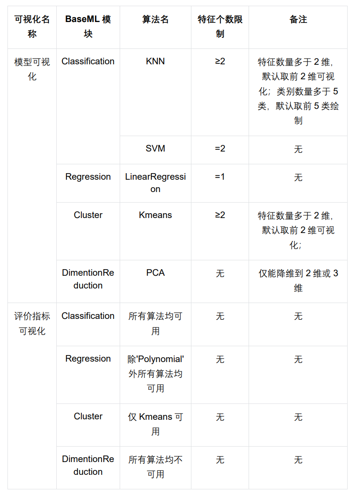

# BaseML辅助工具

## 内置图像处理模型ImageLoader

`ImageLoader`是BaseML内置的图片处理模块，用于进行图像数字化处理，读取图片并提取其中的图像特征，如HOG特征和LBP特征，用以进行后续的机器学习任务。

其处理流程源码如下：

```Python
class ImageLoader(object):
    # BaseML中的图像导入处理模块
    def __init__(self, training_set_path, testing_set_path, label2id={}, size=128):
        """ImageLoader初始化函数
        Args:
            training_set_path (str): 图片训练集路径.
            testing_set_path (str): 图片测试集路径.
            label2id (dict, optional): 自定义的标签id字典. Defaults to {}.
            size (int, optional): 图像被resize的大小,尽量不要改size,否则使用lbp或者hog可能会出错,
            但是如果原始图像过小,可以调整size . Defaults to 128.
        """
        super(ImageLoader, self).__init__()
        self.X_train = []
        self.y_train = []
        self.X_test = []
        self.y_test = []
        # ImageNet格式的数据集才能被load
        self.training_set_path = training_set_path
        self.testing_set_path = testing_set_path
        self.label2id = label2id
        self.size = size
    # 读取单张图片，进行预处理
    def pre_process(self, img_path):
        img = cv2.imread(img_path)
        img = cv2.cvtColor(img, cv2.COLOR_BGR2GRAY)  # 转为灰度图
        img = cv2.resize(img, (self.size, self.size))
        img.astype(np.uint8)
        return img
    def get_label2id(self):
        # 如果为空，自己读取training_set中所有的类别，并且进行编号
        if self.label2id == {}:
            _id = 0
            for label in os.listdir(self.training_set_path):
                self.label2id[label] = _id
                _id += 1
        return self.label2id
    def get_label_by_id(self, value):
        return [k for k, v in self.label2id.items() if v == value]
    # 提取hog描述符
    def get_hog_descriptor(self, img):
        # 采用默认值设置
        window_Size = (128, 128)  # setting the window size
        block_Size = (32, 32)  # setting the block size
        block_Stride = (16, 16)  # setting the block stride
        cell_Size = (32, 32)  # setting the cell size
        no_bins = 9  # setting the number of bins
        deriv_Aperture = 1
        Sigma = -1.  # setting the value of sigma
        histogramNormType = 0
        L2HysThreshold = 0.2
        gamma = 1  # setting the value of gamma
        no_levels = 64
        signed_Gradients = True
        # running Hog descriptor
        hog = cv2.HOGDescriptor(window_Size, block_Size, block_Stride,
                                cell_Size, no_bins, deriv_Aperture, Sigma,
                                histogramNormType, L2HysThreshold, gamma, no_levels,
                                signed_Gradients)
        return hog.compute(img).T
    # 　提取lbp描述符
    def get_lbp_descriptor(self, img):
        hist_size = 256
        lbp_radius = 1
        lbp_point = 8
        # 使用LBP方法提取图像的纹理特征.
        lbp = skif.local_binary_pattern(img, lbp_point, lbp_radius, 'default')
        # 统计图像的直方图
        max_bins = int(lbp.max() + 1)
        # hist size:256
        hist, _ = np.histogram(
            lbp, normed=True, bins=max_bins, range=(0, max_bins))
        return hist
    # 获取图像特征
    def get_feature(self, img, method):  # 获取一张图片的描述子
        if method == 'hog':
            return self.get_hog_descriptor(img)
        elif method == 'lbp':
            # 返回是一维的，长度256的向量
            return self.get_lbp_descriptor(img)
        elif method == 'flatten':
            # 转成灰度图后直接展平
            return np.array(img).flatten().reshape(1, -1)
    # 构建训练集和测试集
    def get_data(self, method='hog'):
        # 如果为空，自己读取training_set中所有的类别，并且进行编号
        if self.label2id == {}:
            _id = 0
            for label in os.listdir(self.training_set_path):
                self.label2id[label] = _id
                _id += 1
        # 读取训练集中的图片，并且进行处理
        for train_label in os.listdir(self.training_set_path):
            for image in os.listdir(os.path.join(self.training_set_path, train_label)):
                image_url = os.path.join(
                    self.training_set_path, train_label, image)
                img_processed = self.pre_process(image_url)
                img_feature = self.get_feature(img_processed, method)
                self.X_train.append(img_feature)  # 转置后是一行的
                self.y_train.append(self.label2id[train_label])
        # 读取测试集中的图片，进行处理
        for test_label in os.listdir(self.testing_set_path):
            for image in os.listdir(os.path.join(self.testing_set_path, test_label)):
                image_url = os.path.join(
                    self.testing_set_path, test_label, image)
                img_processed = self.pre_process(image_url)
                img_feature = self.get_feature(img_processed, method)
                self.X_test.append(img_feature)
                self.y_test.append(self.label2id[test_label])
        # Convert train and test data to numpy arrays
        self.X_train = np.array(self.X_train)
        self.X_train = self.X_train.reshape(
            (self.X_train.shape[0], -1))  # 转成二维数组
        self.y_train = np.array(self.y_train)
        self.X_test = np.array(self.X_test)
        self.X_test = self.X_test.reshape((self.X_test.shape[0], -1))  # 转成二维数组
        self.y_test = np.array(self.y_test)
        return self.X_train, self.y_train, self.X_test, self.y_test

```

使用此模块，可在BaseML载入数据前，对图片进行快速批量处理后再载入，且能够完成单张图片的HOG特征提取（还可以更换为其他特征），示例代码如下。

```python
# 导入BaseML的图像处理模块
from BaseML import IMGLoader

# 定义一个提取单张图片HOG特征的函数
def read_hog_feature_single(file_path):
    # 创建ImageLoader实例并读取图片
    img_set = IMGLoader.ImageLoader(file_path,file_path,size = 128)
    # 对读取的图片进行预处理
    img = img_set.pre_process(file_path)
    # 提取图片的HOG特征
    feature = img_set.get_feature(img,method = 'hog')
    return feature

# 指定一张图片
img_path = 'test.jpg'
# 提取HOG特征
data = read_hog_feature_single(img_path)
# 打印HOG特征和其形状
print("HOG特征：",data)
print("图像形状：",data.shape)
```

## 自带可视化工具

在做机器学习项目的过程中，可视化能帮助我们了解模型训练状态，评估模型效果，还能了解数据，辅助了解算法模型，改善模型。

BaseML中提供两种可视化方法：模型可视化及评价指标可视化。模型可视化可以通过测试数据及线条勾勒模型的大致形状，有助于解释和理解模型的内部结构。评价指标可视化显示了模型对于数据的拟合程度，描述了模型的性能，方便用户进行模型选择。使用可视化部分的前提是已经对模型进行初始化并且训练完成，否则可视化部分无法正常使用。

### 1. 模型可视化

目前该模块只支持4类算法的可视化，分别为Classification中的KNN、SVM，Regression中的LinearRegression，Cluster中的Kmeans。调用方法为`model.plot()`。

### 2. 评价指标可视化

目前该模块支持Classification、Regression中的所有算法及Cluster中的Kmeans算法，其他算法不支持。调用方法为`model.metricplot()`。

### 3. 可视化调用限制



### 快速体验训练过程可视化全流程！

#### 0. 引入包

```Python
# 导入库，从BaseML导入分类模块
from BaseML import Classification as cls
```

#### 1. 实例化模型

```Python
# 实例化模型，模型名称选择KNN（K Nearest Neighbours）
model=cls('KNN')
```

#### 2. 载入数据

```Python
# 载入数据集，并说明特征列和标签列
model.load_dataset('./lenses.csv', type ='csv', x_column = [1,2,3,4],y_column=[5])
```

#### 3. 模型训练

```Python
# 模型训练
model.train()
```

#### 4. 模型可视化

```Python
# 模型可视化
model.plot()
```

#### 5. 评价指标可视化

```Python
# 评价指标可视化
model.metricplot()
```

### 快速体验推理过程可视化！

#### 0. 引入包

```Python
# 导入库，从BaseML导入分类模块
from BaseML import Classification as cls
```

#### 1. 实例化模型

```Python
# 实例化模型，模型名称选择KNN（K Nearest Neighbours）
model=cls('KNN')
```

#### 2. 加载模型参数

```Python
# 加载保存的模型参数
model.load('mymodel.pkl')
```

#### 3. 载入数据

```Python
# 载入数据集，并说明特征列和标签列
model.load_dataset('./lenses.csv', type ='csv', x_column = [1,2,3,4],y_column=[5])
```

#### 4. 模型推理

```Python
# 模型推理
model.inference()
```

#### 5. 模型可视化

```Python
# 模型可视化
model.plot()
```

#### 6. 评价指标可视化

```Python
# 评价指标可视化
model.metricplot()
```

实际上，训练过程可视化使用的数据与推理过程可视化使用的数据是相同的，均为数据集经过划分后的测试集（model.x_test）。

### 其他数据可视化

#### 0. 引入包

```Python
# 导入库，从BaseML导入分类模块
from BaseML import Classification as cls
```

#### 1. 实例化模型

```Python
# 实例化模型，模型名称选择KNN（K Nearest Neighbours）
model=cls('KNN')
```

#### 2. 加载模型参数

```Python
# 加载保存的模型参数
model.load('mymodel.pkl')
```

#### 3. 模型推理

```Python
# 模型推理
# test_data = [[0.2,0.4,3.2,5.6],
#             [2.3,1.8,0.4,2.3]]
model.inference(test_data)
```

#### 4. 模型可视化

```Python
# 模型可视化
# test_true_data = [[0],
#                  [1]]
model.plot(X=test_data, y_true=test_true_data)
```

#### 5. 评价指标可视化

```Python
# 评价指标可视化, 如果要使用其他数据进行测试，必须先加载之前的数据集
model.load_dataset('./lenses.csv', type ='csv', x_column = [1,2,3,4],y_column=[5])
model.metricplot(X=test_data, y_true=test_true_data)
```
