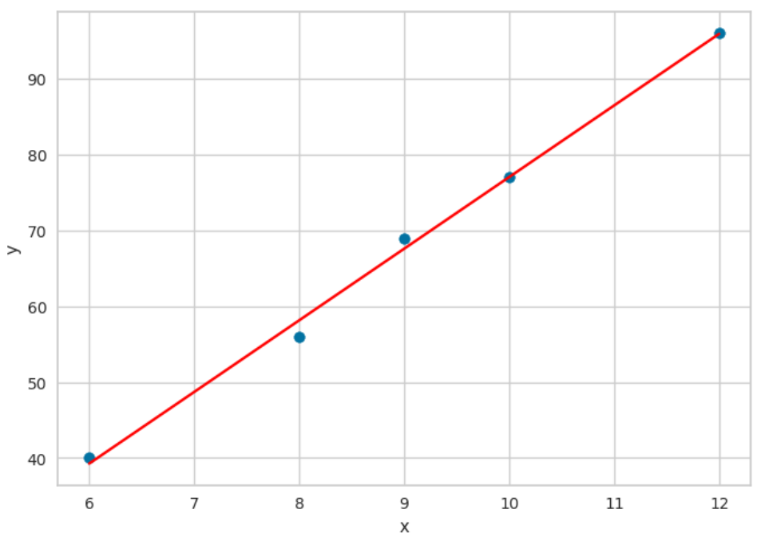
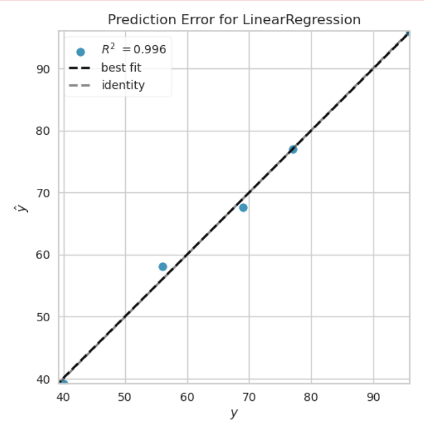

# BaseML杀手锏：自带可视化部分

## 为什么需要可视化？

在做机器学习项目的过程中，可视化能帮助我们了解模型训练状态，评估模型效果，还能了解数据，辅助了解算法模型，改善模型。

BaseML中提供两种可视化方法：模型可视化及评价指标可视化。模型可视化可以通过测试数据及线条勾勒模型的大致形状，有助于解释和理解模型的内部结构。评价指标可视化显示了模型对于数据的拟合程度，描述了模型的性能，方便用户进行模型选择。使用可视化部分的前提是已经对模型进行初始化并且训练完成，否则可视化部分无法正常使用。

### 1. 模型可视化

目前该模块只支持4类算法的可视化，分别为Classification中的KNN、SVM，Regression中的LinearRegression，Cluster中的Kmeans。调用方法为`model.plot()`。

### 2. 评价指标可视化

目前该模块支持Classification、Regression中的所有算法及Cluster中的Kmeans算法，其他算法不支持。调用方法为`model.metricplot()`。

### 3. 可视化调用限制


## 快速体验训练过程可视化全流程！

### 0. 引入包

```Python
# 导入库，从BaseML导入分类模块
from BaseML import Classification as cls
```

### 1. 实例化模型

```Python
# 实例化模型，模型名称选择KNN（K Nearest Neighbours）
model=cls('KNN')
```

### 2. 载入数据

```Python
# 载入数据集，并说明特征列和标签列
model.load_dataset('./lenses.csv', type ='csv', x_column = [1,2,3,4],y_column=[5])
```

### 3. 模型训练

```Python
# 模型训练
model.train()
```

### 4. 模型可视化

```Python
# 模型可视化
model.plot()
```



### 5. 评价指标可视化

```Python
# 评价指标可视化
model.metricplot()
```



## 快速体验推理过程可视化！

### 0. 引入包

```Python
# 导入库，从BaseML导入分类模块
from BaseML import Classification as cls
```

### 1. 实例化模型

```Python
# 实例化模型，模型名称选择KNN（K Nearest Neighbours）
model=cls('KNN')
```

### 2. 加载模型参数

```Python
# 加载保存的模型参数
model.load('mymodel.pkl')
```

### 3. 载入数据

```Python
# 载入数据集，并说明特征列和标签列
model.load_dataset('./lenses.csv', type ='csv', x_column = [1,2,3,4],y_column=[5])
```

### 4. 模型推理

```Python
# 模型推理
model.inference()
```

### 5. 模型可视化

```Python
# 模型可视化
model.plot()
```

### 6. 评价指标可视化

```Python
# 评价指标可视化
model.metricplot()
```

实际上，训练过程可视化使用的数据与推理过程可视化使用的数据是相同的，均为数据集经过划分后的测试集（model.x_test）。

## 其他数据可视化

### 0. 引入包

```Python
# 导入库，从BaseML导入分类模块
from BaseML import Classification as cls
```

### 1. 实例化模型

```Python
# 实例化模型，模型名称选择KNN（K Nearest Neighbours）
model=cls('KNN')
```

### 2. 加载模型参数

```Python
# 加载保存的模型参数
model.load('mymodel.pkl')
```

### 3. 模型推理

```Python
# 模型推理
# test_data = [[0.2,0.4,3.2,5.6],
#             [2.3,1.8,0.4,2.3]]
model.inference(test_data)
```

### 4. 模型可视化

```Python
# 模型可视化
# test_true_data = [[0],
#                  [1]]
model.plot(X=test_data, y_true=test_true_data)
```

### 5. 评价指标可视化

```Python
# 评价指标可视化, 如果要使用其他数据进行测试，必须先加载之前的数据集
model.load_dataset('./lenses.csv', type ='csv', x_column = [1,2,3,4],y_column=[5])
model.metricplot(X=test_data, y_true=test_true_data)
```
