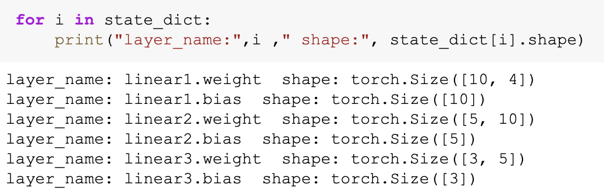

# BaseNN高级功能

BaseNN为初学者设计，内置了很多为教学设计的功能。

## 1.提取CNN特征

图像特征提取是计算机视觉中的重要研究领域之一，是计算机视觉中的一个关键步骤，它涉及将图像转换成一组有意义的特征向量，以便于后续的图像分析和识别任务。CNN（卷积神经网络）特征提取方法是一种基于深度学习的特征提取方法，通过卷积层、池化层等多个网络层的处理，可以提取出具有高层次抽象能力的特征表示，被广泛应用于图像分类、目标检测等领域。

BaseNN中提供了一个CNN特征提取工具，可使用BaseNN的`model.extract_feature()`函数通过指定预训练模型来提取图像特征，使用ResNet预训练模型可将一张图像提取为1000维的特征（该预训练模型是在imagenet上训练的千分类模型，所以输出特征的维度是1000维），输出一个1行1000列的数组。

```python
# 声明模型
model = nn('cls')
# 读取图像文件
img = cv2.imread('small/0/5818.png')
# 指定resnet18提取图像特征
feature = model.extract_feature(img, pretrain='resnet18')
```

第一次下载预训练模型有点慢需要耐心等待，再次运行则无需下载。除了`resnet18`，还支持指定任何可以在 `torchvision.models` 中找到的模型名称，例如`resnet34`、`resnet50`、`mobilenet_v2`、`vgg16`……

## 2.网络中特征可视化

BaseNN内置`visual_feature`函数可呈现数据在网络中传递的过程。特征可视化可以帮助我们更好地理解模型在处理数据时的内部工作原理，并通过这种方式来进一步提高模型的性能和效果。

如输入数据为**图片**，指定图片和已经训练好的模型，可生成一张展示逐层网络特征传递的图片。

```python
import cv2
from basenn import nn
model = nn('cls')
model.load('mn_ckpt/basenn.pth')          # 保存的已训练模型载入
path = 'test_IMG/single_data.jpg'
img = cv2.imread(path,flags = 0)          # 图片数据读取
model.visual_feature(img,in1img = True)   # 特征的可视化
```


如输入数据为**一维数组**或**一维列表**，指定数据和已经训练好的模型，可生成一个txt文件展示经过各层后的输出。

```python
import numpy as np
from basenn import nn
model = nn('cls')
model.load('checkpoints/iris_ckpt/basenn.pth')          # 保存的已训练模型载入
data = np.array(test_x[0]) # 指定数据,如测试数据的一行
model.visual_feature(data)   # 特征的可视化
```

生成的文件默认为“layers/layer_data.txt”，某模型（隐藏层为1个神经元）的输出信息如下：


```
0.Reshape()
[27.524368286132812, 28.948490142822266]
1.Linear(in_features=2, out_features=1, bias=True)
-0.0438382625579834
1.1.ReLU()
0.0
2.Linear(in_features=1, out_features=2, bias=True)
[-2.858757495880127, 3.28355073928833]
```

## 3.查看模型结构

BaseNN能够详细打印模型的具体结构。

```python
model.print_model()
```

无参数。

## 4.自定义随机数种子

默认初始化是随机的，因此每次模型训练效果可能存在差异。可以使用`set_seed()`函数设定随机数种子，使得训练结果可被其他人复现。一旦指定，则每次训练结果一致。使用方法如下：

```python
model = nn()
model.set_seed(1235)
model.add(...)
...
model.train(...)
```

注：设定随机数种子`set_seed()`应当在搭建网络`add()`之前。在搭建机器学习模型之前，通常建议设置随机数种子。这样做可以使得在每次运行时，生成的随机数序列都是相同的，从而使得模型的可重复性更高。这对于模型调试、验证模型效果、比较不同模型效果等方面都非常有帮助。随机数种子的选择通常应该是随意的，只要您能记住或记录下来使用的种子即可。并且，种子的选择并不会影响模型的效果，只会影响结果的可重复性。

## 5.自定义损失函数

损失函数（或称目标函数、优化评分函数）是编译模型时所需的参数之一。在机器学习和深度学习中，模型的训练通常涉及到一个优化过程，即通过不断调整模型的参数，使得模型在训练数据上的预测结果与实际结果的差距最小化。这个差距通常使用一个称为"损失函数"的指标来衡量。损失函数通常是一个关于模型参数的函数，用于度量模型预测结果与实际结果之间的差异。在模型训练过程中，模型会根据损失函数的值来调整自己的参数，以减小损失函数的值。

默认的损失函数是交叉熵损失函数，允许选择不同的损失函数，支持的损失函数见[附录](https://xedu.readthedocs.io/zh-cn/master/basenn/appendix.html#id13)。自选损失函数方法如下：

```python
model.train(...,loss="MSELoss")
```

## 6.自定义评价指标

评价指标用于评估当前训练模型的性能。当模型编译后，评价指标应该作为
`metrics`的参数来输入。默认无，需要自行设置评价指标。支持的评价指标：acc（准确率），mse（均方误差），mae（平均绝对误差）。

自选评价指标方法如下：

```python
model.train(...,metrics="acc")
```

当然，在train函数中设置的`metrics`的参数仅是模型在训练集上的评价结果。如需评估模型在验证集上的效果，还需配合模型推理完成。

**ACC (准确率)**：用于分类任务。衡量模型预测正确的实例占所有实例的比例。想象一下你在做一个分类测试，准确率就是你回答正确的问题数量占总问题数量的比例。准确率越高，表示模型整体预测的准确性越强。

**MSE (均方误差)**：用于回归任务。衡量模型预测值和实际值差异的平方的平均值。如果你射箭，每次射箭偏离靶心的距离的平方的平均值，就是均方误差。它衡量的是模型预测值与实际值之间差异的平方的平均值。MSE越小，表示模型预测的精确度越高。

**MAE (平均绝对误差)**：用于回归任务。衡量模型预测值和实际值差异的绝对值的平均值。同样的射箭比喻，每次射箭偏离靶心的距离的平均值，就是平均绝对误差。它是模型预测值与实际值之间差异的绝对值的平均值。

### 由此拓展-自定义评价函数和训练策略

一般可以自定义一个分类正确率计算函数来评估模型效果，主要可以通过计算验证集上的分类准确率完成。

```python
# 定义一个计算分类正确率的函数
def cal_accuracy(y, pred_y):
    res = pred_y.argmax(axis=1)
    tp = np.array(y)==np.array(res)
    acc = np.sum(tp)/ y.shape[0]
    return acc

# 计算分类正确率
print("分类正确率为：",cal_accuracy(y_val, result))  # y_val指代验证集的真实值，result指代验证集的推理结果
```

由于model.train在完全训练结束之后，才能进行其他操作，如何判断提前终止训练，或者使用自定义的验证策略来验证模型效果呢？可以用循环来实现。
参考代码如下：

```python
for i in range(5):
    model.train(lr=0.01, epochs=5, metrics='acc')
    result = model.inference(x_val, checkpoint=checkpoint)
    acc = cal_accuracy(y_val, result) # 调用自定义的验证计算函数
    print('验证集准确率: {:.2f}%'.format(100.0 * acc))
    if acc > 0.7: # 如果准确率大于70%，提前结束训练
        break
```

## 7.探秘权重文件

BaseNN 0.3.0以上，支持查看pth文件中的权重信息。

首先将pth文件读入一个变量`state_dict`:

```python
import torch 
ckpt = torch.load('iris_ckpt/basenn.pth')
state_dict = ckpt['state_dict'].state_dict()
```

1）查看模型里面有哪些层，及各个层的名称

```python
for i in state_dict:
    print('这一层的名字是:',i)
```

输出结果：

```
layer_name: linear1.weight
layer_name: linear1.bias
layer_name: linear2.weight
layer_name: linear2.bias
layer_name: linear3.weight
layer_name: linear3.bias
```


可以看到，权重主要包括两种参数，一种是weight，一种是bias。其中weight，指“重”，特征的重要程度，bias值“偏”，偏离原点的程度。回想一下我们初中学习的一次函数 `y=w*x+b` 就是这样的含义。上图中，每一层都分别有weight和bias构成。

2）查看模型里面上述层的形状（每层的大小）

```python
for i in state_dict:
    print('层：', i ," 的形状是", state_dict[i].shape)
```

输出结果：

```
layer_name: linear1.weight  shape: torch.Size([10, 4])
layer_name: linear1.bias  shape: torch.Size([10])
layer_name: linear2.weight  shape: torch.Size([5, 10])
layer_name: linear2.bias  shape: torch.Size([5])
layer_name: linear3.weight  shape: torch.Size([3, 5])
layer_name: linear3.bias  shape: torch.Size([3])
```



通过这一功能，可以简单计算一个模型的参数量有多少。

例如在这个例子中，我们可以计算，参数量一共是：`10*4+10+5*10+5+3*5+3` 个参数。但是通常bias可以忽略不计。至于为什么有`10*4` ，这是因为第一个全连接层用的是size=(4, 10)，这表示，4个神经元的输入层，与10个神经元的隐藏层相连接。这种情况下，4个神经元中的任意一个神经元，都与10个下一层神经元相连接，显然，这里的参数量为10+10+10+10=10*4。

3）查看模型里各层参数的值

```python
for i in state_dict:
    print(ckpt['state_dict'].state_dict()[i])
```

输出结果：

```
layer: linear1.weight shape: torch.Size([10, 4])
tensor([[-0.1671, -0.2946, -0.1523,  0.2340],
        [-0.2319, -0.2094,  0.8307,  0.7168],
        [-0.4024,  0.0528, -0.4063,  0.3279],
        [ 0.5091, -0.0214,  0.9994,  0.5224],
        [ 0.6709,  1.0019,  0.1012, -0.8173],
        [ 0.7910,  0.6090, -0.6661, -0.8460],
        [-0.3291,  0.1794,  0.3013, -0.5664],
        [-0.0976, -0.1166, -0.1597, -0.1705],
        [-0.2752,  0.3727, -0.4080, -0.4774],
        [-0.3167, -0.1678,  1.0979,  0.7183]])
layer: linear1.bias shape: torch.Size([10])
tensor([ 0.0276,  0.0367, -0.1092,  0.5315,  0.7263,  0.3025, -0.1470,  0.0737,
        -0.1824,  0.0029])
layer: linear2.weight shape: torch.Size([5, 10])
tensor([[-0.1355,  0.7558,  0.0546,  0.1230, -0.3620, -0.7619, -0.3141, -0.0608,
         -0.0821,  0.6960],
        [-0.2451, -0.8411, -0.1880,  0.2396,  0.4853,  1.0186, -0.0673, -0.2480,
          0.2201, -0.7702],
        [-0.0184, -0.1989, -0.2507, -0.0921,  0.3093,  0.7214, -0.0233,  0.2101,
         -0.2183, -0.2256],
        [ 0.1090, -0.1517,  0.1152, -0.2598, -0.0861,  0.1829, -0.3004, -0.0835,
          0.0937, -0.1331],
        [ 0.1686,  0.8030, -0.2627,  0.5540, -0.0460, -0.4488, -0.1358, -0.2360,
          0.0522,  0.7765]])
layer: linear2.bias shape: torch.Size([5])
tensor([-0.8387,  0.7115,  0.5185, -0.1147,  0.0033])
layer: linear3.weight shape: torch.Size([3, 5])
tensor([[-0.7702,  0.6576,  0.5163, -0.0201, -1.1092],
        [-1.1128,  0.2404,  0.2973,  0.3267,  0.1670],
        [ 0.5992, -1.0186, -0.7638,  0.3445,  0.5820]])
layer: linear3.bias shape: torch.Size([3])
tensor([ 0.6430,  0.3829, -0.1744])
```


我们知道了参数的值之后，可以尝试计算，当一条新数据输入网络后，模型会经历怎样的计算，请你试一试搭建一个简单的神经网络，试一试这个计算过程，你能不能手动实现呢？

推荐浏览项目：<a href="https://www.openinnolab.org.cn/pjlab/project?id=6687857fa4f8ca4aa8e53f27">神经网络是怎么计算的</a>。

