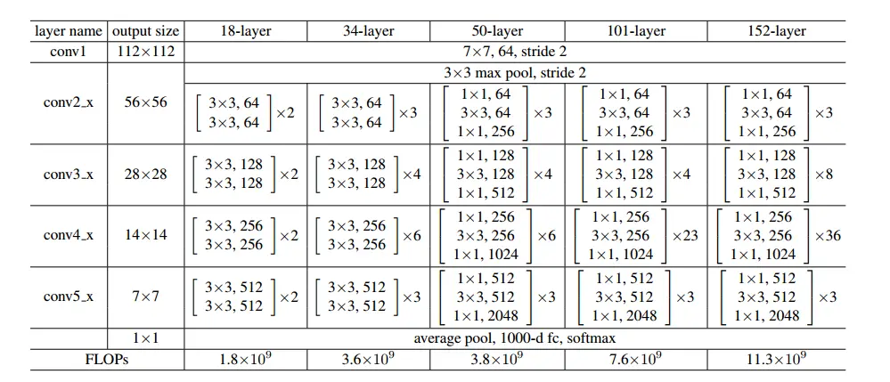
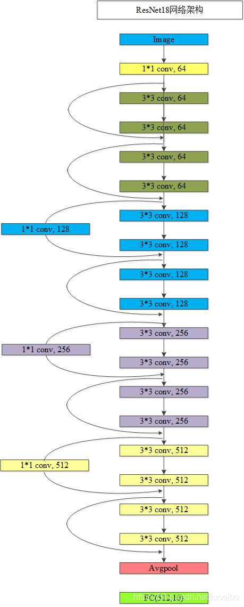
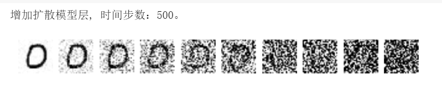

# 附录

## 1. 使用add()搭建网络模型详细介绍

使用BaseNN可以轻易地创建深度学习模型。不同类型的神经网络适用于不同类型的问题，比如CNN通常用于处理图像问题，RNN通常用于处理序列问题，全连接神经网络可以应用于各种问题。

添加层的方法为`add(layer=None, activation=None, optimizer=None, **kw)`。

### 参数说明:

- layer：层的类型，可选值包括conv2d, conv1d, maxpool, avgpool, linear, lstm,dropout，res_block，Res_Block，Res_Bottleneck等。

- activation：激活函数类型，可选值包括ReLU，Softmax，tanh，sigmoid，leakyrelu。一般分类任务输出层建议设置softmax，回归任务输出层建议不设置激活函数。

- optimizer：为优化器类型，默认值为Adam，可选值包括SGD，Adam，Adagrad，ASGD。

- kw：关键字参数，包括与size相关的各种参数，常用的如size=(x,y)，x为输入维度，y为输出维度；
  kernel_size=(a,b)， (a,b)表示核的尺寸。

以下具体讲述各种层：

- conv1d: 卷积层（一维），需给定size（size=(输入特征数, 输出特征数)），卷积核尺寸kernel_size。也可额外设置拓展参数步长stride（默认为1），填充padding（默认为0）。
- conv2d：卷积层（二维），需给定size（size=(输入特征数, 输出特征数)），卷积核尺寸kernel_size。也可额外设置拓展参数步长stride（默认为1），填充padding（默认为0）。
- maxpool：最大池化层，需给定卷积核尺寸kernel_size。
- avgpool：平均池化层，需给定卷积核尺寸kernel_size。
- linear：线性层，需给定size。
- mobilenet：MobileNet网络层。
- mobilenet_backbone：MobileNet主干网络，一般用于分层搭建MoblileNet网络。通过MobileNet Backbone处理后，任意维度的输入都会得到一个固定维度（1280）的输出。
- Res_Block：残差基础模块，需给定size（size=(输入特征数, 输出特征数)），也可额外设置拓展参数num_blocks（默认为1），步长stride（默认为1）。
- Res_Bottleneck：残差瓶颈模块，需给定size（size=(输入特征数, 输出特征数)），也可额外设置拓展参数num_blocks，步长stride（默认为1）。
- lstm：一种特殊的RNN（Recurrent Neural Network，循环神经网络）层，需给定size，num_layers。
- dropout：随机失活层，需给定p（概率）。作用为随机关闭一些神经元，避免过拟合。其中参数`p`表示关闭神经元的比例，比如此处
  p=0.2
  表示有随机20%的神经元会被关闭。这种网络层是为了优化效果，避免过拟合而加入的，不是必需的，因此可以尝试修改p的值甚至删掉这个层观察比较效果差距。
- batchnorm1d：数据维度处理层，对一维数据做归一化。需传入size，表示输入数据的维度（注意和上一层的输出以及下一层的输入一致即可）。这种网络层是也为了优化效果而加入的，不是必需的，没有这个层也可以正常训练，但由于去掉这个网络层后效果下降的会非常明显，所以不建议删掉这个层。

下面为您具体展示如何搭建模型，以全连接神经网络结构、卷积神经网络结构、循环神经网络结构等为例为您讲解。

### 搭建全连接神经网络结构

以一个简单的全连接神经网络结构为例，注释标明了数据经过各层的尺寸变化。

```python
# 输入: [120,4]
model.add(layer='linear',size=(4, 10),activation='relu') # [120, 10]
model.add(layer='linear',size=(10, 5), activation='relu') # [120, 5]
model.add(layer='linear', size=(5, 3), activation='softmax') # [120, 3]
```

这段代码是在构建一个简单的神经网络模型，其中包含了三个线性层（也称为全连接层），每个层后面都有一个激活函数。输入数据的维度是120行4列的鸢尾花数据集，添加了三层线性层，最后一个线性层输出为3与数据集的类别数一致。输入维度为4，输出维度为3，隐藏层数量为2。

参考项目：[用BaseNN库搭建全连接神经网络训练IRIS鸢尾花分类模型](https://openinnolab.org.cn/pjlab/project?id=641bc2359c0eb14f22fdbbb1&backpath=/pjlab/projects/list#public)

### 搭建卷积神经网络结构

首先以一个简单的卷积神经网络LeNet结构为例，注释标明了数据经过各层的尺寸变化。

``` python
# 输入: [100,1,20,20]
model.add('conv2d', size=(1, 3),kernel_size=(3, 3), activation='relu') # [100, 3, 18, 18]
model.add('maxpool', kernel_size=(2,2)) # [100, 3, 9, 9]
model.add('conv2d', size=(3, 10), kernel_size=(3, 3), activation='relu') # [100, 10, 7, 7]
model.add('avgpool', kernel_size=(2,2)) # [100, 10, 3, 3]
model.add('linear', size=(90, 10), activation='relu') # [100, 10]
model.add('linear', size=(10, 2), activation='softmax') # [100,2]
model.add(optimizer='SGD') # 设定优化器
```

以上代码注释中数字代表含义说明：

以[100, 3, 18, 18]为例 ，其对应含义为 [图像数量, 通道数, 图像维度, 图像维度]。

这里我们讨论简单卷积，卷积前后数据尺寸的变化可以利用以下公式解决：

N = W - F + 1 ，其中N表示输出大小，F表示卷积核大小，W表示输入大小。（这里输入、输出和卷积核均为正方形）

由于是正方形，池化操作后数据尺寸变化可以利用以下公式得出：

N = W/P ，其中P表示池化层的卷积核大小。

从参数`kernel_size=(3,3)`可以得到卷积核大小为3，输入大小为20，根据公式20-3+1=18。

根据参数`size=(1,3)`得出输入为1通道，输出为3通道。

经过`kernel_size=(2,2)`的最大池化层后，根据公式18/2=9，得到输出数据尺寸为9x9大小。

最后，由于线性层（linear）是一维的，因此二维数据在输入前要进行展平（flatten），将二维展平为1维。

在以上代码中，输入linear层前，一张图像有10通道，每个通道的图像大小为3x3，因此展平后有10x3x3 = 90，这就是为什么要设置linear层`size=(90,10)`中，输入维度为90。

参考项目：[用卷积神经网络实现MNIST手写体数字分类](https://openinnolab.org.cn/pjlab/project?id=641d17e67c99492cf16d706f&backpath=/pjlab/projects/list#public)

**同时，使用BaseNN也能完成一些相对复杂的神经网络的搭建，如MobileNet，ResNet等MMEdu可以直接调用的SOTA模型，同样也是支持的。**

#### 搭建MobileNet网络：

以训练猫狗二分类数据集为例，如下是搭建MobileNet网络训练猫狗识别模型的示例代码。

```python
from BaseNN import nn
model = nn()
model.load_img_data('CatsDogs/training_set', batch_size=32,shuffle=True,transform={'Resize':[32,32]})

#搭建网络
model.add('mobilenet_backbone') # MobileNet主干网络
model.add('Linear', size=(1280,1000), activation='relu')
model.add('Dropout', p=0.2)
model.add('Linear', size=(1000,2),activation='Softmax')
model.add(optimmizer='Adam')

model.save_fold = 'mobilenet_ckpt'
model.train(lr=1e-3, epochs=20,metrics=['acc']) # 模型训练
```

注：搭建MobileNet网络支持输入任意大小的图像，推理时也无需调整图片尺寸，但是训练时数据集中所有图像大小必须一致，因此载入数据时还是做了图片尺寸的统一调整，如图片数据集的尺寸本身就是一致的，则无需调整。

参考项目：[用BaseNN搭建MobileNet网络实现猫狗分类模型训练](https://openinnolab.org.cn/pjlab/project?id=65fbdf2e8ce1f42bce09ad7a&sc=635638d69ed68060c638f979#public)

无论输入图像的尺寸如何，通过`MobileNet Backbone`处理后，都会得到一个固定维度（1280）的输出，利用此能力，我们可利用`MobileNet Backbone`训练一个图像解码器，参考代码如下。

```python
from BaseNN import nn
# 声明模型
model = nn()
# 载入数据
model.load_img_data('CatsDogs (1)/CatsDogs/training_set', batch_size=1000,transform={'Resize':(64,64)}) 

#搭建网络
model.add('mobilenet_backbone') # MobileNet主干网络
model.add('Linear', size=(1280,1000), activation='relu') 
model.add(optimizer='Adam')

model.save_fold = 'mobilenet_ckpt'
model.train(lr=1e-3, epochs=30) # 模型训练
```

使用模型进行图像编码：

```python
# 模型推理
dog_embedding = model.inference(checkpoint='basenn.pth', data='CatsDogs/dog1.jpg')
print(dog_embedding)
```

上述代码输出的应是形状为(1, 1280)的向量，这样利用已训练的图像解码器，可以实现将任意尺寸的图像转换为1280维的embedding向量（取决于`MobileNet Backbone`层后加的全连接层的输出维度）。这对于图像特征提取和进一步的分析或应用非常有用。比如可以借助XEdu.utils中的get_similarity函数比较两个embedding序列的相似度。

参考项目：[用BaseNN搭建MobileNet网络训练图像解码器](https://openinnolab.org.cn/pjlab/project?id=65fce27be4952d44adcad792&sc=635638d69ed68060c638f979#public)

#### 搭建ResNet网络：

如需搭建ResNet首先需在卷积层新增两个参数的设置，分别是步长stride和填充padding，同时增加残差模块的设置。ResNet系列网络结构如下所示。



以ResNet18为例，我们看一下ResNet18的网络结构。



搭建一个ResNet18的示例代码如下（输入的是包含32张224×224尺寸的手写数字图片）：

```python
model = nn('cls')
model.load_img_data('mnist/training_set',batch_size=32,num_workers=1) # (32,3,224,224)
model.add('Conv2D', size=(3, 64), kernel_size=(7, 7),stride=2,padding=3, activation='ReLU') #(32,64,112,112)
model.add('BatchNorm2d', size=64) # (32,64,112,112)
model.add('MaxPool', kernel_size=(3,3),stride=2,padding=1) # (32,64,56,56)

model.add('Res_Block', size=(64, 64), num_blocks=2,stride=1) # (32,64,56,56)
model.add('Res_Block', size=(64, 128), num_blocks=2,stride=2) # (32,128,28,28)
model.add('Res_Block', size=(128, 256), num_blocks=2,stride=2) # (32,256,14,14)
model.add('Res_Block', size=(256, 512), num_blocks=2,stride=2) # (32,512,7,7)

model.add('AvgPool', kernel_size=(7,7)) # (32,512)
model.add('linear', size=(512, 10), activation='Softmax') # (32,10)
```

注：注释表示[图像数量, 通道数, 图像维度, 图像维度]，加入stride和padding设置后，尺寸计算公式是：N = （W-F+2P)/S+1，前文提到的N = W - F + 1 其实是P取默认值0，S取默认值1的情况。

另外针对ResNet18其实还有一种搭建方式，那就是不设置num_blocks（默认为1）。

```python
model = nn('cls')
model.load_img_data('mnist/training_set',batch_size=32,num_workers=1) # (32,3,224,224)
model.add('Conv2D', size=(3, 64), kernel_size=(7, 7),stride=2,padding=3, activation='ReLU') #(32,64,112,112)
model.add('BatchNorm2d', size=64) # (32,64,112,112)
model.add('MaxPool', kernel_size=(3,3),stride=2,padding=1) # (32,64,56,56)

# 拆开实现：4->8
model.add('Res_Block', size=(64, 64), stride=1) # (32,64,56,56)
model.add('Res_Block', size=(64, 64), stride=1) # (32,64,56,56)
model.add('Res_Block', size=(64, 128), stride=2) # (32,128,28,28)
model.add('Res_Block', size=(128, 128), stride=1) # (32,128,28,28)
model.add('Res_Block', size=(128, 256), stride=2) # (32,256,14,14)
model.add('Res_Block', size=(256, 256), stride=1) # (32,256,14,14)
model.add('Res_Block', size=(256, 512), stride=2) # (32,512,7,7)
model.add('Res_Block', size=(512, 512), stride=1) # (32,512,7,7)

model.add('AvgPool', kernel_size=(7,7)) # (32,512)
model.add('linear', size=(512, 10), activation='Softmax') # (32,10)
```

设定num_blocks和多个块分别写的等价情况：

```python
# 示例
model.add('Res_Block', size=(64, 64), num_blocks=2,stride=1)
# 等价方式
# model.add('Res_Block', size=(64, 64), stride=1)
# model.add('Res_Block', size=(64, 64), stride=1) 
```

掌握了ResNet18的搭建，那么其他ResNet系列网络的搭建只需参照上文的ResNet各网络结构图即可，如需搭建ResNet34就是把中间四层换成[3,4,6,3]，依次类推。

参考项目：[用BaseNN搭建ResNet18网络实现MNIST手写体数字分类](https://openinnolab.org.cn/pjlab/project?id=659ba9b3a731f07a4896af46&backpath=/pjlab/projects/list#public)

如您仔细观察ResNet各网络结构图，会发现ResNet50的中间四层也是[3,4,6,3]，但是搭建代码会稍显不同，不难发现>=50后中间层的残差模块不一样，使用bottleneck而非basicblock，使用BaseNN搭建也非常方便，此处为您提供搭建ResNet50的示例代码：

```python
model = nn('cls')
model.load_img_data('mnist/training_set',batch_size=32,num_workers=1) # (32,3,224,224)
model.add('Conv2D', size=(3, 64), kernel_size=(7, 7),stride=2,padding=3, activation='ReLU') #(32,64,112,112)
model.add('BatchNorm2d', size=64) # (32,64,112,112)
model.add('MaxPool', kernel_size=(3,3),stride=2,padding=1) # (32,64,56,56)

model.add('Res_Bottleneck', size=(64, 64), num_blocks=3,stride=1) # (32,64,56,56)
model.add('Res_Bottleneck', size=(256, 128), num_blocks=4,stride=2) # (32,256,28,28)
model.add('Res_Bottleneck', size=(512, 256), num_blocks=6,stride=2) # (32,256,14,14)
model.add('Res_Bottleneck', size=(1024, 512), num_blocks=3,stride=2) # (32,512,7,7)

model.add('AvgPool', kernel_size=(7,7)) # (32,2048)
model.add('linear', size=(2048, 10), activation='Softmax') # (32,10)
```

注：bottleneck输出通道数是输入的四倍，因此注意size的区别。这个四倍是1 *1，3 *3，1 *1三次矩阵乘法导致的，有点难理解，而且bottleneck跑着也慢，建议文档里可以提有这个功能，但是示例项目不要用bottleneck就用basicblock。更多ResNet网络的介绍详见[深度学习知识库](https://xedu.readthedocs.io/zh/master/how_to_use/dl_library/net/ResNet.html)。

### 搭建循环神经网络结构

循环神经网络是一类以序列数据为输入，在序列的演进方向进行递归且所有节点（循环单元）按链式连接的递归神经网络。RNN在自然语言处理问题中有得到应用，也被用于与自然语言处理有关的异常值检测问题，例如社交网络中虚假信息/账号的检测。RNN与CNN卷积神经网络相结合的系统可被应用于在计算机视觉问题，例如在字符识别中，有研究使用卷积神经网络对包含字符的图像进行特征提取，并将特征输入LSTM进行序列标注。

以lstm为例进行详细说明：lstm（Long Short-Term Memory，长短时记忆）是一种特殊的RNN（Recurrent Neural Network，循环神经网络）模型，主要用于处理序列数据。lstm模型在自然语言处理、语音识别、时间序列预测等任务中被广泛应用，特别是在需要处理长序列数据时，lstm模型可以更好地捕捉序列中的长程依赖关系。

```python
model.add('lstm',size=(128,256),num_layers=2)
```

size中的的两个值：第一个为嵌入层维度(embedding_dim)，即文本转化为词向量后的向量维度。第二个为隐藏层维度(hidden_dim)，即lstm隐藏层中神经元数量。

num_layers：循环神经网络的层数。一般1\~5，常用2、3层，太多层会大幅度影响训练速度和收敛难度。

以上仅是基本的模型架构。在实际使用中，可能需要调整模型的层数、节点数、激活函数等参数以达到最佳效果。

#### 简便方式：

使用BaseNN做时序动作分类任务时，我们特意准备了一种简化模型搭建方法。

```python
model.add('action_model',size=(132,256))
model.add('linear',  size=(256, 64))
model.add('linear',  size=(64, 3))
model.add(activation='Softmax')
```

此方法将搭建lstm、数据维度处理层等合并为一个简单的action_model层，当然了，也有坏处那就是是不太灵活，仅供参考。

#### 搭建RNN模型的一般方式：

以下方式与极简方式的代码的功能完全一致，展示了搭建RNN神经网络并进行模型训练的的一般流程：

``` python
model.add('lstm', size=(132,128))
model.add('dropout',p=0.2)
model.add('lstm', size=(128,256))
model.add('dropout',p=0.2)
model.add('unsqueeze')
model.add('lstm', size=(256,256))
model.add('squeeze')
model.add('batchNorm1d', size=256)

model.add('linear',  size=(256, 256))
model.add('linear',  size=(256, 128))
model.add('linear',  size=(128, 64))
model.add('linear',  size=(64, 3))
model.add(activation='softmax')
```

在搭建RNN时，一般第一层需要设置为`lstm`层，需要注意的是`size=(132,128)`表示该层输入维度为132，输出维度为128，输入维度应与数据集维度相同。

`Dropout`层的作用为随机关闭一些神经元，避免过拟合。其中参数`p`表示关闭神经元的比例，比如此处
p=0.2
表示有随机20%的神经元会被关闭。这种网络层是为了优化效果，避免过拟合而加入的，不是必需的，因此可以尝试修改p的值甚至删掉这个层观察比较效果差距。

`squeeze`与`unsqueeze`层两个神经网络层并不常见，其作用为对数据的升降维度进行处理。squeeze的操作为压缩维度，unsqueeze的操作为扩充维度。这种网络层是为了确保数据在层间正常流动，是必需的，如果想要自行调整，可能需要对数据经过每一层之后的维度变化有充分了解，在此之前，保持原样即可。

`Batchnorm1d`的作用是对一维数据做归一化。参数中size值表示输入数据的维度（注意和上一层的输出以及下一层的输入一致即可）。这种网络层是也为了优化效果而加入的，不是必需的，没有这个层也可以正常训练，但由于去掉这个网络层后效果下降的会非常明显，所以不建议删掉这个层。

参数`layer='linear'`表示添加的层是线性层，`size=(256,256)`表示该层输入维度为256，输出维度为256，`activation='Softmax'`表示使用softmax激活函数。

参考项目：[姿态识别进阶-循环神经网络](https://openinnolab.org.cn/pjlab/project?id=64daed3eafeb1059822a1578&backpath=/pjlab/projects/list#public)

### 搭建扩散模型

扩散模型就是一个先不断破坏（添加噪声），再逐步重建（去除噪声）的迭代生成的过程。扩散模型由**正向过程**和**反向过程**这两部分组成。

```python
# 定义模型结构：扩散模型
model.add('diffusion_model',img_size=28,timestep=500)
```

#### 使用方法：

##### 1.扩散模型的正向过程

在正向过程中，输入图像会不断混入噪声。在真实图像x0上加噪会生成图像x1，经过第t步加噪后，会生成图像xt，... ... 直至第T步的加噪操作后，图像会变成一幅完全没有任何含义的纯噪声图像xT。T是预先定义好的总的加噪步数，可以设置为500，1000等。T值越大，越消耗算力。在正向过程中，从前到后每一步加的噪声是不同的。开始时，清晰的原图上只需要稍微加点噪声，就能明显看出混入了噪点。随着加噪步数的增加，为了让每次图像都有显著的变化，噪声加的会越来越多，越来越明显。

搭建模型并查看正向扩散过程：

```python
# 导入依赖库
from BaseNN import nn
# 声明模型
model = nn()
# 定义模型结构：扩散模型
model.add('diffusion_model',img_size=28,timestep=500)
# 设置颜色
model.color = 'grayscale' # 也可以是'RGB'
# 正向加噪过程
result = model.noisy('./0.jpg', timestep=500)
```

输出结果：



上面的手写数字0从清晰状态，逐渐叠加噪点，直至画面完全被噪点淹没。

##### 2.扩散模型的训练

为从噪声图像中还原生成新的图像，需要训练一个神经网络来预测正向所加的噪声。扩散模型训练的目标，就是对[1,T]范围之间的任意步数的噪声图像，都能预测出其加入的噪声，从而恢复出上一时刻的图像，直至预测出第0时刻的图像，也就是生成新的图像。

使用如下代码训练扩散模型：

```python
from BaseNN import nn
# 声明模型
model = nn()
# 载入数据
model.load_img_data('/data/MELLBZ/mnist/training_set', batch_size=64,color='grayscale',shuffle=True)
# # 定义模型结构：扩散模型
model.add('diffusion_model',img_size=28,timestep=500)
# 指定优化器（可省略）
model.add(optimizer='Adam')
# 正向加噪过程：原始图像->高斯噪声
# model.color = 'grayscale'
# result = model.noisy("../../dataset/cls/mnist/training_set/4/2.png", timestep=500,show=True)

# 训练模型
model.save_fold = 'diffusion_ckpt500'
model.train(epochs=2,metrics=[],lr=5e-4)
```

#####  3.扩散模型的反向过程【可以理解为推理】

经过训练后，神经网络可以预测每一步加入图像中的噪声，然后从图像中去除噪声，逐渐生成全新的图像。训练后的扩散模型学到了训练数据集的特征分布，并不是记住了数据集中的图像再进行复制生成，因此它会生成与数据集特征相似的全新图像。

```python
# 反向去噪过程：高斯噪声->生成图像
generated_imgs = model.inference(num=64, return_all_timesteps=True)
model.show(generated_imgs, size=(4,4))#,visual_timesteps=True)
```

还可以使用载入模型的方式：

```python
from BaseNN import nn
# 声明模型
model = nn()
# 反向去噪过程：高斯噪声->生成图像
generated_imgs = model.inference(checkpoint='basenn.pth',num=16, return_all_timesteps=True)
model.show(generated_imgs, size=(4,4))
```

### 拓展——搭建更复杂的网络结构

如果对pytorch比较熟悉，想要自行添加比较复杂的模块，也可以自定义（BaseNN兼容pytorch搭的网络结构），例如，搭建一个与上述动作识别网络一致的自定义模块：

``` python
import torch class LSTM_model(torch.nn.Module): 
   def __init__(self, actions):
      super(LSTM_model, self).__init__() self.actions = actions
      self.lstm1 = torch.nn.LSTM(132, 128, batch_first=True, bidirectional=False)
      self.dropout1 = torch.nn.Dropout(0.2)
      self.lstm2 = torch.nn.LSTM(128, 256, batch_first=True, bidirectional=False)
      self.dropout2 = torch.nn.Dropout(0.2)
      self.lstm3 = torch.nn.LSTM(256, 256, batch_first=True, bidirectional=False)
      self.bn = torch.nn.BatchNorm1d(256)
      self.dense1 = torch.nn.linear(256, 256)
      self.dense2 = torch.nn.linear(256, 128)
      self.dense3 = torch.nn.linear(128, 64)
      self.dense4 = torch.nn.linear(64, actions.shape[0])
      self.softmax = torch.nn.Softmax(dim=1)

   def forward(self, x):
      x, _ = self.lstm1(x)
      x = self.dropout1(x)
      x, _ = self.lstm2(x)
      x = self.dropout2(x)
      x, _ = self.lstm3(x[:, -1, :].unsqueeze(1))
      x = self.bn(x.squeeze())
      x = self.dense1(x)
      x = self.dense2(x)
      x = self.dense3(x)
      x = self.dense4(x)
      x = self.softmax(x)
      return x
   actions = np.array(["walking","boxing","handwaving"])
   my_model = LSTM_model(actions)
```

创建好这样的自定义模块之后，就可以按照常规方法添加这个模型到basenn中了。

``` python
model.add(my_model)
```

## 2. 支持的损失函数

<table class="docutils align-default">
    <thead>
        <tr class="row-odd">
            <th class="head">序号</th>
            <th class="head">损失函数</th>
        </tr>
    </thead>
    <tbody>
        <tr class="row-even">
            <td rowspan="6">1</td>
            <td><a href="https://pytorch.org/docs/stable/generated/torch.nn.L1Loss.html#torch.nn.L1Loss">nn.L1Loss</a></td>
        </tr>
    </tbody>
    <tbody>
        <tr class="row-even">
            <td rowspan="6">2</td>
            <td><a href="https://pytorch.org/docs/stable/generated/torch.nn.MSELoss.html#torch.nn.MSELoss">nn.MSELoss</a></td>
        </tr>
    </tbody>
    <tbody>
        <tr class="row-even">
            <td rowspan="6">3</td>
            <td><a href="https://pytorch.org/docs/stable/generated/torch.nn.CrossEntropyLoss.html#torch.nn.CrossEntropyLoss">nn.CrossEntropyLoss</a></td>
        </tr>
    </tbody>
    <tbody>
        <tr class="row-even">
            <td rowspan="6">4</td>
            <td><a href="https://pytorch.org/docs/stable/generated/torch.nn.CTCLoss.html#torch.nn.CTCLoss">nn.CTCLoss</a></td>
        </tr>
    </tbody>
    <tbody>
        <tr class="row-even">
            <td rowspan="6">5</td>
            <td><a href="https://pytorch.org/docs/stable/generated/torch.nn.NLLLoss.html#torch.nn.NLLLoss">nn.NLLLoss</a></td>
        </tr>
    </tbody>
    <tbody>
        <tr class="row-even">
            <td rowspan="6">6</td>
            <td><a href="https://pytorch.org/docs/stable/generated/torch.nn.PoissonNLLLoss.html#torch.nn.PoissonNLLLoss">nn.PoissonNLLLoss</a></td>
        </tr>
    </tbody>
    <tbody>
        <tr class="row-even">
            <td rowspan="6">7</td>
            <td><a href="https://pytorch.org/docs/stable/generated/torch.nn.GaussianNLLLoss.html#torch.nn.GaussianNLLLoss">nn.GaussianNLLLoss</a></td>
        </tr>
    </tbody>
    <tbody>
    <tbody>
        <tr class="row-even">
            <td rowspan="6">8</td>
            <td><a href="https://pytorch.org/docs/stable/generated/torch.nn.KLDivLoss.html#torch.nn.KLDivLoss">nn.KLDivLoss</a></td>
        </tr>
    </tbody>
    <tbody>
        <tr class="row-even">
            <td rowspan="6">9</td>
            <td><a href="https://pytorch.org/docs/stable/generated/torch.nn.BCELoss.html#torch.nn.BCELoss">nn.BCELoss</a></td>
        </tr>
    </tbody>
    <tbody>
        <tr class="row-even">
            <td rowspan="6">10</td>
            <td><a href="https://pytorch.org/docs/stable/generated/torch.nn.BCEWithLogitsLoss.html#torch.nn.BCEWithLogitsLoss">nn.BCEWithLogitsLoss</a></td>
        </tr>
    </tbody>
    <tbody>
        <tr class="row-even">
            <td rowspan="6">11</td>
            <td><a href="https://pytorch.org/docs/stable/generated/torch.nn.MarginRankingLoss.html#torch.nn.MarginRankingLoss">nn.MarginRankingLoss</a></td>
        </tr>
    </tbody>
    <tbody>
        <tr class="row-even">
            <td rowspan="6">12</td>
            <td><a href="https://pytorch.org/docs/stable/generated/torch.nn.HingeEmbeddingLoss.html#torch.nn.HingeEmbeddingLoss">nn.HingeEmbeddingLoss</a></td>
        </tr>
    </tbody>
    <tbody>
        <tr class="row-even">
            <td rowspan="6">13</td>
            <td><a href="https://pytorch.org/docs/stable/generated/torch.nn.MultiLabelMarginLoss.html#torch.nn.MultiLabelMarginLoss">nn.MultiLabelMarginLoss</a></td>
        </tr>
    </tbody>
    <tbody>
        <tr class="row-even">
            <td rowspan="6">14</td>
            <td><a href="https://pytorch.org/docs/stable/generated/torch.nn.HuberLoss.html#torch.nn.HuberLoss">nn.HuberLoss</a></td>
        </tr>
    </tbody>
    <tbody>
        <tr class="row-even">
            <td rowspan="6">15</td>
            <td><a href="https://pytorch.org/docs/stable/generated/torch.nn.SmoothL1Loss.html#torch.nn.SmoothL1Loss">nn.SmoothL1Loss</a></td>
        </tr>
    </tbody>
    <tbody>
        <tr class="row-even">
            <td rowspan="6">16</td>
            <td><a href="https://pytorch.org/docs/stable/generated/torch.nn.SoftMarginLoss.html#torch.nn.SoftMarginLoss">nn.SoftMarginLoss</a></td>
        </tr>
    </tbody>
    <tbody>
        <tr class="row-even">
            <td rowspan="6">17</td>
            <td><a href="https://pytorch.org/docs/stable/generated/torch.nn.MultiLabelSoftMarginLoss.html#torch.nn.MultiLabelSoftMarginLoss">nn.MultiLabelSoftMarginLoss</a></td>
        </tr>
    </tbody>
    <tbody>
        <tr class="row-even">
            <td rowspan="6">18</td>
            <td><a href="https://pytorch.org/docs/stable/generated/torch.nn.CosineEmbeddingLoss.html#torch.nn.CosineEmbeddingLoss">nn.CosineEmbeddingLoss</a></td>
        </tr>
    </tbody>
    <tbody>
        <tr class="row-even">
            <td rowspan="6">19</td>
            <td><a href="https://pytorch.org/docs/stable/generated/torch.nn.MultiMarginLoss.html#torch.nn.MultiMarginLoss">nn.MultiMarginLoss</a></td>
        </tr>
    </tbody>
    <tbody>
        <tr class="row-even">
            <td rowspan="6">20</td>
            <td><a href="https://pytorch.org/docs/stable/generated/torch.nn.TripletMarginLoss.html#torch.nn.TripletMarginLoss">nn.TripletMarginLoss</a></td>
        </tr>
    </tbody>
    <tbody>
        <tr class="row-even">
            <td rowspan="6">21</td>
            <td><a href="https://pytorch.org/docs/stable/generated/torch.nn.TripletMarginWithDistanceLoss.html#torch.nn.TripletMarginWithDistanceLoss">nn.TripletMarginWithDistanceLoss</a></td>
        </tr>
    </tbody>
</table>


## 3. RNN和CNN

RNN（Recurrent Neural Network，循环神经网络）和CNN（Convolutional NeuralNetwork，卷积神经网络）是深度学习中两个非常重要的神经网络模型。

RNN是一种用于处理序列数据的神经网络模型。它的特点是可以将前面的输入信息保存下来，并在后面的计算中进行利用，从而实现对序列数据的建模。RNN在自然语言处理、语音识别、股票预测等任务中广泛应用。RNN对具有序列特性的数据非常有效，它能挖掘数据中的时序信息以及语义信息。它有记忆功能，可以记住序列中前面的信息，并用这些信息影响后续的输出。这就像我们人类在阅读一段文字时，会记住前面的内容，以帮助理解后面的内容一样。

一些常见的序列数据：

-   文本数据：即人类的自然语言，一段话或一篇文章中的单词或字符序列，是符合某个逻辑或规则的字词拼凑排列起来的，这些规则包括词序、句法结构、语境等等。因此，文本数据具有序列特性，即前后元素之间存在某种联系或依赖关系。这种序列特性使得文本数据的处理和分析比较复杂。
-   时间序列数据：股票价格、气温、交通流量等随时间变化的数据，随着时间的推移，会产生具有顺序的一系列数字，这些数字也是具有序列特性。
-   语音数据：音频信号中的时域或频域特征序列，我们发出的声音，每一帧每一帧的衔接起来，才凑成了我们听到的话，这也具有序列特性。
-   生物信息学数据：DNA或RNA序列、蛋白质序列等。
-   符号序列：编码信息的二进制序列、信号编码序列等。

在这些序列数据中，每个数据点（单词、股票价格、音频帧等）都与序列中的其他数据点密切相关，传统的RNN在处理长序列时会遇到一些问题，比如长期依赖问题和梯度消失问题。为了解决这些问题，研究者们提出了一些改进的RNN模型，如长短期记忆网络（LSTM）和门控循环单元（GRU）。

CNN是一种用于处理图像和空间数据的神经网络模型。例如图片（可以看成是像素的网格）。CNN的核心概念是卷积层和池化层。卷积层通过滑动窗口（也叫做卷积核）在输入数据上进行卷积操作，能够自动学习并识别图像中的局部特征，比如线条、形状等。池化层则用于降低数据的维度，减少计算量。CNN的一个重要特性是它具有参数共享和平移不变性，这使得CNN非常适合处理图像数据。当然，CNN也被用于处理其他类型的数据，如文本和时间序列数据。它的主要特点是利用卷积操作提取图像中的特征，并通过池化操作减小特征图的大小，最终通过全连接层进行分类或回归。CNN在图像分类、目标检测、图像分割等任务中表现出色。

简单来说，RNN适用于序列数据处理，而CNN适用于图像和空间数据处理。但实际上，它们也可以互相组合使用，例如在图像描述生成任务中，可以使用CNN提取图像特征，然后使用RNN生成对应的文字描述。使用BaseNN搭建RNN和CNN模型的方式详见[add()](https://xedu.readthedocs.io/zh/master/basenn/appendix.html#add)详细介绍。

## 4. 深度学习常见的数据类型

**图像数据**：图像数据是深度学习应用中最常见的数据类型之一。图像数据通常表示为多维数组，每个数组元素代表一个像素的值。深度学习应用中常使用的图像数据格式包括JPEG、PNG、BMP等。

**文本数据**：文本数据是指由字符组成的序列数据。在深度学习应用中，文本数据通常被表示为词向量或字符向量，用于输入到文本处理模型中。

**特征数据**：特征数据指的是表示对象或事物的特征的数据，通常用于机器学习和数据挖掘。特征数据可以是数值型、离散型或者是二进制的，用于描述对象或事物的各种属性和特征。特征数据可以是手动设计的、自动提取的或者是混合的。在机器学习中，特征数据通常作为模型的输入，用于预测目标变量或者分类。