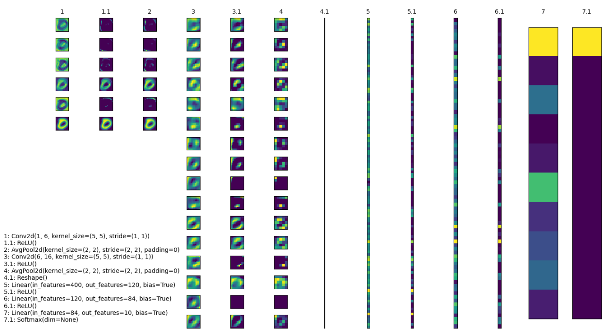

# BaseNN功能详解

## BaseNN是什么？

BaseNN是神经网络库，能够使用类似Keras却比Keras门槛更低的的语法搭建神经网络模型。可支持逐层搭建神经网络，深入探究网络原理。如果有如下需求，可以优先选择BaseNN：

a）简易和快速地搭建神经网络

b）支持搭建[CNN和RNN](https://xedu.readthedocs.io/zh/master/basenn/introduction.html#rnncnn)，或二者的结合

c）同时支持CPU和GPU

## 解锁BaseNN使用方法

### 0. 引入包

```python
from BaseNN import nn
```

### 1. 声明模型

```python
model = nn()
```

### 2. 载入数据

根据数据类型，可选择使用`load_img_data`、`load_tab_data`等（持续更新中）直接载入不同类型数据的函数，在这些函数中封装了读取数据并进行预处理的功能。下面分数据类型进行说明：

#### 图片文件夹类型：

指定图片文件夹路径，再使用`load_img_data`函数即可完成载入数据。此处使用的是经典的MNIST手写体数字图像数据集。

```
image_folder_data = '../../dataset/mnist/training_set'
model.load_img_data(image_folder_data,color="grayscale",batch_size=1024)
```

参数说明：

`train_val_ratio`：0~1之间的浮点数，表示训练集的占比，默认为1。eg，数据集共1万张，train_val_ratio=0.8，则8000张训练集，2000张验证集。若传入大于1或小于0的错误比例，则参数值无效，默认整个数据集都可用于训练。此参数可用于拆分数据集为训练集和验证集。

`color`：设置为"grayscale"或"RGB"，表示图片的颜色空间或色彩模式，可以根据具体的需求来选择适合的模式。如果将color参数设置为"grayscale"，表示希望将图像转换为灰度图像，仅包含亮度信息。如果将color参数设置为"RGB"，表示希望保留图像的红、绿、蓝三个通道的颜色信息，得到彩色图像。

`batch_size`：表示在一次训练中同时处理的样本数量。通常情况下，批量大小越大，模型的收敛速度越快，但内存和计算资源的需求也会相应增加。

#### 特征表格类型：

指定表格路径，再使用`load_tab_data`函数即可完成载入数据。此处我使用的是经典的lvis鸢尾花数据集。

```
train_path = '../../dataset/iris/iris_training.csv'
model.load_tab_data(train_path, batch_size=120)
```

对表格的要求：csv格式，纵轴为样本，横轴为特征，第一行为表头，最后一列为标签。

`batch_size`：表示在一次训练中同时处理的样本数量。通常情况下，批量大小越大，模型的收敛速度越快，但内存和计算资源的需求也会相应增加。

#### 拓展——自行编写代码载入数据：

如您想要尝试自行编写代码加载数据并做预处理，需生成NumPy数组格式的特征 `x` 和标签 `y`（不同的框架和模型可能对输入数据的格式有所要求有所不同，这是BaseNN的要求），载入时可使用如下代码。

```
model.load_dataset(x, y)
```

此处采用lvis鸢尾花数据集和MNIST手写体数字图像数据集作为示例。

读取并载入csv格式鸢尾花数据集（鸢尾花数据集以鸢尾花的特征作为数据来源，数据集包含150个数据集，有4维，分为3类（setosa、versicolour、virginica），每类50个数据，每个数据包含4个属性，花萼长度、宽度和花瓣长度、宽度）：

```python
# 训练数据
train_path = '../dataset/iris/iris_training.csv' 
x = np.loadtxt(train_path, dtype=float, delimiter=',',skiprows=1,usecols=range(0,4)) # 读取前四列，特征
y = np.loadtxt(train_path, dtype=int, delimiter=',',skiprows=1,usecols=4) # 读取第五列，标签
# 测试数据
test_path = '../dataset/iris/iris_test.csv'
test_x = np.loadtxt(test_path, dtype=float, delimiter=',',skiprows=1,usecols=range(0,4)) # 读取前四列，特征
test_y = np.loadtxt(test_path, dtype=int, delimiter=',',skiprows=1,usecols=4) # 读取第五列，标签
# 将数据载入
model.load_dataset(x, y)
```

上面这段代码使用了NumPy库加载和预处理lvis鸢尾花数据集。代码首先指定了训练数据集和测试数据集的路径，然后使用`np.loadtxt`函数从CSV文件中读取特征和标签数据，并存储在`x`和`y`变量中。测试数据也以相同的方式加载并存储在`test_x`和`test_y`变量中。最后，通过调用`model.load_dataset(x, y)`将数据集载入模型。

读取并载入手写体图像数据集（数据集包含了0-9共10类手写数字图片，都是28x28大小的灰度图）：

```python
# 定义读取训练数据的函数
def read_data(path):
    data = []
    label = []
    dir_list = os.listdir(path)

    # 将顺序读取的文件保存到该list中
    for item in dir_list:
        tpath = os.path.join(path,item)

        # print(tpath)
        for i in os.listdir(tpath):
            # print(item)
            img = cv2.imread(os.path.join(tpath,i))
            imGray = cv2.cvtColor(img, cv2.COLOR_BGR2GRAY)
            # print(img)
            data.append(imGray)
            label.append(int(item))
    x = np.array(data)
    y = np.array(label)

    x = np.expand_dims(x, axis=1)
    return x, y
    
# 读取训练数据
train_x, train_y = read_data('../dataset/mnist/training_set')
# 载入数据
model.load_dataset(train_x, train_y) 
```

上面这段代码中定义了一个名为`read_data`的函数，该函数用于从指定路径中读取MNIST训练数据。该函数首先遍历给定路径中的文件夹，然后读取每个文件夹中的图像数据，并将其转换为灰度图像。读取的图像数据被存储在`data`列表中，相应的标签存储在`label`列表中。最后，通过`np.array`将数据和标签转换为NumPy数组，并使用`np.expand_dims`函数在数据维度上进行扩展，以适应模型的输入要求。

### 3. 搭建模型

逐层添加，搭建起模型结构，支持CNN（卷积神经网络）和RNN（循环神经网络）。注释标明了数据经过各层的尺寸变化。

```python
model.add(layer='linear',size=(4, 10),activation='relu') # [120, 10]
model.add(layer='linear',size=(10, 5), activation='relu') # [120, 5]
model.add(layer='linear', size=(5, 3), activation='softmax') # [120, 3]
```

```
model.add('lstm',size=(128,256),num_layers=2)
```

```
model.add('conv2d', size=(1, 3),kernel_size=( 3, 3), activation='relu') # [100, 3, 18, 18]
```

以上使用`add()`方法添加层，参数`layer='linear'`表示添加的层是线性层，`size=(4,10)`表示该层输入维度为4，输出维度为10，`activation='relu'`表示使用relu激活函数。更详细[`add()`方法使用可见[附录1](https://xedu.readthedocs.io/zh/latest/basenn/introduction.html#add)。

### 4. 模型训练

模型训练可以采用以下函数：

```python
model.train(lr=0.01, epochs=500)
```

参数`lr`为学习率，`epochs`为训练轮数。

从训练类型的角度，可以分为正常训练和继续训练。

#### 正常训练

```python
model = nn() 
model.add(layer='linear',size=(4, 10),activation='relu') # [120, 10]
model.add(layer='linear',size=(10, 5), activation='relu') # [120, 5]
model.add(layer='linear', size=(5, 3), activation='softmax') # [120, 3]
model.load_dataset(x, y)
model.save_fold = 'checkpoints' # 指定模型保存路径
model.train(lr=0.01, epochs=1000)
```

`model.save_fold`表示训练出的模型文件保存的文件夹。

#### 继续训练

```python
model = nn()
model.load_dataset(x, y)
model.save_fold = 'checkpoints/new_train' # 指定模型保存路径
checkpoint = 'checkpoints/basenn.pth' # 指定已有模型的权重文件路径
model.train(lr=0.01, epochs=1000, checkpoint=checkpoint)
```

`checkpoint`为现有模型路径，当使用`checkpoint`参数时，模型基于一个已有的模型继续训练，不使用`checkpoint`参数时，模型从零开始训练。

### 5. 分数据类型看训练代码

针对不同类型的数据类型，载入数据、搭建模型和模型训练的代码会略有不同。深度学习常见的数据类型介绍详见[附录4](https://xedu.readthedocs.io/zh/latest/basenn/introduction.html#id23)。

#### 图片类型

针对图像数据可增加classes参数设置。

直接指定图片文件夹完成模型训练的示例代码如下：

```python
model = nn()
model.load_img_data("./mnist/training_set",color="grayscale",batch_size=32)
model.add('Conv2D', size=(1, 6),kernel_size=( 5, 5), activation='ReLU') 
model.add('AvgPool', kernel_size=(2,2)) 
model.add('Conv2D', size=(6, 16), kernel_size=(5, 5), activation='ReLU') 
model.add('AvgPool', kernel_size=(2,2)) 
model.add('Linear', size=(256, 120), activation='ReLU')  
model.add('Linear', size=(120, 84), activation='ReLU') 
model.add('Linear', size=(84, 10), activation='Softmax')
model.add(optimizer='SGD')
model.save_fold = 'new_mn_ckpt'
model.train(lr=0.01, epochs=200, checkpoint="new_mn_ckpt/basenn.pth",classes=classes) # 继续训练
```

如自己进行对图片数据处理后，使用`load_dataset(x, y)`载入数据，可使用如下代码：

```
model = nn()
model.load_dataset(x,y) # classes是类别列表（列表） //字典
model.add('conv2d',...)
model.train(lr=0.01,epochs=1,classes=classes)
```

classes可传参数兼容列表，字典形式(以下三种形式均可)。

```
classes = ['cat','dog']
classes = {0:'cat',1:'dog'}
classes = {'cat':0, 'dog':1} # 与词表形式统一
```

注意：索引是数值类型（int)，类别名称是字符串（str)，即哪怕类别名也是数字0,1,...字典的键和值也有区别，例如：

```
# 正确示例
classes = {0:'0',1:'1'} # 索引to类别
classes = {'0':0, '1':1} # 类别to索引

# 错误示例
classes = {0:0,1:1} 
classes = {'0':'0', '1':'1'} 
```

#### 特征类型

直接指定csv格式的表格完成模型训练的示例代码如下：

```python
model = nn()
train_path = '../../dataset/iris/iris_training.csv'
model.load_tab_data(train_path, batch_size=120)
model.add(layer='Linear',size=(4, 10),activation='ReLU') # [120, 10]
model.add(layer='Linear',size=(10, 5), activation='ReLU') # [120, 5]
model.add(layer='Linear', size=(5, 3), activation='Softmax') # [120, 3]
model.save_fold = './iris_ckpt'
model.train(lr=0.01, epochs=500)
```

对表格的要求：csv格式，纵轴为样本，横轴为特征，第一行为表头，最后一列为标签。

当然您也可以自行编写代码来加载数据并进行预处理，然后将生成的输入特征 `x` 和目标标签 `y` 传递给模型。针对特征数据，使用BaseNN各模块的示例代码即可。

```
model = nn()
model.load_dataset(x,y)
model.add('Linear',...)
model.save_fold = './iris_ckpt'
model.train(lr=0.01,epochs=1)
```

#### 文本类型

在做文本识别等NLP（自然语言处理）领域项目时，一般搭建[RNN网络](https://xedu.readthedocs.io/zh/latest/basenn/introduction.html#rnncnn)训练模型，训练数据是文本数据，模型训练的示例代码如下：

```
model = nn()
model.load_dataset(x,y,word2idx=word2idx) # word2idx是词表（字典）
model.add('lstm',size=(128,256),num_layers=2)
model.train(lr=0.001,epochs=1)
```

### 6. 模型推理

可使用以下函数进行推理：

```python
model = nn() # 声明模型
checkpoint = 'checkpoints/iris_ckpt/basenn.pth' # 现有模型路径
result = model.inference(data=test_x, checkpoint=checkpoint) # 直接推理
model.print_result(result) # 输出字典格式结果
```

`checkpoint`为已有模型路径，即使用现有的模型进行推理。

直接推理的输出结果数据类型为`NumPy`的二维数组，表示各个样本的各个特征的置信度。

输出字典格式结果的数据类型为字典，格式为{样本编号：{预测值：x，置信度：y}}。`print_result()`函数调用即输出，但也有返回值。

参数`data`为待推理的测试数据数据，该参数必须传入值，可以传入NumPy数组或文件路径。除了NumPy数组格式的特征数据，还可以传入文件路径进行模型推理，下面我们分文件类型说明。

#### 针对单个图片文件的推理：

```python
model = nn()
test_x = "mnist/val_set/7/83.jpg"
result = model.inference(data=test_x, checkpoint="mn_ckpt/basenn.pth") # 推理整个测试集
model.print_result()
```

#### 针对图片文件夹的推理：

```python
model = nn()
test_x = "mnist/val_set/7"
result = model.inference(data=test_x, checkpoint="mn_ckpt/basenn.pth") # 推理整个测试集
model.print_result()
```

#### 针对特征表格文件的推理：

```python
model = nn()
test_path = '../../dataset/iris/iris_test.csv'
res = model.inference(test_path, checkpoint="iris_ckpt/basenn.pth",label=True)
model.print_result(res)
```

`label=True`：csv文件中含标签列，比如iris_test.csv；False为没有标签，一般情况下测试集都是没有标签的，所以默认为False。

c对表格文件的要求：csv格式，纵轴为样本，横轴为特征，第一行为表头，最后一列为标签

#### 针对文本数据的推理：

```python
model = nn()
data = '长'
checkpoint = 'xxx.pth'
result = model.inference(data=data, checkpoint=checkpoint)
index = np.argmax(result[0]) # 取得概率最大的字的索引，当然也可以取别的，自行选择即可
word = model.idx2word[index] # 根据词表获得对应的字
```

`result`为列表包含两个变量：`[output, hidden]`。

`output`为NumPy数组，里面是一系列概率值，对应每个字的概率。

`hidden`为高维向量，存储上下文信息，代表“记忆”，所以生成单个字可以不传入hidden，但写诗需要循环传入之前输出的hidden。

### 7. 模型的保存与加载

```python
# 保存
model.save_fold = 'mn_ckpt'
# 加载
model.load("basenn.pth")
```

参数为模型保存的路径，模型权重文件格式为`.pth`文件格式。

注：`train()`，`inference()`函数中也可通过参数控制模型的保存与加载，但这里也列出单独保存与加载模型的方法，以确保灵活性。

### 8. 查看模型结构

```python
model.print_model()
```

无参数。

### 9. 网络中特征可视化

BaseNN内置`visual_feature`函数可呈现数据在网络中传递的过程。特征可视化可以帮助我们更好地理解模型在处理数据时的内部工作原理，并通过这种方式来进一步提高模型的性能和效果。

如输入数据为图片，指定图片和已经训练好的模型，可生成一张展示逐层网络特征传递的图片。

```
import cv2
from BaseNN import nn
model = nn()
model.load('mn_ckpt/basenn.pth')          # 保存的已训练模型载入
path = 'test_IMG/single_data.jpg'
img = cv2.imread(path,flags = 0)          # 图片数据读取
model.visual_feature(img,in1img = True)   # 特征的可视化
```



如输入数据为一维数据，指定数据和已经训练好的模型，可生成一个txt文件展示经过各层后的输出。

```
import NumPy as np
from BaseNN import nn
model = nn()
model.load('checkpoints/iris_ckpt/basenn.pth')          # 保存的已训练模型载入
data = np.array(test_x[0]) # 指定数据,如测试数据的一行
model.visual_feature(data)   # 特征的可视化
```

### 10. 自定义随机数种子

默认初始化是随机的，每次训练结果都不一样。可以使用`set_seed()`函数设定随机数种子，使得训练结果可被其他人复现。一旦指定，则每次训练结果一致。使用方法如下：

```Shell
model = nn()
model.set_seed(1235)
model.add(...)
...
model.train(...)
```

注：设定随机数种子`set_seed()`应当在搭建网络`add()`之前。在搭建机器学习模型之前，通常建议设置随机数种子。这样做可以使得在每次运行时，生成的随机数序列都是相同的，从而使得模型的可重复性更高。这对于模型调试、验证模型效果、比较不同模型效果等方面都非常有帮助。随机数种子的选择通常应该是随意的，只要您能记住或记录下来使用的种子即可。并且，种子的选择并不会影响模型的效果，只会影响结果的可重复性。

### 11. 自定义损失函数

损失函数（或称目标函数、优化评分函数）是编译模型时所需的参数之一。在机器学习和深度学习中，模型的训练通常涉及到一个优化过程，即通过不断调整模型的参数，使得模型在训练数据上的预测结果与实际结果的差距最小化。这个差距通常使用一个称为"损失函数"的指标来衡量。损失函数通常是一个关于模型参数的函数，用于度量模型预测结果与实际结果之间的差异。在模型训练过程中，模型会根据损失函数的值来调整自己的参数，以减小损失函数的值。

默认的损失函数是交叉熵损失函数，允许选择不同的损失函数，支持的损失函数见[附录](https://xedu.readthedocs.io/zh/latest/basenn/introduction.html#id22)。自选损失函数方法如下：

```
model.train(...,loss="CrossEntropyLoss")
```

### 12. 自定义评价指标

评价指标用于评估当前训练模型的性能。当模型编译后，评价指标应该作为 `metrics` 的参数来输入。默认的默认为准确率，允许选择其他的评价指标。支持的评价指标：acc（准确率），mae（平均绝对误差），mse（均方误差）。

自选评价指标方法如下：

```
model.train(...,metrics=["mse"])
```

因此针对不同的分类或回归任务，可指定不同的损失函数和评价指标。

例：

回归：`model.train(...,loss="SmoothL1Loss", metrics=["mae"])` 

分类：`model.train(...,loss="CrossEntropyLoss",metrics=["acc"])`

### 13. CNN特征提取

图像特征提取是计算机视觉中的重要研究领域之一，是计算机视觉中的一个关键步骤，它涉及将图像转换成一组有意义的特征向量，以便后续的图像分析和识别任务。CNN（卷积神经网络）特征提取方法是一种基于深度学习的特征提取方法，通过卷积层、池化层等多个网络层的处理，可以提取出具有高层次抽象能力的特征表示，被广泛应用于图像分类、目标检测等领域。

BaseNN中提供了一个CNN特征提取工具，可使用BaeNN的`model.extract_feature()`函数通过指定预训练模型来提取图像特征，使用ResNet预训练模型可将一张图像提取为1000维的特征（该预训练模型是在imagenet上训练的千分类模型，所以输出特征的维度是1000维），输出一个1行1000列的数组。

```
# 声明模型
model = nn()
# 读取图像文件
img = cv2.imread('small/0/5818.png')
# 指定resnet18提取图像特征
feature = model.extract_feature(img, pretrain='resnet18')
```

第一次下载预训练模型有点慢需要耐心等待，再次运行则无需下载。

## 附录

### 1. add()详细介绍

使用BaseNN可以轻易地创建深度学习模型。不同类型的神经网络适用于不同类型的问题，比如CNN通常用于处理图像问题，RNN通常用于处理序列问题，全连接神经网络可以应用于各种问题。

首先以典型的LeNet5网络结构为例。注释标明了数据经过各层的尺寸变化。

```python
model.add('conv2d', size=(1, 3),kernel_size=( 3, 3), activation='relu') # [100, 3, 18, 18]
model.add('maxpool', kernel_size=(2,2)) # [100, 3, 9, 9]
model.add('conv2d', size=(3, 10), kernel_size=(3, 3), activation='relu') # [100, 10, 7, 7]
model.add('avgpool', kernel_size=(2,2)) # [100, 10, 3, 3]
model.add('linear', size=(90, 10), activation='relu') # [100, 10]
model.add('linear', size=(10, 2), activation='softmax') # [100,2]
model.add(optimizer='SGD') # 设定优化器
```

添加层的方法为`add(self, layer=None, activation=None, optimizer='SGD', **kw)`，

参数:

layer：层的类型，可选值包括Conv2D, MaxPool, AvgPool, Linear。

activation：激活函数类型，可选值包括ReLU，Softmax。

optimizer：为优化器类型，默认值为SGD，可选值包括SGD，Adam，Adagrad，ASGD。

kw：关键字参数，包括与size相关的各种参数，常用的如size=(x,y)，x为输入维度，y为输出维度；					                     			kernel_size=(a,b)， (a,b)表示核的尺寸。

以下具体讲述各种层：

conv2d：卷积层（二维），需给定size，kernel_size。同时支持搭建conv1d（一维卷积层）。

maxpool：最大池化层，需给定kernel_size。

avgpool：平均池化层，需给定kernel_size。

linear：线性层，需给定size。

再以RNN模型（循环神经网络）为例进行详细说明：

```
model.add('lstm',size=(128,256),num_layers=2)
```

lstm（Long Short-Term Memory，长短时记忆）是一种特殊的RNN（Recurrent Neural Network，循环神经网络）模型，主要用于处理序列数据。lstm模型在自然语言处理、语音识别、时间序列预测等任务中被广泛应用，特别是在需要处理长序列数据时，lstm模型可以更好地捕捉序列中的长程依赖关系。

size的两个值：

第一个为嵌入层维度（embedding_dim)，

第二个为隐藏层维度（hidden_dim)，即lstm隐藏层中神经元数量。

参数说明：

input_size： 输入数据的特征维数，即每一个字用多少维的向量来表示，通常就是embedding_dim(词向量的维度)。

hidden_size：LSTM中隐藏层的神经元数量。

num_layers：循环神经网络的层数。一般1~5，常用2、3层，太多层会大幅度影响训练速度和收敛难度。

bias：用不用偏置，default=True。

dropout：默认是0，代表不用dropout。

bidirectional：默认是false，代表不用双向LSTM。

以上仅是基本的模型架构。在实际使用中，可能需要调整模型的层数、节点数、激活函数等参数以达到最佳效果。

### 2. 支持的损失函数

| 序号 | 损失函数                                                     |
| ---- | :----------------------------------------------------------- |
| 1    | [nn.L1Loss](https://pytorch.org/docs/stable/generated/torch.nn.L1Loss.html#torch.nn.L1Loss) |
| 2    | [nn.MSELoss](https://pytorch.org/docs/stable/generated/torch.nn.MSELoss.html#torch.nn.MSELoss) |
| 3    | [nn.CrossEntropyLoss](https://pytorch.org/docs/stable/generated/torch.nn.CrossEntropyLoss.html#torch.nn.CrossEntropyLoss) |
| 4    | [nn.CTCLoss](https://pytorch.org/docs/stable/generated/torch.nn.CTCLoss.html#torch.nn.CTCLoss) |
| 5    | [nn.NLLLoss](https://pytorch.org/docs/stable/generated/torch.nn.NLLLoss.html#torch.nn.NLLLoss) |
| 6    | [nn.PoissonNLLLoss](https://pytorch.org/docs/stable/generated/torch.nn.PoissonNLLLoss.html#torch.nn.PoissonNLLLoss) |
| 7    | [nn.GaussianNLLLoss](https://pytorch.org/docs/stable/generated/torch.nn.GaussianNLLLoss.html#torch.nn.GaussianNLLLoss) |
| 8    | [nn.KLDivLoss](https://pytorch.org/docs/stable/generated/torch.nn.KLDivLoss.html#torch.nn.KLDivLoss) |
| 9    | [nn.BCELoss](https://pytorch.org/docs/stable/generated/torch.nn.BCELoss.html#torch.nn.BCELoss) |
| 10   | [nn.BCEWithLogitsLoss](https://pytorch.org/docs/stable/generated/torch.nn.BCEWithLogitsLoss.html#torch.nn.BCEWithLogitsLoss) |
| 11   | [nn.MarginRankingLoss](https://pytorch.org/docs/stable/generated/torch.nn.MarginRankingLoss.html#torch.nn.MarginRankingLoss) |
| 12   | [nn.HingeEmbeddingLoss](https://pytorch.org/docs/stable/generated/torch.nn.HingeEmbeddingLoss.html#torch.nn.HingeEmbeddingLoss) |
| 13   | [nn.MultiLabelMarginLoss](https://pytorch.org/docs/stable/generated/torch.nn.MultiLabelMarginLoss.html#torch.nn.MultiLabelMarginLoss) |
| 14   | [nn.HuberLoss](https://pytorch.org/docs/stable/generated/torch.nn.HuberLoss.html#torch.nn.HuberLoss) |
| 15   | [nn.SmoothL1Loss](https://pytorch.org/docs/stable/generated/torch.nn.SmoothL1Loss.html#torch.nn.SmoothL1Loss) |
| 16   | [nn.SoftMarginLoss](https://pytorch.org/docs/stable/generated/torch.nn.SoftMarginLoss.html#torch.nn.SoftMarginLoss) |
| 17   | [nn.MultiLabelSoftMarginLoss](https://pytorch.org/docs/stable/generated/torch.nn.MultiLabelSoftMarginLoss.html#torch.nn.MultiLabelSoftMarginLoss) |
| 18   | [nn.CosineEmbeddingLoss](https://pytorch.org/docs/stable/generated/torch.nn.CosineEmbeddingLoss.html#torch.nn.CosineEmbeddingLoss) |
| 19   | [nn.MultiMarginLoss](https://pytorch.org/docs/stable/generated/torch.nn.MultiMarginLoss.html#torch.nn.MultiMarginLoss) |
| 20   | [nn.TripletMarginLoss](https://pytorch.org/docs/stable/generated/torch.nn.TripletMarginLoss.html#torch.nn.TripletMarginLoss) |
| 21   | [nn.TripletMarginWithDistanceLoss](https://pytorch.org/docs/stable/generated/torch.nn.TripletMarginWithDistanceLoss.html#torch.nn.TripletMarginWithDistanceLoss) |

### 3. RNN和CNN

RNN（Recurrent Neural Network，循环神经网络）和CNN（Convolutional Neural Network，卷积神经网络）是深度学习中两个非常重要的神经网络模型。

RNN是一种用于处理序列数据的神经网络模型。它的特点是可以将前面的输入信息保存下来，并在后面的计算中进行利用，从而实现对序列数据的建模。RNN在自然语言处理、语音识别、股票预测等任务中广泛应用。RNN对具有序列特性的数据非常有效，它能挖掘数据中的时序信息以及语义信息。它有记忆功能，可以记住序列中前面的信息，并用这些信息影响后续的输出。这就像我们人类在阅读一段文字时，会记住前面的内容，以帮助理解后面的内容一样。

一些常见的序列数据：

- 文本数据：即人类的自然语言，一段话或一篇文章中的单词或字符序列，是符合某个逻辑或规则的字词拼凑排列起来的，这些规则包括词序、句法结构、语境等等。因此，文本数据具有序列特性，即前后元素之间存在某种联系或依赖关系。这种序列特性使得文本数据的处理和分析比较复杂。
- 时间序列数据：股票价格、气温、交通流量等随时间变化的数据，随着时间的推移，会产生具有顺序的一系列数字，这些数字也是具有序列特性。
- 语音数据：音频信号中的时域或频域特征序列，我们发出的声音，每一帧每一帧的衔接起来，才凑成了我们听到的话，这也具有序列特性。
- 生物信息学数据：DNA或RNA序列、蛋白质序列等。
- 符号序列：编码信息的二进制序列、信号编码序列等。

在这些序列数据中，每个数据点（单词、股票价格、音频帧等）都与序列中的其他数据点密切相关，传统的RNN在处理长序列时会遇到一些问题，比如长期依赖问题和梯度消失问题。为了解决这些问题，研究者们提出了一些改进的RNN模型，如长短期记忆网络（LSTM）和门控循环单元（GRU）。

CNN是一种用于处理图像和空间数据的神经网络模型。例如图片（可以看成是像素的网格）。CNN的核心概念是卷积层和池化层。卷积层通过滑动窗口（也叫做卷积核）在输入数据上进行卷积操作，能够自动学习并识别图像中的局部特征，比如线条、形状等。池化层则用于降低数据的维度，减少计算量。CNN的一个重要特性是它具有参数共享和平移不变性，这使得CNN非常适合处理图像数据。当然，CNN也被用于处理其他类型的数据，如文本和时间序列数据。它的主要特点是利用卷积操作提取图像中的特征，并通过池化操作减小特征图的大小，最终通过全连接层进行分类或回归。CNN在图像分类、目标检测、图像分割等任务中表现出色。

简单来说，RNN适用于序列数据处理，而CNN适用于图像和空间数据处理。但实际上，它们也可以互相组合使用，例如在图像描述生成任务中，可以使用CNN提取图像特征，然后使用RNN生成对应的文字描述。使用BaseNN搭建RNN和CNN模型的方式详见[add()详细](https://xedu.readthedocs.io/zh/master/basenn/introduction.html#add)介绍。

### 4. 深度学习常见的数据类型

图像数据：图像数据是深度学习应用中最常见的数据类型之一。图像数据通常表示为多维数组，每个数组元素代表一个像素的值。深度学习应用中常使用的图像数据格式包括JPEG、PNG、BMP等。

文本数据：文本数据是指由字符组成的序列数据。在深度学习应用中，文本数据通常被表示为词向量或字符向量，用于输入到文本处理模型中。

特征数据：特征数据指的是表示对象或事物的特征的数据，通常用于机器学习和数据挖掘。特征数据可以是数值型、离散型或者是二进制的，用于描述对象或事物的各种属性和特征。特征数据可以是手动设计的、自动提取的或者是混合的。在机器学习中，特征数据通常作为模型的输入，用于预测目标变量或者分类。

