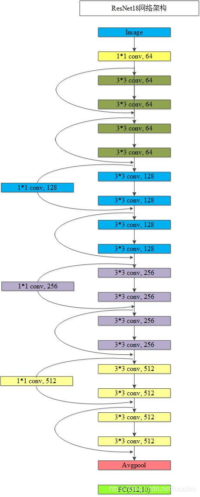

# BaseNN功能详解

## BaseNN是什么？

BaseNN是神经网络库，能够使用类似Keras却比Keras门槛更低的的语法搭建神经网络模型。可支持逐层搭建神经网络，深入探究网络原理。如果有如下需求，可以优先选择BaseNN：

a）简易和快速地搭建神经网络

b）支持搭建[CNN和RNN](https://xedu.readthedocs.io/zh/master/basenn/introduction.html#rnncnn)，或二者的结合

c）同时支持CPU和GPU

文档涉及的部分代码见XEdu帮助文档配套项目集：[https://www.openinnolab.org.cn/pjlab/project?id=64f54348e71e656a521b0cb5&sc=645caab8a8efa334b3f0eb24#public](https://www.openinnolab.org.cn/pjlab/project?id=64f54348e71e656a521b0cb5&sc=645caab8a8efa334b3f0eb24#public)

## 解锁BaseNN基本使用方法

### 0. 引入包

``` python
from BaseNN import nn
```

### 1. 声明模型

``` python
model = nn()
```

可选参数：

`task`：指定了这个模型要完成的任务，可选取值有：`['reg','cls']`，

回归任务：nn('reg')。

分类任务：nn('cls')，当不指定时，`task`的默认值`'cls'`。

### 2. 载入数据

根据数据类型，可选择使用`load_img_data`、`load_tab_data`等（持续更新中）直接载入不同类型数据的函数，在这些函数中封装了读取数据并进行预处理的功能。下面分数据类型进行说明：

#### 针对图片文件夹类型的数据：

指定图片文件夹路径，再使用`load_img_data`函数即可完成载入数据。此处使用的是经典的MNIST手写体数字图像数据集。

```python
image_folder_data = '../../dataset/mnist/training_set'
model.load_img_data(image_folder_data,color="grayscale",batch_size=1024)
```

参数说明：

`train_val_ratio`：0\~1之间的浮点数，表示训练集的占比，默认为1。eg，数据集共1万张，train_val_ratio=0.8，则8000张训练集，2000张验证集。若传入大于1或小于0的错误比例，则参数值无效，默认整个数据集都可用于训练。此参数可用于拆分数据集为训练集和验证集。

`color`：设置为"grayscale"或"RGB"，表示图片的颜色空间或色彩模式，可以根据具体的需求来选择适合的模式。如果将color参数设置为"grayscale"，表示希望将图像转换为灰度图像，仅包含亮度信息。如果将color参数设置为"RGB"，表示希望保留图像的红、绿、蓝三个通道的颜色信息，得到彩色图像。

`batch_size`：表示在一次训练中同时处理的样本数量。通常情况下，批量大小越大，模型的收敛速度越快，但内存和计算资源的需求也会相应增加。

`num_workers`：线程数，决定了有多少个子线程被用于数据加载。子线程是并行运行的，可以同时处理多个数据批次。增加 `num_workers` 的数值时，可以加快数据批次的寻找速度，这通常会提高训练的速度，因为模型等待数据的时间减少了，但增大内存开销和CPU负荷。此参数用来控制数据加载过程中的线程数量。适当增加这个数值可以加速训练，但也要注意不要超出你的硬件限制。默认为0，一般而言设置num_workers最大为CPU核心数。

##### 关于图片数据集预处理：

载入图片数据前如需对图像数据集进行预处理，最常见的例如做尺寸调整，可先调用已经内置的torchvision对图片数据集进行预处理再载入模型进行训练，只需在`load_img_data`图片数据集时增加一个`transform`的参数。

此处为对数据进行单个步骤的简单处理。

```python
model.load_img_data('MNIST',transform={"Resize":(128,128)})
```

若要对图片数据进行多次处理的复杂操作，可以采用如下代码，将多个处理方式设置入参数，在执行时这些操作也会被按顺序执行。

```python
model.load_img_data('catdog',transform={"Resize":(128,128),"RandomResizedCrop":224,"RandomHorizontalFlip":0.5})
```

方法说明: `Resize()`:对图片尺寸进行缩放。

`RandomResizedCrop()`:对图片尺寸进行随机缩放后裁剪为固定尺寸。

`RandomHorizontalFlip()`:依照某概率对图片进行水平翻转。

支持的操作即为[torchvision中的transforms](https://pytorch-cn.readthedocs.io/zh/latest/torchvision/torchvision-transform/)包括的所有方式，如下表所列。

<table class="docutils align-default">
<thead>
  <tr>
    <th>类别</th>
    <th>转换名称</th>
    <th>函数</th>
    <th>参数设置示例</th>
  </tr>
</thead>
<tbody>
  <tr>
    <td>裁剪</td>
    <td>随机裁剪</td>
    <td>transforms.RandomCrop</td>
    <td>(size=(32, 32))</td> 
  </tr>
</tbody>
<tbody>
  <tr>
    <td>裁剪</td>
    <td>中心裁剪</td>
    <td>transforms.CenterCrop</td>
    <td>(size=(32, 32))</td>
  </tr>
</tbody>
<tbody>
  <tr>
    <td>裁剪</td>
    <td>随机长宽比裁剪</td>
    <td>transforms.RandomResizedCrop</td>
    <td>(size=224, scale=(0.08, 1.0), ratio=(0.75, 1.33), interpolation=2)</td>
  </tr>
</tbody>
<tbody>
  <tr>
    <td>裁剪</td>
    <td>上下左右中心裁剪</td>
    <td>transforms.FiveCrop</td>
    <td>(size=(32, 32))</td>
  </tr>
</tbody>
<tbody>
  <tr>
    <td>裁剪</td>
    <td>上下左右中心裁剪后翻转</td>
    <td>transforms.TenCrop</td>
    <td>(size=(32, 32), vertical_flip=False)</td>
  </tr>
</tbody>
<tbody>
  <tr>
    <td>翻转和旋转</td>
    <td>依概率p水平翻转</td>
    <td>transforms.RandomHorizontalFlip</td>
    <td>(p=0.5)</td>
  </tr>
</tbody>
<tbody>
  <tr>
    <td>翻转和旋转</td>
    <td>依概率p垂直翻转</td>
    <td>transforms.RandomVerticalFlip</td>
    <td>(p=0.5)</td>
  </tr>
</tbody>
<tbody>
  <tr>
    <td>翻转和旋转</td>
    <td>随机旋转</td>
    <td>transforms.RandomRotation</td>
    <td>(degrees=(0, 180))</td>
  </tr>
</tbody>
<tbody>
  <tr>
    <td>图像变换</td>
    <td>Resize</td>
    <td>transforms.Resize</td>
    <td>(size=(128, 128))</td>
  </tr>
</tbody>
<tbody>
  <tr>
    <td>图像变换</td>
    <td>标准化</td>
    <td>transforms.Normalize</td>
    <td>(mean=(0.485, 0.456, 0.406), std=(0.229, 0.224, 0.225))</td>
  </tr>
</tbody>
<tbody>
  <tr>
    <td>图像变换</td>
    <td>转为tensor</td>
    <td>transforms.ToTensor</td>
    <td>无参数设置示例</td>
  </tr>
</tbody>
<tbody>
  <tr>
    <td>图像变换</td>
    <td>填充</td>
    <td>transforms.Pad</td>
    <td>(padding=4)</td>
  </tr>
</tbody>
<tbody>
  <tr>
    <td>图像变换</td>
    <td>修改亮度、对比度和饱和度</td>
    <td>transforms.ColorJitter</td>
    <td>(brightness=0.2, contrast=0.2, saturation=0.2, hue=0.1)</td>
  </tr>
</tbody>
<tbody>
  <tr>
    <td>图像变换</td>
    <td>转灰度图</td>
    <td>transforms.Grayscale</td>
    <td>(num_output_channels=1)</td>
  </tr>
</tbody>
<tbody>
  <tr>
    <td>图像变换</td>
    <td>线性变换</td>
    <td>transforms.LinearTransformation</td>
    <td>(transformation_matrix, mean_vector)</td>
  </tr>
</tbody>
<tbody>
  <tr>
    <td>图像变换</td>
    <td>仿射变换</td>
    <td>transforms.RandomAffine</td>
    <td>(degrees=30, translate=(0.1, 0.1), scale=(0.8, 1.2), shear=10)</td>
  </tr>
</tbody>
<tbody>
  <tr>
    <td>图像变换</td>
    <td>依概率p转为灰度图</td>
    <td>transforms.RandomGrayscale</td>
    <td>(p=0.1)</td>
  </tr>
</tbody>
<tbody>
  <tr>
    <td>图像变换</td>
    <td>将数据转换为PILImage</td>
    <td>transforms.ToPILImage</td>
    <td>无参数设置示例</td>
  </tr>
</tbody>
<tbody>
  <tr>
    <td>图像变换</td>
    <td>自定义Lambda变换</td>
    <td>transforms.Lambda</td>
    <td>(lambda x: x.div(255))</td>
  </tr>
</tbody>
</table>

#### 针对特征表格类型的数据：

指定表格路径，再使用`load_tab_data`函数即可完成载入数据。此处我使用的是经典的Iris鸢尾花数据集。

```python
train_path = '../../dataset/iris/iris_training.csv'
model.load_tab_data(train_path, batch_size=120)
```

对表格的要求：csv格式，纵轴为样本，横轴为特征，第一行为表头，最后一列为标签。

`batch_size`：表示在一次训练中同时处理的样本数量。通常情况下，批量大小越大，模型的收敛速度越快，但内存和计算资源的需求也会相应增加。

`num_workers`：线程数，决定了有多少个子线程被用于数据加载。子线程是并行运行的，可以同时处理多个数据批次。增加 `num_workers` 的数值时，可以加快数据批次的寻找速度，这通常会提高训练的速度，因为模型等待数据的时间减少了，但增大内存开销和CPU负荷。此参数用来控制数据加载过程中的线程数量。适当增加这个数值可以加速训练，但也要注意不要超出你的硬件限制。默认为0，一般而言设置num_workers最大为CPU核心数。

#### 针对NPZ数据集类型的数据：

指定NPZ数据集路径，再使用`load_npz_data`函数即可完成载入数据。

详见案例：[姿态识别进阶-循环神经网络](https://www.openinnolab.org.cn/pjlab/project?id=64daed3eafeb1059822a1578&sc=62f33550bf4f550f3e926cf2#public)

```python
train_path = '../../dataset/dataset.npz'
model.load_npz_data(train_path, batch_size=5000,classes=["walking","waving","stretching"])
```

对NPZ数据集的要求：npz格式(numpy zip)，其中至少应该拥有两个键，分别为`data`与`label`，其中`data`中存储的应为训练数据信息，`label`中存储的应为数据所对应的标签信息（应为数组形式）。

参数说明：

`batch_size`：表示在一次训练中同时处理的样本数量。通常情况下，批量大小越大，模型的收敛速度越快，但内存和计算资源的需求也会相应增加。

`classes`：表示数据集中的`label`中存储的数组各个位置标签所代表的意义。可以不传入，若不传入，则推理结果将会是认为结果的下标。若传入，则推理结果将自动转化为将原结果作为下标的数组中的对应内容。

`num_workers`：指定线程数，决定了有多少个子线程被用于数据加载。子线程是并行运行的，可以同时处理多个数据批次。增加 `num_workers` 的数值时，可以加快数据批次的寻找速度，这通常会提高训练的速度，因为模型等待数据的时间减少了，但增大内存开销和CPU负荷。此参数用来控制数据加载过程中的线程数量。适当增加这个数值可以加速训练，但也要注意不要超出你的硬件限制。默认为0，一般而言设置num_workers最大为CPU核心数。

- 小帖士（井号后面是运行结果）：
```python
import numpy as np
data = np.load('dataset.npz')
print(data)
# <numpy.lib.npyio.NpzFile object at 0x7f319c448ac0>
print(data['label'])  # 这是一个三分类标签数据，它是二维数据，每一条数据里面是三分类独热编码标签。
# array([[1, 0, 0],
#          ...,
#        [0, 0, 1]])
print(data['data']) # 这是一个高维数据，每一条数据对应一个标签，但是数据本身不是一维的，而是高纬的。
# array([[[ 4.60664570e-01,  2.78294533e-01, -3.56185764e-01, ...,
#          9.21180844e-01,  1.94783360e-01,  9.93974388e-01],
#        [ 4.62414086e-01,  2.83538818e-01, -3.53962898e-01, ...,
#          9.16427970e-01,  1.96989119e-01,  9.91852582e-01],
#        [ 4.63086247e-01,  2.80452102e-01, -3.24477255e-01, ...,
#          9.19000983e-01,  1.50782943e-01,  9.93449986e-01],
#        ...,
#        [ 4.34215039e-01,  4.27498937e-01,  3.03461671e-01, ...,
#          8.96103501e-01, -4.72080037e-02,  9.73582983e-01]]])
```

len(data['data'])和len(data['label'])是相等的。

对于案例[《姿态识别进阶-循环神经网络》](https://www.openinnolab.org.cn/pjlab/project?id=64daed3eafeb1059822a1578&sc=62f33550bf4f550f3e926cf2#public)
来说：`data['label'].shape`是(19, 3)，`data['data'].shape`是(19, 30, 132)。

`type(data['data'])`的运行结果是numpy.ndarray，`type(data['data'])`的运行结果是numpy.ndarray。


#### 拓展------自行编写代码载入数据：

如您想要尝试自行编写代码加载数据并做预处理，需生成NumPy数组格式的特征`x` 和标签`y`（不同的框架和模型可能对输入数据的格式有所要求有所不同，这是BaseNN的要求），载入时可使用如下代码，此方法比较灵活。

```python
model.load_dataset(x, y)
```

也支持设置线程数参数`num_workers`，此参数用来控制数据加载过程中的线程数量。适当增加这个数值可以加速训练，但也要注意不要超出你的硬件限制。默认为0，一般而言设置num_workers最大为CPU核心数。

此处采用Iris鸢尾花数据集和MNIST手写体数字图像数据集作为示例。

读取并载入csv格式鸢尾花数据集（鸢尾花数据集以鸢尾花的特征作为数据来源，数据集包含150条数据，有4维（花萼长度、宽度和花瓣长度、宽度），分为3类（setosa、versicolour、virginica），每类50条数据）：

数据集共有5列，其中前四列为特征，第五列为鸢尾花的类别，即标签。

``` python
# 训练数据
train_path = '../dataset/iris/iris_training.csv' 
x = np.loadtxt(train_path, dtype=float, delimiter=',',skiprows=1,usecols=range(0,4)) # 读取前四列，特征
y = np.loadtxt(train_path, dtype=int, delimiter=',',skiprows=1,usecols=4) # 读取第五列，标签
# 测试数据
test_path = '../dataset/iris/iris_test.csv'
test_x = np.loadtxt(test_path, dtype=float, delimiter=',',skiprows=1,usecols=range(0,4)) # 读取前四列，特征
test_y = np.loadtxt(test_path, dtype=int, delimiter=',',skiprows=1,usecols=4) # 读取第五列，标签
# 将数据载入
model.load_dataset(x, y)
```

上面这段代码使用了NumPy库加载和预处理Iris鸢尾花数据集。代码首先指定了训练数据集和测试数据集的路径，然后使用`np.loadtxt`函数从CSV文件中读取特征和标签数据，并存储在`x`和`y`变量中。测试数据也以相同的方式加载并存储在`test_x`和`test_y`变量中。最后，通过调用`model.load_dataset(x, y)`将数据集载入模型。

读取并载入手写体图像数据集（数据集包含了0-9共10类手写数字图片，都是28x28大小的灰度图）：

``` python
# 定义读取训练数据的函数
def read_data(path):
    data = []
    label = []
    dir_list = os.listdir(path)

    # 将顺序读取的文件保存到该list中
    for item in dir_list:
        tpath = os.path.join(path,item)

        # print(tpath)
        for i in os.listdir(tpath):
            # print(item)
            img = cv2.imread(os.path.join(tpath,i))
            imGray = cv2.cvtColor(img, cv2.COLOR_BGR2GRAY)
            # print(img)
            data.append(imGray)
            label.append(int(item))
    x = np.array(data)
    y = np.array(label)

    x = np.expand_dims(x, axis=1)
    return x, y

# 读取训练数据
train_x, train_y = read_data('../dataset/mnist/training_set')
# 载入数据
model.load_dataset(train_x, train_y) 
```

上面这段代码中定义了一个名为`read_data`的函数，该函数用于从指定路径中读取MNIST训练数据。该函数首先遍历给定路径中的文件夹，然后读取每个文件夹中的图像数据，并将其转换为灰度图像。读取的图像数据被存储在`data`列表中，相应的标签存储在`label`列表中。最后，通过`np.array`将数据和标签转换为NumPy数组，并使用`np.expand_dims`函数在数据维度上进行扩展，以适应模型的输入要求。

### 3. 搭建模型

逐层添加，搭建起模型结构，支持CNN（卷积神经网络）和RNN（循环神经网络）。注释标明了数据经过各层的尺寸变化。在模型搭建中要特别注意数据经过各层的尺寸变化，以设置正确的`size`值。

``` python
model.add(layer='linear',size=(4, 10),activation='relu') # [120, 10]
model.add(layer='linear',size=(10, 5), activation='relu') # [120, 5]
model.add(layer='linear', size=(5, 3), activation='softmax') # [120, 3]
```

```python
model.add('lstm',size=(128,256),num_layers=2)

model.add('conv2d', size=(1, 3),kernel_size=( 3, 3), activation='relu') # [100, 3, 18, 18]
```

以上使用`add()`方法添加层，参数`layer='linear'`表示添加的层是线性层，`size=(4,10)`表示该层输入维度为4，输出维度为10，`activation='relu'`表示使用relu激活函数。更详细`add()`方法使用可见[附录1](https://xedu.readthedocs.io/zh/latest/basenn/introduction.html#add)。

### 4. 模型训练

模型训练可以采用以下函数：

``` python
model.train(lr=0.01, epochs=500)
```

参数`lr`为学习率，`epochs`为训练轮数。

从训练类型的角度，可以分为正常训练和继续训练。

#### 正常训练

``` python
model = nn('cls') 
model.add(layer='linear',size=(4, 10),activation='relu') # [120, 10]
model.add(layer='linear',size=(10, 5), activation='relu') # [120, 5]
model.add(layer='linear', size=(5, 3), activation='softmax') # [120, 3]
model.load_dataset(x, y)
model.save_fold = 'checkpoints' # 指定模型保存路径
model.train(lr=0.01, epochs=1000)
```

`model.save_fold`表示训练出的模型文件保存的文件夹。

#### 继续训练

``` python
model = nn('cls')
model.load_dataset(x, y)
model.save_fold = 'checkpoints/new_train' # 指定模型保存路径
checkpoint = 'checkpoints/basenn.pth' # 指定已有模型的权重文件路径
model.train(lr=0.01, epochs=1000, checkpoint=checkpoint)
```

`checkpoint`为现有模型路径，当使用`checkpoint`参数时，模型基于一个已有的模型继续训练，不使用`checkpoint`参数时，模型从零开始训练。

#### 拓展------分数据类型看训练代码

针对不同类型的数据类型，载入数据、搭建模型和模型训练的代码会略有不同。深度学习常见的数据类型介绍详见[附录4](https://xedu.readthedocs.io/zh/latest/basenn/introduction.html#id23)。

##### 第一种：图片文件夹类型

可直接指定图片文件夹，同时针对图片数据可增加classes参数设置（推理时会输出预测的类别名称，如不设置此参数则只输出类别标签），参考代码如下：

``` python
model = nn('cls')
model.load_img_data("./mnist/training_set",color="grayscale",batch_size=32,classes=classes)
model.add('Conv2D', size=(1, 6),kernel_size=( 5, 5), activation='ReLU') 
model.add('AvgPool', kernel_size=(2,2)) 
model.add('Conv2D', size=(6, 16), kernel_size=(5, 5), activation='ReLU') 
model.add('AvgPool', kernel_size=(2,2)) 
model.add('Linear', size=(256, 120), activation='ReLU')  
model.add('Linear', size=(120, 84), activation='ReLU') 
model.add('Linear', size=(84, 10), activation='Softmax')
model.add(optimizer='SGD')
model.save_fold = 'new_mn_ckpt'
model.train(lr=0.01, epochs=200, checkpoint="new_mn_ckpt/basenn.pth") # 继续训练
```

如自己进行对图片数据处理后，使用`load_dataset(x, y)`载入数据，可使用如下代码：

```python
model = nn('cls')
model.load_dataset(x,y,classes=classes) # classes是类别列表（列表） //字典
model.add('conv2d',...)
model.train(lr=0.01,epochs=1)
```

classes可传参数兼容列表，字典形式(以下三种形式均可)。

```python
classes = ['cat','dog']
classes = {0:'cat',1:'dog'}
classes = {'cat':0, 'dog':1} # 与词表形式统一
```

注意：索引是数值类型（int)，类别名称是字符串（str)，即哪怕类别名也是数字0,1,...字典的键和值也有区别，例如：

```python
# 正确示例
classes = {0:'0',1:'1'} # 索引to类别
classes = {'0':0, '1':1} # 类别to索引

# 错误示例
classes = {0:0,1:1} 
classes = {'0':'0', '1':'1'} 
```

##### 第二种：特征类型

可直接指定csv格式的表格完成模型训练，参考代码如下：

``` python
model = nn('cls')
train_path = '../../dataset/iris/iris_training.csv'
model.load_tab_data(train_path, batch_size=120)
model.add(layer='Linear',size=(4, 10),activation='ReLU') # [120, 10]
model.add(layer='Linear',size=(10, 5), activation='ReLU') # [120, 5]
model.add(layer='Linear', size=(5, 3), activation='Softmax') # [120, 3]
model.save_fold = './iris_ckpt'
model.train(lr=0.01, epochs=500)
```

对表格的要求：csv格式，纵轴为样本，横轴为特征，第一行为表头，最后一列为标签。

当然您也可以自行编写代码来加载数据并进行预处理，然后将生成的输入特征 `x`
和目标标签 `y`
传递给模型。针对特征数据，使用BaseNN各模块的示例代码即可。

```python
model = nn('cls')
model.load_dataset(x,y)
model.add('Linear',...)
model.save_fold = './iris_ckpt'
model.train(lr=0.01,epochs=1)
```

##### 第三种：文本类型

在做文本生成等NLP（自然语言处理）领域项目时，一般搭建[RNN网络](https://xedu.readthedocs.io/zh/latest/basenn/introduction.html#rnncnn)训练模型，训练数据是文本数据，参考代码如下：

```python
model = nn('cls')
model.load_dataset(x,y,word2idx=word2idx) # word2idx是词表（字典）
model.add('lstm',size=(128,256),num_layers=2)
model.train(lr=0.001,epochs=1)
```

### 5. 模型推理

可使用以下函数进行推理：

``` python
model = nn('cls') # 声明模型
checkpoint = 'checkpoints/iris_ckpt/basenn.pth' # 现有模型路径
result = model.inference(data=test_x, checkpoint=checkpoint) # 直接推理
model.print_result(result) # 输出字典格式结果
```

`checkpoint`为已有模型路径，即使用现有的模型进行推理。

直接推理的输出结果数据类型为`NumPy`的二维数组，表示各个样本的各个特征的置信度。

输出字典格式结果的数据类型为字典，格式为`{样本编号：{预测值：x，置信度：y}}`。`print_result()`函数调用即输出，但也有返回值。

参数`data`为待推理的测试数据，该参数必须传入值，可以传入NumPy数组或文件路径或者dataloader类型的数据，也可以传入list（最终还是会转成numpy数组）。除了NumPy数组格式和list数组格式的特征数据，以及传入dataloader类型的数据进行批量的模型推理外，还可以直接传入文件路径进行模型推理，下面我们分文件类型说明。

#### 针对单个图片文件的推理：

``` python
model = nn('cls')
test_x = "mnist/val_set/7/83.jpg"
result = model.inference(data=test_x, checkpoint="mn_ckpt/basenn.pth") # 推理整个测试集
model.print_result()
```

#### 针对图片文件夹的推理：

``` python
model = nn('cls')
test_x = "mnist/val_set/7"
result = model.inference(data=test_x, checkpoint="mn_ckpt/basenn.pth") # 推理整个测试集
model.print_result()
```

#### 针对特征表格文件的推理：

``` python
model = nn('cls')
test_path = '../../dataset/iris/iris_test.csv'
res = model.inference(test_path, checkpoint="iris_ckpt/basenn.pth",label=True)
model.print_result(res)
```

`label=True`：csv文件中含标签列，比如iris_test.csv；False为没有标签，一般情况下测试集都是没有标签的，所以默认为False。

对表格文件的要求：csv格式，纵轴为样本，横轴为特征，第一行为表头，最后一列为标签

#### 针对文本数据的推理：

``` python
model = nn('cls')
data = '长'
checkpoint = 'xxx.pth'
result = model.inference(data=data, checkpoint=checkpoint)
index = np.argmax(result[0]) # 取得概率最大的字的索引，当然也可以取别的，自行选择即可
word = model.idx2word[index] # 根据词表获得对应的字
```

- `result`为列表包含两个变量：`[output, hidden]`。

- `output`为NumPy数组，里面是一系列概率值，对应每个字的概率。

- `hidden`为高维向量，存储上下文信息，代表"记忆"，所以生成单个字可以不传入hidden，但写诗需要循环传入之前输出的hidden。

### 6. 模型的保存与加载

``` python
# 保存
model.save_fold = 'mn_ckpt'
# 加载
model.load("basenn.pth")
```

参数为模型保存的路径，模型权重文件格式为`.pth`文件格式。

注：`train()`，`inference()`函数中也可通过参数控制模型的保存与加载，但这里也列出单独保存与加载模型的方法，以确保灵活性。

### 7. 模型文件格式转换

使用BaseNN训练好的模型权重会以.pth格式的文件保存到本地，但是以.pth格式保存文件不利于模型的部署以及推理，因此我们希望将.pth文件转换成.onnx格式的文件，这样就可以将模型快速部署并进行推理啦。比如，可以使用XEduHub工具，利用转换好的onnx文件进行模型推理。

模型格式转换代码如下：

```python
from BaseNN import nn
model = nn()
model.convert(checkpoint="basenn_cd.pth",out_file="basenn_cd.onnx")
```

参数说明：

`checkpoint`: 指定要转换的pth模型文件路径。

`out_file`: 指定转换出的onnx模型文件路径。

`opset_version`：指定转换出的onnx模型算子的版本，默认为10，一般情况下不需要进行设置，除非出现了算子版本不符而导致的报错。【可选参数】

`ir_version`：指定中间表示（Intermediate Representation, 简称 IR）规范的版本，一个整数（int）类型的参数。当前可选范围为1～12，默认为6。在计算机编程中，中间表示是一种数据结构或代码，它介于原始代码和机器码之间。它通常用于编译器或类似工具中，作为转换和优化代码的一个步骤。指定中间表示的版本，可方便根据不同的需求和优化目标选择最合适的 IR 规范。【可选参数】

**注意！**：在转换为onnx文件后会将模型的元信息，如数据类型、输入尺寸等也写入模型文件，而之前版本的BaseNN训练得到的模型文件不含有这些信息，因此如果想要将之前的BaseNN训练得到的文件进行转换，需要基于原先的模型文件使用最新的BaseNN版本再进行一轮训练！

模型转换后生成一个ONNX模型和示例代码，示例代码的使用详见[后文](https://xedu.readthedocs.io/zh/master/how_to_use/support_resources/model_convert.html#id8)。

## 高级功能

### 1.提取CNN特征

图像特征提取是计算机视觉中的重要研究领域之一，是计算机视觉中的一个关键步骤，它涉及将图像转换成一组有意义的特征向量，以便于后续的图像分析和识别任务。CNN（卷积神经网络）特征提取方法是一种基于深度学习的特征提取方法，通过卷积层、池化层等多个网络层的处理，可以提取出具有高层次抽象能力的特征表示，被广泛应用于图像分类、目标检测等领域。

BaseNN中提供了一个CNN特征提取工具，可使用BaseNN的`model.extract_feature()`函数通过指定预训练模型来提取图像特征，使用ResNet预训练模型可将一张图像提取为1000维的特征（该预训练模型是在imagenet上训练的千分类模型，所以输出特征的维度是1000维），输出一个1行1000列的数组。

```python
# 声明模型
model = nn('cls')
# 读取图像文件
img = cv2.imread('small/0/5818.png')
# 指定resnet18提取图像特征
feature = model.extract_feature(img, pretrain='resnet18')
```

第一次下载预训练模型有点慢需要耐心等待，再次运行则无需下载。

### 2.网络中特征可视化

BaseNN内置`visual_feature`函数可呈现数据在网络中传递的过程。特征可视化可以帮助我们更好地理解模型在处理数据时的内部工作原理，并通过这种方式来进一步提高模型的性能和效果。

如输入数据为图片，指定图片和已经训练好的模型，可生成一张展示逐层网络特征传递的图片。

```python
import cv2
from BaseNN import nn
model = nn('cls')
model.load('mn_ckpt/basenn.pth')          # 保存的已训练模型载入
path = 'test_IMG/single_data.jpg'
img = cv2.imread(path,flags = 0)          # 图片数据读取
model.visual_feature(img,in1img = True)   # 特征的可视化
```


如输入数据为一维数据，指定数据和已经训练好的模型，可生成一个txt文件展示经过各层后的输出。

```python
import NumPy as np
from BaseNN import nn
model = nn('cls')
model.load('checkpoints/iris_ckpt/basenn.pth')          # 保存的已训练模型载入
data = np.array(test_x[0]) # 指定数据,如测试数据的一行
model.visual_feature(data)   # 特征的可视化
```

### 3.查看模型结构

``` python
model.print_model()
```

无参数。

### 4.自定义随机数种子

默认初始化是随机的，因此每次模型训练效果可能存在差异。可以使用`set_seed()`函数设定随机数种子，使得训练结果可被其他人复现。一旦指定，则每次训练结果一致。使用方法如下：

``` python
model = nn()
model.set_seed(1235)
model.add(...)
...
model.train(...)
```

注：设定随机数种子`set_seed()`应当在搭建网络`add()`之前。在搭建机器学习模型之前，通常建议设置随机数种子。这样做可以使得在每次运行时，生成的随机数序列都是相同的，从而使得模型的可重复性更高。这对于模型调试、验证模型效果、比较不同模型效果等方面都非常有帮助。随机数种子的选择通常应该是随意的，只要您能记住或记录下来使用的种子即可。并且，种子的选择并不会影响模型的效果，只会影响结果的可重复性。

### 5.自定义损失函数

损失函数（或称目标函数、优化评分函数）是编译模型时所需的参数之一。在机器学习和深度学习中，模型的训练通常涉及到一个优化过程，即通过不断调整模型的参数，使得模型在训练数据上的预测结果与实际结果的差距最小化。这个差距通常使用一个称为"损失函数"的指标来衡量。损失函数通常是一个关于模型参数的函数，用于度量模型预测结果与实际结果之间的差异。在模型训练过程中，模型会根据损失函数的值来调整自己的参数，以减小损失函数的值。

默认的损失函数是交叉熵损失函数，允许选择不同的损失函数，支持的损失函数见[附录](https://xedu.readthedocs.io/zh/latest/basenn/introduction.html#id33)。自选损失函数方法如下：

```python
model.train(...,loss="MSELoss")
```

### 6.自定义评价指标

评价指标用于评估当前训练模型的性能。当模型编译后，评价指标应该作为
`metrics`
的参数来输入。默认的默认为准确率，允许选择其他的评价指标。支持的评价指标：acc（准确率），mae（平均绝对误差），mse（均方误差）。

自选评价指标方法如下：

```python
model.train(...,metrics=["mse"])
```


## 附录

### 1. 使用add()搭建网络模型详细介绍

使用BaseNN可以轻易地创建深度学习模型。不同类型的神经网络适用于不同类型的问题，比如CNN通常用于处理图像问题，RNN通常用于处理序列问题，全连接神经网络可以应用于各种问题。

添加层的方法为`add(layer=None, activation=None, optimizer=None, **kw)`。

#### 参数说明:

- layer：层的类型，可选值包括conv2d, conv1d, maxpool, avgpool, linear, lstm,dropout，res_block，Res_Block，Res_Bottleneck等。

- activation：激活函数类型，可选值包括ReLU，Softmax，tanh，sigmoid，leakyrelu。

- optimizer：为优化器类型，默认值为Adam，可选值包括SGD，Adam，Adagrad，ASGD。

- kw：关键字参数，包括与size相关的各种参数，常用的如size=(x,y)，x为输入维度，y为输出维度；
  kernel_size=(a,b)， (a,b)表示核的尺寸。

以下具体讲述各种层：

- conv1d: 卷积层（一维），需给定size（size=(输入特征数, 输出特征数)），卷积核尺寸kernel_size。也可额外设置拓展参数步长stride（默认为1），填充padding（默认为0）。
- conv2d：卷积层（二维），需给定size（size=(输入特征数, 输出特征数)），卷积核尺寸kernel_size。也可额外设置拓展参数步长stride（默认为1），填充padding（默认为0）。
- maxpool：最大池化层，需给定卷积核尺寸kernel_size。
- avgpool：平均池化层，需给定卷积核尺寸kernel_size。
- linear：线性层，需给定size。
- Res_Block：残差基础模块，需给定size（size=(输入特征数, 输出特征数)），也可额外设置拓展参数num_blocks（默认为1），步长stride（默认为1）。
- Res_Bottleneck：残差瓶颈模块，需给定size（size=(输入特征数, 输出特征数)），也可额外设置拓展参数num_blocks，步长stride（默认为1）。
- lstm：一种特殊的RNN（Recurrent Neural Network，循环神经网络）层，需给定size，num_layers。
- dropout：随机失活层，需给定p（概率）。作用为随机关闭一些神经元，避免过拟合。其中参数`p`表示关闭神经元的比例，比如此处
  p=0.2
  表示有随机20%的神经元会被关闭。这种网络层是为了优化效果，避免过拟合而加入的，不是必需的，因此可以尝试修改p的值甚至删掉这个层观察比较效果差距。
- Batchnorm1d：数据维度处理层，对一维数据做归一化。需传入size，表示输入数据的维度（注意和上一层的输出以及下一层的输入一致即可）。这种网络层是也为了优化效果而加入的，不是必需的，没有这个层也可以正常训练，但由于去掉这个网络层后效果下降的会非常明显，所以不建议删掉这个层。

下面为您具体展示如何搭建模型，以全连接神经网络结构、卷积神经网络结构、循环神经网络结构等为例为您讲解。

#### 搭建全连接神经网络结构：

以一个简单的全连接神经网络结构为例，注释标明了数据经过各层的尺寸变化。

```
# 输入: [120,4]
model.add(layer='linear',size=(4, 10),activation='relu') # [120, 10]
model.add(layer='linear',size=(10, 5), activation='relu') # [120, 5]
model.add(layer='linear', size=(5, 3), activation='softmax') # [120, 3]
```

这段代码是在构建一个简单的神经网络模型，其中包含了三个线性层（也称为全连接层），每个层后面都有一个激活函数。输入数据的维度是120行4列的鸢尾花数据集，添加了三层线性层，最后一个线性层输出为3与数据集的类别数一致。

参考项目：[用BaseNN库搭建全连接神经网络训练IRIS鸢尾花分类模型](https://openinnolab.org.cn/pjlab/project?id=641bc2359c0eb14f22fdbbb1&backpath=/pjlab/projects/list#public)

#### 搭建卷积神经网络结构：

以一个简单的卷积神经网络结构为例，注释标明了数据经过各层的尺寸变化。

``` python
# 输入: [100,1,20,20]
model.add('conv2d', size=(1, 3),kernel_size=(3, 3), activation='relu') # [100, 3, 18, 18]
model.add('maxpool', kernel_size=(2,2)) # [100, 3, 9, 9]
model.add('conv2d', size=(3, 10), kernel_size=(3, 3), activation='relu') # [100, 10, 7, 7]
model.add('avgpool', kernel_size=(2,2)) # [100, 10, 3, 3]
model.add('linear', size=(90, 10), activation='relu') # [100, 10]
model.add('linear', size=(10, 2), activation='softmax') # [100,2]
model.add(optimizer='SGD') # 设定优化器
```

以上代码注释中数字代表含义说明：

以[100, 3, 18, 18]为例 ，其对应含义为 [图像数量, 通道数, 图像维度, 图像维度]。

这里我们讨论简单卷积，卷积前后数据尺寸的变化可以利用以下公式解决：

N = W - F + 1 ，其中N表示输出大小，F表示卷积核大小，W表示输入大小。（这里输入、输出和卷积核均为正方形）

由于是正方形，池化操作后数据尺寸变化可以利用以下公式得出：

N = W/P ，其中P表示池化层的卷积核大小。

从参数`kernel_size=(3,3)`可以得到卷积核大小为3，输入大小为20，根据公式20-3+1=18。

根据参数`size=(1,3)`得出输入为1通道，输出为3通道。

经过`kernel_size=(2,2)`的最大池化层后，根据公式18/2=9，得到输出数据尺寸为9x9大小。

最后，由于线性层（linear）是一维的，因此二维数据在输入前要进行展平（flatten），将二维展平为1维。

在以上代码中，输入linear层前，一张图像有10通道，每个通道的图像大小为3x3，因此展平后有10x3x3 = 90，这就是为什么要设置linear层`size=(90,10)`中，输入维度为90。

参考项目：[用卷积神经网络实现MNIST手写体数字分类](https://openinnolab.org.cn/pjlab/project?id=641d17e67c99492cf16d706f&backpath=/pjlab/projects/list#public)


同时，使用BaseNN也能完成一些相对复杂的神经网络的搭建，如ResNet，同样也是支持的，首先需在卷积层新增两个参数的设置，分别是步长stride和填充padding，同时增加残差模块的设置。ResNet系列网络结构如下所示。


以ResNet18为例，我们看一下ResNet18的网络结构。



搭建一个ResNet18的示例代码如下（输入的是包含32张224×224尺寸的手写数字图片）：

```python
model = nn('cls')
model.load_img_data('mnist/training_set',batch_size=32,num_workers=1) # (32,3,224,224)
model.add('Conv2D', size=(3, 64), kernel_size=(7, 7),stride=2,padding=3, activation='ReLU') #(32,64,112,112)
model.add('BatchNorm2d', size=64) # (32,64,112,112)
model.add('MaxPool', kernel_size=(3,3),stride=2,padding=1) # (32,64,56,56)

model.add('Res_Block', size=(64, 64), num_blocks=2,stride=1) # (32,64,56,56)
model.add('Res_Block', size=(64, 128), num_blocks=2,stride=2) # (32,128,28,28)
model.add('Res_Block', size=(128, 256), num_blocks=2,stride=2) # (32,256,14,14)
model.add('Res_Block', size=(256, 512), num_blocks=2,stride=2) # (32,512,7,7)

model.add('AvgPool', kernel_size=(7,7)) # (32,512)
model.add('Linear', size=(512, 10), activation='Softmax') # (32,10)
```

注：注释表示[图像数量, 通道数, 图像维度, 图像维度]，加入stride和padding设置后，尺寸计算公式是：N = （W-F+2P)/S+1，前文提到的N = W - F + 1 其实是P取默认值0，S取默认值1的情况。

另外针对ResNet18其实还有一种搭建方式，那就是不设置num_blocks（默认为1）。

```python
model = nn('cls')
model.load_img_data('mnist/training_set',batch_size=32,num_workers=1) # (32,3,224,224)
model.add('Conv2D', size=(3, 64), kernel_size=(7, 7),stride=2,padding=3, activation='ReLU') #(32,64,112,112)
model.add('BatchNorm2d', size=64) # (32,64,112,112)
model.add('MaxPool', kernel_size=(3,3),stride=2,padding=1) # (32,64,56,56)

# 拆开实现：4->8
model.add('Res_Block', size=(64, 64), stride=1) # (32,64,56,56)
model.add('Res_Block', size=(64, 64), stride=1) # (32,64,56,56)
model.add('Res_Block', size=(64, 128), stride=2) # (32,128,28,28)
model.add('Res_Block', size=(128, 128), stride=1) # (32,128,28,28)
model.add('Res_Block', size=(128, 256), stride=2) # (32,256,14,14)
model.add('Res_Block', size=(256, 256), stride=1) # (32,256,14,14)
model.add('Res_Block', size=(256, 512), stride=2) # (32,512,7,7)
model.add('Res_Block', size=(512, 512), stride=1) # (32,512,7,7)

model.add('AvgPool', kernel_size=(7,7)) # (32,512)
model.add('Linear', size=(512, 10), activation='Softmax') # (32,10)
```

设定num_blocks和多个块分别写的等价情况：

```
# 示例
model.add('Res_Block', size=(64, 64), num_blocks=2,stride=1)
# 等价方式
# model.add('Res_Block', size=(64, 64), stride=1)
# model.add('Res_Block', size=(64, 64), stride=1) 
```

掌握了ResNet18的搭建，那么其他ResNet系列网络的搭建只需参照上文的ResNet各网络结构图即可，如需搭建ResNet34就是把中间四层换成[3,4,6,3]，依次类推。

参考项目：[用BaseNN搭建ResNet18网络实现MNIST手写体数字分类](https://openinnolab.org.cn/pjlab/project?id=659ba9b3a731f07a4896af46&backpath=/pjlab/projects/list#public)

如您仔细观察ResNet各网络结构图，会发现ResNet50的中间四层也是[3,4,6,3]，但是搭建代码会稍显不同，不难发现>=50后中间层的残差模块不一样，使用bottleneck而非basicblock，使用BaseNN搭建也非常方便，此处为您提供搭建ResNet50的示例代码：

```python
model = nn('cls')
model.load_img_data('mnist/training_set',batch_size=32,num_workers=1) # (32,3,224,224)
model.add('Conv2D', size=(3, 64), kernel_size=(7, 7),stride=2,padding=3, activation='ReLU') #(32,64,112,112)
model.add('BatchNorm2d', size=64) # (32,64,112,112)
model.add('MaxPool', kernel_size=(3,3),stride=2,padding=1) # (32,64,56,56)

model.add('Res_Bottleneck', size=(64, 64), num_blocks=3,stride=1) # (32,64,56,56)
model.add('Res_Bottleneck', size=(256, 128), num_blocks=4,stride=2) # (32,256,28,28)
model.add('Res_Bottleneck', size=(512, 256), num_blocks=6,stride=2) # (32,256,14,14)
model.add('Res_Bottleneck', size=(1024, 512), num_blocks=3,stride=2) # (32,512,7,7)

model.add('AvgPool', kernel_size=(7,7)) # (32,2048)
model.add('Linear', size=(2048, 10), activation='Softmax') # (32,10)
```

注：bottleneck输出通道数是输入的四倍，因此注意size的区别。这个四倍是1 *1，3 *3，1 *1三次矩阵乘法导致的，有点难理解，而且bottleneck跑着也慢，建议文档里可以提有这个功能，但是示例项目不要用bottleneck就用basicblock。更多ResNet网络的介绍详见[深度学习知识库](https://xedu.readthedocs.io/zh/master/how_to_use/dl_library/net/ResNet.html)。

#### 搭建循环神经网络结构：

循环神经网络是一类以序列数据为输入，在序列的演进方向进行递归且所有节点（循环单元）按链式连接的递归神经网络。RNN在自然语言处理问题中有得到应用，也被用于与自然语言处理有关的异常值检测问题，例如社交网络中虚假信息/账号的检测。RNN与CNN卷积神经网络相结合的系统可被应用于在计算机视觉问题，例如在字符识别中，有研究使用卷积神经网络对包含字符的图像进行特征提取，并将特征输入LSTM进行序列标注。

以lstm为例进行详细说明：lstm（Long Short-Term Memory，长短时记忆）是一种特殊的RNN（Recurrent Neural Network，循环神经网络）模型，主要用于处理序列数据。lstm模型在自然语言处理、语音识别、时间序列预测等任务中被广泛应用，特别是在需要处理长序列数据时，lstm模型可以更好地捕捉序列中的长程依赖关系。

```python
model.add('lstm',size=(128,256),num_layers=2)
```

size中的的两个值：第一个为嵌入层维度(embedding_dim)，即文本转化为词向量后的向量维度。第二个为隐藏层维度(hidden_dim)，即lstm隐藏层中神经元数量。

num_layers：循环神经网络的层数。一般1\~5，常用2、3层，太多层会大幅度影响训练速度和收敛难度。

以上仅是基本的模型架构。在实际使用中，可能需要调整模型的层数、节点数、激活函数等参数以达到最佳效果。

##### 简便方式：

使用BaseNN做时序动作分类任务时，我们特意准备了一种简化模型搭建方法。

```
model.add('action_model',size=(132,256))
model.add('linear',  size=(256, 64))
model.add('Linear',  size=(64, 3))
model.add(activation='Softmax')
```

此方法将搭建lstm、数据维度处理层等合并为一个简单的action_model层，当然了，也有坏处那就是是不太灵活，仅供参考。

##### 搭建RNN模型的一般方式：

以下方式与极简方式的代码的功能完全一致，展示了搭建RNN神经网络并进行模型训练的的一般流程：

``` python
model.add('lstm', size=(132,128))
model.add('Dropout',p=0.2)
model.add('lstm', size=(128,256))
model.add('Dropout',p=0.2)
model.add('unsqueeze')
model.add('lstm', size=(256,256))
model.add('squeeze')
model.add('BatchNorm1d', size=256)

model.add('linear',  size=(256, 256))
model.add('Linear',  size=(256, 128))
model.add('linear',  size=(128, 64))
model.add('Linear',  size=(64, 3))
model.add(activation='Softmax')
```

在搭建RNN时，一般第一层需要设置为`lstm`层，需要注意的是`size=(132,128)`表示该层输入维度为132，输出维度为128，输入维度应与数据集维度相同。

`Dropout`层的作用为随机关闭一些神经元，避免过拟合。其中参数`p`表示关闭神经元的比例，比如此处
p=0.2
表示有随机20%的神经元会被关闭。这种网络层是为了优化效果，避免过拟合而加入的，不是必需的，因此可以尝试修改p的值甚至删掉这个层观察比较效果差距。

`squeeze`与`unsqueeze`层两个神经网络层并不常见，其作用为对数据的升降维度进行处理。squeeze的操作为压缩维度，unsqueeze的操作为扩充维度。这种网络层是为了确保数据在层间正常流动，是必需的，如果想要自行调整，可能需要对数据经过每一层之后的维度变化有充分了解，在此之前，保持原样即可。

`Batchnorm1d`的作用是对一维数据做归一化。参数中size值表示输入数据的维度（注意和上一层的输出以及下一层的输入一致即可）。这种网络层是也为了优化效果而加入的，不是必需的，没有这个层也可以正常训练，但由于去掉这个网络层后效果下降的会非常明显，所以不建议删掉这个层。

参数`layer='linear'`表示添加的层是线性层，`size=(256,256)`表示该层输入维度为256，输出维度为256，`activation='Softmax'`表示使用softmax激活函数。

参考项目：[姿态识别进阶-循环神经网络](https://openinnolab.org.cn/pjlab/project?id=64daed3eafeb1059822a1578&backpath=/pjlab/projects/list#public)

#### 拓展——搭建更复杂的网络结构：

如果对pytorch比较熟悉，想要自行添加比较复杂的模块，也可以自定义（BaseNN兼容pytorch搭的网络结构），例如，搭建一个与上述动作识别网络一致的自定义模块：

``` python
import torch class LSTM_model(torch.nn.Module): 
   def __init__(self, actions):
      super(LSTM_model, self).__init__() self.actions = actions
      self.lstm1 = torch.nn.LSTM(132, 128, batch_first=True, bidirectional=False)
      self.dropout1 = torch.nn.Dropout(0.2)
      self.lstm2 = torch.nn.LSTM(128, 256, batch_first=True, bidirectional=False)
      self.dropout2 = torch.nn.Dropout(0.2)
      self.lstm3 = torch.nn.LSTM(256, 256, batch_first=True, bidirectional=False)
      self.bn = torch.nn.BatchNorm1d(256)
      self.dense1 = torch.nn.Linear(256, 256)
      self.dense2 = torch.nn.Linear(256, 128)
      self.dense3 = torch.nn.Linear(128, 64)
      self.dense4 = torch.nn.Linear(64, actions.shape[0])
      self.softmax = torch.nn.Softmax(dim=1)

   def forward(self, x):
      x, _ = self.lstm1(x)
      x = self.dropout1(x)
      x, _ = self.lstm2(x)
      x = self.dropout2(x)
      x, _ = self.lstm3(x[:, -1, :].unsqueeze(1))
      x = self.bn(x.squeeze())
      x = self.dense1(x)
      x = self.dense2(x)
      x = self.dense3(x)
      x = self.dense4(x)
      x = self.softmax(x)
      return x
   actions = np.array(["walking","boxing","handwaving"])
   my_model = LSTM_model(actions)
```

创建好这样的自定义模块之后，就可以按照常规方法添加这个模型到basenn中了。

``` python
model.add(my_model)
```

### 2. 支持的损失函数

<table class="docutils align-default">
    <thead>
        <tr class="row-odd">
            <th class="head">序号</th>
            <th class="head">损失函数</th>
        </tr>
    </thead>
    <tbody>
        <tr class="row-even">
            <td rowspan="6">1</td>
            <td><a href="https://pytorch.org/docs/stable/generated/torch.nn.L1Loss.html#torch.nn.L1Loss">nn.L1Loss</a></td>
        </tr>
    </tbody>
    <tbody>
        <tr class="row-even">
            <td rowspan="6">2</td>
            <td><a href="https://pytorch.org/docs/stable/generated/torch.nn.MSELoss.html#torch.nn.MSELoss">nn.MSELoss</a></td>
        </tr>
    </tbody>
    <tbody>
        <tr class="row-even">
            <td rowspan="6">3</td>
            <td><a href="https://pytorch.org/docs/stable/generated/torch.nn.CrossEntropyLoss.html#torch.nn.CrossEntropyLoss">nn.CrossEntropyLoss</a></td>
        </tr>
    </tbody>
    <tbody>
        <tr class="row-even">
            <td rowspan="6">4</td>
            <td><a href="https://pytorch.org/docs/stable/generated/torch.nn.CTCLoss.html#torch.nn.CTCLoss">nn.CTCLoss</a></td>
        </tr>
    </tbody>
    <tbody>
        <tr class="row-even">
            <td rowspan="6">5</td>
            <td><a href="https://pytorch.org/docs/stable/generated/torch.nn.NLLLoss.html#torch.nn.NLLLoss">nn.NLLLoss</a></td>
        </tr>
    </tbody>
    <tbody>
        <tr class="row-even">
            <td rowspan="6">6</td>
            <td><a href="https://pytorch.org/docs/stable/generated/torch.nn.PoissonNLLLoss.html#torch.nn.PoissonNLLLoss">nn.PoissonNLLLoss</a></td>
        </tr>
    </tbody>
    <tbody>
        <tr class="row-even">
            <td rowspan="6">7</td>
            <td><a href="https://pytorch.org/docs/stable/generated/torch.nn.GaussianNLLLoss.html#torch.nn.GaussianNLLLoss">nn.GaussianNLLLoss</a></td>
        </tr>
    </tbody>
    <tbody>
    <tbody>
        <tr class="row-even">
            <td rowspan="6">8</td>
            <td><a href="https://pytorch.org/docs/stable/generated/torch.nn.KLDivLoss.html#torch.nn.KLDivLoss">nn.KLDivLoss</a></td>
        </tr>
    </tbody>
    <tbody>
        <tr class="row-even">
            <td rowspan="6">9</td>
            <td><a href="https://pytorch.org/docs/stable/generated/torch.nn.BCELoss.html#torch.nn.BCELoss">nn.BCELoss</a></td>
        </tr>
    </tbody>
    <tbody>
        <tr class="row-even">
            <td rowspan="6">10</td>
            <td><a href="https://pytorch.org/docs/stable/generated/torch.nn.BCEWithLogitsLoss.html#torch.nn.BCEWithLogitsLoss">nn.BCEWithLogitsLoss</a></td>
        </tr>
    </tbody>
    <tbody>
        <tr class="row-even">
            <td rowspan="6">11</td>
            <td><a href="https://pytorch.org/docs/stable/generated/torch.nn.MarginRankingLoss.html#torch.nn.MarginRankingLoss">nn.MarginRankingLoss</a></td>
        </tr>
    </tbody>
    <tbody>
        <tr class="row-even">
            <td rowspan="6">12</td>
            <td><a href="https://pytorch.org/docs/stable/generated/torch.nn.HingeEmbeddingLoss.html#torch.nn.HingeEmbeddingLoss">nn.HingeEmbeddingLoss</a></td>
        </tr>
    </tbody>
    <tbody>
        <tr class="row-even">
            <td rowspan="6">13</td>
            <td><a href="https://pytorch.org/docs/stable/generated/torch.nn.MultiLabelMarginLoss.html#torch.nn.MultiLabelMarginLoss">nn.MultiLabelMarginLoss</a></td>
        </tr>
    </tbody>
    <tbody>
        <tr class="row-even">
            <td rowspan="6">14</td>
            <td><a href="https://pytorch.org/docs/stable/generated/torch.nn.HuberLoss.html#torch.nn.HuberLoss">nn.HuberLoss</a></td>
        </tr>
    </tbody>
    <tbody>
        <tr class="row-even">
            <td rowspan="6">15</td>
            <td><a href="https://pytorch.org/docs/stable/generated/torch.nn.SmoothL1Loss.html#torch.nn.SmoothL1Loss">nn.SmoothL1Loss</a></td>
        </tr>
    </tbody>
    <tbody>
        <tr class="row-even">
            <td rowspan="6">16</td>
            <td><a href="https://pytorch.org/docs/stable/generated/torch.nn.SoftMarginLoss.html#torch.nn.SoftMarginLoss">nn.SoftMarginLoss</a></td>
        </tr>
    </tbody>
    <tbody>
        <tr class="row-even">
            <td rowspan="6">17</td>
            <td><a href="https://pytorch.org/docs/stable/generated/torch.nn.MultiLabelSoftMarginLoss.html#torch.nn.MultiLabelSoftMarginLoss">nn.MultiLabelSoftMarginLoss</a></td>
        </tr>
    </tbody>
    <tbody>
        <tr class="row-even">
            <td rowspan="6">18</td>
            <td><a href="https://pytorch.org/docs/stable/generated/torch.nn.CosineEmbeddingLoss.html#torch.nn.CosineEmbeddingLoss">nn.CosineEmbeddingLoss</a></td>
        </tr>
    </tbody>
    <tbody>
        <tr class="row-even">
            <td rowspan="6">19</td>
            <td><a href="https://pytorch.org/docs/stable/generated/torch.nn.MultiMarginLoss.html#torch.nn.MultiMarginLoss">nn.MultiMarginLoss</a></td>
        </tr>
    </tbody>
    <tbody>
        <tr class="row-even">
            <td rowspan="6">20</td>
            <td><a href="https://pytorch.org/docs/stable/generated/torch.nn.TripletMarginLoss.html#torch.nn.TripletMarginLoss">nn.TripletMarginLoss</a></td>
        </tr>
    </tbody>
    <tbody>
        <tr class="row-even">
            <td rowspan="6">21</td>
            <td><a href="https://pytorch.org/docs/stable/generated/torch.nn.TripletMarginWithDistanceLoss.html#torch.nn.TripletMarginWithDistanceLoss">nn.TripletMarginWithDistanceLoss</a></td>
        </tr>
    </tbody>
</table>

### 3. RNN和CNN

RNN（Recurrent Neural Network，循环神经网络）和CNN（Convolutional NeuralNetwork，卷积神经网络）是深度学习中两个非常重要的神经网络模型。

RNN是一种用于处理序列数据的神经网络模型。它的特点是可以将前面的输入信息保存下来，并在后面的计算中进行利用，从而实现对序列数据的建模。RNN在自然语言处理、语音识别、股票预测等任务中广泛应用。RNN对具有序列特性的数据非常有效，它能挖掘数据中的时序信息以及语义信息。它有记忆功能，可以记住序列中前面的信息，并用这些信息影响后续的输出。这就像我们人类在阅读一段文字时，会记住前面的内容，以帮助理解后面的内容一样。

一些常见的序列数据：

-   文本数据：即人类的自然语言，一段话或一篇文章中的单词或字符序列，是符合某个逻辑或规则的字词拼凑排列起来的，这些规则包括词序、句法结构、语境等等。因此，文本数据具有序列特性，即前后元素之间存在某种联系或依赖关系。这种序列特性使得文本数据的处理和分析比较复杂。
-   时间序列数据：股票价格、气温、交通流量等随时间变化的数据，随着时间的推移，会产生具有顺序的一系列数字，这些数字也是具有序列特性。
-   语音数据：音频信号中的时域或频域特征序列，我们发出的声音，每一帧每一帧的衔接起来，才凑成了我们听到的话，这也具有序列特性。
-   生物信息学数据：DNA或RNA序列、蛋白质序列等。
-   符号序列：编码信息的二进制序列、信号编码序列等。

在这些序列数据中，每个数据点（单词、股票价格、音频帧等）都与序列中的其他数据点密切相关，传统的RNN在处理长序列时会遇到一些问题，比如长期依赖问题和梯度消失问题。为了解决这些问题，研究者们提出了一些改进的RNN模型，如长短期记忆网络（LSTM）和门控循环单元（GRU）。

CNN是一种用于处理图像和空间数据的神经网络模型。例如图片（可以看成是像素的网格）。CNN的核心概念是卷积层和池化层。卷积层通过滑动窗口（也叫做卷积核）在输入数据上进行卷积操作，能够自动学习并识别图像中的局部特征，比如线条、形状等。池化层则用于降低数据的维度，减少计算量。CNN的一个重要特性是它具有参数共享和平移不变性，这使得CNN非常适合处理图像数据。当然，CNN也被用于处理其他类型的数据，如文本和时间序列数据。它的主要特点是利用卷积操作提取图像中的特征，并通过池化操作减小特征图的大小，最终通过全连接层进行分类或回归。CNN在图像分类、目标检测、图像分割等任务中表现出色。

简单来说，RNN适用于序列数据处理，而CNN适用于图像和空间数据处理。但实际上，它们也可以互相组合使用，例如在图像描述生成任务中，可以使用CNN提取图像特征，然后使用RNN生成对应的文字描述。使用BaseNN搭建RNN和CNN模型的方式详见[add()详细](https://xedu.readthedocs.io/zh/master/basenn/introduction.html#add)介绍。

### 4. 深度学习常见的数据类型

**图像数据**：图像数据是深度学习应用中最常见的数据类型之一。图像数据通常表示为多维数组，每个数组元素代表一个像素的值。深度学习应用中常使用的图像数据格式包括JPEG、PNG、BMP等。

**文本数据**：文本数据是指由字符组成的序列数据。在深度学习应用中，文本数据通常被表示为词向量或字符向量，用于输入到文本处理模型中。

**特征数据**：特征数据指的是表示对象或事物的特征的数据，通常用于机器学习和数据挖掘。特征数据可以是数值型、离散型或者是二进制的，用于描述对象或事物的各种属性和特征。特征数据可以是手动设计的、自动提取的或者是混合的。在机器学习中，特征数据通常作为模型的输入，用于预测目标变量或者分类。
