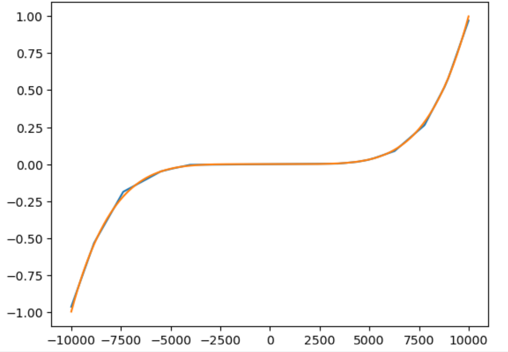

# BaseNN项目案例集

## 搭建卷积神经网络实现手写体图像分类

本案例来源于《人工智能初步》人教地图72页。

项目地址：[https://www.openinnolab.org.cn/pjlab/project?id=641d17e67c99492cf16d706f&sc=635638d69ed68060c638f979#public](https://www.openinnolab.org.cn/pjlab/project?id=641d17e67c99492cf16d706f&sc=635638d69ed68060c638f979#public)

#### 实现效果：


#### 实现步骤：

##### 1）网络搭建和模型训练

导入库：

```
# 导入BaseNN库
from BaseNN import nn
```

读取数据：

```
# 模型载入数据
model.load_img_data("/data/MELLBZ/mnist/training_set",color="grayscale",batch_size=10000)
```

搭建网络开始训练：

```
# 声明模型
model = nn()
# 自己搭建网络（我们搭建的是LeNet网络，可改变参数搭建自己的网络）
model.add('Conv2D', size=(1, 6),kernel_size=(5, 5), activation='ReLU') 
model.add('MaxPool', kernel_size=(2,2)) 
model.add('Conv2D', size=(6, 16), kernel_size=(5, 5), activation='ReLU')
model.add('MaxPool', kernel_size=(2,2)) 
model.add('Linear', size=(256, 120), activation='ReLU') 
model.add('Linear', size=(120, 84), activation='ReLU') 
model.add('Linear', size=(84, 10), activation='Softmax') 

# 模型超参数设置和网络训练
model.optimizer = 'Adam' #'SGD' , 'Adam' , 'Adagrad' , 'ASGD' 内置不同优化器
learn_rate = 0.001 #学习率
max_epoch = 100 # 最大迭代次数
model.save_fold = 'mn_ckpt' # 模型保存路径
model.train(lr=learn_rate, epochs=max_epoch) # 直接训练
```

##### 2）模型推理

读取某张图片进行推理：

```
# 单张图片的推理
path = 'test_IMG/single_data.jpg'
checkpoint = 'mn_ckpt/basenn.pth' # 现有模型路径
y_pred = model.inference(data=path, checkpoint=checkpoint)
model.print_result()

# 输出结果
res = y_pred.argmax(axis=1)
print('此手写体的数字是：',res[0])
```

定义一个准确率计算函数，读取测试集所有图片进行推理并计算准确率。

```
# 计算准确率函数
def cal_accuracy(y, pred_y):
    res = pred_y.argmax(axis=1)
    tp = np.array(y)==np.array(res)
    acc = np.sum(tp)/ y.shape[0]
    return acc

import torch
from BaseNN import nn
import numpy as np
# 推理验证集
m = nn()
val_data = m.load_img_data('/data/MELLBZ/mnist/val_set',color="grayscale",batch_size=20000)
checkpoint_path = 'mn_ckpt/basenn.pth' # 载入模型

for x, y in val_data:
    res = m.inference(x, checkpoint=checkpoint_path)
    acc=cal_accuracy(y,res)
    print('验证集准确率: {:.2f}%'.format(100.0 * acc))
```


## 一维卷积神经网络文本情感识别

本案例来源于《人工智能初步》人教地图版72-76页。

项目地址：[https://www.openinnolab.org.cn/pjlab/project?id=638d8bd8be5e9c6ce28ad033&sc=635638d69ed68060c638f979#public](https://www.openinnolab.org.cn/pjlab/project?id=638d8bd8be5e9c6ce28ad033&sc=635638d69ed68060c638f979#public)

#### 项目核心功能：

完成了搭建一维卷积神经网络实现文本感情识别分类，代码使用BaseNN库实现，同时结合了Embedding层对单词文本进行向量化。

数据集是imdb电影评论和情感分类数据集，来自斯坦福AI实验室平台，[http://ai.stanford.edu/~amaas/data/sentiment/](http://ai.stanford.edu/~amaas/data/sentiment/)。

**注意**：新版本BaseNN（>==0.1.6）已不支持项目中部分代码的写法或，如添加Embedding层。可模仿下列代码进行

#### 实现步骤：

##### 1）网络搭建和模型训练

导入库：

```
# 导入BaseNN库、numpy库用于数据处理
from BaseNN import nn
import numpy as np
```

读取数据并载入：

```
# 读取训练集数据
train_data = np.loadtxt('imdb/train_data.csv', delimiter=",")
train_label = np.loadtxt('imdb/train_label.csv', delimiter=",")
# 模型载入数据
model.load_dataset(train_data, train_label) 
```

搭建模型并开始训练：

```
# 声明模型
model = nn() # 有Embedding层
# 搭建模型
model.add('Embedding', vocab_size = 10000, embedding_dim = 32)  # Embedding层，对实现文本任务十分重要，将one-hot编码转化为相关向量 输入大小（batch_size,512）输出大小（batch_size,32,510）
model.add('conv1d', size=(32, 32),kernel_size=3, activation='relu') #一维卷积 输入大小（batch_size,32,510） 输出大小（batch_size,32,508）
model.add('conv1d', size=(32, 64),kernel_size=3, activation='relu') #一维卷积 输入大小（batch_size,32,508） 输出大小（batch_size,64,506）
model.add('mean') #全局池化 输入大小（batch_size,64,508）输出大小（batch_size,64）
model.add('linear', size=(64, 128), activation='relu') #全连接层 输入大小（batch_size,64）输出大小（batch_size,128）
model.add('linear', size=(128, 2), activation='softmax') #全连接层 输入大小（batch_size,128）输出大小（batch_size,2）

# 模型超参数设置和网络训练（训练时间较长, 可调整最大迭代次数减少训练时间）
model.add(optimizer='Adam') #'SGD' , 'Adam' , 'Adagrad' , 'ASGD' 内置不同优化器
learn_rate = 0.001 #学习率
max_epoch = 150 # 最大迭代次数
model.save_fold = 'mn_ckpt' # 模型保存路径
checkpoint = 'mn_ckpt/cov_basenn.pkl' 
model.train(lr=learn_rate, epochs=max_epoch) # 直接训练
```

##### 2）模型推理

读取测试集所有数据进行推理：

```
#读取测试集数据
test_data = np.loadtxt('imdb/test_data.csv', delimiter=",")
test_label = np.loadtxt('imdb/test_label.csv', delimiter=",")
y_pred = model.inference(data=train_data)
```

用单个数据进行推理：

```
# 用测试集单个数据查看模型效果
single_data = np.loadtxt('imdb/test_data.csv', delimiter=",", max_rows = 1)
single_label = np.loadtxt('imdb/test_label.csv', delimiter=",", max_rows = 1)
label = ['差评','好评']
single_data = single_data.reshape(1,512) 
res = model.inference(data=single_data)
res = res.argmax(axis=1)
print('评论对电影的评价是：', label[res[0]]) # 该评论文本数据可见single_data.txt
```


## 用神经网络计算前方障碍物方向

本案例是一个跨学科项目，用神经网络来拟合三角函数。案例发表于2023年的《中国信息技术教育》杂志。

项目地址：[https://www.openinnolab.org.cn/pjlab/project?id=6444992a06618727bed5a67c&backpath=/pjlab/projects/list#public](https://www.openinnolab.org.cn/pjlab/project?id=6444992a06618727bed5a67c&backpath=/pjlab/projects/list#public)

#### 项目核心功能：

用两个超声波传感器测量前方的障碍物距离，然后计算出障碍物所在的方向。这是一个跨学科项目，用神经网络来拟合三角函数。训练一个可以通过距离计算出坐标的神经网络模型，掌握使用BaseNN库搭建神经网络完成“回归”任务的流程。

#### 实现步骤：

##### 1）数据采集

我们有多种方式来采集数据。第一种是最真实的，即在障碍物和中点之间拉一条 线，然后读取两个超声波传感器的数据，同时测量角度并记录。另一种是拉三条线， 因为超声波传感器的数值和真实长度误差是很小的。 当然，因为这一角度是可以用三角函数计算的，那么最方面的数据采集方式莫过于是用Python写一段代码，然后将一组数据输出到CSV 文件中。或者使用Excel的公式来计算，再导出关键数据，如图所示。


##### 2）数据预处理

首先读取数据，0-2为输入，3-9是各种输出的数据。

```
import numpy as np
train_path = './data/train-full.csv'
x = np.loadtxt(train_path, dtype=float, delimiter=',',skiprows=1,usecols=[0,1,2]) # 读取前3列
y = np.loadtxt(train_path, dtype=float, delimiter=',',skiprows=1,usecols=[8]) # 读取9列
```

将y映射到0-1之间。

```
from sklearn.preprocessing import MinMaxScaler
y = y.reshape(-1, 1)
scaler = MinMaxScaler()
scaler.fit(y)
y = scaler.transform(y)  # 0~1
```

生成新的数据集。

```
norm_data = np.concatenate((x,y),axis=1)
np.savetxt('./data/train_norm.csv',norm_data,delimiter=',')
```

##### 3）网络搭建和模型训练

搭建一个3层的神经网络并开始训练，输入维度是3（3列数据），最后输出维度是1（1列数据），激活函数使用ReLU。

```
from BaseNN import nn
model = nn('reg') #声明模型 
model.load_tab_data('./data/train_norm.csv',batch_size=1024) # 载入数据
model.add('Linear', size=(3, 60),activation='ReLU')  
model.add('Linear', size=(60, 6), activation='ReLU') 
model.add('Linear', size=(6, 1))
model.add(optimizer='Adam')

# 设置模型保存的路径
model.save_fold = 'checkpoints/ckpt'
# 模型训练
model.train(lr=0.001, epochs=300,loss='MSELoss') 
```

##### 4）模型推理

读取测试数据进行模型推理，测试数据同样来自随机数。

```
# 测试数据
test_path = './data/test-full.csv'
test_x = np.loadtxt(test_path, dtype=float, delimiter=',',skiprows=1,usecols=[0,1,2]) # 读取前3列
test_y = np.loadtxt(test_path, dtype=float, delimiter=',',skiprows=1,usecols=[8]) # 读取第9列
y_pred = model.inference(test_x,checkpoint = 'checkpoints/ckpt/basenn.pth')  # 对该数据进行预测
```

## 用BaseNN搭建神经网络拟合多项式

本案例实现用BaseNN搭建神经网络拟合多项式，使用神经网络来拟合简单的多项式函数是学习和理解神经网络工作原理的一个很好的入门方式。这个过程涉及到数据的处理、模型的构建、损失函数的应用、优化算法的使用等，这些都是深度学习的基本组成部分。

项目地址：[https://openinnolab.org.cn/pjlab/project?id=6576e6928474f83270a08310&sc=635638d69ed68060c638f979#public](https://openinnolab.org.cn/pjlab/project?id=6576e6928474f83270a08310&sc=635638d69ed68060c638f979#public)

#### 项目核心功能：

用自动生成的多项式数据训练一个可以拟合多项式的神经网络模型，掌握使用BaseNN库搭建神经网络完成“回归”任务的流程。

#### 实现步骤：

##### 1）数据准备

可以定义一个多项式函数（以五项式为例），生成数据。
如下代码还向五次多项式函数生成的数据点添加高斯噪声，可以模拟现实世界中可能遇到的数据不准确性。这种方法特别适合于准备数据，用于训练机器学习模型，以确保它们在面对实际、可能带有噪声的数据时仍能有效工作。

```
import numpy as np

# 定义五项式函数
def quintic_polynomial(x, a=1, b=0, c=0, d=0, e=0, f=0):
    return a * x**5 + b * x**4 + c * x**3 + d * x**2 + e * x + f

# 生成数据点
x = np.linspace(-10000, 10000, 10000, dtype=np.float32)  # 生成 -10000 到 10000 之间的 10000 个点，确保生成的数据是 float32 类型
a, b, c, d, e, f = 1, 13, 35, -85, -216, 252 # 设置系数
y = quintic_polynomial(x, a, b, c, d, e, f)
noise = np.random.normal(0, 2, y.shape).astype(np.float32)  # 将噪声转换为 float32 类型
y_noisy = y + noise

# 调整数据形状以适应神经网络
x = x.reshape(-1, 1)
y_noisy = y_noisy.reshape(-1, 1)
```

将生成的数据保存在一个csv中，且给它加入表头，完成数据集制作。

```
data = np.concatenate((x,y_noisy),axis=1)
# 定义标题行，列之间用逗号分隔
header = 'feature,pred'
np.savetxt('data/data.csv',data,delimiter=',', header=header, comments='')
```

##### 2）数据预处理

为了加速收敛，我们参照已有经验将x和y映射到0-1之间。

```
from sklearn.preprocessing import MinMaxScaler
scaler = MinMaxScaler() # 创建MinMaxScaler实例
y_noisy = scaler.fit_transform(y_noisy) # 将y_noisy拟合并转换到0-1范围
scaler2 = MinMaxScaler() # 创建MinMaxScaler实例
x = scaler2.fit_transform(x) # 将x拟合并转换到0-1范围
```

保存为新的csv。

```
norm_data = np.concatenate((x,y_noisy),axis=1)
# 定义标题行，列之间用逗号分隔
header = 'feature,pred'
np.savetxt('data/norm_data.csv',norm_data,delimiter=',', header=header, comments='')
```

训练模型前，一般建议划分数据集为训练集、验证集，我们可以借助BaseDT库完成数据集按照一定比例的随机划分。

```
from BaseDT.dataset import split_tab_dataset
path = "data/norm_data.csv"
tx,ty,val_x,val_y = split_tab_dataset(path,data_column=0,label_column=1)
```

##### 3）网络搭建和模型训练

搭建一个3层的神经网络并开始训练，输入维度是1（1列数据），最后输出维度是1（1列数据），激活函数使用ReLU。

```
# 导入库
from BaseNN import nn
# 声明模型，选择回归任务
model = nn('reg') 
model.load_tab_data('data/norm_data_train.csv',batch_size=1024) # 载入数据
model.add('Linear', size=(1, 60),activation='ReLU')  
model.add('Linear', size=(60, 6), activation='ReLU') 
model.add('Linear', size=(6, 1))
model.add(optimizer='Adam')
# 设置模型保存的路径
model.save_fold = 'checkpoints/ckpt'
model.train(lr=0.01, epochs=500,loss='MSELoss') # 训练
```

##### 4）模型推理

读取验证集数据进行模型推理。

```
import numpy as np
# 读取验证集
val_path = 'data/norm_data_val.csv'
val_x = np.loadtxt(val_path, dtype=float, delimiter=',',skiprows=1,usecols=0) # 读取特征列
val_y = np.loadtxt(val_path, dtype=float, delimiter=',',skiprows=1,usecols=1) # 读取预测值列

# 导入库
from BaseNN import nn
# 声明模型
model = nn('reg') 
y_pred = model.inference(val_x,checkpoint = 'checkpoints/ckpt/basenn.pth')  # 对该数据进行预测
```

借助matplotlib绘图将预测值 (y_pred) 和实际值 (val_y) 与 val_x 的值进行对比，效果是相当不错的。

先将x和y从标准化的状态恢复到它们原始的比例和值，使用和预处理时一样的方式，scaler和scaler2均调用数据预处理时的。

```
y_pred = scaler.inverse_transform(y_pred)
val_y = scaler.inverse_transform(val_y.reshape(-1, 1))
val_x = scaler2.inverse_transform(val_x.reshape(-1, 1))
```

```
import matplotlib.pyplot as plt
import operator

# 将val_x,val_y,y_pred 根据val_x的顺序排序
L = sorted(zip(val_x,val_y,y_pred), key=operator.itemgetter(0))
val_x, val_y,y_pred = zip(*L)

plt.plot(val_x,y_pred, label='pred')
plt.plot(val_x,val_y, label='val')

plt.show()
```



## 用BaseNN搭建ResNet18网络实现MNIST手写体数字分类

本项目展示用BaseNN搭建ResNet18网络，以MNIST手写体数字分类为任务，使用BaseNN完成ResNet18网络搭建并基于手写体数据集训练一个手写数字分类模型，通过模型测试效果不错。希望借此项目您能掌握使用BaseNN搭建ResNet18网络的方法，能举一反三搭建ResNet34、ResNet580等，也能更换数据集训练其他模型。

项目地址：[https://openinnolab.org.cn/pjlab/project?id=659ba9b3a731f07a4896af46&backpath=/pjedu/userprofile?slideKey=project#public](https://openinnolab.org.cn/pjlab/project?id=659ba9b3a731f07a4896af46&backpath=/pjedu/userprofile?slideKey=project#public)

#### 项目核心功能：

BaseNN是XEdu系列工具的重要组成部分，延续了MMEdu极简的训练流程和风格，聚焦于基础原理的探究和模型的快速应用。BaseNN可以自由地构建神经网路，调整神经元的个数、层数、激活方式等，学生可以轻松探究神经网络原理和模型训练之中的奥秘。使用BaseNN可以轻易地创建深度学习模型。不同类型的神经网络适用于不同类型的问题，比如CNN通常用于处理图像问题，RNN通常用于处理序列问题，全连接神经网络可以应用于各种问题。同时，使用BaseNN也能完成一些相对复杂的神经网络的搭建，如ResNet，同样也是支持的，首先需在卷积层新增两个参数的设置，分别是步长stride和填充padding，同时增加残差模块的设置。

#### 实现步骤：

##### 1）导入库

```
# 导入库
from BaseNN import nn
```

##### 2）搭建模型

```
#声明模型 
model = nn() 

# 搭建ResNet18网络(参照论文完成)，要求输入数据的尺寸为（224,224）
model.add('Conv2D', size=(3, 64), kernel_size=(7, 7),stride=2,padding=3, activation='ReLU') #(32,64,112,112)
model.add('BatchNorm2d', size=64) # (32,64,112,112)
model.add('MaxPool', kernel_size=(3,3),stride=2,padding=1) # (32,64,56,56)

model.add('Res_Block', size=(64, 64), num_blocks=2,stride=1) # (32,64,56,56)
model.add('Res_Block', size=(64, 128), num_blocks=2,stride=2) # (32,128,28,28)
model.add('Res_Block', size=(128, 256), num_blocks=2,stride=2) # (32,256,14,14)
model.add('Res_Block', size=(256, 512), num_blocks=2,stride=2) # (32,512,7,7)

model.add('AvgPool', kernel_size=(7,7)) # (32,512)
model.add('Linear', size=(512, 10), activation='Softmax') # (32,10)
```

##### 3）载入数据

载入前需对数据做预处理，载入图片数据前如需对图像数据集进行预处理，例如做尺寸调整，可先使用torchvision对图片数据集进行预处理再载入模型进行训练。此处我们需将图片做尺寸调整（调整为224,224）
参考代码如下，注意涉及数万张图片，需等待几分钟。

```
from torchvision.transforms import transforms
# 对数据集做尺寸调整
tran = transforms.Resize([224,224])
# 模型载入数据
model.load_img_data("/data/MELLBZ/mnist/training_set",
                            batch_size=32,transform=tran,num_workers=1)
```

##### 4）设置超参数并训练模型

```
model.add(optimizer='SGD')
model.save_fold = 'new_mn_ckpt'

model.train(lr=0.01, epochs=1) # 直接训练
```

可以发现虽然训练很慢，但是可以发现仅需1轮Accuracy便提升显著，最后直接到1（即100%准确率）。
主要原因是手写数字识别通常是深度学习中的一个相对简单的任务，尤其是对于像ResNet18这样的先进模型来说。因此，即使是少量的训练，模型也能迅速学习到有效的特征来区分不同的数字。且ResNet18是一个相对复杂的网络，拥有较强的特征提取能力。对于简单的数据集来说，它可能会很快学会区分各类别。

##### 5）模型测试

可指定新的图片进行模型测试，注意需先将图片进行尺寸调整（训练时也做了）。

```
import cv2

# 指定一张图片
path =  'test_IMG/single_data.jpg'
# 读取图片
img = cv2.imread(path)
# 对图片进行尺寸调整
img = cv2.resize(img,(224,224))
# 指定模型
checkpoint = 'new_mn_ckpt/basenn.pth' 
# 模型推理
y_pred = model.inference(data=path, checkpoint=checkpoint)
model.print_result()

# 输出结果
res = y_pred.argmax(axis=1)
print('此手写体的数字是：',res[0])xxxxxxxxxx import cv2# 指定一张图片path =  'test_IMG/single_data.jpg'# 读取图片img = cv2.imread(path)# 对图片进行尺寸调整img = cv2.resize(img,(224,224))# 指定模型checkpoint = 'new_mn_ckpt/basenn.pth' # 模型推理y_pred = model.inference(data=path, checkpoint=checkpoint)model.print_result()# 输出结果res = y_pred.argmax(axis=1)print('此手写体的数字是：',res[0])model.add(optimizer='SGD')model.save_fold = 'new_mn_ckpt'model.train(lr=0.01, epochs=1) # 直接训练
```
