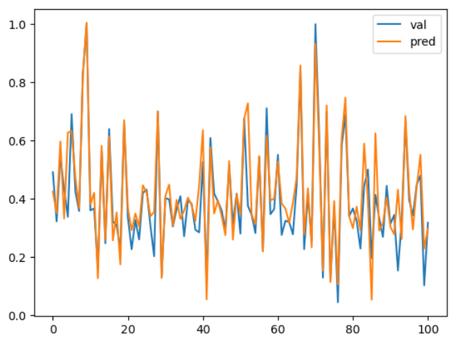

# 快速体验BaseNN，开始！

## 简介

BaseNN可以方便地逐层搭建神经网络，深入探究神经网络的原理。

## 安装

`pip install basenn` 或 `pip install BaseNN`

更新库文件：`pip install --upgrade BaseNN`

库文件源代码可以从[PyPi](https://pypi.org/project/BaseNN/#files)下载，选择tar.gz格式下载，可用常见解压软件查看源码。


## 体验

运行demo/BaseNN_demo.py。

可以在命令行输入BaseNN查看安装的路径，在安装路径内，可以查看提供的更多demo案例。同时可查看附录。

如果在使用中出现类似报错：`**AttributeError**: partially initialized module 'cv2' has no attribute 'gapi_wip_gst_GStreamerPipeline' (most likely due to a circular import)` 

可尝试通过运行`pip install --upgrade opencv-python`解决

## 第一个BaseNN项目：搭建全连接神经网络训练鸢尾花分类模型

### 第0步 引入包

```python
# 导入BaseNN库
from BaseNN import nn
```

### 第1步 声明模型

```python
model = nn('cls')
```

### 第2步 载入数据

直接使用`load_tab_data`方法载入鸢尾花数据集，该数据集包含150个数据样本，分为3类（Versicolour鸢尾花、Setosa鸢尾花和Virginica鸢尾花），每类50个数据，每个数据包含4个属性（花萼长度、花萼宽度、花瓣长度和花瓣宽度）。

```python
train_path = 'data/iris_training.csv'
model.load_tab_data(train_path, batch_size=120)
```

### 第3步 搭建模型

逐层添加，搭建起模型结构。注释标明了数据经过各层的维度变化。此处我们搭建的是一个输入维度为4，输出维度为3，隐藏层数量为2的全连接神经网络。输入维度4与鸢尾花数据集的特征维度对应，输出3与类别数量对应。

```python
model.add(layer='linear',size=(4, 10),activation='relu') # [120, 10]
model.add(layer='linear',size=(10, 5), activation='relu') # [120, 5]
model.add(layer='linear', size=(5, 3), activation='softmax') # [120, 3]
```

以上使用`add()`方法添加层，参数`layer='linear'`表示添加的层是线性层，`size=(4,10)`表示该层输入维度为4，输出维度为10，`activation='relu'`表示使用ReLU激活函数。

### 第4步 模型训练

设置好模型保存的路径，使用`train`开始训练，需要设置学习率lr和轮次epochs。

```python
# 设置模型保存的路径
model.save_fold = 'checkpoints/iris_ckpt'
# 模型训练
model.train(lr=0.01, epochs=1000)
```

也可以使用继续训练：

```python
checkpoint = 'checkpoints/basenn.pth'
model.train(lr=0.01, epochs=1000, checkpoint=checkpoint)
```

参数`lr`为学习率， `epochs`为训练轮数，`checkpoint`为现有模型路径，当使用`checkpoint`参数时，模型基于一个已有的模型继续训练，不使用`checkpoint`参数时，模型从零开始训练。

### 第5步 模型测试

可以直接用测试数据查看模型效果。

读取数据。

```python
# 用测试数据查看模型效果
model2 = nn('cls')
test_path = 'data/iris_test.csv'
test_x = np.loadtxt(test_path, dtype=float, delimiter=',',skiprows=1,usecols=range(0,4)) 
# 获取最后一列的真实值
test_y = np.loadtxt(test_path, dtype=float, delimiter=',',skiprows=1,usecols=4) 
```

模型推理并定义一个计算分类正确率的函数计算测试集上准确率。

```python
res = model2.inference(test_x, checkpoint="checkpoints/iris_ckpt/basenn.pth")
model2.print_result(res)

# 定义一个计算分类正确率的函数
def cal_accuracy(y, pred_y):
    res = pred_y.argmax(axis=1)
    tp = np.array(y)==np.array(res)
    acc = np.sum(tp)/ y.shape[0]
    return acc

# 计算分类正确率
print("分类正确率为：",cal_accuracy(test_y, res))
```

用某组测试数据查看模型效果。

```python
# 用某组测试数据查看模型效果
data = [test_x[0]]
checkpoint = 'checkpoints/iris_ckpt/basenn.pth'
res = model.inference(data=data, checkpoint=checkpoint)
model.print_result(res) # 输出字典格式结果
```

参数`data`为待推理的测试数据数据，该参数必须传入值；

`checkpoint`为已有模型路径，即使用现有的模型进行推理。

## 快速体验

体验BaseNN的最快速方式是通过OpenInnoLab平台。

OpenInnoLab平台为上海人工智能实验室推出的青少年AI学习平台，满足青少年的AI学习和创作需求，支持在线编程。在“项目”中查看更多，搜索”BaseNN“，即可找到所有与BaseNN相关的体验项目。

AI项目工坊：[https://www.openinnolab.org.cn/pjlab/projects/list?backpath=/pjlab/ai/projects](https://www.openinnolab.org.cn/pjlab/projects/list?backpath=/pjlab/ai/projects)

（用Chrome浏览器打开效果最佳）

用BaseNN库搭建搭建鸢尾花分类模型项目地址：[https://www.openinnolab.org.cn/pjlab/project?id=641bc2359c0eb14f22fdbbb1&sc=635638d69ed68060c638f979#public](https://www.openinnolab.org.cn/pjlab/project?id=641bc2359c0eb14f22fdbbb1&sc=635638d69ed68060c638f979#public)

## 挑战使用BaseNN完成第一个回归项目：房价预测

Boston Housing Dataset（波士顿房价数据集）是一个著名的数据集，经常用于机器学习和统计分析中。该数据集包含波士顿郊区房屋的各种信息，包括房价和与房价可能相关的各种属性。选择了四个与房价关系较大的特征：RM (每栋住宅的平均房间数)、LSTAT (人口中较低地位的百分比)、PTRATIO (师生比例)、NOX (一氧化氮浓度) 。进行数据预处理后生成了已提取出只有这四列特征和预测值且做了归一化处理的训练集（house_price_data_norm_train.csv）、验证集（house_price_data_norm_val.csv），搭建模型进行训练，数据预处理的代码可参考原项目。

项目地址：

[https://www.openinnolab.org.cn/pjlab/project?id=656d99e87e42e551fa5f89bd&sc=62f34141bf4f550f3e926e0e#public](https://www.openinnolab.org.cn/pjlab/project?id=656d99e87e42e551fa5f89bd&sc=62f34141bf4f550f3e926e0e#public)

（用Chrome浏览器打开效果最佳）

### 第0步 引入包

```python
# 导入库
from BaseNN import nn
```

### 第1步 声明模型

```python
# 声明模型，选择回归任务
model = nn('reg') 
```

### 第2步 载入数据

```python
model.load_tab_data('house_price_data_norm_train.csv',batch_size=1024) # 载入数据
```

注：载入的数据集是做归一化之后并完成数据拆分的训练集。原项目中涉及数据归一化处理的步骤，使用sklearn.preprocessing的MinMaxScaler类，将每个特征缩放到给定的范围（在您的案例中是0到1），这是通过将最小值映射到0，最大值映射到1来实现的。对于中间的值，它们根据最大和最小值线性地缩放。

### 第3步 搭建一个3层的全连接神经网络

逐层添加，此处我们搭建的是一个输入维度为4，输出维度为1，隐藏层数量为2的全连接神经网络。输入维度4与数据集的特征维度对应，在任务中，由于我们只预测一个目标值房价，则输出维度设定为 1。

```python
model.add('Linear', size=(4, 64),activation='ReLU')  
model.add('Linear', size=(64, 4), activation='ReLU') 
model.add('Linear', size=(4, 1))
model.add(optimizer='Adam')
```

### 第4步 模型训练

```python
# 设置模型保存的路径
model.save_fold = 'checkpoints/ckpt'
model.train(lr=0.008, epochs=5000,loss='MSELoss') # 训练
```

### 第5步 模型测试

此步骤可以借助验证集完成。

读取数据。

```python
import numpy as np
# 读取验证集
val_path = 'house_price_data_norm_val.csv'
val_x = np.loadtxt(val_path, dtype=float, delimiter=',',skiprows=1,usecols=range(0,4)) # 读取特征列
val_y = np.loadtxt(val_path, dtype=float, delimiter=',',skiprows=1,usecols=4) # 读取预测值列
```

对验证集完成模型推理。

```python
# 导入库
from BaseNN import nn
# 声明模型
model = nn('reg') 
y_pred = model.inference(val_x,checkpoint = 'checkpoints/ckpt2/basenn.pth')  # 对该数据进行预测
```

绘制曲线图。

```python
# 绘制真实数据和预测比较曲线
import matplotlib.pyplot as plt
plt.plot(val_y, label='val')
plt.plot(y_pred, label='pred')
plt.legend()
plt.show()
```

对比输出，查看回归的效果，觉得效果还是很不错的。



### 第6步 模型应用

最后，可将模型应用于推理新数据。输入一组新的数据进行模型推理，需先完成数据处理，涉及的数据处理的代码会较长，此处是为了应用之前在训练集 (x) 上通过 fit_transform 方法学习到的scaler来转换 val_x。这确保了数据的一致性，因为对于模型来说，重要的是以相同的方式缩放训练数据和验证/测试数据。

```python
# 导入库
from BaseNN import nn
# 声明模型
model = nn('reg') 
# 输入一组数据
data = [[4,5,20,2]]
# 数据预处理
from sklearn.preprocessing import MinMaxScaler
import numpy as np
train_path = 'data/house-price-data.csv'
x = np.loadtxt(train_path, dtype=float, delimiter=',',skiprows=1,usecols=[4,5,10,12]) # 读取特征列
scaler = MinMaxScaler() # 创建MinMaxScaler实例
x = scaler.fit_transform(x) # 将训练集的特征x拟合并转换到0-1范围并获取scaler
data = scaler.transform(data)

# 模型推理
y_pred = model.inference(data,checkpoint = 'checkpoints/ckpt2/basenn.pth')  # 对该数据进行预测
#输出预测
print('我的房价预测结果是：',y_pred[0][0],'（单位：千美元）')
```


## 挑战使用BaseNN完成第一个自然语言处理项目：自动写诗机

### 第0步 引入包

```python
# 导入BaseNN库、numpy库，numpy库用于数据处理
from BaseNN import nn
import numpy as np
```

### 第1步 声明模型

```python
model = nn('cls')
```

### 第2步 载入数据

[tangccc.npz](https://download.openxlab.org.cn/models/yikshing/bash/weight/tangccc)是本项目的文本数据，源于互联网，包括57580首唐诗。npz是一种用于存储NumPy数组数据的文件格式。

npz文件是一种方便的方式来保存和加载NumPy数组，通常用于在不同的Python程序之间或不同的计算环境中共享数据。

在该项目中可以使用`load_npz_data()`方法直接读取npz格式的数据到模型中

```python
model.load_npz_data('tangccc.npz')
```

### 第3步 搭建LSTM模型

搭建模型只需加入em_lstm层即可，其他层会自适应补充，其中num_layers参数为循环神经网络循环的次数。

em_LSTM由包括embedding层，LSTM层和线性层组成，因为有embedding层的加入，所以em_LSTM可以专门处理文本数据。

```python
model.add('em_lstm', size=(128,256),num_layers=2) 
```

### 第4步 模型训练

为了节省训练时间，可以选择继续训练。

```python
checkpoint = 'model.pth'
model.save_fold = 'checkpoints'
model.train(lr=0.005, epochs=1,batch_size=16, checkpoint=checkpoint)
```

### 第5步 模型测试

可以输入一个字输出下一个字。

```python
input = '长'
checkpoint = 'model.pth'
result = model.inference(data=input,checkpoint=checkpoint) # output是多维向量，接下来转化为汉字
output = result[0]
print("output: ",output)
index = np.argmax(output) # 找到概率最大的字的索引
w = model.ix2word[index] # 根据索引从词表中找到字
print("word:",w)
```

### 拓展

可以使用训练好的模型生成唐诗，生成藏头诗，做各种有意思的应用。

更多内容详见用BaseNN实现自动写诗机项目，项目地址：[https://www.openinnolab.org.cn/pjlab/project?id=641c00bbba932064ea962783&sc=635638d69ed68060c638f979#public](https://www.openinnolab.org.cn/pjlab/project?id=641c00bbba932064ea962783&sc=635638d69ed68060c638f979#public)

更多案例详见[下文](https://xedu.readthedocs.io/zh-cn/master/basenn/projects.html)。
