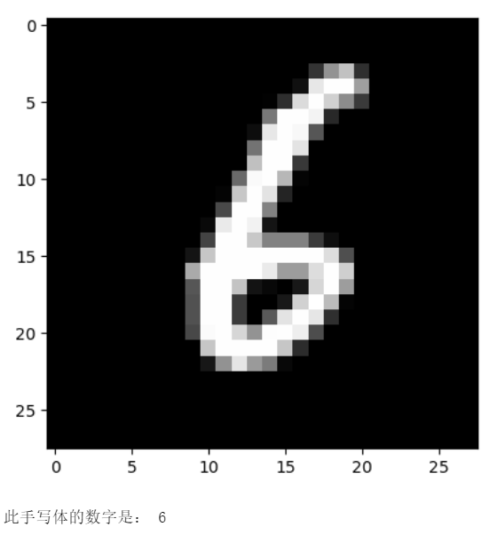

快速体验BaseNN，开始！
======================

简介
----

BaseNN可以方便地逐层搭建神经网路，深入探究网络原理。

安装
----

``pip install basenn`` 或 ``pip install BaseNN``

更新库文件：\ ``pip install --upgrade BaseNN``

体验
----

运行demo/BaseNN_demo.py。

可以在命令行输入BaseNN查看安装的路径，在安装路径内，可以查看提供的更多demo案例。同时可查看附录。

第一个BaseNN项目：搭建搭建鸢尾花分类模型
----------------------------------------

第0步 引入包
~~~~~~~~~~~~

.. code:: python

   # 导入BaseNN库、numpy库，numpy库用于数据处理
   from BaseNN import nn
   import numpy as np

第1步 声明模型
~~~~~~~~~~~~~~

.. code:: python

   model = nn()

第2步 载入数据
~~~~~~~~~~~~~~

.. code:: python

   train_path = 'data/iris_training.csv'
   model.load_tab_data(train_path, batch_size=120)

第3步 搭建模型
~~~~~~~~~~~~~~

逐层添加，搭建起模型结构。注释标明了数据经过各层的尺寸变化。

.. code:: python

   model.add(layer='linear',size=(4, 10),activation='relu') # [120, 10]
   model.add(layer='linear',size=(10, 5), activation='relu') # [120, 5]
   model.add(layer='linear', size=(5, 3), activation='softmax') # [120, 3]

以上使用\ ``add()``\ 方法添加层，参数\ ``layer='linear'``\ 表示添加的层是线性层，\ ``size=(4,10)``\ 表示该层输入维度为4，输出维度为10，\ ``activation='relu'``\ 表示使用ReLU激活函数。

第4步 模型训练
~~~~~~~~~~~~~~

模型训练可以采用以下函数：

.. code:: python

   # 设置模型保存的路径
   model.save_fold = 'checkpoints/iris_ckpt'
   # 模型训练
   model.train(lr=0.01, epochs=1000)

也可以使用继续训练：

::

   checkpoint = 'checkpoints/basenn.pth'
   model.train(lr=0.01, epochs=1000, checkpoint=checkpoint)

参数\ ``lr``\ 为学习率，
``epochs``\ 为训练轮数，\ ``checkpoint``\ 为现有模型路径，当使用\ ``checkpoint``\ 参数时，模型基于一个已有的模型继续训练，不使用\ ``checkpoint``\ 参数时，模型从零开始训练。

第5步 模型测试
~~~~~~~~~~~~~~

用测试数据查看模型效果。

.. code:: python

   # 用测试数据查看模型效果
   model2 = nn()
   test_path = 'data/iris_test.csv'
   test_x = np.loadtxt(test_path, dtype=float, delimiter=',',skiprows=1,usecols=range(0,4)) 
   res = model2.inference(test_x, checkpoint="checkpoints/iris_ckpt/basenn.pth")
   model2.print_result(res)

   # 获取最后一列的真实值
   test_y = np.loadtxt(test_path, dtype=float, delimiter=',',skiprows=1,usecols=4) 
   # 定义一个计算分类正确率的函数
   def cal_accuracy(y, pred_y):
       res = pred_y.argmax(axis=1)
       tp = np.array(y)==np.array(res)
       acc = np.sum(tp)/ y.shape[0]
       return acc

   # 计算分类正确率
   print("分类正确率为：",cal_accuracy(test_y, res))

用某组测试数据查看模型效果。

.. code:: python

   # 用某组测试数据查看模型效果
   data = np.array([test_x[0]])
   checkpoint = 'checkpoints/iris_ckpt/basenn.pth'
   res = model.inference(data=data, checkpoint=checkpoint)
   model.print_result(res) # 输出字典格式结果

参数\ ``data``\ 为待推理的测试数据数据，该参数必须传入值；

``checkpoint``\ 为已有模型路径，即使用现有的模型进行推理。

快速体验
--------

体验BaseNN的最快速方式是通过OpenInnoLab平台。

OpenInnoLab平台为上海人工智能实验室推出的青少年AI学习平台，满足青少年的AI学习和创作需求，支持在线编程。在“项目”中查看更多，搜索”BaseNN“，即可找到所有与BaseNN相关的体验项目。

AI项目工坊：https://www.openinnolab.org.cn/pjlab/projects/list?backpath=/pjlab/ai/projects

（用Chrome浏览器打开效果最佳）

用BaseNN库搭建搭建鸢尾花分类模型项目地址：https://www.openinnolab.org.cn/pjlab/project?id=641bc2359c0eb14f22fdbbb1&sc=635638d69ed68060c638f979#public

挑战使用BaseNN完成第一个自然语言处理项目：自动写诗机
----------------------------------------------------

.. _第0步-引入包-1:

第0步 引入包
~~~~~~~~~~~~

.. code:: python

   # 导入BaseNN库、numpy库，numpy库用于数据处理
   from BaseNN import nn
   import numpy as np

.. _第1步-声明模型-1:

第1步 声明模型
~~~~~~~~~~~~~~

.. code:: python

   model = nn()

.. _第2步-载入数据-1:

第2步 载入数据
~~~~~~~~~~~~~~

tang.npz是本项目的文本数据，源于互联网，包括57580首唐诗。

::

   datas = np.load('tang.npz',allow_pickle=True)
   data = datas['data'] 
   print("第一条数据：",data[0]) # 观察第一条数据
   word2idx = datas['word2ix'].item() # 汉字对应的索引
   print("词表:",word2idx) 
   idx2word = datas['ix2word'].item() # 索引对应的汉字
   x, y = data[:,:-1], data[:, 1:]

   model.load_dataset(x, y, word2idx=word2idx) # 载入数据

第3步 搭建LSTM模型
~~~~~~~~~~~~~~~~~~

搭建模型只需加入lstm层即可，其他层会自适应补充，其中num_layers参数为循环神经网络循环的次数。

::

   model.add('lstm', size=(128,256),num_layers=2) 

.. _第4步-模型训练-1:

第4步 模型训练
~~~~~~~~~~~~~~

为了节省训练时间，可以选择继续训练。

::

   checkpoint = 'model.pth'
   model.save_fold = 'checkpoints'
   model.train(lr=0.005, epochs=1,batch_size=16, checkpoint=checkpoint)

.. _第5步-模型测试-1:

第5步 模型测试
~~~~~~~~~~~~~~

可以输入一个字输出下一个字。

::

   input = '长'
   checkpoint = 'model.pth'
   result = model.inference(data=input,checkpoint=checkpoint) # output是多维向量，接下来转化为汉字
   output = result[0]
   print("output: ",output)
   index = np.argmax(output) # 找到概率最大的字的索引
   w = model.ix2word[index] # 根据索引从词表中找到字
   print("word:",w)

拓展
~~~~

可以使用训练好的模型生成唐诗，生成藏头诗，做各种有意思的应用。

更多内容详见用BaseNN实现自动写诗机项目，项目地址：https://www.openinnolab.org.cn/pjlab/project?id=641c00bbba932064ea962783&sc=635638d69ed68060c638f979#public

附录
----

体验案例1. 搭建卷积神经网络实现手写体分类
~~~~~~~~~~~~~~~~~~~~~~~~~~~~~~~~~~~~~~~~~

本案例来源于《人工智能初步》人教地图72页。

项目地址：https://www.openinnolab.org.cn/pjlab/project?id=641d17e67c99492cf16d706f&sc=635638d69ed68060c638f979#public

实现效果：

实现步骤：
^^^^^^^^^^

1）网络搭建和模型训练
'''''''''''''''''''''

导入库：

::

   # 导入BaseNN库
   from BaseNN import nn

读取数据：

::

   # 模型载入数据
   model.load_img_data("/data/MELLBZ/mnist/training_set",color="grayscale",batch_size=10000)

搭建网络开始训练：

::

   # 声明模型
   model = nn()
   # 自己搭建网络（我们搭建的是LeNet网络，可改变参数搭建自己的网络）
   model.add('Conv2D', size=(1, 6),kernel_size=(5, 5), activation='ReLU') 
   model.add('MaxPool', kernel_size=(2,2)) 
   model.add('Conv2D', size=(6, 16), kernel_size=(5, 5), activation='ReLU')
   model.add('MaxPool', kernel_size=(2,2)) 
   model.add('Linear', size=(256, 120), activation='ReLU') 
   model.add('Linear', size=(120, 84), activation='ReLU') 
   model.add('Linear', size=(84, 10), activation='Softmax') 

   # 模型超参数设置和网络训练
   model.optimizer = 'Adam' #'SGD' , 'Adam' , 'Adagrad' , 'ASGD' 内置不同优化器
   learn_rate = 0.001 #学习率
   max_epoch = 100 # 最大迭代次数
   model.save_fold = 'mn_ckpt' # 模型保存路径
   model.train(lr=learn_rate, epochs=max_epoch) # 直接训练

2）模型推理
'''''''''''

读取某张图片进行推理：

::

   # 单张图片的推理
   path = 'test_IMG/single_data.jpg'
   checkpoint = 'mn_ckpt/basenn.pth' # 现有模型路径
   y_pred = model.inference(data=path, checkpoint=checkpoint)
   model.print_result()

   # 输出结果
   res = y_pred.argmax(axis=1)
   print('此手写体的数字是：',res[0])

定义一个准确率计算函数，读取测试集所有图片进行推理并计算准确率。

::

   # 计算准确率函数
   def cal_accuracy(y, pred_y):
       res = pred_y.argmax(axis=1)
       tp = np.array(y)==np.array(res)
       acc = np.sum(tp)/ y.shape[0]
       return acc

   import torch
   from BaseNN import nn
   import numpy as np
   # 推理验证集
   m = nn()
   val_data = m.load_img_data('/data/MELLBZ/mnist/val_set',color="grayscale",batch_size=20000)
   checkpoint_path = 'mn_ckpt/basenn.pth' # 载入模型

   for x, y in val_data:
       res = m.inference(x, checkpoint=checkpoint_path)
       acc=cal_accuracy(y,res)
       print('验证集准确率: {:.2f}%'.format(100.0 * acc))

体验案例2. 一维卷积神经网络文本情感识别
~~~~~~~~~~~~~~~~~~~~~~~~~~~~~~~~~~~~~~~

本案例来源于《人工智能初步》人教地图版72-76页。

项目地址：https://www.openinnolab.org.cn/pjlab/project?id=638d8bd8be5e9c6ce28ad033&sc=635638d69ed68060c638f979#public

项目核心功能：
^^^^^^^^^^^^^^

完成了搭建一维卷积神经网络实现文本感情识别分类，代码使用BaseNN库实现，同时结合了Embedding层对单词文本进行向量化。

数据集是imdb电影评论和情感分类数据集，来自斯坦福AI实验室平台，http://ai.stanford.edu/~amaas/data/sentiment/。

.. _实现步骤-1:

实现步骤：
^^^^^^^^^^

.. _网络搭建和模型训练-1:

1）网络搭建和模型训练
'''''''''''''''''''''

导入库：

::

   # 导入BaseNN库、numpy库用于数据处理
   from BaseNN import nn
   import numpy as np

读取数据并载入：

::

   # 读取训练集数据
   train_data = np.loadtxt('imdb/train_data.csv', delimiter=",")
   train_label = np.loadtxt('imdb/train_label.csv', delimiter=",")
   # 模型载入数据
   model.load_dataset(train_data, train_label) 

搭建模型并开始训练：

::

   # 声明模型
   model = nn() # 有Embedding层
   # 搭建模型
   model.add('Embedding', vocab_size = 10000, embedding_dim = 32)  # Embedding层，对实现文本任务十分重要，将one-hot编码转化为相关向量 输入大小（batch_size,512）输出大小（batch_size,32,510）
   model.add('conv1d', size=(32, 32),kernel_size=3, activation='relu') #一维卷积 输入大小（batch_size,32,510） 输出大小（batch_size,32,508）
   model.add('conv1d', size=(32, 64),kernel_size=3, activation='relu') #一维卷积 输入大小（batch_size,32,508） 输出大小（batch_size,64,506）
   model.add('mean') #全局池化 输入大小（batch_size,64,508）输出大小（batch_size,64）
   model.add('linear', size=(64, 128), activation='relu') #全连接层 输入大小（batch_size,64）输出大小（batch_size,128）
   model.add('linear', size=(128, 2), activation='softmax') #全连接层 输入大小（batch_size,128）输出大小（batch_size,2）

   # 模型超参数设置和网络训练（训练时间较长, 可调整最大迭代次数减少训练时间）
   model.add(optimizer='Adam') #'SGD' , 'Adam' , 'Adagrad' , 'ASGD' 内置不同优化器
   learn_rate = 0.001 #学习率
   max_epoch = 150 # 最大迭代次数
   model.save_fold = 'mn_ckpt' # 模型保存路径
   checkpoint = 'mn_ckpt/cov_basenn.pkl' 
   model.train(lr=learn_rate, epochs=max_epoch) # 直接训练

.. _模型推理-1:

2）模型推理
'''''''''''

读取测试集所有数据进行推理：

::

   #读取测试集数据
   test_data = np.loadtxt('imdb/test_data.csv', delimiter=",")
   test_label = np.loadtxt('imdb/test_label.csv', delimiter=",")
   y_pred = model.inference(data=train_data)

用单个数据进行推理：

::

   # 用测试集单个数据查看模型效果
   single_data = np.loadtxt('imdb/test_data.csv', delimiter=",", max_rows = 1)
   single_label = np.loadtxt('imdb/test_label.csv', delimiter=",", max_rows = 1)
   label = ['差评','好评']
   single_data = single_data.reshape(1,512) 
   res = model.inference(data=single_data)
   res = res.argmax(axis=1)
   print('评论对电影的评价是：', label[res[0]]) # 该评论文本数据可见single_data.txt

体验案例3. 用神经网络计算前方障碍物方向
~~~~~~~~~~~~~~~~~~~~~~~~~~~~~~~~~~~~~~~

本案例是一个跨学科项目，用神经网络来拟合三角函数。案例发表于2023年的《中国信息技术教育》杂志。

项目地址：https://www.openinnolab.org.cn/pjlab/project?id=6444992a06618727bed5a67c&sc=635638d69ed68060c638f979#public

.. _项目核心功能-1:

项目核心功能：
^^^^^^^^^^^^^^

用两个超声波传感器测量前方的障碍物距离，然后计算出障碍物所在的方向。这是一个跨学科项目，用神经网络来拟合三角函数。训练一个可以通过距离计算出坐标的神经网络模型，掌握使用BaseNN库搭建神经网络完成“回归”任务的流程。

.. _实现步骤-2:

实现步骤：
^^^^^^^^^^

1）数据采集
'''''''''''

我们有多种方式来采集数据。第一种是最真实的，即在障碍物和中点之间拉一条
线，然后读取两个超声波传感器的数据，同时测量角度并记录。另一种是拉三条线，
因为超声波传感器的数值和真实长度误差是很小的。
当然，因为这一角度是可以用三角函数计算的，那么最方面的数据采集方式莫过于是用Python写一段代码，然后将一组数据输出到CSV
文件中。或者使用Excel的公式来计算，再导出关键数据，如图所示。

.. figure:: ../images/basenn/用Excel计算数据.png

.. _网络搭建和模型训练-2:

2）网络搭建和模型训练
'''''''''''''''''''''

训练数据由Excel的随机数结合三角函数公式产生。0-2为输入，3-9是各种输出的数据。

::

   import numpy as np
   train_path = './data/train-full.csv'
   x = np.loadtxt(train_path, dtype=float, delimiter=',',skiprows=1,usecols=[0,1,2]) # 读取前3列
   y = np.loadtxt(train_path, dtype=float, delimiter=',',skiprows=1,usecols=[3])

搭建一个3层的神经网络并开始训练，输入维度是3（3列数据），最后输出维度是1（1列数据），激活函数使用ReLU。

::

   from BaseNN import nn
   model = nn() #声明模型 
   model.load_dataset(x, y) # 载入数据
   model.add('linear', size=(3, 30), activation='relu')  
   model.add('linear', size=(30, 10), activation='relu') 
   model.add('linear', size=(10, 5), activation='relu') 
   model.add('linear', size=(5, 1))
   model.add(optimizer='SGD')

   # 设置模型保存的路径
   model.save_fold = 'checkpoints/ckpt-1'
   # model.train(lr=0.001, epochs=500, loss="MSELoss",metrics=["mae"],checkpoint='checkpoints/ckpt/basenn.pkl') # 直接训练
   model.train(lr=0.001, epochs=500, loss="MSELoss",metrics=["mae"]) # 直接训练

.. _模型推理-2:

3）模型推理
'''''''''''

读取测试数据进行模型推理，测试数据同样来自随机数。

::

   # 测试数据
   test_path = './data/test.csv'
   test_x = np.loadtxt(test_path, dtype=float, delimiter=',',skiprows=1,usecols=[0,1,2]) # 读取前3列
   test_y = np.loadtxt(test_path, dtype=float, delimiter=',',skiprows=1,usecols=[3]) # 读取第4列
   result = model.inference(data=test_x) # 对该数据进行预测
   print(np.arccos(result)/np.pi*180)
