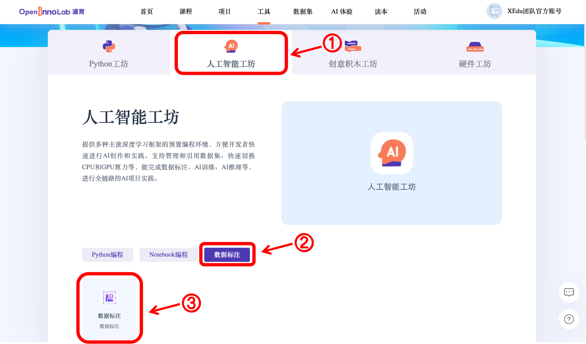

## 从零开始制作一个COCO格式数据集

### COCO格式数据集简介

COCO数据集是一个大型的、丰富的物体检测，分割和字幕数据集。这个数据集以scene understanding（场景理解）为目标，主要从复杂的日常场景中截取，图像中的目标通过精确的segmentation（分割）进行位置的标定。图像包括91类目标，328,000影像和2,500,000个label。是目前为止有语义分割的最大数据集，提供的类别有80类，有超过33万张图片，其中20万张有标注，整个数据集中个体的数目超过150万个。

XEdu中MMEdu的MMDetection模块支持的数据集类型是COCO，很多时候我们需要训练自己创建的数据集，那怎么样才能将数据集需转换成<a href="https://xedu.readthedocs.io/zh/master/mmedu/introduction.html#coco">COCO格式</a>呢？

接下来就让我们一起学习几种自己制作<a href="https://xedu.readthedocs.io/zh/master/mmedu/introduction.html#coco">COCO格式</a>数据集的方式吧。


### 方式1：OpenInnoLab版（线上标注）

这里强烈推荐初学者点击<a href="https://www.openinnolab.org.cn/pjlab/project?id=63c4ad101dd9517dffdff539&sc=635638d69ed68060c638f979#public">《从零开始制作一个COCO数据集之格式转换》</a>，跟随项目中的图文指引，轻松体验COCO格式数据集创建过程。

#### 第一步：整理图片

新建一个images文件夹用于存放自己收集到的所有图片，图片可以从网络上下载，也可以自行拍摄，但是要注意的是，图片需要是jpg或png格式，否则可能会导致无法正常显示。

#### 第二步：标注图片

使用熟悉的标注方式标注图片，如可点击链接进入<a href="https://www.openinnolab.org.cn/pjlab/projects/channel">浦育在线工具</a>页面，再点击“人工智能工坊”，在“数据标注”板块创建数据标注项目实践。


#### 第三步：转换成COCO格式

使用BaseDT库将平台标注格式的数据集转换成COCO格式，可以使用如下代码：

```plain
from BaseDT.dataset import DataSet
ds = DataSet(r"my_dataset") # 指定目标数据集
ds.make_dataset(r"/data/HZQV42", src_format="INNOLAB",train_ratio = 0.8, test_ratio = 0.1, val_ratio = 0.1) # 仅需修改第一个参数为待转格式的原始数据集路径（注意是整个数据集）
```

#### 第四步：检查数据集格式

结合数据集检查提示对数据集进行调整，必要时可重做前几步，最后完成整个数据集制作。在训练的时候，只要通过`model.load_dataset`指定数据集的路径就可以了。


### 选择2：LabelMe版（本地标注）

#### 第一步：整理图片

根据需求按照自己喜欢的方式收集图片，图片中包含需要检测的信息即可，可以使用ImageNet格式数据集整理图片的方式对收集的图片进行预处理。

#### 第二步：标注图片

使用熟悉的标注方式标注图片，如可使用LabelMe批量打开图片文件夹的图片，进行标注并保存为json文件。

- LabelMe：麻省理工（MIT）的计算机科学和人工智能实验室（CSAIL）研发的图像标注工具，标注格式为LabelMe，网上较多LabelMe转VOC、COCO格式的脚本，可以标注矩形、圆形、线段、点。标注语义分割、实例分割数据集尤其推荐。
- 安装与打开方式：`pip install labelme`安装完成后输入`labelme`即可打开。


#### 第三步：转换成COCO标注格式

将LabelMe格式的标注文件转换成COCO标注格式，可以使用如下代码：

```plain
import json
import numpy as np
import glob
import PIL.Image
from PIL import ImageDraw
from shapely.geometry import Polygon

class labelme2coco(object):
    def __init__(self, labelme_json=[], save_json_path='./new.json'):
        '''
        :param labelme_json: 所有labelme的json文件路径组成的列表
        :param save_json_path: json保存位置
        '''
        self.labelme_json = labelme_json
        self.save_json_path = save_json_path
        self.annotations = []
        self.images = []
        self.categories = [{'supercategory': None, 'id': 1, 'name': 'cat'},{'supercategory': None, 'id': 2, 'name': 'dog'}] # 指定标注的类别
        self.label = []
        self.annID = 1
        self.height = 0
        self.width = 0
        self.save_json()

    # 定义读取图像标注信息的方法
    def image(self, data, num):
        image = {}
        height = data['imageHeight']
        width = data['imageWidth']
        image['height'] = height
        image['width'] = width
        image['id'] = num + 1
        image['file_name'] = data['imagePath'].split('/')[-1]
        self.height = height
        self.width = width
        return image

    # 定义数据转换方法
    def data_transfer(self):
        for num, json_file in enumerate(self.labelme_json):
            with open(json_file, 'r') as fp:
                data = json.load(fp)  # 加载json文件
                self.images.append(self.image(data, num)) # 读取所有图像标注信息并加入images数组
                for shapes in data['shapes']:
                    label = shapes['label']
                    points = shapes['points']
                    shape_type = shapes['shape_type']
                    if shape_type == 'rectangle':
                        points = [points[0],[points[0][0],points[1][1]],points[1],[points[1][0],points[0][1]]]     
                    self.annotations.append(self.annotation(points, label, num)) # 读取所有检测框标注信息并加入annotations数组
                    self.annID += 1
        print(self.annotations)

    # 定义读取检测框标注信息的方法
    def annotation(self, points, label, num):
        annotation = {}
        annotation['segmentation'] = [list(np.asarray(points).flatten())]
        poly = Polygon(points)
        area_ = round(poly.area, 6)
        annotation['area'] = area_
        annotation['iscrowd'] = 0
        annotation['image_id'] = num + 1
        annotation['bbox'] = list(map(float, self.getbbox(points)))
        annotation['category_id'] = self.getcatid(label)
        annotation['id'] = self.annID
        return annotation

    # 定义读取检测框的类别信息的方法
    def getcatid(self, label):
        for categorie in self.categories:
            if label == categorie['name']:
                return categorie['id']
        return -1

    def getbbox(self, points):
        polygons = points
        mask = self.polygons_to_mask([self.height, self.width], polygons)
        return self.mask2box(mask)

    def mask2box(self, mask):
        '''从mask反算出其边框
        mask：[h,w]  0、1组成的图片
        1对应对象，只需计算1对应的行列号（左上角行列号，右下角行列号，就可以算出其边框）
        '''
        # np.where(mask==1)
        index = np.argwhere(mask == 1)
        rows = index[:, 0]
        clos = index[:, 1]
        # 解析左上角行列号
        left_top_r = np.min(rows)  # y
        left_top_c = np.min(clos)  # x

        # 解析右下角行列号
        right_bottom_r = np.max(rows)
        right_bottom_c = np.max(clos)

        return [left_top_c, left_top_r, right_bottom_c - left_top_c,
                right_bottom_r - left_top_r]  # [x1,y1,w,h] 对应COCO的bbox格式

    def polygons_to_mask(self, img_shape, polygons):
        mask = np.zeros(img_shape, dtype=np.uint8)
        mask = PIL.Image.fromarray(mask)
        xy = list(map(tuple, polygons))
        PIL.ImageDraw.Draw(mask).polygon(xy=xy, outline=1, fill=1)
        mask = np.array(mask, dtype=bool)
        return mask

    def data2coco(self):
        data_coco = {}
        data_coco['images'] = self.images
        data_coco['categories'] = self.categories
        data_coco['annotations'] = self.annotations
        return data_coco

    def save_json(self):
        self.data_transfer()
        self.data_coco = self.data2coco()
        # 保存json文件
        json.dump(self.data_coco, open(self.save_json_path, 'w'), indent=4)  # 写入指定路径的json文件，indent=4 更加美观显示

labelme_json = glob.glob('picture/*.json')  # 获取指定目录下的json格式的文件
labelme2coco(labelme_json, 'picture/new.json') # 指定生成文件路径
```

#### 第四步：按照目录结构整理文件

创建两个文件夹“images”和“annotations”，分别用于存放图片以及标注信息。按照要求的目录结构，整理好文件夹，制作完成后如想要检查数据集，可使用BaseDT的<a href="https://xedu.readthedocs.io/zh/latest/basedt/introduction.html#id9">数据集格式检查</a>功能，结合数据集检查提示对数据集进行调整，最后完成整个数据集制作。在训练的时候，只要通过`model.load_dataset`指定数据集的路径就可以了。

### 选择3：改装网上下载的目标检测数据集

网上也可以找到一些目标检测数据集，但是网上下载的数据集的格式可能不符合XEdu的需求。那么就需要进行数据集格式转换。

我们可以下载网上的数据集，改装生成我们需要的数据集格式。此时可以选择使用BaseDT的常见数据集格式转换功能。

#### 第一步：整理原始数据集

首先新建一个annotations文件夹用于存放所有标注文件（VOC格式的为xml文件、COCO格式的为json格式），然后新建一个images文件夹用于存放所有图片，同时在根目录下新建一个classes.txt，写入类别名称。整理规范如下：

```
原数据集（目标检测）
|---annotations
      |----xxx.json/xxx.xml/xxx.txt
|---images
      |----xxx.jpg/png/....
classes.txt
```

#### 第二步：转换为COCO格式

使用BaseDT库将平台标注格式的数据集转换成COCO格式，可以使用如下代码。如需了解更多BaseDT库数据集处理的功能，详见<a href="https://xedu.readthedocs.io/zh/master/basedt/introduction.html#id7">BaseDT的数据集格式转换</a>。

```plain
from BaseDT.dataset import DataSet
ds = DataSet(r"my_dataset") # 指定为新数据集路径
ds.make_dataset(r"G:\\测试数据集\\fruit_voc", src_format="VOC",train_ratio = 0.8, test_ratio = 0.1, val_ratio = 0.1) # 指定待转格式的原始数据集路径，原始数据集格式，划分比例，默认比例为train_ratio = 0.7, test_ratio = 0.1, val_ratio = 0.2
```

#### 第三步：检查数据集

结合数据集检查提示对数据集进行调整，必要时可重做前几步，最后完成整个数据集制作。在训练的时候，只要通过`model.load_dataset`指定数据集的路径就可以了。