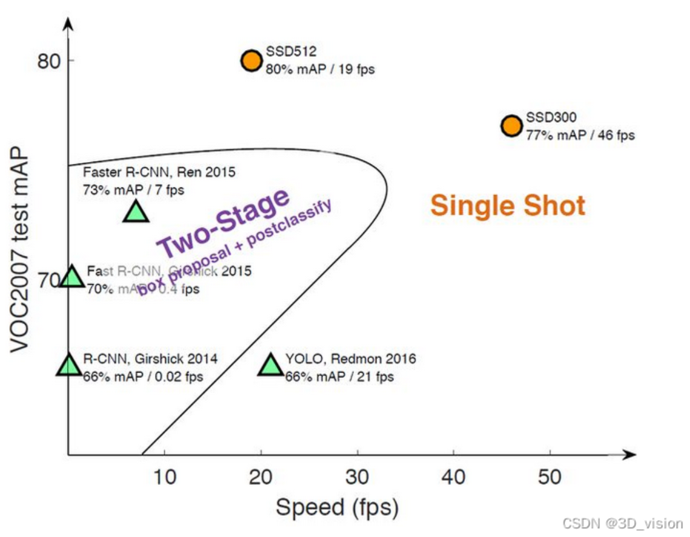
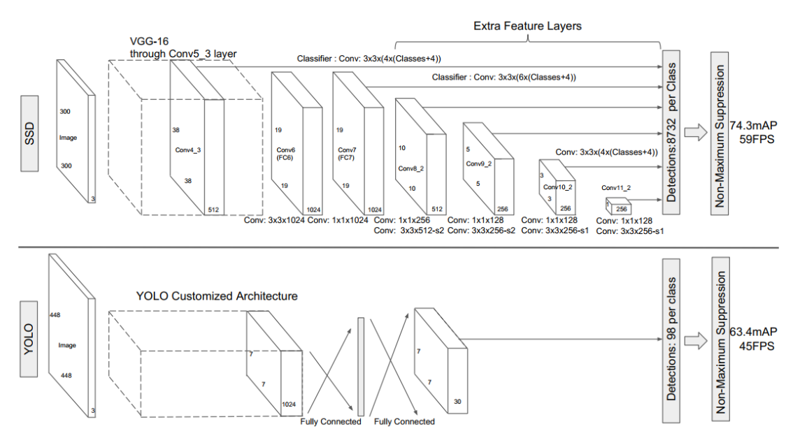

# 目标检测模型SSD

[SSD: Single Shot MultiBox Detector](https://arxiv.org/pdf/1512.02325.pdf)

## 介绍

SSD是ECCV 2016上提出的一种目标检测算法，截至目前是主要的检测框架之一，相比Faster RCNN有明显的速度优势，相比YOLO又有明显的mAP优势。

## 特点：end-to-end

目标检测主流算法分成两个类型：

（1）two-stage方法：RCNN系列

通过算法产生候选框，然后再对这些候选框进行分类和回归

（2）one-stage方法：yolo和SSD

直接通过主干网络给出类别位置信息，不需要区域生成

下图是给出的几类算法的精度和速度差异。



## 优点

- 从YOLO中继承了将detection转化为regression的思路，一次完成目标定位与分类
- 基于Faster RCNN中的Anchor，提出了相似的prior box
- 加入基于特征金字塔（Pyramidal Feature Hierarchy）的检测方式，即在不同感受野的feature map上预测目标
- 这些设计实现了简单的端到端的训练，而且即便使用低分辨率的输入图像也能得到高的精度

## 设计理念

- 采用多尺度特征图用于检测
CNN网络一般前面的特征图比较大，后面会逐渐采用stride=2的卷积或者pool来降低特征图大小，这正如图3所示，一个比较大的特征图和一个比较小的特征图，它们都用来做检测。这样做的好处是比较大的特征图来用来检测相对较小的目标，而小的特征图负责检测大目标。

- 采用卷积进行检测
SSD直接采用卷积对不同的特征图来进行提取检测结果。对于形状为mnp的特征图，只需要采用33p这样比较小的卷积核得到检测值。
（每个添加的特征层使用一系列卷积滤波器可以产生一系列固定的预测。）

- 设置先验框
SSD借鉴faster rcnn中ancho理念，每个单元设置尺度或者长宽比不同的先验框，预测的是对于该单元格先验框的偏移量，以及每个类被预测反映框中该物体类别的置信度。

## 模型结构



VGG-Base作为基础框架用来提取图像的feature，Extra-Layers对VGG的feature做进一步处理，增加模型对图像的感受野，使得extra-layers得到的特征图承载更多抽象信息。待预测的特征图由六种特征图组成，6中特征图最终通过pred-layer得到预测框的坐标，置信度，类别信息。

## 结论

### 优点：

SSD算法的优点应该很明显：运行速度可以和YOLO媲美，检测精度可以和Faster RCNN媲美。

### 缺点：

需要人工设置prior box的min_size，max_size和aspect_ratio值。网络中prior box的基础大小和形状不能直接通过学习获得，而是需要手工设置。而网络中每一层feature使用的prior box大小和形状恰好都不一样，导致调试过程非常依赖经验。
虽然使用了pyramdial feature hierarchy的思路，但是对于小目标的recall依然一般，这是由于SSD使用conv4_3低级feature去检测小目标，而低级特征卷积层数少，存在特征提取不充分的问题。

## 参考文献

```bibtex
@article{Liu_2016,
   title={SSD: Single Shot MultiBox Detector},
   journal={ECCV},
   author={Liu, Wei and Anguelov, Dragomir and Erhan, Dumitru and Szegedy, Christian and Reed, Scott and Fu, Cheng-Yang and Berg, Alexander C.},
   year={2016},
}
```