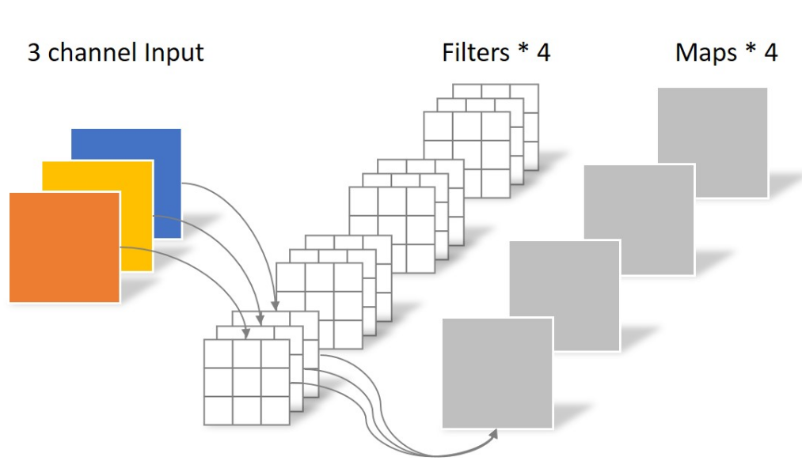
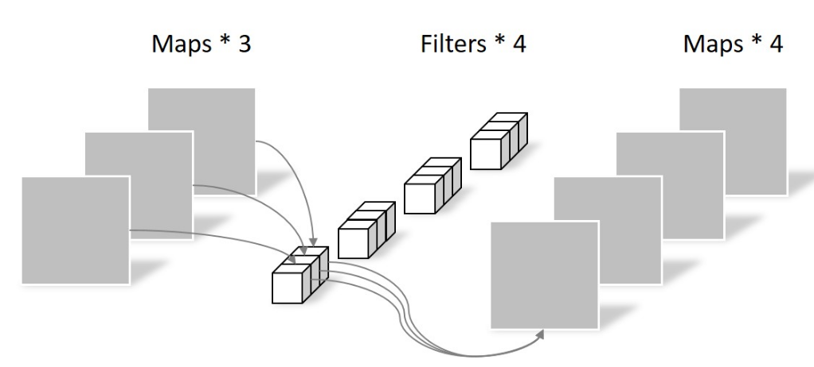
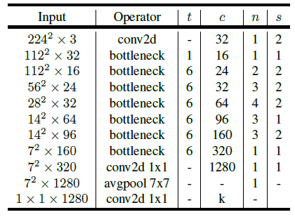

# 图像分类模型MobileNet

[MobileNetV2: Inverted Residuals and Linear Bottlenecks](https://arxiv.org/abs/1801.04381)

## 介绍

MobileNetV2是Google对MobileNetV1提出的改良版本。MobileNets系列的本身初衷是" **for Mobile Vision Applications**"。也就是提出一个轻量化的卷积网络模型，可以显著减少计算量和参数量，同时保持较高的准确率来提升效率，这样的模型是如此的的轻量化甚至可以在移动模型上进行训练。
其主要创新性是采用了**深度可分离卷积**的思想，也就是把标准的卷积过程拆分成**深度卷积**和**逐层卷积**两个过程，大大减少了参数量。

## 特点：深度可分离卷积

传统的标准卷积操作在M通道图像的基础上，准备得到N个特征图，使用的基础卷积核尺寸为$(W \cdot H)$。
每一个特征图对应一个filter，需要用M个小卷积核进行卷积，即每一个filter为$(W \cdot H \cdot M)$个参数，而这样的操作重复N次，就得到了N个特征图，即总参数为$(W \cdot H \cdot M \cdot N)$。



而为了简化这一计算过程，采用两次计算：
我们首先在深度方向进行卷积（深度卷积、逐通道卷积），先改变特征图的大小而不改变特征图的数量，即输入是M个通道，输出也是M个通道，先不涉及通道数的变化：


可以看到，每一个filter都是单层，这一步的参数量为$(W \cdot H \cdot M)$.

此时特征图大小已经改变，只需要从M维映射到N维即可。我们需要对每个点进行卷积（逐点卷积），添加N个filters，每个filter尺寸为$(1 \times 1 \cdot M)$，也就是我们常说的加权平均：



可以看到，逐点卷积通过对老通道作N次“加权平均数”的运算，得到了N个新的特征图。这一步的参数量为$(1 \times 1 \cdot M \cdot N)$

这两次计算的总参数量为$1 \times 1 \cdot M \cdot N + W \cdot H \cdot M = M \cdot (N + W \cdot H)$
参数量是传统卷积的几分之一呢？答案是：
$$
\frac{M \cdot (N + W \cdot H)}{W \cdot H \cdot M \cdot N} = \frac{1}{W \cdot H } + \frac{1}{N}
$$
在网络中的大部分层中，我们使用的是$3 \times 3$的卷积核，而N一般是几十到几百的数量级，因此一般参数可以缩减到传统方法的九分之一。而在实际测试中，原论文指出，准确度仅有1.1%的减少，但是参数量缩减到约七分之一：


## 特点：Linear Bottleneck

MobileNetV1使用的激活函数为Relu，这个函数也是深度学习常用的激活函数之一。在MobileNetV2原始论文中，MobileNet团队指出，这个激活函数在较低维度无法保证信息的相对完整，会造成一定程度的丢失，下面这个例子有助于理解：
有一条螺旋线$X$在二维空间内，我们使用某矩阵$T$将其映射到高维空间内，之后进行Relu操作，再使用某矩阵$T$的逆矩阵$T^{-1}$将其降维回二维。也就是说进行了一个：
$$
X' = T^{-1}(Relu(T \cdot X))
$$
的操作。如果没有任何信息损失，$X'$和$X$就会是完全一致的，论文作者给出的结果是：


可以很直接的看出，维度越高，Relu造成的损失越小，而在低维度的情况下，信息失真很严重，这样会造成很多卷积核的死亡（权重为0）。
于是作者在某些层舍弃了Relu，采用了线性的变化函数，进行了一次升维的操作，作者将其称之为"Linear Bottleneck"。此部分的细节我们不做深入阐述，这一步的作用就是给原网络升维，从而避免了很多卷积核的死亡。

## 网络结构

至此我们给出网络结构：



可以从网络结构中看到上面我们描述的深度卷积层（conv2d）和逐点卷积层（conv2d 1x1）。网络结构肉眼可见的简洁和清晰，而效果也不俗。

## 优点

总结一下优点，最大的优点就是创新性的可分离卷积带来的大量参数减少，从而导致网络的轻量化。此外，V2比起V1，还增加了Linear Bottleneck机制来避免卷积核的死亡，从而提高参数利用率。

## 使用领域

* 算力相对较低的移动平台的模型部署
* 减少大型项目的运行时间同时保留较高的准确率

## 参考文献

```bibtex
@misc{howard2017mobilenets,
      title={MobileNets: Efficient Convolutional Neural Networks for Mobile Vision Applications}, 
      author={Andrew G. Howard and Menglong Zhu and Bo Chen and Dmitry Kalenichenko and Weijun Wang and Tobias Weyand and Marco Andreetto and Hartwig Adam},
      year={2017},
      eprint={1704.04861},
      archivePrefix={arXiv},
      primaryClass={cs.CV}
}
@misc{sandler2019mobilenetv2,
      title={MobileNetV2: Inverted Residuals and Linear Bottlenecks}, 
      author={Mark Sandler and Andrew Howard and Menglong Zhu and Andrey Zhmoginov and Liang-Chieh Chen},
      year={2019},
      eprint={1801.04381},
      archivePrefix={arXiv},
      primaryClass={cs.CV}
}
```