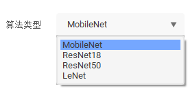

# EasyTrain（模型训练辅助工具）

EasyTrain简介
=============

EasyTrain是无代码的MMEdu模型训练辅助工具。借助EasyTrain，不需要编写一行代码，即可训练出AI模型。

用EasyTrain训练第一个AI模型！
=============================

EasyTrain界面打开之后在下拉框中选择问题类型为分类或者检测。

在选择了问题类型之后，下面的"算法类型"也会对应的更改。

在训练中要指定训练结果的保存路径和数据集路径，在选择了路径后，按钮文本会变成"重新选择"。如果训练新的模型，请尽量把结果保存在新的空文件夹中，否则不同训练问题的自动保存模型会冲突。

训练的轮数，学习率，类别数量，使用设备等参数也可以调节，点击"更多参数"按钮可以修改更多的参数。一部分参数有范围，限定数字等要求。并且请选择合理的数值。如果是用不到的参数，建议不要修改，采用默认值。特别地，类别默认为-1是允许的，表示默认读取`class.txt`中的类别，修改之后需要填成正确的类数量。

在更多参数中做出修改后，请点击"保存修改"将其保存。

在修改好自己的参数后，点击左下角的"代码生成"，可以生成训练代码，生成代码之后才可以训练。
生成的代码会显示在上方的代码框，并且保存到`train_code.py`中，请不要随意修改。

代码生成之后点击"开始训练"按钮即可开始训练，训练过程中主界面依旧可以正常运行，但是为了程序的稳定性和速度，不建议进行额外操作。
在开始训练后，停止训练会短暂地卡顿，随后停止。

在训练过程中，loss曲线会实时显示在右下方的loss框中，以轮数表示的训练进度也会表现在"结束训练"按钮下的进度条中。

注意事项
========

-   一部分参数有范围，例如学习率只能为正值，轮数只能为正整数，请选择合理范围的参数。
-   关于设备类型，如果没有安装GPU版本的XEdu各模块，则不能以cuda设备运行，只能选择cpu。
-   请选择空文件夹进行结果的保存，原因已经解释过。
-   请确认推理时选择的网络是否与权重文件匹配，如果不匹配会报错。
