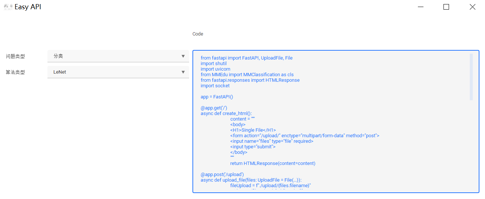
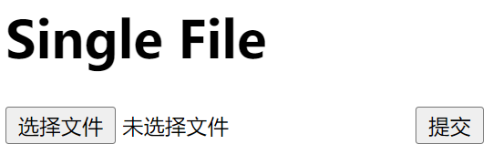

# EasyAPI（AI模型远程推理工具）

EasyAPI简介
===========

EasyAPI是无代码的MMEdu模型推理（部署）工具，不需要编写一行代码，即可搭建出一个类似百度开放平台的API平台。

如果你训练的模型无法运行在某一创客作品的开源硬件上，那么就需要EasyAPI的帮忙了。

EasyAPI的应用场景
=================

应用场景1：行空板+掌控板
------------------------

行空板可以运行ONNX，你可以利用EasyAPI生成参考代码，然后在行空板上运行。掌控板可以用HTTP的方式远程发送图片或者音频，行空板推理后返回结果信息。

应用场景2：行空板+PC
--------------------

行空板拍摄照片，然后发送到PC（算力服务器）上推理。

启动EasyAPI实现无代码服务部署可视化界面
=======================================

EasyAPI界面启动之后在下拉框中选择问题类型为分类或者检测。

在选择了问题类型之后，下面的"算法类型"也会对应的更改。

选择权重文件、类别文件、推理结果保存路径、推理所用设备。

点击生成代码会在上方Code呈现代码，有需要的用户也可以复制到本地运行。

运行代码会看到EasyAPI界面打开的同时运行的cmd.exe框内会有呈现运行后台，此时点击打开网页。

网页界面如下图所示。用户可指定类别的图片进行识别。此外，EasyAPI还提供了一个接口地址，可通过POST请求进行图像发送-服务器推理识别-结果放回的数据通路。如果手机和启动EasyAPI服务的电脑在同一wifi下，手机端还可以直接输入可视化网页连接来访问该服务，可以实现一个手机拍照，识别推理结果返回显示的功能。

注意事项
========

-   一部分参数有范围，例如学习率只能为正值，轮数只能为正整数，请选择合理范围的参数。
-   关于设备类型，如果没有安装GPU版本的XEdu各模块，则不能以cuda设备运行，只能选择cpu。
-   请选择空文件夹进行结果的保存，原因已经解释过。
-   请确认推理时选择的网络是否与权重文件匹配，如果不匹配会报错。
