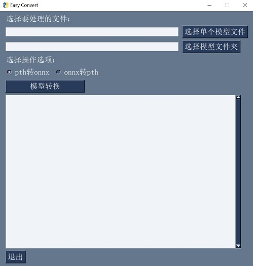

# EasyConvert 模型训练辅助工具

EasyConvert 简介
-------------

EasyConvert是XEdu提供的无代码模型转换工具。利用EasyConvert，可以实现将MMEdu和BaseNN导出的pth格式模型转换成onnx格式模型，适用于初学者人工智能入门。

注意：pth模型须是新版的MMEdu和BaseNN训练得到的模型！

用EasyConvert准换第一个AI模型！
-----------------------------

### step 1：选择要转换处理的文件

EasyTrain界面打开之后，有两种支持的文件选项：
-   单个模型文件转换
-   批量模型文件转换（放置在一个文件夹下）

### step 2：选择操作

-   pth转onnx
-   onnx转pth（正在开发，敬请期待）

### step 3：模型转换

点击“模型转换”按钮，会将“单个模型”和“模型文件夹”中的所有模型进行转换。新模型保存地址与原模型相同。

