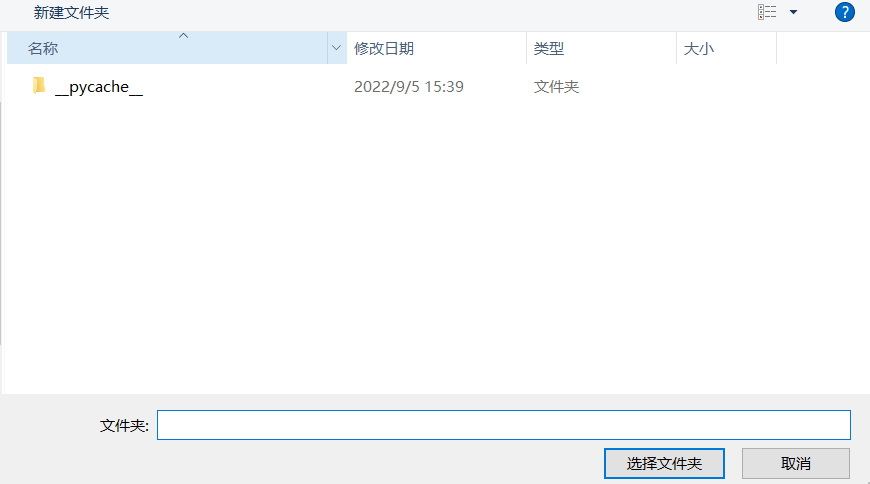

# EasyInference（模型推理辅助工具）

## EasyInference简介

EasyInference是模型推理工具。借助EasyInference，不需要编写一行代码，即可完成模型的推理。支持一张图片和一个文件夹的批量推理。

## 快速体验用EasyInference完成模型推理

EasyInference页面的左侧还是基本的参数选择，包括问题类型，算法类型，权重文件，类别文件，推理结果的保存路径。 如果推理结果的保存路径不选择，会默认保存到当前文件夹下的`det_result`中。
但是请选择一个空文件夹作为保存路径，否则预览界面会出现问题。

在一个单选按钮中选择要推理的文件夹或者单张图片，无论选择哪个都会弹出选择框。

如果选择推理单张图片，请选择一张图片，格式支持jpg，jpeg，png。请注意，即使多选，也只会推理第一张。

如果是选择文件夹，选择该文件夹即可。

如果问题类型为检测，则会多出两个参数选择，分别是rpn阈值和rcnn阈值，请选择0-1之内的数字。

点击“生成代码”后，代码会保存在`inference_code.py`中，并且在界面中显示。

点击“开始推理”后，会弹出提示框并且进行推理。请注意，运行过程中主界面会卡住，请耐心等待推理完成，推理完成后会在右下角显示推理信息，也会在上方显示结果图片。

点击“上一张”，“下一张”可以进行切换。如果保存路径还有其他图片，程序会将那些图片全都展示，所以建议在推理之前清空保存路径。

## 注意事项

* 一部分参数有范围，例如学习率只能为正值，轮数只能为正整数，请选择合理范围的参数。
* 关于设备类型，如果没有安装GPU版本的XEdu各模块，则不能以cuda设备运行，只能选择cpu。
* 请选择空文件夹进行结果的保存，原因已经解释过。
* 请确认推理时选择的网络是否与权重文件匹配，如果不匹配会报错。
