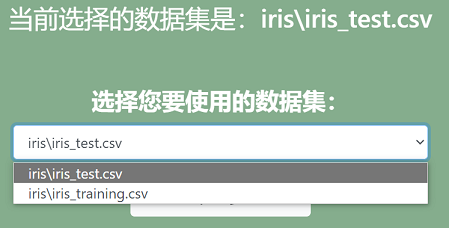
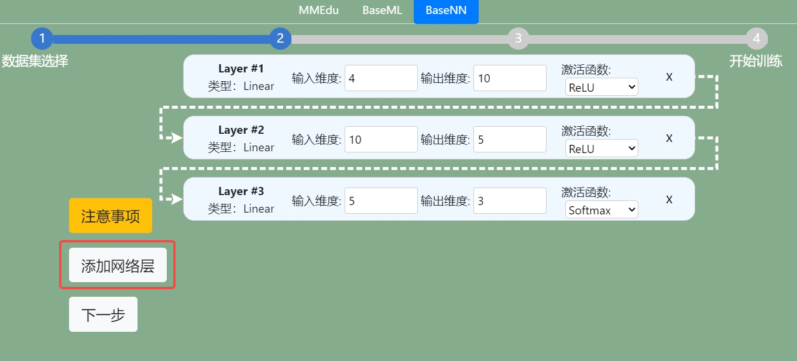
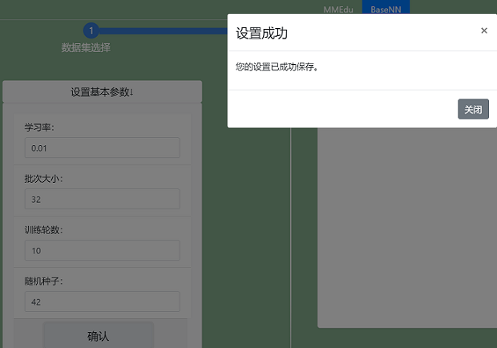
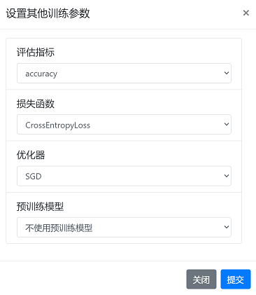
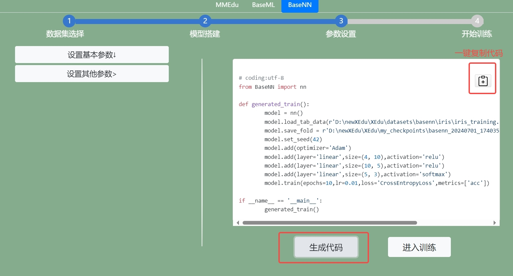
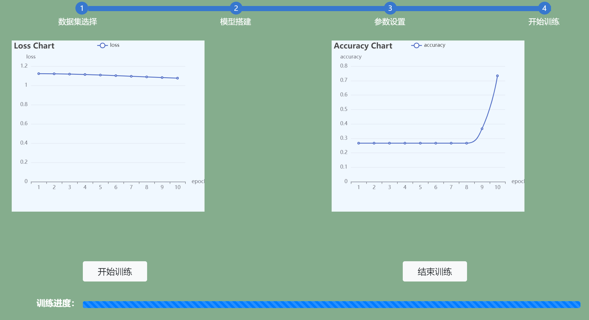
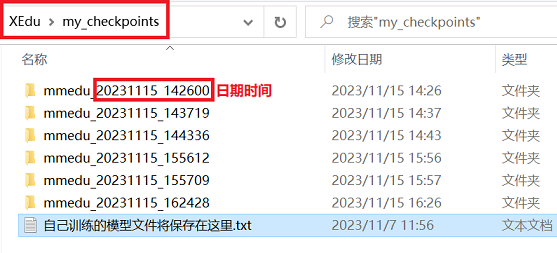

# EasyTrain-BaseNN 模型训练辅助工具

EasyTrain-BaseNN简介
-------------

EasyTrain-BaseNN是无代码的BaseNN模型训练辅助工具。借助EasyTrain-BaseNN，不需要编写一行代码，即可训练出AI模型。

用EasyTrain-BaseNN训练第一个AI模型！
-----------------------------

### step 1：数据集选择

EasyTrain界面打开之后，选择BaseNN页面，在下拉框中指定训练的数据集，网页会读取XEdu/dataset/basenn之下数据集。一键安装包中自带数据集：iris/iris_test.csv，iris/iris_training.csv。

数据集的格式要求为：[csv文件](https://xedu.readthedocs.io/zh/master/basenn/introduction.html#id21)(BaseNN任务)。

### step 2：模型搭建

点击“添加网络层”可以增加网络层，点击右侧“×”可以减少网络层。

注意：
- 第一层的输入维度要和数据集的特征维度（特征的数量）相等。
- 因为数据是从上一层流向下一层，因此下一层的输入维度要和上一层的输出维度保持相等。
- 最后一层的输出维度要和类别数相同。

### step 3：参数设置

点击“设置基本参数↓”，可以设置学习率，批次大小，训练轮数，随机种子。完成设置后点击“确认”按钮，成功设置会弹出窗口提醒设置成功。

点击“设置其他训练参数”，可以设置分类数量（仅用于分类任务），优化器，权重衰减、设备、预训练模型。完成设置后点击“提交”按钮。

*预训练模型放置位置标准：XEdu/checkpoints/训练任务/数据集名（严格一致）/预训练模型.pth

更多参数学习请跳转[深度学习训练参数详解](https://xedu.readthedocs.io/zh/master/dl_library/parameter_explain.html)

在完成参数设置后，点击右侧的"生成代码"，可以生成训练代码，生成代码之后才可以训练。
生成的代码会显示在上方的代码框，点击右上角复制按钮还可以一键复制代码。

### step 4：开始训练

代码生成之后点击"进入训练"按钮即可跳转至训练页面，点击“开始训练”按钮即可一键开始训练模型。

出现“loading”表示模型正在训练中，由于本地cpu训练模型的速度较慢，请耐心等待，可以先去喝杯水休息一下~

若想中断训练，可以点击“停止训练”按钮。

在训练过程中，loss曲线会实时显示在左侧的Loss Chart框中，accuracy曲线会实时显示在左侧的Accuracy  Chart框中。坐标轴的横坐标为训练轮数，纵坐标为对应数值。

自己训练的模型文件将保存在XEdu/my_checkpoints中。每次训练都会生成一个文件夹，可以通过文件夹名称上的日期时间找到对应的模型。

完成模型训练之后，窗口会弹出模型转换，可以点击“是”可实现pth格式模型准换成onnx格式模型。若要自行转换可使用[EasyConvert](https://xedu.readthedocs.io/zh/master/easydl/easyconvert.html)。

注意事项
--------

-   请确认选择的数据集不为空，且数据集格式正确。
-   一部分参数有范围，例如学习率只能为正值，轮数只能为正整数，请选择合理范围的参数。
-   关于设备类型，如果没有安装GPU版本的XEdu各模块，则不能以cuda设备运行，只能选择cpu。
-   请确认推理时选择的网络是否与权重文件匹配，如果不匹配会报错。
