# EasyTrain 模型训练辅助工具

EasyTrain简介
-------------

EasyTrain是无代码的MMEdu模型、BaseML模型、BaseNN模型训练辅助工具。借助EasyTrain，不需要编写一行代码，即可训练出AI模型。

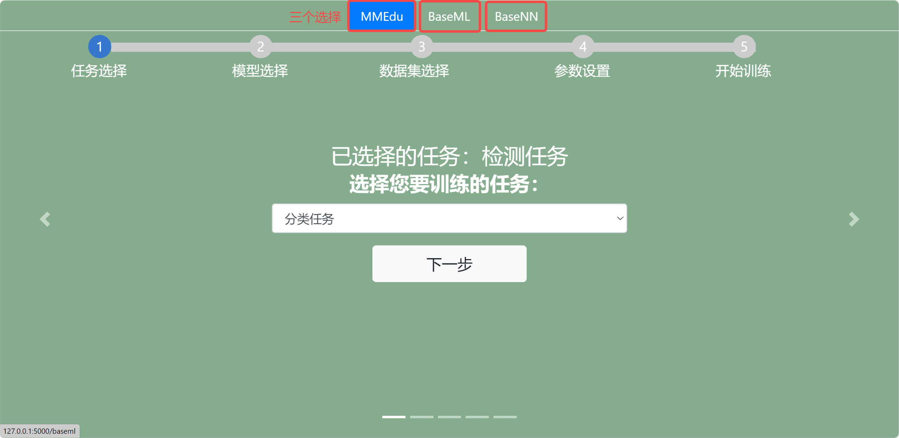

用EasyTrain训练第一个MMEdu模型！
-----------------------------

### step 1：任务选择

EasyTrain界面打开之后在下拉框中选择训练任务为分类或者检测任务。


### step 2：模型选择

在选择了训练任务类型之后，点击“下一步”，进入模型选择页面，选择训练的模型。训练模型会根据任务对应更改。

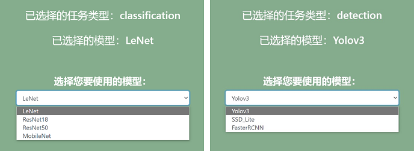

### step 3：数据集选择

在训练中要指定训练的数据集，网页会读取XEdu/dataset相应的任务之下数据集。数据集的格式要求为：[ImageNet格式](https://xedu.readthedocs.io/zh/master/mmedu/introduction.html#imagenet)（分类任务），[COCO格式](https://xedu.readthedocs.io/zh/master/mmedu/introduction.html#coco)（检测任务）。

一键安装包中自带分类任务数据集：cats_dogs、hand_gray;检测任务数据集：plate。

**目前数据集中为空需要自行下载添加，详细步骤在文件夹中**
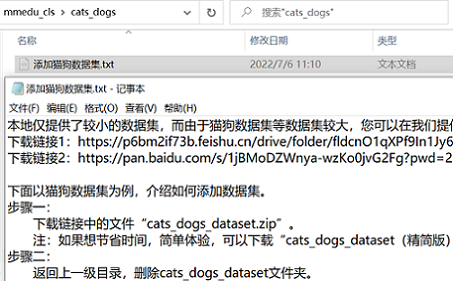
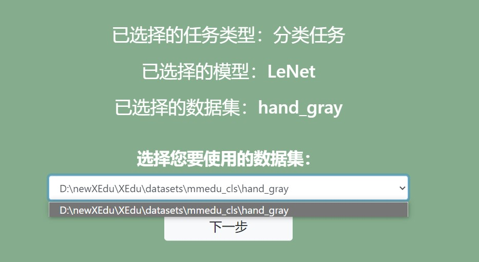

**怎么传入自己的数据集？**

如果要使用自己的数据集需要将数据集放置在XEdu/dataset相应的任务之下（分类任务mmedu_cls/检测任务mmedu_det），再刷新一下网页即可再数据集菜单选项中看到对应的数据集。例如现在我想做分类任务，在分类任务mmedu_cls文件夹下放置我的数据集“my_newdataset”（如下图所示），刷新网页成功出现。

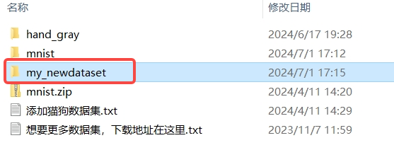
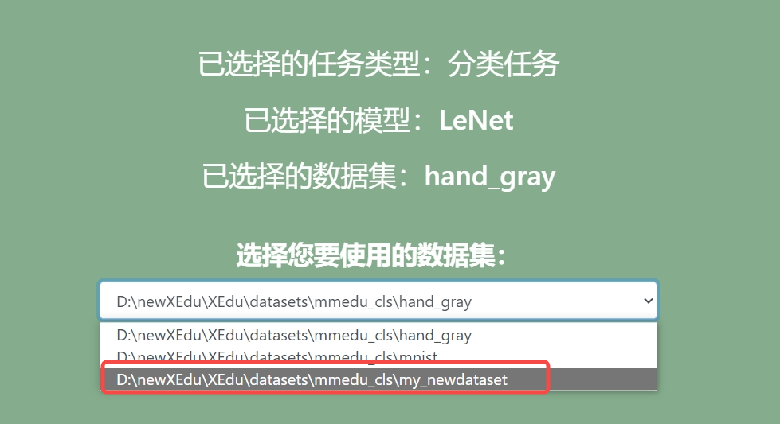

### step 4：参数设置

点击“设置基本参数↓”，可以设置学习率，批次大小，训练轮数，随机种子。完成设置后点击“确认”按钮，成功设置会弹出窗口提醒设置成功。

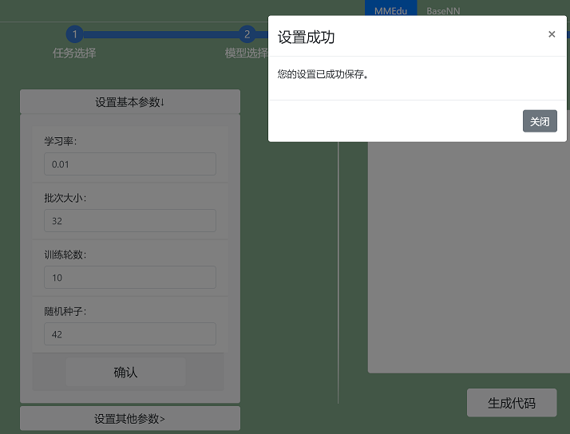

点击“设置其他训练参数”，可以设置分类数量（仅用于分类任务），优化器，权重衰减、设备、预训练模型。完成设置后点击“提交”按钮。

*预训练模型放置位置标准：XEdu/checkpoints/训练任务/数据集名（严格一致）/预训练模型.pth

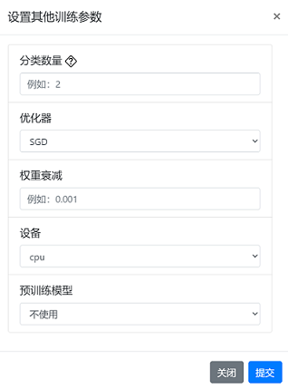

更多参数学习请跳转[深度学习训练参数详解](https://xedu.readthedocs.io/zh/master/dl_library/parameter_explain.html)


在完成参数设置后，点击右侧的"生成代码"，可以生成训练代码，生成代码之后才可以训练。
生成的代码会显示在上方的代码框，点击右上角复制按钮还可以一键复制代码。

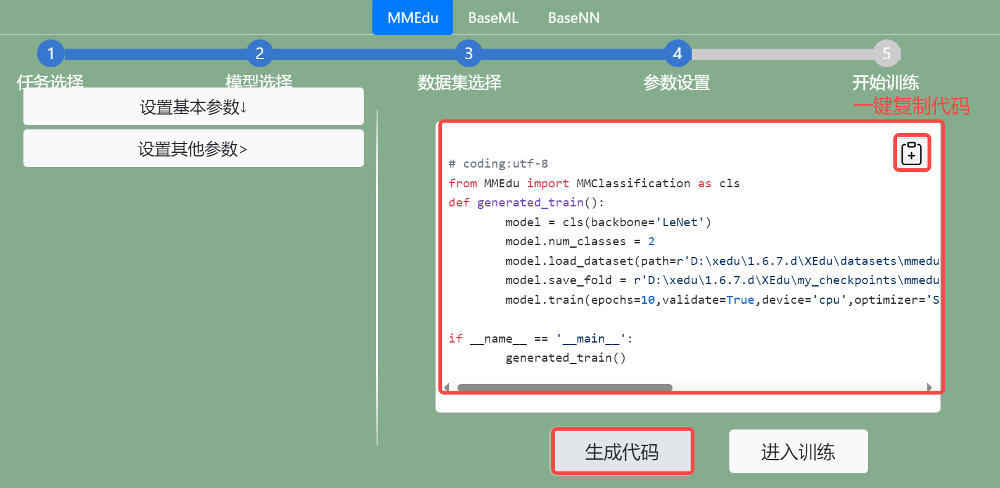

### step 5：开始训练

代码生成之后点击"进入训练"按钮即可跳转至训练页面，工具会先检查你的电脑有没有安装MMEdu的库，如果没有请先去”小黑窗“进行[pip安装MMEdu](https://xedu.readthedocs.io/zh/master/mmedu/installation.html#pip)。


点击“开始训练”按钮即可一键开始训练模型。

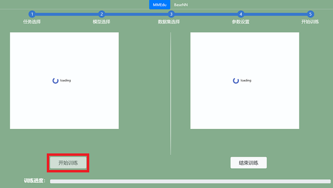

出现“loading”表示模型正在训练中，由于本地cpu训练模型的速度较慢，请耐心等待，可以先去喝杯水休息一下~

若想中断训练，可以点击“停止训练”按钮。


在训练过程中，loss曲线会实时显示在左侧的Loss Chart框中，accuracy曲线会实时显示在左侧的Accuracy  Chart框中。坐标轴的横坐标为训练轮数，纵坐标为对应数值。

自己训练的模型文件将保存在XEdu/my_checkpoints中。每次训练都会生成一个文件夹，可以通过文件夹名称上的日期时间找到对应的模型。

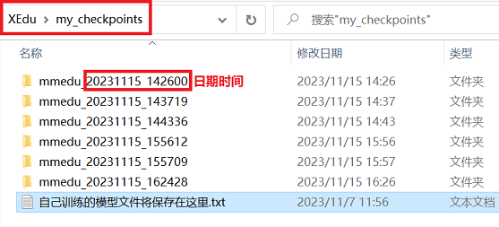

完成模型训练之后，窗口会弹出模型转换，可以点击“是”可实现best_accuracy的pth格式模型转为onnx格式。若要自行转换可使用[EasyConvert](https://xedu.readthedocs.io/zh/master/easydl/easyconvert.html)。


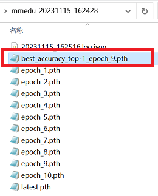

如需尝试用代码完成MMEdu模型训练或了解MMEdu具体功能，请参照[MMEdu的教程](https://xedu.readthedocs.io/zh/master/mmedu.html)。

用EasyTrain训练第一个BaseML模型！
-----------------------------

### step 1：任务选择

EasyTrain界面打开之后在下拉框中选择训练任务为回归任务、分类任务或者聚类任务。

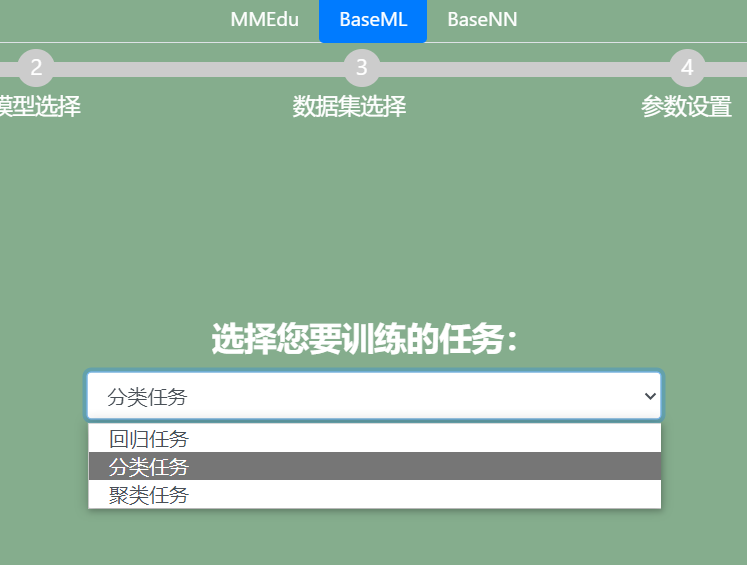

### step 2：模型选择

在选择了训练任务类型之后，点击“下一步”，进入模型选择页面，选择训练的模型。训练模型会根据任务对应更改。可点击“了解更多”按钮了解模型，对应[机器学习典型算法](https://xedu.readthedocs.io/zh/master/baseml/introduction.html#id6)。

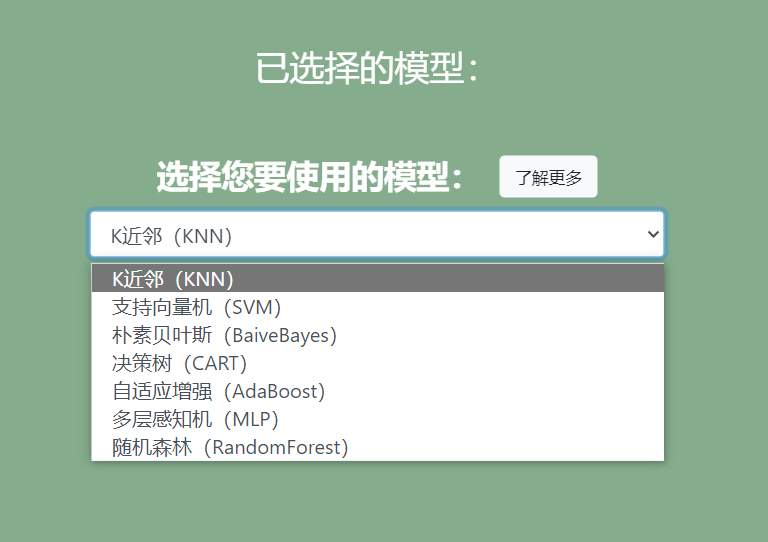

### step 1：数据集选择

EasyTrain界面打开之后，选择BaseML页面，在下拉框中指定训练的数据集，网页会读取XEdu/dataset/baseml之下数据集。一键安装包中已自带一些数据集，也可以自己放入新的数据集。

数据集的格式要求为：[csv文件](https://xedu.readthedocs.io/zh/master/baseml/introduction.html#csv)(BaseML任务)。纵轴为样本，横轴为特征，第一行为表头，最后一列为标签。

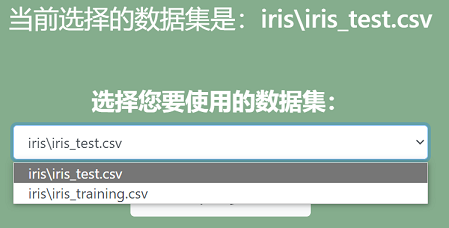

### step 3：参数设置

点击“设置基本参数↓”，可以设置数据乱序随机种子、高级参数设置、数据验证策略（一般回归任务选择"r2"，分类任务选择"acc"）。

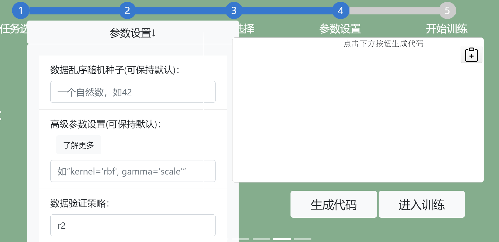

在完成参数设置后，点击右侧的"生成代码"，可以生成训练代码，生成代码之后才可以训练。
生成的代码会显示在上方的代码框，点击右上角复制按钮还可以一键复制代码。

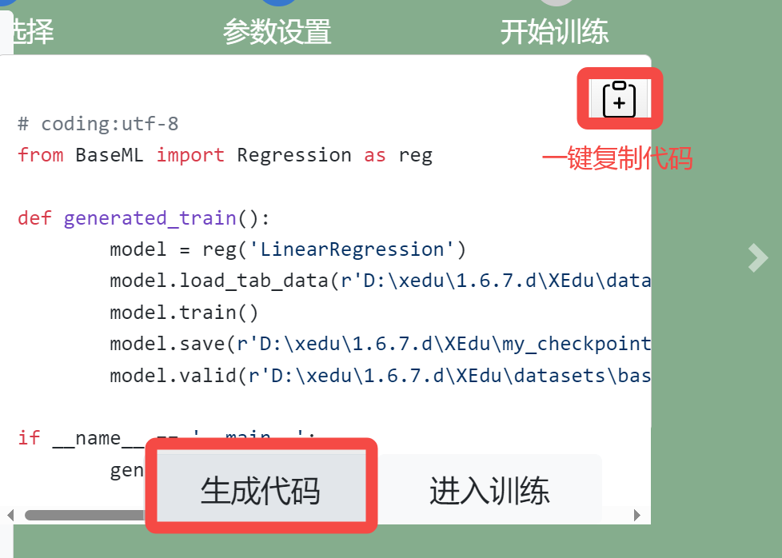

### step 4：开始训练

代码生成之后点击"进入训练"按钮即可跳转至训练页面，点击“开始训练”按钮即可一键开始训练模型，一般训练很快就可以完成。

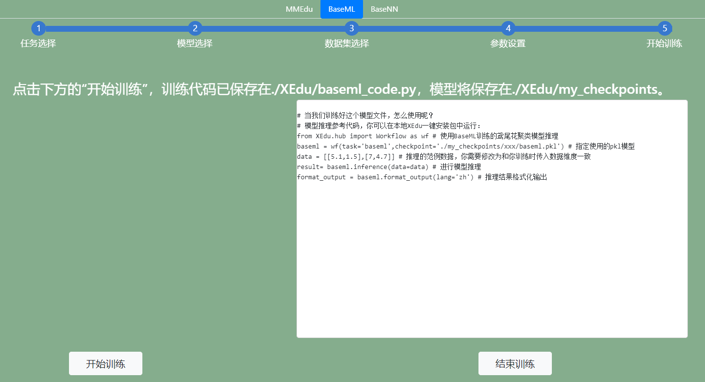

训练的模型文件将保存在XEdu/my_checkpoints中。每次训练都会生成一个文件夹，可以通过文件夹名称上的日期时间找到对应的模型。

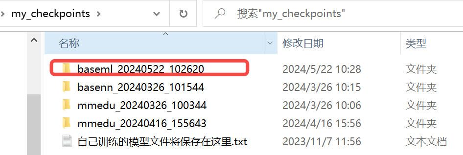

如需尝试用代码完成BaseML模型训练或了解BaseML具体功能，请参照[BaseML](https://xedu.readthedocs.io/zh/master/baseml.html)的教程。

用EasyTrain训练第一个BaseNN模型！
-----------------------------

### step 1：数据集选择

EasyTrain界面打开之后，选择BaseNN页面，在下拉框中指定训练的数据集，网页会读取XEdu/dataset/basenn之下数据集。一键安装包中已自带一些数据集，也可以自己放入新的数据集。

数据集的格式要求为：[csv文件](https://xedu.readthedocs.io/zh/master/basenn/introduction.html#id9)(BaseNN任务)。纵轴为样本，横轴为特征，第一行为表头，最后一列为标签。


### step 2：模型搭建

点击“添加网络层”可以增加网络层，点击右侧“×”可以减少网络层。

注意：
- 第一层的输入维度要和数据集的特征维度（特征的数量）相等。
- 因为数据是从上一层流向下一层，因此下一层的输入维度要和上一层的输出维度保持相等。
- 最后一层的输出维度要和类别数相同。

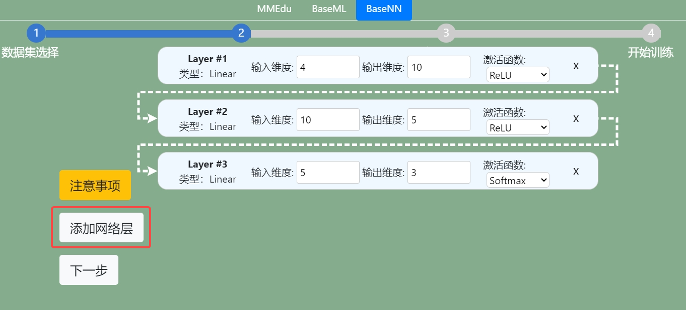

### step 3：参数设置

点击“设置基本参数↓”，可以设置学习率，批次大小，训练轮数，随机种子。完成设置后点击“确认”按钮，成功设置会弹出窗口提醒设置成功。

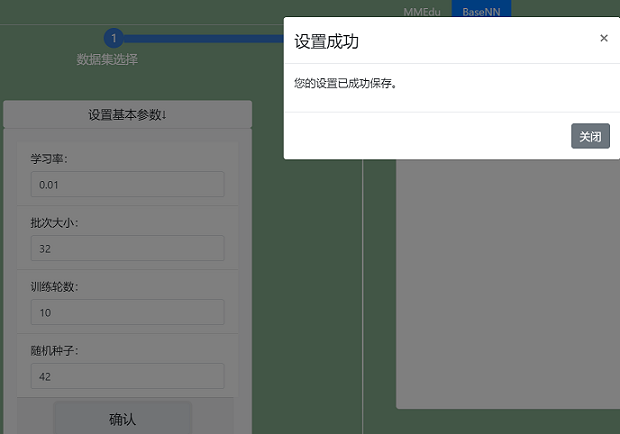

点击“设置其他训练参数”，可以设置分类数量（仅用于分类任务），优化器，权重衰减、设备、预训练模型。完成设置后点击“提交”按钮。

*预训练模型放置位置标准：XEdu/checkpoints/训练任务/数据集名（严格一致）/预训练模型.pth

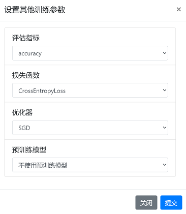

更多参数学习请跳转[深度学习训练参数详解](https://xedu.readthedocs.io/zh/master/dl_library/parameter_explain.html)


在完成参数设置后，点击右侧的"生成代码"，可以生成训练代码，生成代码之后才可以训练。
生成的代码会显示在上方的代码框，点击右上角复制按钮还可以一键复制代码。

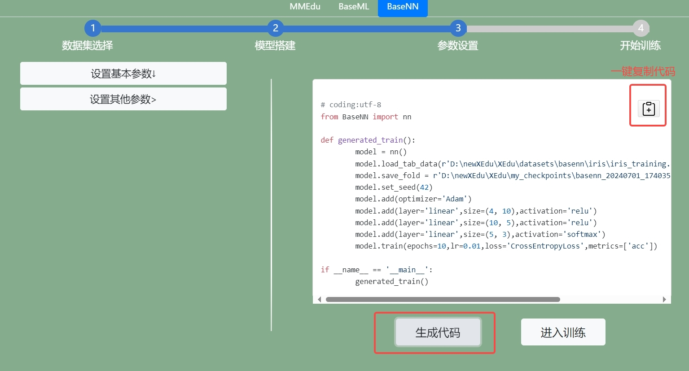

### step 4：开始训练

代码生成之后点击"进入训练"按钮即可跳转至训练页面，工具会先检查你的电脑有没有安装MMEdu的库，如果没有请先去”小黑窗“进行[pip安装BaseNN](https://xedu.readthedocs.io/zh/master/basenn/installation.html#)。

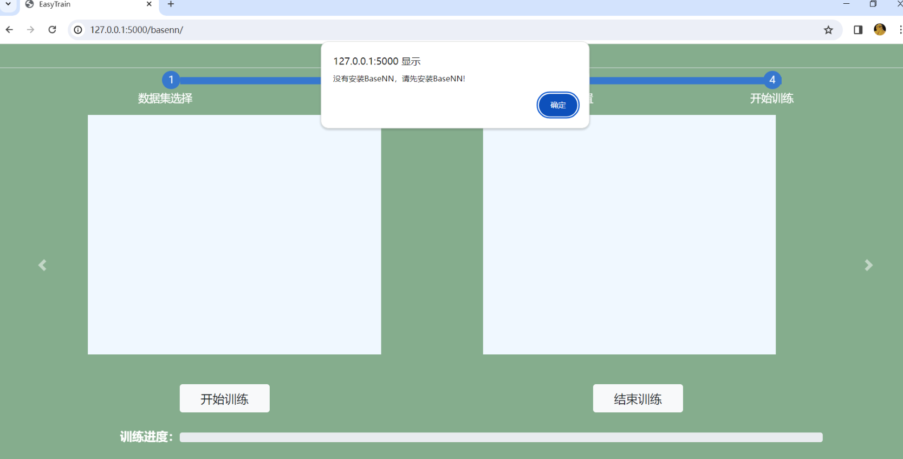

点击“开始训练”按钮即可一键开始训练模型。


出现“loading”表示模型正在训练中，但是也有可能是因为没有安装相应的库，数据集路径错误，数据集为空等等原因导致训练失败，所以先检查一下后台”小黑窗“有没有报错。

如果有报错，修改相应的错误，再通过刷新页面或者关闭”小黑窗“重启工具的方式重新训练。如果没有报错，请耐心等待，由于本地cpu训练模型的速度较慢，可以先去喝杯水休息一下~

若想中断训练，可以点击“停止训练”按钮。

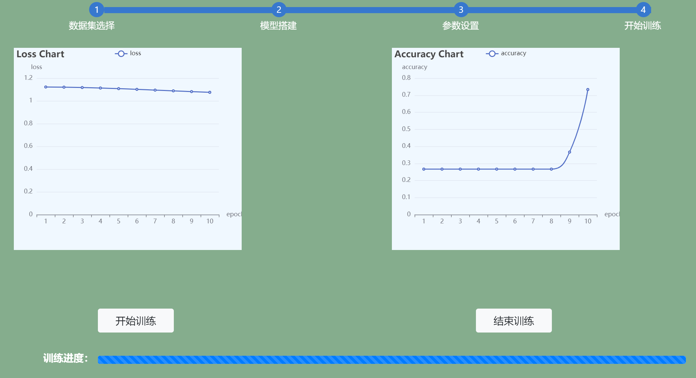

在训练过程中，loss曲线会实时显示在左侧的Loss Chart框中，accuracy曲线会实时显示在左侧的Accuracy  Chart框中。坐标轴的横坐标为训练轮数，纵坐标为对应数值。

自己训练的模型文件将保存在XEdu/my_checkpoints中。每次训练都会生成一个文件夹，可以通过文件夹名称上的日期时间找到对应的模型。


完成模型训练之后，窗口会弹出模型转换，可以点击“是”可实现pth格式模型准换成onnx格式模型。若要自行转换可使用[EasyConvert](https://xedu.readthedocs.io/zh/master/easydl/easyconvert.html)。


如需尝试用代码完成BaseNN模型训练或了解BaseNN具体功能，请参照[BaseNN的教程](https://xedu.readthedocs.io/zh/master/basenn.html)。


常见错误排查
-------------

1.Flask运行错误

EasyTrain基于Flask开发。如果在运行时出现这样的错误：

``` {.powershell}

hostname,aliases,ipaddrs = gethostbyaddr(name)InicodeDecodeError: 'utf-8' codec can't decode byte 0xdl in position 7: invalid continuation bvte。

```

请检查电脑名称是否为中文，修改为英文即可。


2.生成代码正常，但是进入训练时没有反应。

EasyTrain的生成代码部分基于Flask开发，进入训练则需要XEdu环境，涵盖BaseML、BaseNN、MMEdu等。点击“进入训练”后会在主目录下生成一个“*code.py”的文件。如果训练时页面没有反应，请用Python IDE工具（如Thonny）打开并运行，再根据错误提示进行排查。


注意事项
----------

-   请确认选择的数据集不为空，且数据集格式正确。
-   一部分参数有范围，例如学习率只能为正值，轮数只能为正整数，请选择合理范围的参数。
-   关于设备类型，如果没有安装GPU版本的XEdu各模块，则不能以cuda设备运行，只能选择cpu。
-   请确认推理时选择的网络是否与权重文件匹配，如果不匹配会报错。
