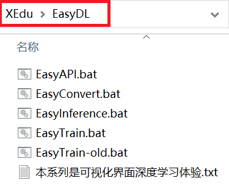

# 如何获取EasyDL系列工具

EasyDL系列工具内置在XEdu一键安装包中（如下图所示）。

飞书网盘：[https://p6bm2if73b.feishu.cn/drive/folder/fldcn67XTwhg8qIFCl8edJBZZQb](https://p6bm2if73b.feishu.cn/drive/folder/fldcn67XTwhg8qIFCl8edJBZZQb)

浦源CDN加速：[https://download.openxlab.org.cn/models/yikshing/bash/weight/x16](https://download.openxlab.org.cn/models/yikshing/bash/weight/x16)

下载一键安装包后，进度EazyDL文件夹，选择对应的工具，双击即可打开。（提示：不要关闭命令提示符窗口）

EasyDL系列工具的代码全部以CC协议开源，欢迎再次修改。