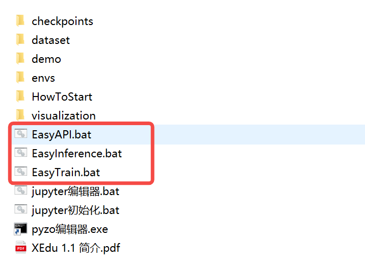

# 如何获取EasyDL系列工具

EasyDL系列工具内置在XEdu一键安装包中（如下图所示）。

飞书网盘：https://p6bm2if73b.feishu.cn/drive/folder/fldcn67XTwhg8qIFCl8edJBZZQb

百度网盘:https://pan.baidu.com/s/1UDt-GwHriCB_rewl8kCrUA?pwd=2022 提取码:2022 

下载一键安装包后，双击即可打开。

EasyDL系列工具的代码全部以CC协议开源，欢迎再次修改。