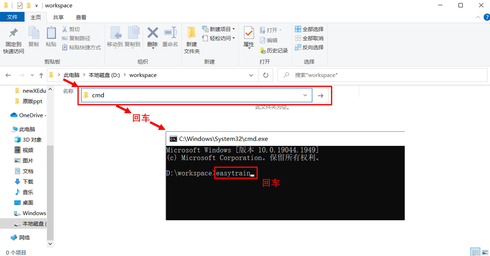
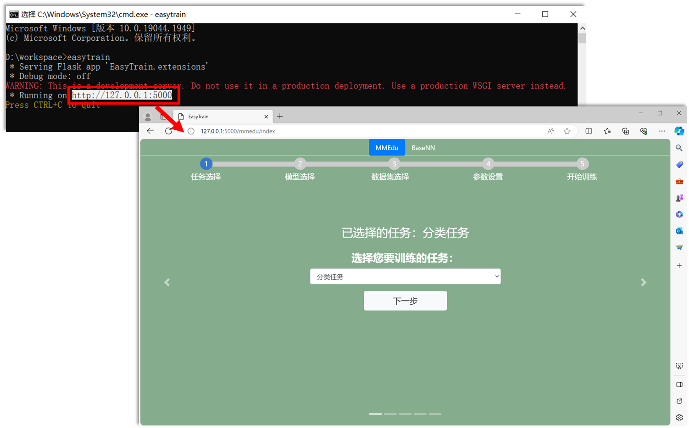
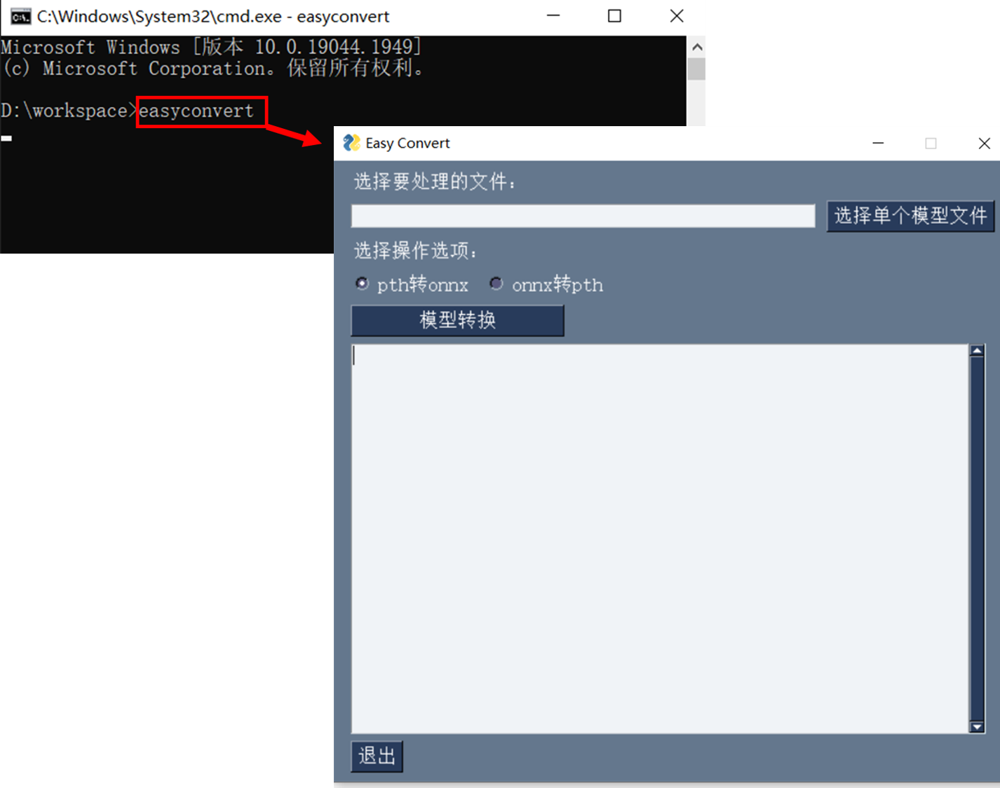
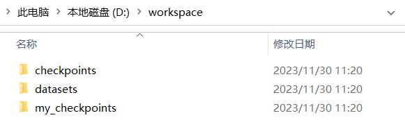

# 如何获取EasyDL系列工具

## 方式一：使用XEdu一键安装包中内置EasyDL

EasyDL系列工具内置在XEdu一键安装包中（如下图所示）。

飞书网盘：[https://p6bm2if73b.feishu.cn/drive/folder/fldcn67XTwhg8qIFCl8edJBZZQb](https://p6bm2if73b.feishu.cn/drive/folder/fldcn67XTwhg8qIFCl8edJBZZQb)

浦源CDN加速：[https://download.openxlab.org.cn/models/yikshing/bash/weight/x16](https://download.openxlab.org.cn/models/yikshing/bash/weight/x16)

下载一键安装包后，进入EasyDL文件夹，选择对应的工具，双击即可打开。（提示：不要关闭命令提示符窗口）


## 方式二：通过pip命令来安装新版easy系列工具

### 1. 安装库
你可以通过pip命令来安装新版easy系列工具。

`pip install easy-xedu` 

更新库文件：

`pip install --upgrade easy-xedu`

安装EasyDL库之后，就可以在终端使用命令`easytrain`或`easyconvert`，打开EasyTrain无代码模型训练工具或
EasyConvert无代码模型转换工具。

### 2. 启动工具

打开一个任意文件夹，建议是纯英文路径下的空白文件夹，下面以D:\workspace为例。如下图所示，在当前目录下的路径栏，输入cmd+回车，就可以打开当前目录下的命令行，在命令行中输入`easytrain`或`easyconvert`，回车运行，即可启动EasyTrain工具或EasyConvert工具。



- `easytrain`工具在启动后会在命令行中返回工具地址，复制地址到浏览器的网址栏中，即可打开工具。如下图所示。



- `easyconvert`工具在启动后会即可弹出工具窗口。如下图所示。



在启动以上两个任意一个工具的过程中会自动检测这个文件夹下是否存在以下目录结构，不符合以下结构会新建相应的文件夹。



```
|----checkpoints（预训练模型）
    |----basenn_model
    |----mmedu_cls_model
    |----mmedu_det_model
|----datasets（数据集）
    |----basenn
    |----mmedu_cls
    |----mmedu_det
|----my_checkpoints（自己训练的模型将会保存在此）
```
文件夹的使用可以通过链接跳转学习：checkpoints[（选择预训练模型）](https://xedu.readthedocs.io/zh/master/easydl/easytrain.html#step-4)、datasets[（选择数据集）](https://xedu.readthedocs.io/zh/master/easydl/easytrain.html#step-3)、
my_checkpoints[（自己训练的模型将会保存在此）](https://xedu.readthedocs.io/zh/master/easydl/easytrain.html#step-5)。


EasyDL系列工具的代码全部以CC协议开源，欢迎再次修改。