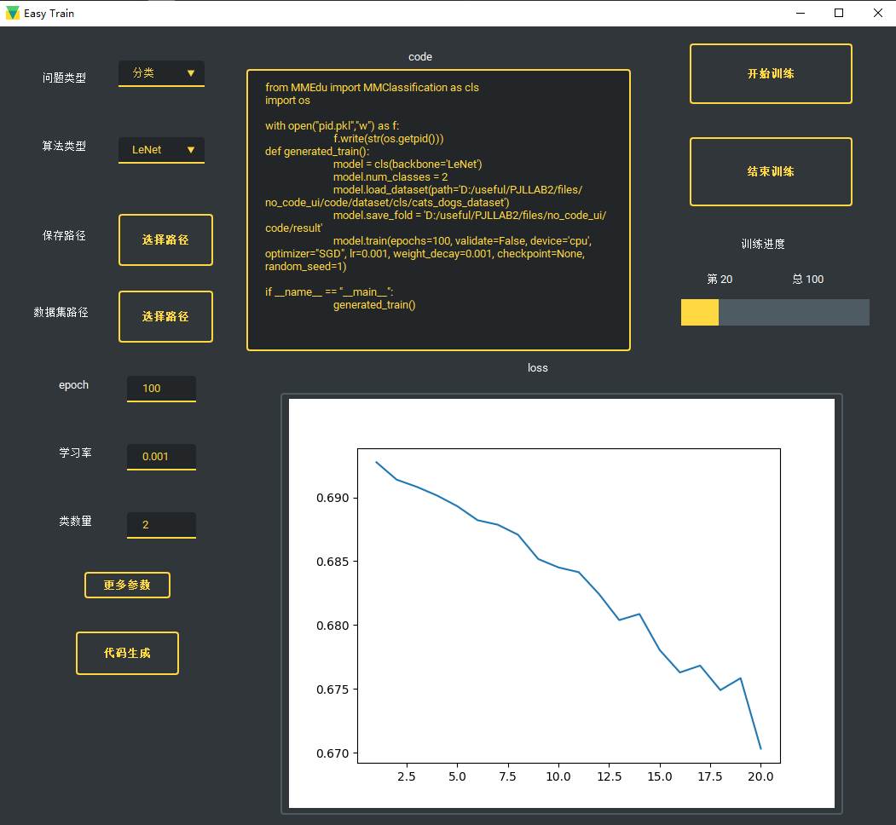
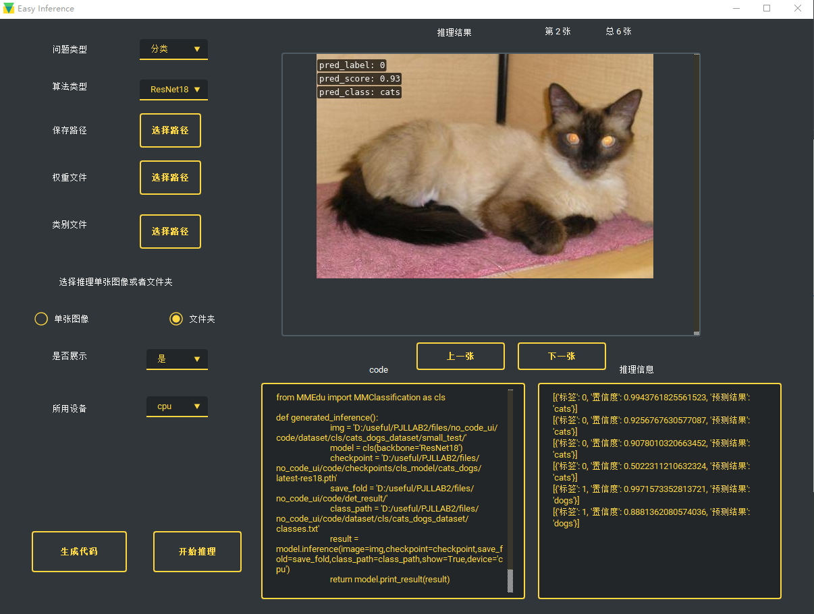
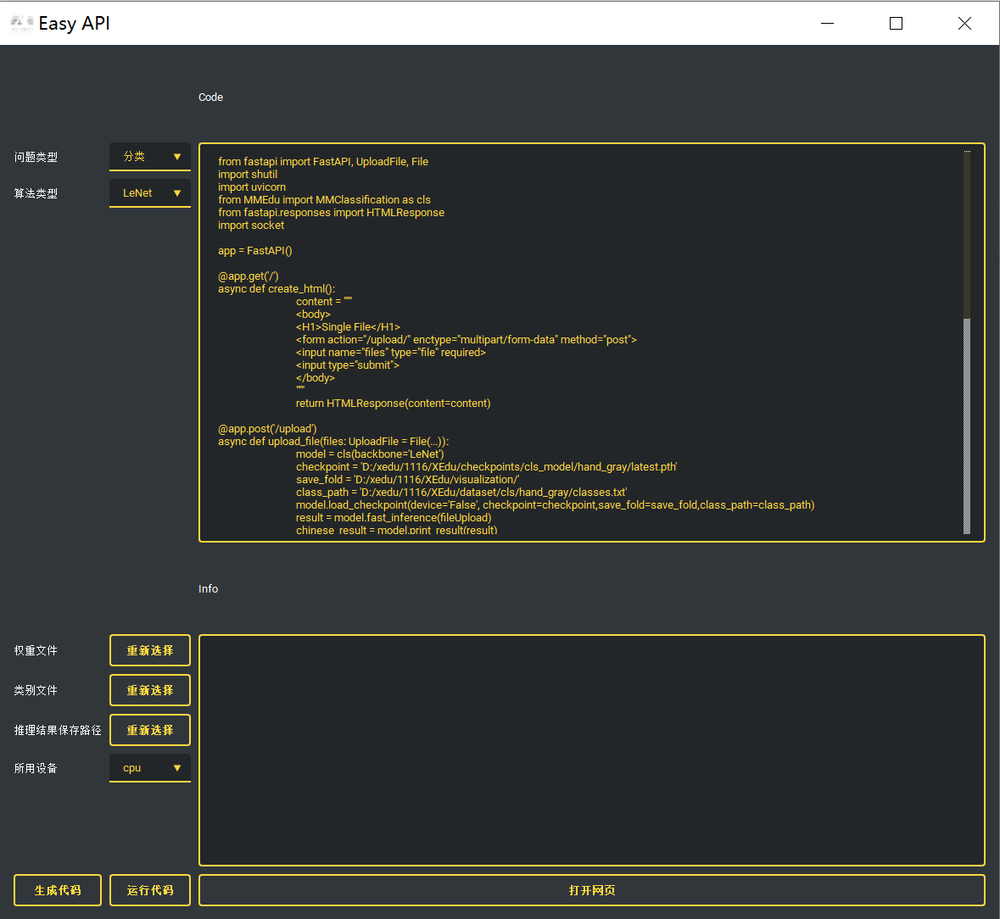

# EasyDL系列工具功能详解

## 初识EasyDL

EasyDL系列工具是由上海人工智能实验室智能教育中心打造的面向0基础或者较低基础的中小学生的无代码可视化工具。一个step-by-step的无代码（傻瓜化）模型训练和推理辅助工具，基于MMEdu开发。既可以独立下载（安装时提示需要XEdu环境），又内置在XEdu的一键安装包中。旨在让代码能力不强的初学者也能体验到人工智能的训练与学习，并且可以看到基于XEdu编写格式的训练、推理及部署的代码。

## 核心功能

### 1. EasyTrain

EasyTrain是XEdu提供的无代码模型训练工具。利用EasyTrain，可以完成模型训练的全流程体验，适用于初学者人工智能入门。

①实现了无代码训练可视化界面

②支持以下训练选项：

* 分类问题和检测问题
* LeNet，ResNet18，yolov3等不同算法选择
* 自选数据集，保存路径，是否使用预训练模型等
* 轮数，学习率，优化器等训练参数的自定义

③训练代码生成与查看

④集成开始训练与结束训练按钮，并实时显示loss曲线

### 2. EasyInference

EasyInference是XEdu提供的无代码模型训练工具。利用EasyInference，可以完成模型推理的全流程体验，适用于初学者人工智能入门。

①实现了无代码推理可视化界面

②支持以下推理选项：

* 数据和权重文件选择
* 单张图像或者文件夹选择

③在界面中预览推理结果和图片

④推理代码生成与查看

### 3. EasyAPI

EasyAPI是XEdu提供的无代码接口部署工具系列。利用EasyAPI，可以将推理侧从边缘硬件设备上剥离开，在PC机或计算节点上启动EasyAPI，即可供同一局域网下的边缘硬件设备调用，用户也可以在公网环境中启动EasyAPI，并打开相应的安全组，即可供公网设备调用该接口服务。该方案增加了数据传输的时间，节省了由于边缘设备算力有限带来了计算消耗。

①实现了无代码服务部署可视化界面

②支持以下选项：

* 问题类型
* 算法类型
* 权重文件和类别文件的选择
* 结果保存路径

③生成代码

④在界面中跳转到Web服务的网页

