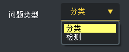
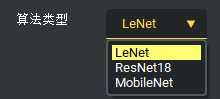
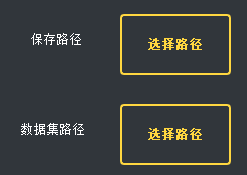
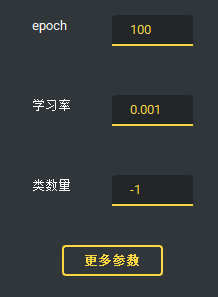
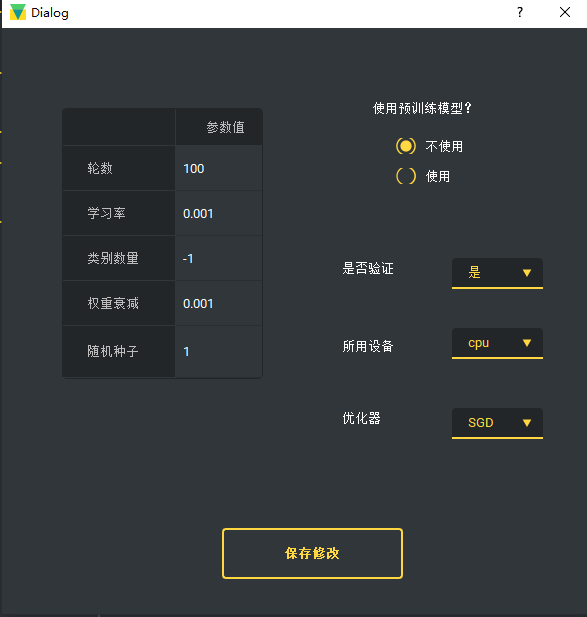
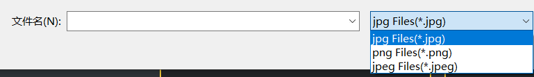
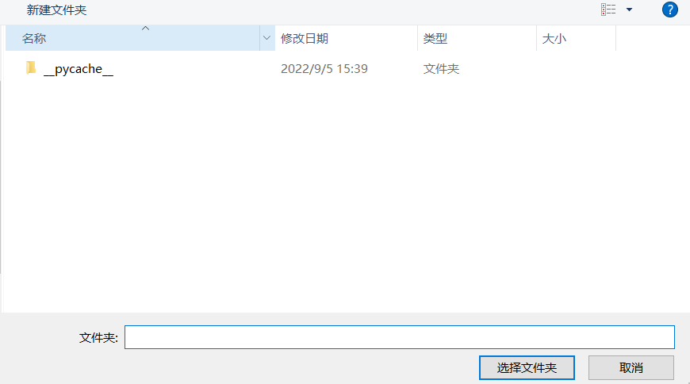
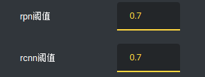
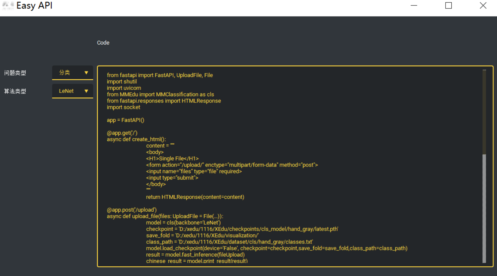
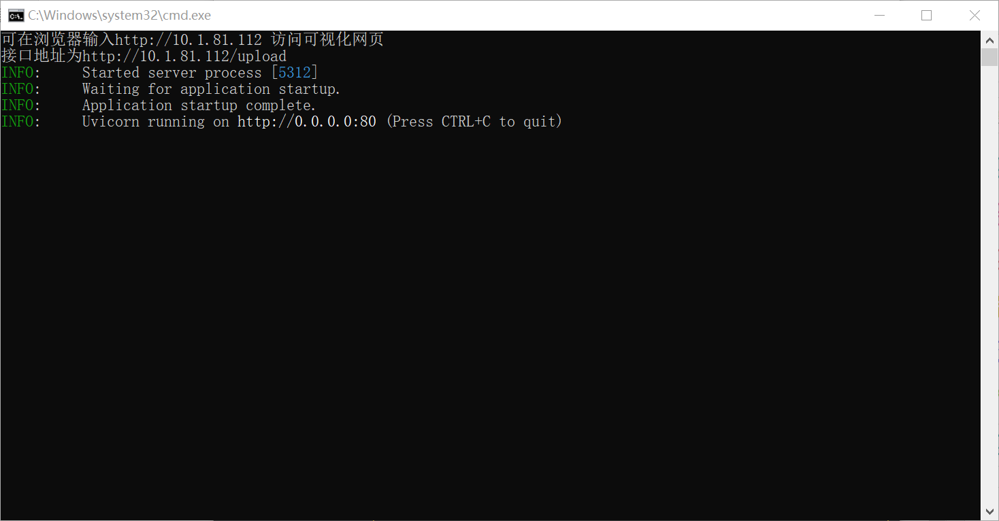

# 快速体验EasyDL系列工具

## 用EasyTrain训练第一个AI模型！

EasyTrain界面打开之后在下拉框中选择问题类型为分类或者检测。

在选择了问题类型之后，下面的“算法类型”也会对应的更改。

在训练中要指定训练结果的保存路径和数据集路径，在选择了路径后，按钮文本会变成“选择路径”。如果训练新的模型，请尽量把结果保存在新的空文件夹中，否则不同训练问题的自动保存模型会冲突。

训练的轮数，学习率，类别数量，使用设备等参数也可以调节，点击“更多参数”按钮可以修改更多的参数。一部分参数有范围，限定数字等要求。并且请选择合理的数值。如果是用不到的参数，建议不要修改，采用默认值。特别地，类别默认为-1是允许的，表示默认读取`class.txt`中的类别，修改之后需要填成正确的类数量。

在更多参数中做出修改后，请点击“保存修改”将其保存。

在修改好自己的参数后，点击左下角的“代码生成”，可以生成训练代码，生成代码之后才可以训练。
生成的代码会显示在上方的代码框，并且保存到`train_code.py`中，请不要随意修改。

代码生成之后点击“开始训练”按钮即可开始训练，训练过程中主界面依旧可以正常运行，但是为了程序的稳定性和速度，不建议进行额外操作。
在开始训练后，停止训练会短暂地

在训练过程中，loss曲线会实时显示在右下方的loss框中，以轮数表示的训练进度也会表现在“结束训练”按钮下的进度条中。

## 快速体验用EasyInference完成模型推理

EasyInference页面的左侧还是基本的参数选择，包括问题类型，算法类型，权重文件，类别文件，推理结果的保存路径。 如果推理结果的保存路径不选择，会默认保存到当前文件夹下的`det_result`中。
但是请选择一个空文件夹作为保存路径，否则预览界面会出现问题。

在一个单选按钮中选择要推理的文件夹或者单张图片，无论选择哪个都会弹出选择框。

如果选择推理单张图片，请选择一张图片，格式支持jpg，jpeg，png。请注意，即使多选，也只会推理第一张。

如果是选择文件夹，选择该文件夹即可。

如果问题类型为检测，则会多出两个参数选择，分别是rpn阈值和rcnn阈值，请选择0-1之内的数字。

点击“生成代码”后，代码会保存在`inference_code.py`中，并且在界面中显示。

点击“开始推理”后，会弹出提示框并且进行推理。请注意，运行过程中主界面会卡住，请耐心等待推理完成，推理完成后会在右下角显示推理信息，也会在上方显示结果图片。

点击“上一张”，“下一张”可以进行切换。如果保存路径还有其他图片，程序会将那些图片全都展示，所以建议在推理之前清空保存路径。

## 启动EasyAPI实现无代码服务部署可视化界面

EasyAPI界面启动之后在下拉框中选择问题类型为分类或者检测。

在选择了问题类型之后，下面的“算法类型”也会对应的更改。

选择权重文件、类别文件、推理结果保存路径、推理所用设备。

点击生成代码会在上方Code呈现代码，有需要的用户也可以复制到本地运行。

运行代码会看到EasyAPI界面打开的同时运行的cmd.exe框内会有呈现运行后台，此时点击打开网页。

网页界面如下图所示。用户可指定类别的图片进行识别。此外，EasyAPI还提供了一个接口地址，可通过POST请求进行图像发送-服务器推理识别-结果放回的数据通路。如果手机和启动EasyAPI服务的电脑在同一wifi下，手机端还可以直接输入可视化网页连接来访问该服务，可以实现一个手机拍照，识别推理结果返回显示的功能。

## 注意事项

* 一部分参数有范围，例如学习率只能为正值，轮数只能为正整数，请选择合理范围的参数。
* 关于设备类型，如果没有安装GPU版本的XEdu各模块，则不能以cuda设备运行，只能选择cpu。
* 请选择空文件夹进行结果的保存，原因已经解释过。
* 请确认推理时选择的网络是否与权重文件匹配，如果不匹配会报错。
