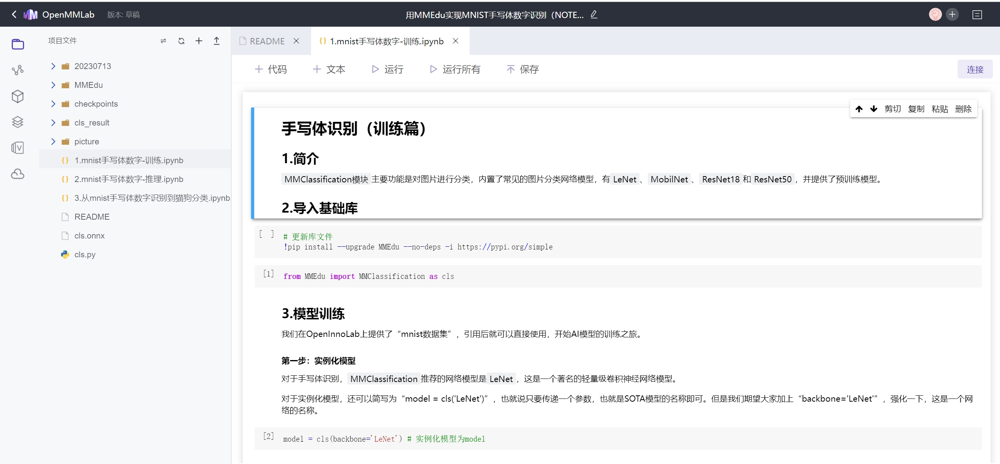
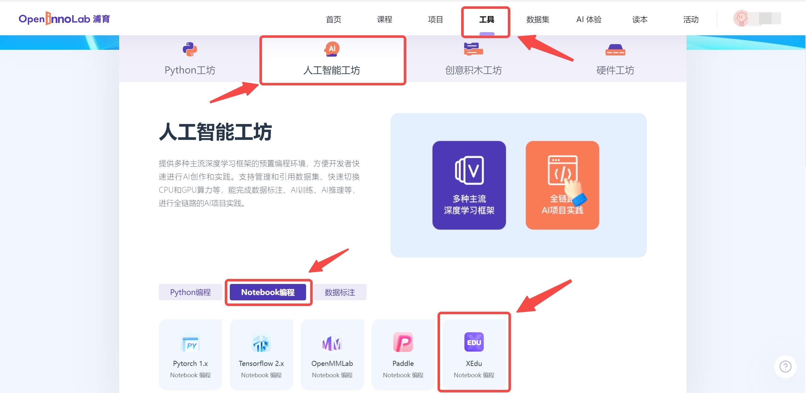

# 如何快速获得XEdu

网页：浦育平台为使用者提供了XEdu容器，我们可以把它想象成一台部署好XEdu和配套AI开发工具的远程电脑，这种形式很好的解决了环境搭建和算力问题。

本地：为了满足广大中小学师生本本地环境的需求，XEdu安装方式分为一键安装包安装、pip安装、docker安装和openhydra安装。快速获得自然是推荐选择XEdu一键安装包（CPU版本），它满足大部分机房需求。

## 在浦育平台使用XEdu

### 1. 打开浦育平台，注册登录账号

[浦育平台openinnolab
](https://www.openinnolab.org.cn/pjedu/home
)：[https://www.openinnolab.org.cn/pjedu/home
](https://www.openinnolab.org.cn/pjedu/home
)

### 2. 克隆一个XEdu容器的项目

推荐初学者从克隆别人的项目开始学习XEdu，克隆项目的步骤如下：

“项目”->"搜索XEdu"->"挑选喜欢的项目"->"克隆"

这样你就得到了一个XEdu项目，跟随项目就可以快速入门XEdu了

### 3. 新建一个XEdu容器的项目

推荐初学者使用Notebook开始XEdu的学习，新建项目的步骤如下：

“工具”->"人工智能工坊"->"Notebook编程"->"XEdu"

## 在本地使用XEdu

### 准备工作

下载工具：XEdu一键安装包

下载方式

飞书网盘：[XEdu v1.6.7d.exe](https://p6bm2if73b.feishu.cn/file/boxcn7ejYk2XUDsHI3Miq9546Uf?from=from_copylink)

硬件要求：准备win10及以上的电脑，将一键安装包安装到纯英文路径下。飞书网盘里的一件安装包会不定期更新，可时常到网盘中查看与下载最新版。

### 安装步骤

第一步：双击运行“XEdu v1.6.7d.exe”文件，将自解压为XEdu文件夹。

第二步：打开XEdu简介.pdf，快速了解一键安装包的使用。

第三步：快速测试XEdu示例代码。

打开根目录下的"jupyter编辑器.bat"，即自动启动浏览器并显示界面，如下图所示。

此时可打开"demo"文件夹中的ipynb文件，如"MMEdu\_cls\_notebook.ipynb"。选中代码单元格，点击常用工具栏"运行"按钮，就可以运行单元格中的代码，单元格左侧\[\*\]内的星号变为数字，表示该单元格运行完成。按步骤即可测试体验XEdu代码。

更多一键安装包的使用请前往[XEdu一键安装包说明](https://xedu.readthedocs.io/zh/master/about/installation.html#id2)。