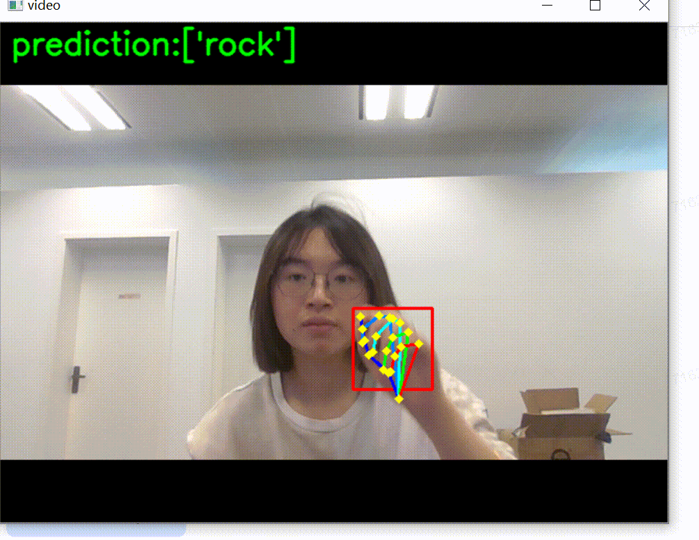

# 案例六：综合项目石头剪刀布的实时识别（XEduHub+BaseNN）

## 项目说明：

组合XEdu工具集的工具完成一个综合项目非常方便，本项目使用XEduHub提取手势图像的关键点信息，再将这些关键点信息作为特征输入到一个自己搭建的全连接神经网络模型中进行训练，此步骤由BaseNN实现，最后到本地完成模型应用，实现石头剪刀布手势实时识别的综合项目。

项目地址：[https://openinnolab.org.cn/pjlab/project?id=66062a39a888634b8a1bf2ca&backpath=/pjedu/userprofile?slideKey=project#public](https://openinnolab.org.cn/pjlab/project?id=66062a39a888634b8a1bf2ca&backpath=/pjedu/userprofile?slideKey=project#public)

## 项目步骤：

### 任务一：关键点检测和简单应用

XEduHub提供了能够快速识别人手关键点的模型：pose_hand21，该模型能够识别人手上的21个关键点，如下图所示。手部关键点检测的代码可参考学习[人手关键点](https://xedu.readthedocs.io/zh/master/xedu_hub/introduction.html#id44)。


首先分析检测到的手部关键点的结构：

- 掌心：0；

- 大拇指：1-4；

- 食指：5-8；

- 中指：9-12；

- 无名指：12-16；

- 小拇指：17-20。

经过人手关键点的模型推理，可以得到包含21对关键点坐标信息的组数，保存在keypoints变量中，通过访问数组元素，便能够轻松获取每个点的坐标信息。例如大拇指指尖4号关键点的x，y关键点坐标是keypoints[4]。

#### 1）基于规则实现手势分类

假设已经检测出了一组手部关键点，可以通过坐标点信息制定规则来区分不同的手势。例如我们写了一个计算伸展手指数量的函数，并设计判断规则通过伸展手指数量区分不同的手势。然而通过下方的代码不难看出这种方式比较麻烦，需对手指进行细致分析，同时结果可能不准确。

```
import numpy as np

# 计算两点之间的欧氏距离
def distance(p1, p2):
    return np.sqrt((p1[0] - p2[0])**2 + (p1[1] - p2[1])**2)

# 计算伸展手指的数量
def count_extended_fingers(keypoints, wrist_point=0, finger_tips=[4, 8, 12, 16, 20], threshold=50):
    #finger_tips: 每个手指尖端关键点的索引列表，默认为拇指到小指的尖端。
    # 初始化伸展手指的数量为0
    extended_fingers = 0
    distances = []  # 存储掌心到手指尖的距离
    
    # 获取手腕关键点的坐标
    wrist = keypoints[wrist_point]
    
    # 遍历手指尖端关键点
    for fingertip in finger_tips:
        # 计算手指尖端和掌心之间的距离
        dist = distance(wrist, keypoints[fingertip])
        # 计算第一节指骨到掌心之间的距离
        dist1 = distance(wrist, keypoints[fingertip-1])
        # 计算第二节指骨到掌心之间的距离
        dist2 = distance(wrist, keypoints[fingertip-2])
        distances.append(dist)
        # 如果是大拇指距离大于阈值则认为该手指是伸展的
        if dist > threshold and fingertip==4:
            extended_fingers += 1  # 增加伸展手指的数量
        # 如果距离大于阈值且指尖距离大于第一节指骨距离，第一节指骨距离大于第二节指骨距离则认为该手指是伸展的    
        elif  dist > threshold and dist>dist1>dist2:
            extended_fingers += 1  # 增加伸展手指的数量
            
    # 返回伸展手指的总数和每个手指的距离
    return extended_fingers, distances

# 假设 keypoints 是从模型获取的关键点列表
extended_fingers, finger_distances = count_extended_fingers(keypoints)
threshold=5
# 判断手势
if extended_fingers == 0 or (finger_distances[0]>threshold and extended_fingers == 1):
    hand_gesture = "石头"
elif extended_fingers == 2 and finger_distances[1] > threshold and finger_distances[2] > threshold:
    hand_gesture = "剪刀"
elif extended_fingers == 5 and all(dist > threshold for dist in finger_distances):
    hand_gesture = "布"
else:
    hand_gesture = "未知手势"

print(hand_gesture)
```

#### 2）实时人手关键点检测

还有一种简单的应用，可以实现实时人手关键点检测，只需连接摄像头，调用OpenCV库，对每一帧图像进行关键点检测，并将关键点检测的结果可视化就可以实现实时人手关键点检测。

```
from XEdu.hub import Workflow as wf # 导入库
import cv2
cap = cv2.VideoCapture(0)
det  = wf(task='det_hand') # 实例化模型
model = wf(task='pose_hand21') # 实例化模型

while cap.isOpened():
    ret, frame = cap.read()
    if not ret:
        break
    bboxs,img = det.inference(data=frame,img_type='cv2') # 进行推理
    for i in bboxs:
        keypoints,img =model.inference(data=img,img_type='cv2',bbox=i) # 进行推理
        cv2.imshow('video', img)
    if cv2.waitKey(1) & 0xFF == ord('q'):
        break    
cap.release()
cv2.destroyAllWindows()
```

### 任务二：搭建全连接神经网络训练石头剪刀布手势模型

除了任务一基于规则实现手势分类以外，还可以通过机器学习的方式，训练一个手势分类模型区分不同的手势。

#### 准备工作：准备数据

首先我们可以批量提取出所有手势图像的手势关键点数据，做一个CSV格式的关键点数据集，每行代表一张图片提出的手部关键点坐标和这张图的类别。用如下代码可以做到随拍随提取关键点，并生成关键点数据集（注意需提前安装库）。

```
import csv
from XEdu.hub import Workflow as wf
import cv2
import os
cap = cv2.VideoCapture(0)

class_name=input('请输入本次想要采集的手势名称：')

c_file='classes.txt'
if not os.path.exists(c_file):
    open(c_file,'w')
with open(c_file,'r') as f:
    lines=f.readlines()
    print(lines)
    class_index=len(lines)
    print('类别{',class_name,'}对应的序号是{',class_index,'}。')
with open(c_file,'a') as f:
    s=str(class_name)+','+str(class_index)+'\n'
    f.write(s)

pose = wf(task='hand')
feature_data=[]
cnt=0
from time import sleep
print('3秒后开始采集数据，请做好准备....')
sleep(3)
total=100   # 一共采集多少条数据
from tqdm import tqdm
pbar=tqdm(total=total)
while cnt<total:
    sleep(0.1)
    ret, frame = cap.read()

    if not ret:
        continue
    keypoints,img =pose.inference(data=frame,img_type='cv2')
    if cv2.waitKey(1) & 0xFF == ord('q'):
        break
    format_result = pose.format_output(lang='en', isprint=False)
    avg=0
    for i in format_result['scores']:
        avg+=i
    avg/=21
    if avg<0.5:
        cv2.imshow('video', frame)
        print('手部置信度未超过0.5:', avg)
        continue
    else:
        cnt+=1
        pbar.update(1)
        cv2.imshow('video', img)
    my_data=format_result['keypoints']
    feature=[]
    for d in format_result['keypoints']:
        feature.append(d[0])
        feature.append(d[1])
    feature_data.append(feature)

cap.release()
cv2.destroyAllWindows()
header = [f"Feature {i+1}" for i in range(21*2)] + ["Label"]
csv_data = []

for i in range(len(feature_data)):
    csv_data.append(feature_data[i].copy())
    csv_data[-1].append(class_index)
print(csv_data)
with open('hand_'+str(class_name)+'.csv','w',encoding='UTF8',newline='') as f:
    writer = csv.writer(f)
    writer.writerow(header)
    writer.writerows(csv_data)
print('saved to '+'hand_'+str(class_name)+'.csv')
```

再次运行上面的代码，可以生成第二类手势的数据集。

经过多次收集，可以形成多类数据，用下面这段代码进行数据合并。

```
import pandas as pd

classes=pd.read_csv('classes.txt',header=None)
dataset=pd.DataFrame()
for c in classes[0]:
    df=pd.read_csv('hand_'+c+'.csv')
    dataset=pd.concat([dataset,df],ignore_index=True)

print(dataset)
dataset.to_csv('hand_total.csv',index=False)
```

当制作完成了这样一个数据集（见项目文件），我们便可以使用XEdu的一系列训练模型的工具去学习这些数据的特征，从而去训练一个石头剪刀布手势识别模型。

#### 第1步 划分数据集

在准备训练前，我们建议先完成数据集划分，即将数据集拆分为训练集和验证集，训练集用于训练模型，验证集用于评估模型的性能。此步骤可以手动完成，也可以用代码完成，可[借助XEdu的数据处理库BaseDT](https://xedu.readthedocs.io/zh/master/basedt/introduction.html#id11)，指定csv文件路径以及划分比例，将特征数据集划分为训练集和验证集，并将训练集和验证集的特征和标签均提取出来。

```
from BaseDT.dataset import split_tab_dataset
# 指定待拆分的csv数据集
path = "data/workflow_pose.csv"
# 指定特征数据列、标签列、训练集比重
tx,ty,val_x,val_y = split_tab_dataset(path,data_column=range(1,43),label_column=43,train_val_ratio=0.8)
```

#### 第2步 用BaseNN搭建全连接神经网络训练模型

```
# 导入BaseNN库
from BaseNN import nn
# 声明模型
model = nn('cls')
# 载入数据
train_path = 'data/workflow_pose_train.csv'
model.load_tab_data(train_path,batch_size=2100)
# 自己搭建网络
model.add('linear', size=(42, 140), activation='relu') 
model.add('linear', size=(140, 52), activation='relu') 
model.add('linear', size=(52, 3), activation='softmax') 
# 设置随机数种子
model.set_seed(888)
model.optimizer = 'Adam' #'SGD' , 'Adam' , 'Adagrad' , 'ASGD' 内置不同优化器
learn_rate = 0.001 #学习率
max_epoch = 200 # 最大迭代次数
metrics = 'acc'# 评估指标
model.save_fold = 'checkpoints/BaseNN' # 模型保存路径
# 模型训练
model.train(lr=learn_rate, epochs=max_epoch,metrics=metrics)
```

#### 第3步 模型评估

使用第1步拆分出的验证集数据评估模型的性能。

```
import numpy as np
# 计算验证集准确率
def cal_accuracy(y, pred_y):
    res = pred_y.argmax(axis=1)
    tp = np.array(y)==np.array(res)
    acc = np.sum(tp)/ y.shape[0]
    return acc


model = nn('cls') # 声明模型
checkpoint = 'checkpoints/BaseNN/basenn.pth' # 现有模型路径

# 读取验证数据
val_path = 'data/workflow_pose_val.csv'
x_val = np.loadtxt(val_path, dtype=float, delimiter=',',skiprows=1,usecols=range(0,42)) 
y_val = np.loadtxt(val_path, dtype=float, delimiter=',',skiprows=1,usecols=42) # 读取最后一列，标签

result = model.inference(x_val, checkpoint=checkpoint) # 直接推理
acc = cal_accuracy(y_val, result)
print('验证集准确率: {:.2f}%'.format(100.0 * acc))
```

#### 第4步 模型测试

用某组数据进行推理预测。

```
model = nn('cls') # 声明模型
checkpoint = 'checkpoints/BaseNN/basenn.pth' # 现有模型路径
data = [[ 89.14984302, 114.5882458 ,  62.63654601, 104.86670357,
        47.90693656,  91.90464725,  33.17732712,  84.24525034,
        18.15312548,  81.88851283,  70.59053511,  68.63186433,
        59.98521631,  45.3590814 ,  52.03122721,  29.4511032 ,
        47.02316   ,  15.89986251,  85.02555237,  64.80216587,
        85.61473675,  38.87805324,  83.55259143,  22.08629847,
        82.66881486,  10.00801873,  93.27413366,  66.27512681,
        95.63087117,  44.18071264,  92.09576491,  37.4050923 ,
        86.49851332,  40.64560638,  99.46056963,  69.51564089,
       100.63893838,  51.54551737,  98.28220087,  48.89418767,
        95.63087117,  48.0104111 ]] # 指定一组坐标数据
result = model.inference(data, checkpoint=checkpoint) # 直接推理
model.print_result(result) # 输出推理结果
```

#### 第5步 模型转换与应用

为了方便模型应用先可借助BaseNN完成模型转换，转换为ONNX格式后更方便模型使用。

```
from BaseNN import nn
model = nn('cls')
checkpoint = 'checkpoints/BaseNN3/basenn.pth' # 指定待转换的模型权重文件
model.convert(checkpoint=checkpoint, out_file='checkpoints/basenn.onnx') 
```

### 任务三：实时手势分类


#### 任务一 单张图片完成手势分类

模型推理时，需要保持推理的数据与训练的数据格式一致，所以新的图片也需完成人手关键点检测，并且做维度处理。如下代码实现了上述功能

```
from XEdu.hub import Workflow as wf
import numpy as np

img_path = 'paper01-001.png' # 指定进行推理的图片路径
det  = wf(task='det_hand') # 实例化模型
model = wf(task='pose_hand21') # 实例化模型
bboxs = det.inference(data=img_path) # 进行推理
keypoints_list = []
for i in bboxs:
    keypoints =model.inference(data=img_path,bbox=i) # 进行推理
    keypoints_list.append(keypoints)
# 展平数组
pose_features = np.concatenate(keypoints_list).reshape(len(keypoints_list), -1)
# 声明分类模型
bn = wf(task='basenn',checkpoint='checkpoints/basenn.onnx')
result = bn.inference(data=pose_features)
res = bn.format_output(lang='zh')
```

#### 任务二 模型应用：实时手势分类

了解了单张图片推理的实现逻辑，我们可以应用一下这个模型，比如我们把onnx模型下载到本地，连接一个摄像头，再借助OpenCV库完成一个实时手势分类的应用，参考代码如下。

```
from XEdu.hub import Workflow as wf
import cv2
import numpy as np

cap = cv2.VideoCapture(0)
det = wf(task='det_hand')  # 实例化模型
model = wf(task='pose_hand21')  # 实例化模型
bn = wf(task='basenn', checkpoint='basenn.onnx')  # 声明分类模型

while cap.isOpened():
    ret, frame = cap.read()
    if not ret:
        break
    bboxs, img = det.inference(data=frame, img_type='cv2')  # 进行推理
    keypoints_list = []
    for i in bboxs:
        keypoints, img = model.inference(data=img, img_type='cv2', bbox=i)  # 进行推理
        keypoints_list.append(keypoints)
    if len(keypoints_list) > 0:  # 判断是否检测到手部关键点
        pose_features = np.concatenate(keypoints_list).reshape(len(keypoints_list), -1)
        result = bn.inference(data=pose_features)
        res = bn.format_output(lang='zh')
        # 指定分类标签
        label = ['paper', 'rock', 'scissors']
        # 输出类别结果
        prediction=[]
        for i in range(0,len(res)):
            index = (res[i]['预测值'])
            prediction.append(label[index])
        print(prediction)   
        # 在显示图像的窗口中添加预测结果的文本
        cv2.putText(img, f'prediction:{prediction}', (10, 30), cv2.FONT_HERSHEY_SIMPLEX, 1, (0, 255, 0), 2, cv2.LINE_AA)  # 使用BGR颜色代码
        cv2.imshow('video', img)

    if cv2.waitKey(1) & 0xFF == ord('q'):
        break

cap.release()
cv2.destroyAllWindows()
```

实现效果：

