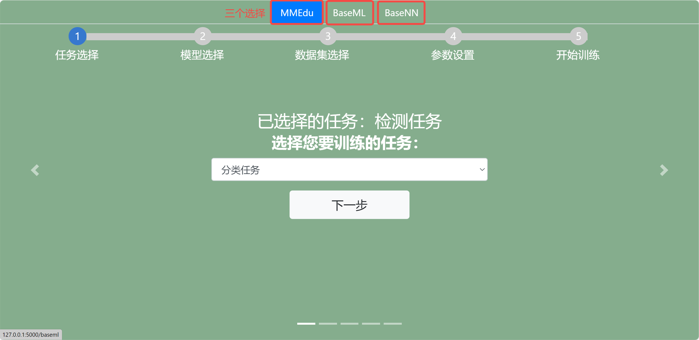
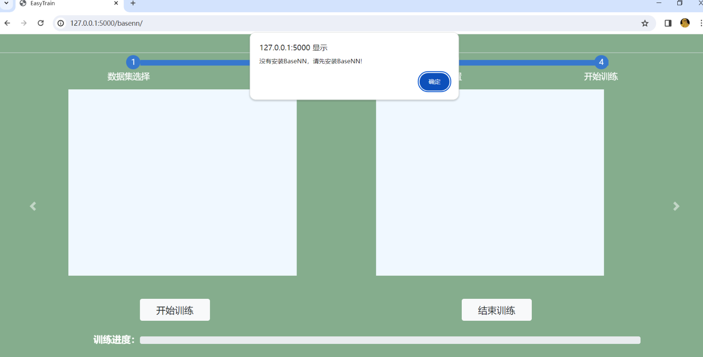
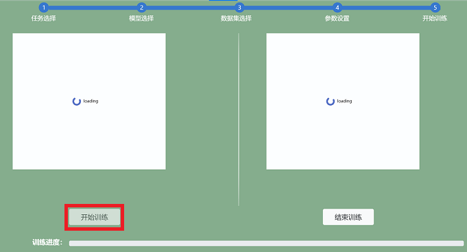

# 案例三：用BaseNN训练搭建全连接神经网络（鸢尾花）

## 项目说明：

BaseNN可以方便地逐层搭建神经网络，支持搭建CNN和RNN，或二者的结合，训练深度学习模型。可前往[解锁BaseNN基本使用方法的教程](https://xedu.readthedocs.io/zh/master/basenn/introduction.html#id2)。本项目核心功能是完成使用经典的鸢尾花数据集完成鸢尾花分类，最后完成了一个简单的鸢尾花分类小应用，输入花萼长度、宽度、花瓣长度、宽度，可以输出预测结果。

项目地址：[https://www.openinnolab.org.cn/pjlab/project?id=641bc2359c0eb14f22fdbbb1&sc=635638d69ed68060c638f979#public](https://www.openinnolab.org.cn/pjlab/project?id=641bc2359c0eb14f22fdbbb1&sc=635638d69ed68060c638f979#public)

数据集：UCI Machine Learning Repository: Iris Data Set（[https://archive.ics.uci.edu/ml/datasets/Iris](https://archive.ics.uci.edu/ml/datasets/Iris)）

项目来源：《人工智能初步》人教地图p69

## 项目步骤：

### 任务一：鸢尾花模型训练

#### 第0步 引入包（建议将库更新为最新版本再导入）

```python
# 导入BaseNN库
from BaseNN import nn
```

#### 第1步 声明模型

```python
model = nn('cls')
```

#### 第2步 载入数据

```python
train_path = 'data/iris_training.csv'
model.load_tab_data(train_path, batch_size=120)
```

#### 第3步 搭建模型

逐层添加，搭建起模型结构。注释标明了数据经过各层的维度变化。

```python
model.add(layer='linear',size=(4, 10),activation='relu') # [120, 10]
model.add(layer='linear',size=(10, 5), activation='relu') # [120, 5]
model.add(layer='linear', size=(5, 3), activation='softmax') # [120, 3]
```

以上使用`add()`方法添加层，参数`layer='linear'`表示添加的层是线性层，`size=(4,10)`表示该层输入维度为4，输出维度为10，`activation='relu'`表示使用ReLU激活函数。

#### 第4步 模型训练

模型训练可以采用以下代码：

```python
# 设置模型保存的路径
model.save_fold = 'checkpoints/iris_ckpt'
# 模型训练
model.train(lr=0.01, epochs=1000)
```

也可以使用继续训练：

```python
checkpoint = 'checkpoints/basenn.pth'
model.train(lr=0.01, epochs=1000, checkpoint=checkpoint)
```

参数`lr`为学习率， `epochs`为训练轮数，`checkpoint`为现有模型路径，当使用`checkpoint`参数时，模型基于一个已有的模型继续训练，不使用`checkpoint`参数时，模型从零开始训练。

#### 第5步 模型测试

用测试数据查看模型效果。

```python
import numpy as np
# 用测试数据查看模型效果
model2 = nn('cls')
test_path = 'data/iris_test.csv'
test_x = np.loadtxt(test_path, dtype=float, delimiter=',',skiprows=1,usecols=range(0,4)) 
res = model2.inference(test_x, checkpoint="checkpoints/iris_ckpt/basenn.pth")
model2.print_result(res)

# 获取最后一列的真实值
test_y = np.loadtxt(test_path, dtype=float, delimiter=',',skiprows=1,usecols=4) 
# 定义一个计算分类正确率的函数
def cal_accuracy(y, pred_y):
    res = pred_y.argmax(axis=1)
    tp = np.array(y)==np.array(res)
    acc = np.sum(tp)/ y.shape[0]
    return acc

# 计算分类正确率
print("分类正确率为：",cal_accuracy(test_y, res))
```

用某组测试数据查看模型效果。

```python
# 用某组测试数据查看模型效果
data = [test_x[0]]
checkpoint = 'checkpoints/iris_ckpt/basenn.pth'
res = model.inference(data=data, checkpoint=checkpoint)
model.print_result(res) # 输出字典格式结果
```

参数`data`为待推理的测试数据数据，该参数必须传入值；

`checkpoint`为已有模型路径，即使用现有的模型进行推理。

上文介绍了借助BaseNN从模型训练到模型测试的简单方法，此外BaseNN支持搭建CNN和RNN，或二者的结合。可前往[解锁BaseNN基本使用方法的教程](https://xedu.readthedocs.io/zh/master/basenn/introduction.html#id2)。

### 任务二：模型转换和后续应用

如果想要快速部署模型，可进行模型转换。BaseNN模型转换的代码如下：

```python
from BaseNN import nn
model = nn('cls')
model.convert(checkpoint="checkpoints/iris_ckpt/basenn.pth",out_file="basenn_cd.onnx")
```

借助生成的示例代码，简单修改（如下所示），即可在本地或者硬件上运行（提前[安装XEduHub库](https://xedu.readthedocs.io/zh/master/xedu_hub/quick_start.html#id3)），甚至可以借助一些开源工具库做一个网页应用。

```python
from XEdu.hub import Workflow as wf

# 模型声明
basenn = wf(task='basenn',checkpoint='basenn_cd.onnx')
# 待推理数据，此处仅以随机二维数组为例，以下为1个维度为4的特征
table = [[5.9, 3. , 4.2, 1.5]]
# 模型推理
res = basenn.inference(data=table)
# 标准化推理结果
result = basenn.format_output(lang="zh")
```

还可以借助一些开源工具库（如[PyWebIO](https://xedu.readthedocs.io/zh/master/how_to_use/scitech_tools/pywebio.html#webpywebio)）编写一个人工智能应用，如下代码可实现手动输入观察到的鸢尾花特征，输出花种判断。

```python
from pywebio.input import *
from pywebio.output import *
from XEdu.hub import Workflow as wf

# 模型声明
basenn = wf(task='basenn',checkpoint='basenn_cd.onnx')
def pre():  
    a=input('请输入花萼长度：', type=FLOAT)
    b=input('请输入请花萼宽度：', type=FLOAT)
    c=input('请输入花瓣长度：', type=FLOAT)
    d=input('请输入花瓣宽度：', type=FLOAT)
    data = [a,b,c,d]
    result = basenn.inference(data=data)
    res = basenn.format_output(lang="zh")
    label=['山鸢尾','变色鸢尾','维吉尼亚鸢尾']
    put_text('预测结果是：', str(label[res[0]['预测值']]))
if __name__ == '__main__':
    pre()
```

运行效果如下：


更多模型转换和应用的教程详见[模型转换和应用](https://xedu.readthedocs.io/zh/master/how_to_use/support_resources/model_convert.html#)[https://xedu.readthedocs.io/zh/master/how_to_use/support_resources/model_convert.html#](https://xedu.readthedocs.io/zh/master/how_to_use/support_resources/model_convert.html#)。

### 拓展阅读：无代码完成本项目的模型训练和转换

本地版XEdu一键安装包中内置了无代码训练工具，支持BaseNN模型训练，我们也可以使用无代码方式完成鸢尾花模型训练和转换。无代码训练工具使用的步骤与前文介绍的代码实现方式完全一致。

#### 第0步 模块选择

EasyTrain界面打开之后，选择BaseNN页面。


#### 第1步 数据集选择

在下拉框中指定训练的数据集，网页会读取XEdu/dataset/basenn之下数据集。一键安装包中自带数据集：iris/iris_test.csv，iris/iris_training.csv。

数据集的格式要求为：[csv文件](https://xedu.readthedocs.io/zh/master/basenn/introduction.html#id21)(BaseNN任务)。纵轴为样本，横轴为特征，第一行为表头，最后一列为标签。


#### 第2步 模型搭建

点击“添加网络层”可以增加网络层，点击右侧“×”可以减少网络层。

注意：

- 第一层的输入维度要和数据集的特征维度（特征的数量）相等。
- 因为数据是从上一层流向下一层，因此下一层的输入维度要和上一层的输出维度保持相等。
- 最后一层的输出维度要和类别数相同。


#### 第3步 参数设置

点击“设置基本参数↓”，可以设置学习率，批次大小，训练轮数，随机种子。完成设置后点击“确认”按钮，成功设置会弹出窗口提醒设置成功。


点击“设置其他训练参数”，可以设置分类数量（仅用于分类任务），优化器，权重衰减、设备、预训练模型。完成设置后点击“提交”按钮。

*预训练模型放置位置标准：XEdu/checkpoints/训练任务/数据集名（严格一致）/预训练模型.pth


更多参数学习请跳转[深度学习训练参数详解](https://xedu.readthedocs.io/zh/master/dl_library/parameter_explain.html)


在完成参数设置后，点击右侧的"生成代码"，可以生成训练代码，生成代码之后才可以训练。
生成的代码会显示在上方的代码框，点击右上角复制按钮还可以一键复制代码。


#### 第4步 开始训练

代码生成之后点击"进入训练"按钮即可跳转至训练页面，工具会先检查你的电脑有没有安装MMEdu的库，如果没有请先去”小黑窗“进行[pip安装BaseNN](https://xedu.readthedocs.io/zh/master/basenn/installation.html#)。



点击“开始训练”按钮即可一键开始训练模型。



出现“loading”表示模型正在训练中，但是也有可能是因为没有安装相应的库，数据集路径错误，数据集为空等等原因导致训练失败，所以先检查一下后台”小黑窗“有没有报错。

如果有报错，修改相应的错误，再通过刷新页面或者关闭”小黑窗“重启工具的方式重新训练。如果没有报错，请耐心等待，由于本地cpu训练模型的速度较慢，可以先去喝杯水休息一下~

若想中断训练，可以点击“停止训练”按钮。


在训练过程中，loss曲线会实时显示在左侧的Loss Chart框中，accuracy曲线会实时显示在左侧的Accuracy  Chart框中。坐标轴的横坐标为训练轮数，纵坐标为对应数值。

自己训练的模型文件将保存在XEdu/my_checkpoints中。每次训练都会生成一个文件夹，可以通过文件夹名称上的日期时间找到对应的模型。


完成模型训练之后，窗口会弹出模型转换，可以点击“是”可实现pth格式模型准换成onnx格式模型。若要自行转换可使用[EasyConvert](https://xedu.readthedocs.io/zh/master/easydl/easyconvert.html)。


如需尝试用代码完成BaseNN模型训练或了解BaseNN具体功能，请参照[BaseNN的教程](https://xedu.readthedocs.io/zh/master/basenn.html)。
