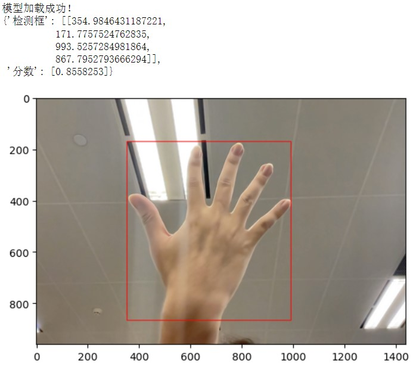

# 案例零：快速体验深度学习（无代码训练和推理）

## 项目说明：

XEduHub针对一些常见任务，提供了现成的优质模型，可以完成目标检测、关键点检测等等，还可以实现自训练模型推理，用示例详见[XEduHub功能详解](https://xedu.readthedocs.io/zh-cn/master/xedu_hub/introduction.html#xeduhub)。本项目完成了直接调用XEduHub一个内置模型det_hand实现检测手的功能，只用7行代码就可实现。


## 项目步骤：

### 任务一：检测单任务（以人手目标检测为例）

下面是人手目标检测模型（det_hand）的完整代码：

```python
from XEdu.hub import Workflow as wf # 导入库
hand_det = wf(task='det_hand') # 实例化模型
img_path = 'demo/hand1.jpg'  # 指定进行推理的图片路径
boxes,img_with_box = hand_det.inference(data=img_path,img_type='cv2') # 进行推理
format_result =hand_det.format_output(lang='zh') # 结果格式化输出
hand_det.show(img_with_box) # 可视化结果
hand_det.save(img_with_box,'demo/img_with_box.jpg') # 保存可视化结果
```


#### 第0步 导入库（建议将库更新为最新版本再导入）

```python
from XEdu.hub import Workflow as wf # 导入库
```

