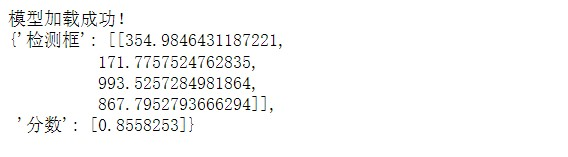
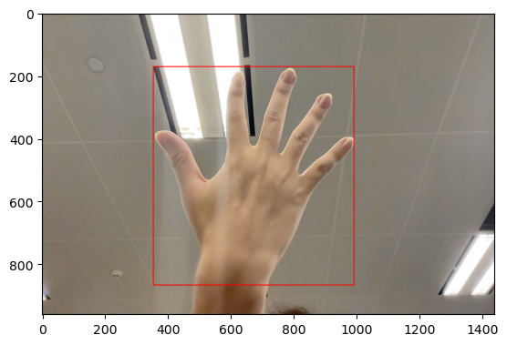
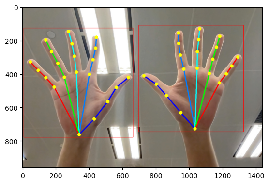

# 案例一：用XEduhub执行推理任务（检测任务）

## 项目说明：

XEduHub针对一些常见任务，提供了现成的优质模型，可以完成目标检测、关键点检测等等，还可以实现自训练模型推理，用示例详见[XEduHub功能详解](https://xedu.readthedocs.io/zh/master/xedu_hub/introduction.html#xeduhub)。本项目完成了直接调用XEduHub一个内置模型det_hand实现检测手的功能，只用7行代码就可实现。

项目地址：[用XEduhub执行推理任务（检测任务）](https://www.openinnolab.org.cn/pjlab/project?id=6612327ea888634b8a6de8f6&backpath=/pjlab/projects/list#public)
[https://www.openinnolab.org.cn/pjlab/project?id=6612327ea888634b8a6de8f6&backpath=/pjlab/projects/list#public](https://www.openinnolab.org.cn/pjlab/project?id=6612327ea888634b8a6de8f6&backpath=/pjlab/projects/list#public)

## 项目步骤：

### 任务一：检测单任务（以人手目标检测为例）

下面是人手目标检测模型（det_hand）的完整代码：

```python
from XEdu.hub import Workflow as wf # 导入库
hand_det = wf(task='det_hand') # 实例化模型
img_path = 'demo/hand1.jpg'  # 指定进行推理的图片路径
boxes,img_with_box = hand_det.inference(data=img_path,img_type='cv2') # 进行推理
format_result =hand_det.format_output(lang='zh') # 结果格式化输出
hand_det.show(img_with_box) # 可视化结果
hand_det.save(img_with_box,'demo/img_with_box.jpg') # 保存可视化结果
```


#### 第0步 导入库（建议将库更新为最新版本再导入）

```python
from XEdu.hub import Workflow as wf # 导入库
```

#### 第1步 模型声明

```python
hand_det = wf(task='det_hand') # 实例化模型
```

在第一次声明模型时代码运行用时较长，是因为要将预训练模型从云端下载到本地中，从而便于用户进行使用。

当代码在本地运行时，会先在本地的同级目录`checkpoints`的文件夹中寻找是否有已下载的预训练模型，如果没有，到本地缓存中寻找，如果本地缓存没有，查看是不是指定了模型的路径，如果都没有，到网络下载。

#### 第2步 指定一张待检测的图片

```python
img_path = 'demo/hand.jpg'  # 指定进行推理的图片路径
```

#### 第3步 模型推理

```python
boxes = hand_det.inference(data=img_path) # 进行推理
```

[[354.98464312 171.77575248 993.5257285  867.79527937]]

变量boxes以二维数组的形式保存了检测框左上角顶点的坐标(x1,y1)和右下角顶点的坐标(x2,y2)（之所以是二维数组，是因为该模型能够检测多个人手，因此当检测到多个人手时，就会有多个[x1,y1,x2,y2]的一维数组，所以需要以二维数组形式保存）

#### 第4步 结果输出

XEduHub提供了一种便捷的方式，能够以标准美观的格式查看检测框坐标以及置信度，代码如下：

```python
format_result = hand_det.format_output(lang='zh') # 结果格式化输出
```


#### 第5步 可视化结果

在**推理函数**变量中加入`img_type='cv2'`，这时候会有两个返回值，除了第一个是检测框之外，还返回了每个像素点的颜色信息`img_with_keypoints`。再通过`show()`函数就可以看到像素点组成图片可以看到，此时的图片带有目标检测框。

```python
boxes,img_with_box = hand_det.inference(data=img_path,img_type='cv2') # 进行推理
hand_det.show(img_with_box) # 可视化结果
```


XEduHub内置了多个模型，像目标检测任务，除了人手目标检测，还支持人脸目标检测、人体目标检测……使用方法基本一致，更多使用示例详见[XEduHub功能详解](https://xedu.readthedocs.io/zh/master/xedu_hub/introduction.html#xeduhub)。

也可以通过学习“[XEduHub实例代码-入门完整版入门](https://www.openinnolab.org.cn/pjlab/project?id=65518e1ae79a38197e449843&backpath=/pjedu/userprofile?slideKey=project#public)”项目进行学习，https://www.openinnolab.org.cn/pjlab/project?id=65518e1ae79a38197e449843&backpath=/pjedu/userprofile?slideKey=project#public

### 任务二：检测多任务（目标检测+关键点检测）

如果再结合关键点检测模型，还能实现多任务的检测。下面几行代码，实现了先检测手，再对每个检测到的手进行关键点检测。

```python
from XEdu.hub import Workflow as wf # 导入库
det  = wf(task='det_hand') # 实例化模型
model = wf(task='pose_hand21') # 实例化模型
img_path = 'demo/hand3.jpg' # 指定进行推理的图片路径
bboxs,img = det.inference(data=img_path,img_type='cv2') # 进行推理
for i in bboxs:
    keypoints,img = model.inference(data=img,img_type='cv2',bbox=i) # 进行推理
model.show(img) # 可视化结果
```


此外还有多种模型组合运用的案例，可以通过学习“[XEduHub实例代码-入门完整版入门](https://www.openinnolab.org.cn/pjlab/project?id=65518e1ae79a38197e449843&backpath=/pjedu/userprofile?slideKey=project#public)”项目进行学习，https://www.openinnolab.org.cn/pjlab/project?id=65518e1ae79a38197e449843&backpath=/pjedu/userprofile?slideKey=project#public