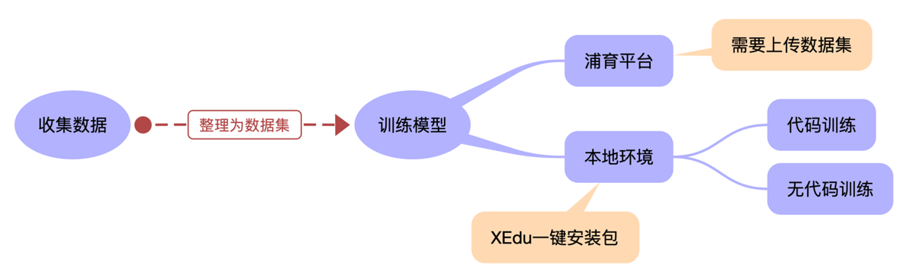
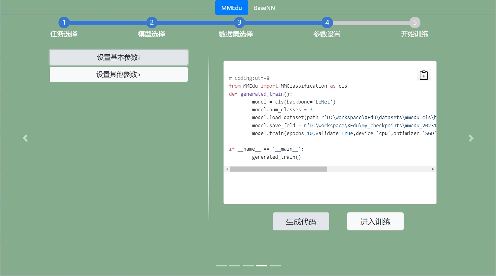

# 用AI解决真实问题的技术地图


数据、算法和算力被公认为推动人工智能发展的三驾马车。随着深度学习技术的发展，人工智能的门槛逐步下降。浦育平台、XEdu为代表系列人工智能开发工具发布以来，越来越多的老师开始认同，借助大量数据和开源算法，训练具备一定智能的模型，从而解决一些简单的真实问题，应该成为中小学人工智能课程的核心内容。

## 一、用AI解决真实问题的流程分析

人工智能的开发框架很多，相关的工具也很多。因为老师们在缺少对工具全面了解的情况下，很难设计出一份合理的技术地图，容易走弯路。为了能更加清晰地表述，本文以劳动和科学教育中常常遇到的昆虫识别问题为例，结合一个害虫识别应用的开发过程来介绍各种技术工具的选择。

首先，要训练一个昆虫的分类或者识别模型。人工智能的核心是模型，用人工智能解决真实问题实际上可以等同为用模型来解决问题。要识别害虫，可以借助提供网络API服务的AI开放平台，也可以使用一个已经训练好的昆虫模型。但如果AI模型不是自己训练，显然有“攘人之美”之嫌。当然，我们常常遇到的真实情况是AI开放平台要收费或者没有相关功能，找到的预训练模型的识别效果不好或者根本找不到。而农场中出现的昆虫种类并不多，完全可以自行收集数据训练模型。

其次，训练好的模型需要部署为智能应用。应用模型也有多种选择，一种是将模型部署在服务器或者可以长时间开机的电脑上，提供WebAPI服务，使用带摄像头和Wi-Fi的开源硬件，将害虫的照片发回到Web服务器，然后得到推理结果。一般来说，只有较大的模型才需要这么做。另一种是直接将模型运行在开源硬件上，拍摄、识别和执行等功能全部整合在一起。能运行Python的开源硬件，绝大多数都支持ONNX的模型推理，如行空板、树莓派和爱克斯板等。只要模型不要太大，都能直接部署推理。


具体的流程分析如图所示。而识别昆虫的模型，使用图像分类技术即可，选择常见的MobileNet模型约10M，ResNet18模型也才50M。以爱克斯板为例，即使不做OpenVINO加速，推理速度也很快。

## 二、训练AI模型的技术地图

对自行训练模型来说，收集数据是一件最核心的工作。因为算法是开源的，算力是购买的，对学生来说核心工作也只有数据收集、清洗等。一般来说，如果不追求精度，每个类别的昆虫有数十张就够了，采用迁移学习的方式，训练速度很快，甚至可以直接在网页端训练。浦育平台的“AI体验”页面就提供了网页端训练模型的功能，即图像分类模块，采用的算法就是MobileNet V2。这个训练模型的过程不需要写代码。


如果数据比较多，那么建议选择MMEdu来训练模型。用MMEdu训练模型，核心代码就六行。只要按照<a href="https://xedu.readthedocs.io/zh/master/mmedu/introduction.html#imagenet">ImageNet</a>的数据集格式，将昆虫图片放在不同的分类目录中即可。具体可以参考XEdu的帮助文档<a href="https://xedu.readthedocs.io/zh/master/how_to_use/dl_library/howtomake_imagenet.html#">《从零开始制作一个ImageNet格式数据集》</a>，或者打开浦育平台的<a href="https://www.openinnolab.org.cn/pjlab/dataset/d74c1bb3c1564bb78db883e21ad66580">“猫狗”</a><a href="https://www.openinnolab.org.cn/pjlab/dataset/6464601f3c0e930cb50e15c8">“手写体数字”</a>之类的数据集，看一眼就明白。即使用MMEdu来训练，也有几种方式可以选择，如图所示。



1. 用浦育平台提供的服务器（容器）训练模型。浦育平台还提供了GPU服务器，训练速度比普通电脑要快一些。只是GPU服务器数量少，如果在线人多就需要耐心等一两分钟。唯一不方便的是，需要将数据集打包上传到浦育平台。
2. 搭建本地XEdu环境训练模型。即使在浦育平台上，训练模型一般也选择XEdu服务器，如果自己的电脑配置不会太古老，能安装Win7的64位，或者Win10、Win11等操作系统的，那就下载XEdu一键安装包，解压后训练环境就配置好了。XEdu提供了各种参考代码，改一下目录就能使用。

实际上，XEdu也提供了无代码训练模型的工具。运行<a href="https://xedu.readthedocs.io/zh/master/easydl/easytrain.html">EasyTrain</a>系列工具。系统会打开一个网页，按照网页上的提供，将数据集放在相应的位置，一步一步操作，最后生成代码，并直接开始模型训练，如图所示。



此外，微软提供了一个名叫Lobe（https://www.lobe.ai/）的工具，不需要编写代码即可训练出AI模型。相信这点工具会越来越多。


## 三、应用AI模型的技术地图

模型训练结束后，接下来就是模型应用推理了。不同的AI模型有不同的推理框架，我们推荐使用ONNX格式。这是一种非常通用的模型交换格式，推理环境的安装很容易，推理速度又快。MMEdu提供ONNX模型转换的功能，参考代码如“model.convert(checkpoint=in_file, out_file=out_file)”。如果使用EasyTrain工具，训练结束后都会提示要不要转换为ONNX。

用浦育平台的“AI体验”网页中图像分类模块训练的模型，也能转换为ONNX格式的模型。在浦育平台的“项目”栏目输入关键字“tensorflow”，即可找到类似<a href="https://www.openinnolab.org.cn/pjlab/project?id=647dc2a0d6c5dc73107c7449&backpath=/pjlab/projects/list#public">“模型转换：从TensorFlowJS到ONNX”</a>的项目，任选一个，按照提示，即可完成模型转换。

对于ONNX模型的推理，实际上就属于传统编程的学习内容了。使用模型推理和使用一个Python的库没有任何区别。Mind+中有个名叫BaseDeploy的插件，安装后就能用图形化的方式写推理代码了。MMEdu在转换模型的同时，会产生Python参考代码，简洁易懂，其使用的是XEduhub库。对于浦育平台训练出来的ONNX模型，使用“mmcls = wf(task='mmedu',checkpoint='insect.onnx')”即可推理。下面的代码是将图片“insect01.jpg”进行了推理，并输出了结果。

```python
from XEdu.hub import Workflow as wf # 导入库
mmcls = wf(task='mmedu',checkpoint='insect.onnx') # 指定使用的onnx模型
result, result_img =  mmcls.inference(data='./insect01.jpg',img_type='pil') # 进行模型推理
format_result = mmcls.format_output(lang="zh") # 推理结果格式化输出
print(format_result) # 输出结果
```

需要说明的是，著名的图形化工具Mind+也支持XEduHub，具体使用请参考教程。
[在Mind+中使用XEduHub](../xedu_hub/mindplus_xeduhub.html)


## 四、小结

如上所述，我们成功地完成了一个昆虫识别的AI应用。限于篇幅，本文没有展开介绍如何从摄像头中获取图片，如何根据推理结果做出不同的执行动作等。在这个过程中，学生们有多种可选的方法和工具，具体要视具体情况作出合适的选择。

而本文在介绍各种技术的过程中，也展示了人工智能教育区别于传统编程教育的最重要标志，那就是要训练AI模型。而在浦育平台和XEdu的帮助下，训练模型真的没有什么难度。“右手写代码，左手训模型”，这应该是中小学人工智能教育的常态。

## 五、附录

人工智能科创活动中的常见工具盘点。

### 数据采集和处理工具

- BaseDT（数据转换工具）
- Labelbee、Labelme（数据标注工具）

### 模型训练工具

深度学习框架

- MMEdu
- BaseeNN
- BaseML
- Keras

AI开发平台或者工具

- 浦育平台
- Lobe
- EasyTrain
- ModelArts
- paddlehub


### 模型部署工具

- XEduhub
- BaseDeploy


### 可部署模型的硬件

- 行空板
- 树莓派
- 拿铁熊猫
- 爱克斯板


