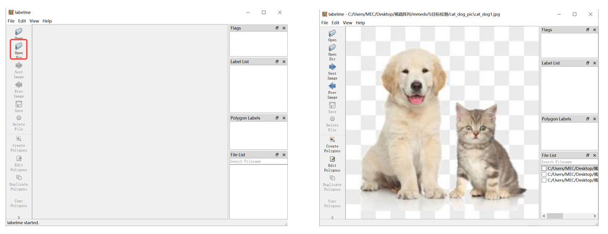
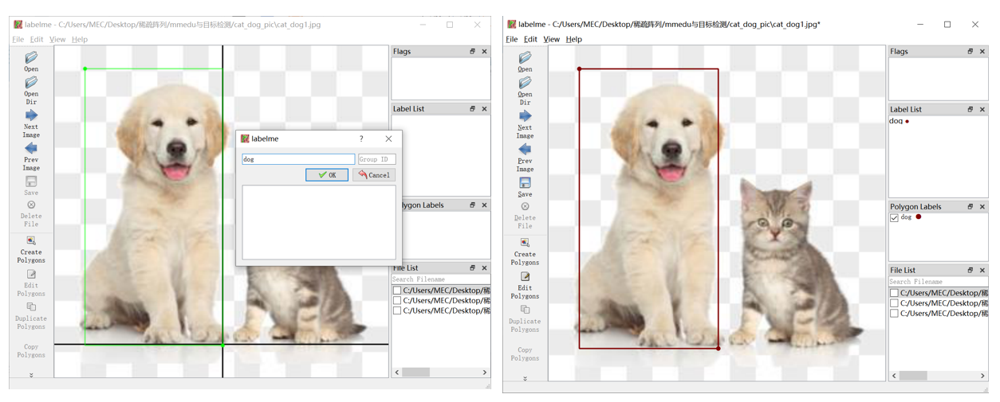

# 数据集标注工具

### labelme

官网：[https://github.com/wkentaro/labelme](https://github.com/wkentaro/labelme)

1.安装：打开本地Python IDE终端或命令提示符，输入pip安装命令`pip install labelme`（建议python版本选择python3.8）

2.操作步骤：

a.在终端重新输入labelme即可启动labelme，此时会自动出现labelme界面。

b.使用Open Dir或左上角File打开图片文件夹。



c.右键选择Create Rectangle创建矩形框进行标注。点击鼠标左键，确认起始位置，注意设置类别。



d.左侧功能栏的save保存也亮了，点击保存即保存至文件夹，会自动保存为以图片名命名的labelme格式的json文件中。比较便捷的方式可以开启自动保存后再开始标注，便不再需要每标注一张图片都点一次保存。

**快速标注小技巧：使用快捷键**

设置自动保存的方式：左上角点击File文件，选择Save Automatically。

标注快捷键：按快捷键“ctrl”+“r”使用矩形框标注，鼠标左键并点击后框出物体，并输入类别，并点击ok完成标注，若标注框和类别不正确，按快捷键“ctrl”+“j”；若标注框和类别不正确，按快捷键“ctrl”+“j”对框的大小位置修改，“ctrl”+“j”的编辑模式下左键点击框按“ctrl”+“e”修改类别。

### labelbee

1.下载链接：[https://github.com/open-mmlab/labelbee-client](https://github.com/open-mmlab/labelbee-client)

2.操作步骤：

a.双击运行labelbee-client.exe，可以直接切换至中文。

b.新建单步骤项目即可开始标注，填写项目名称，选择图片文件夹、结果文件夹后到最下方，需要完成属性标注的设置，设置为要标注的类别，如plate。

c.点击鼠标左键，确认起始位置，拖拽鼠标开始标注，注意选择我们设置的类别。

d.标注完成后点击左上角的返回按钮返回至项目列表导出标注结果。可选多种格式，默认是labelbee格式，我们选择COCO并选择导出路径即可。

**labelbee也有网页版本哦~**

网页版数据标注：[https://www.openinnolab.org.cn/pjLab/projects/channel](https://www.openinnolab.org.cn/pjLab/projects/channel)


### 自制工具（基于WorkFlow思想）
#### 图像分类采集（基础）
我们如果想要用手机采集数据，然后存到电脑里，好像比较麻烦，我们可以写一个网页服务，点击按钮，就可以保存图片到对应的类别文件夹。这样就很方便。贡献者也分享了他们编写的代码，供大家参考：
```python
'''
# 网络摄像头代码，用于采集数据（图像），功能类似浦育平台的图像分类页面。
# 拍摄的图像将存放在同一级目录的“my_dataset”文件夹，按照三个类别保存
# 代码编写：谢作如 邱奕盛(2024.7.10)
'''

import remi.gui as gui
from remi import start, App
import time,threading
import qrcode,base64,io,cv2
import socket,os

camera = cv2.VideoCapture(0)
# 临时变量，用于保存画面
tempcam = None
# 图片名称编号
f_num = 1
image_path = 'my_dataset' #数据存储位置
app_title = 'Web摄像头数据采集器-图像'  #网页标题

# 本机IP地址
def get_host_ip():
    s = socket.socket(socket.AF_INET, socket.SOCK_DGRAM)
    try:
        s.connect(("8.8.8.8", 80))
        ip = s.getsockname()[0]
    finally:
        s.close()
    return ip

# 获取图像
def get_img(data):
    img = qrcode.make(data)
    out = io.BytesIO()
    img.save(out, 'PNG')
    base64_data=base64.b64encode(out.getvalue())
    s=base64_data.decode()
    data='data:image/jpeg;base64,%s'%s
    return data

# 返回摄像头画面，自定义大小
def get_frames(x,y):
    global tempcam
    success, frame = camera.read()  # read the camera frame
    if success:
        tempcam = frame
        frame = cv2.flip(frame, 1, dst=None)
        frame = cv2.resize(frame, (x, y), interpolation=cv2.INTER_LINEAR)
        image = cv2.imencode('.jpg', frame)[1]
        base64_data = str(base64.b64encode(image))[2:-1]
        data='data:image/jpeg;base64,%s'%base64_data
        return data
    else:
        return get_img("摄像头启动失败")

# Web主程序
class MyApp(App):
    def __init__(self, *args):
        super(MyApp, self).__init__(*args)

    def main(self):
        container = gui.VBox(width=900, height=470,style={'margin':'0px auto'})
        bts = gui.HBox(width=600, height=50)
        self.lbl_01 = gui.Label(app_title,style={'font-size': '25px'})
        self.lbl_2 = gui.Label('请用浏览器访问：http://'+str(get_host_ip())+':8001')
        self.img_1 = gui.Image(get_frames(640,480))
        self.bt1 = gui.Button('[ 保存画面-类别1 ]')
        self.bt2 = gui.Button('[ 保存画面-类别2 ]')
        self.bt3 = gui.Button('[ 保存画面-类别3 ]')
        self.lbl_9 = gui.Label(' ')

        # 按钮按下时执行
        self.bt1.onclick.do(self.on_button_pressed,1)
        self.bt2.onclick.do(self.on_button_pressed,2)
        self.bt3.onclick.do(self.on_button_pressed,3)

        # 添加到网页上
        container.append(self.lbl_01)
        container.append(self.lbl_2)
        container.append(self.img_1)
        bts.append(self.bt1)
        bts.append(self.bt2)
        bts.append(self.bt3)
        container.append(bts)
        container.append(self.lbl_9)

        # 开启新的进程刷新画面
        t = threading.Thread(target=self.showimg)
        t.start()

        # returning the root widget
        return container

    def on_button_pressed(self, emitter, n):
        path = image_path
        if not os.path.exists(path):
            os.mkdir(path)
        path = os.path.join(path,'class'+str(n))
        if not os.path.exists(path):
            os.mkdir(path)
        f_data = time.strftime("%Y-%m-%d-%H_%M_%S",time.localtime())
        path = os.path.join(path,str(f_data)+'.jpg')
        cv2.imwrite(path,tempcam)
        self.lbl_9.set_text('图片保存成功！路径为：' + str(path))

    # 刷新网页的摄像头画面
    def showimg(self):
        while True:
            self.img_1.set_image(get_frames(640,360))
            time.sleep(0.2)

# 输出连接地址
print('请用浏览器访问：http://'+str(get_host_ip())+':8001')

# 启动服务（如果端口80冲突，可改为其他值）
start(MyApp,title='摄像头实时视频',address='0.0.0.0',port=8001)
```
#### 图像分类采集（远程）
上面的代码其实只能调用电脑的摄像头，这里我们另外写了一段代码来调用手机摄像头。
```python
# 网络摄像头代码，用于采集数据（图像）
# 代码编写：谢作如 邱奕盛(2023.1.10)

import remi.gui as gui
from remi import start, App
import time,threading
import qrcode,base64,io,cv2
import socket
import os

camera = cv2.VideoCapture(0)
# 临时变量，用于保存画面
tempcam = None
# 图片名称编号
f_num = 1

# 本机IP地址
def get_host_ip():
    s = socket.socket(socket.AF_INET, socket.SOCK_DGRAM)
    try:
        s.connect(("8.8.8.8", 80))
        ip = s.getsockname()[0]
    finally:
        s.close()
    return ip

# 二维码信息提示
def get_img(data):
    img = qrcode.make(data)
    out = io.BytesIO()
    img.save(out, 'PNG')
    base64_data=base64.b64encode(out.getvalue())
    s=base64_data.decode()
    data='data:image/jpeg;base64,%s'%s
    return data

# 返回摄像头画面，自定义大小
def get_frames(x,y):
    global tempcam
    success, frame = camera.read()  # read the camera frame
    if success:
        tempcam = frame
        frame = cv2.flip(frame, 1, dst=None)
        frame = cv2.resize(frame, (x, y), interpolation=cv2.INTER_LINEAR)
        image = cv2.imencode('.jpg', frame)[1]
        base64_data = str(base64.b64encode(image))[2:-1]
        data='data:image/jpeg;base64,%s'%base64_data
        return data
    else:
        return get_img("摄像头启动失败")

# Web主程序
class MyApp(App):
    def __init__(self, *args):
        super(MyApp, self).__init__(*args)

    def main(self):
        container = gui.VBox(width=700, height=450,style={'margin':'0px auto'})
        bts = gui.HBox(width=300, height=50)
        self.lbl_01 = gui.Label('Web摄像头画面采集器',style={'font-size': '25px'})
        self.lbl_2 = gui.Label('请用浏览器访问：http://'+str(get_host_ip())+':8001')
        self.lbl_9 = gui.Label(' ')
        self.img_1 = gui.Image(get_frames(640,360))
        self.bt1 = gui.Button('[ 保存画面-按序号命名 ]')
        self.bt2 = gui.Button('[ 保存画面-按时间命名 ]')

        # 按钮按下时执行
        self.bt1.onclick.do(self.on_button_pressed,1)
        self.bt2.onclick.do(self.on_button_pressed,2)

        # 添加到网页上
        container.append(self.lbl_01)
        container.append(self.lbl_2)
        container.append(self.lbl_9)
        container.append(self.img_1)
        bts.append(self.bt1)
        bts.append(self.bt2)
        container.append(bts)

        # 开启新的进程刷新画面
        t = threading.Thread(target=self.showimg)
        t.start()

        # returning the root widget
        return container

    def on_button_pressed(self, emitter, n):
        if not os.path.exists('webcam'):
            os.mkdir('webcam')
    # 1，按照序号保存；2，按照时间保存
        if n==1:
            global f_num
            f_num = f_num + 1
            cv2.imwrite('webcam/'+str(f_num) + '.jpg',tempcam)
        if n==2:
            f_data = time.strftime("%Y-%m-%d-%H_%M_%S",time.localtime())
            cv2.imwrite('webcam/'+str(f_data) + '.jpg',tempcam)
    # 刷新网页的摄像头画面
    def showimg(self):
        while True:
            self.img_1.set_image(get_frames(640,360))
            time.sleep(0.2)

# 输出连接地址
print('请用浏览器访问：http://'+str(get_host_ip())+':8001')

# 启动服务（如果端口80冲突，可改为其他值）
start(MyApp,title='摄像头实时视频',address='0.0.0.0',port=8001)
```

#### 手势分类采集
我们其实可以在保存的时候，直接保存手部关键点，只要稍微修改按钮点击的响应函数就行了。在浦育平台上，我们已经看到了这样的AI体验，其实自己实现也很简单。贡献者也分享了他们编写的代码，供大家参考：

```python
'''
# 网络摄像头代码，用于采集数据（csv），功能类似浦育平台的手势分类页面。
# 备注：该程序只能识别一只手，每一次启动会清空数据。
# 代码编写：谢作如 邱奕盛(2024.7.10)
'''

import remi.gui as gui
from remi import start, App
import time,threading
import qrcode,base64,io,cv2
import socket,os,csv
from XEdu.hub import Workflow as wf # 导入库

camera = cv2.VideoCapture(0)
# 临时变量，用于保存画面
tempcam = None
# 图片名称编号
f_num = 1
pose_path = 'hand.csv' #数据存储文件名称
app_title = 'Web摄像头数据采集器-手势'  #网页标题

k  =  []

# 本机IP地址
def get_host_ip():
    s = socket.socket(socket.AF_INET, socket.SOCK_DGRAM)
    try:
        s.connect(("8.8.8.8", 80))
        ip = s.getsockname()[0]
    finally:
        s.close()
    return ip

# 获取图像
def get_img(data):
    img = qrcode.make(data)
    out = io.BytesIO()
    img.save(out, 'PNG')
    base64_data=base64.b64encode(out.getvalue())
    s=base64_data.decode()
    data='data:image/jpeg;base64,%s'%s
    return data

# 返回摄像头画面，自定义大小
def get_frames(x,y):
    global tempcam,k
    success, frame = camera.read()  # read the camera frame
    if success:
        tempcam = frame
        frame = cv2.flip(frame, 1, dst=None)
        frame = cv2.resize(frame, (x, y), interpolation=cv2.INTER_LINEAR)
        bboxs,img = det.inference(data= frame ,img_type='cv2') # 进行推理
        # print(bboxs)
        if len(bboxs)>0:
            keypoints,img = model.inference(data=img,img_type='cv2',bbox=bboxs[0]) # 进行推理
            format_result = model.format_output(lang='en', isprint=False)
            k = format_result['keypoints']
        image = cv2.imencode('.jpg', img)[1]
        base64_data = str(base64.b64encode(image))[2:-1]
        data='data:image/jpeg;base64,%s'%base64_data
        return data
    else:
        return get_img("摄像头启动失败")

# Web主程序
class MyApp(App):
    def __init__(self, *args):
        super(MyApp, self).__init__(*args)

    def main(self):
        container = gui.VBox(width=900, height=470,style={'margin':'0px auto'})
        bts = gui.HBox(width=600, height=50)
        self.lbl_01 = gui.Label(app_title,style={'font-size': '25px'})
        self.lbl_2 = gui.Label('请用浏览器访问：http://'+str(get_host_ip())+':8001')
        self.img_1 = gui.Image(get_frames(640,480))
        self.bt1 = gui.Button('[ 保存画面-类别0 ]')
        self.bt2 = gui.Button('[ 保存画面-类别1 ]')
        self.bt3 = gui.Button('[ 保存画面-类别2 ]')
        self.lbl_9 = gui.Label(' ')

        # 按钮按下时执行
        self.bt1.onclick.do(self.on_button_pressed,0)
        self.bt2.onclick.do(self.on_button_pressed,1)
        self.bt3.onclick.do(self.on_button_pressed,2)

        # 添加到网页上
        container.append(self.lbl_01)
        container.append(self.lbl_2)
        container.append(self.img_1)
        bts.append(self.bt1)
        bts.append(self.bt2)
        bts.append(self.bt3)
        container.append(bts)
        container.append(self.lbl_9)

        # 开启新的进程刷新画面
        t = threading.Thread(target=self.showimg)
        t.start()

        # returning the root widget
        return container

    def on_button_pressed(self, emitter, n):
        # 保存手势数据
        global k
        if k:
            temp = []
            for d in k:
                temp.append(d[0])
                temp.append(d[1])
            temp.append(n)
            with open(pose_path,'r',encoding='UTF8',newline='') as f:
                reader = csv.reader(f)
                rows = list(reader)
            # 向数据中增加新行
            rows.append(temp)
            with open(pose_path,'w',encoding='UTF8',newline='') as f:
                writer = csv.writer(f)
                writer.writerows(rows)
            self.lbl_9.set_text('数据保存成功！')
            k.clear()

    # 刷新网页的摄像头画
    def showimg(self):
        while True:
            self.img_1.set_image(get_frames(640,360))
            time.sleep(0.2)

# 输出连接地址
print('请用浏览器访问：http://'+str(get_host_ip())+':8001')

det  = wf(task='det_hand') # 实例化模型
model = wf(task='pose_hand21') # 实例化模型
# 生成数据集文件
header = [f"Feature {i+1}" for i in range(21*2)] + ["Label"]
with open(pose_path,'w',encoding='UTF8',newline='') as f:
    writer = csv.writer(f)
    writer.writerow(header)

# 启动服务（如果端口80冲突，可改为其他值）
start(MyApp,title='摄像头实时视频',address='0.0.0.0',port=8001)
```
#### 人体姿态分类采集
类似的，替换一个模型就可以实现对人体姿态关键点分类数据集采集。
```python
'''
# 网络摄像头代码，用于采集数据（csv），功能类似浦育平台的人体姿态分类页面。
# 备注：该程序只能识别一个人，每一次启动会清空数据。
# 代码编写：谢作如 邱奕盛(2024.7.10)
'''

import remi.gui as gui
from remi import start, App
import time,threading
import qrcode,base64,io,cv2
import socket,os,csv
from XEdu.hub import Workflow as wf # 导入库

camera = cv2.VideoCapture(0)
# 临时变量，用于保存画面
tempcam = None
# 图片名称编号
f_num = 1
pose_path = 'pose.csv' #数据存储文件名称
app_title = 'Web摄像头数据采集器-姿势'  #网页标题

k  =  []

# 本机IP地址
def get_host_ip():
    s = socket.socket(socket.AF_INET, socket.SOCK_DGRAM)
    try:
        s.connect(("8.8.8.8", 80))
        ip = s.getsockname()[0]
    finally:
        s.close()
    return ip

# 获取图像
def get_img(data):
    img = qrcode.make(data)
    out = io.BytesIO()
    img.save(out, 'PNG')
    base64_data=base64.b64encode(out.getvalue())
    s=base64_data.decode()
    data='data:image/jpeg;base64,%s'%s
    return data

# 返回摄像头画面，自定义大小
def get_frames(x,y):
    global tempcam,k
    success, frame = camera.read()  # read the camera frame
    if success:
        tempcam = frame
        frame = cv2.flip(frame, 1, dst=None)
        frame = cv2.resize(frame, (x, y), interpolation=cv2.INTER_LINEAR)
        bboxs,img = det.inference(data= frame ,img_type='cv2') # 进行推理
        # print(bboxs)
        if len(bboxs)>0:
            keypoints,img = model.inference(data=img,img_type='cv2',bbox=bboxs[0]) # 进行推理
            format_result = model.format_output(lang='en', isprint=False)
            k = format_result['keypoints']
        image = cv2.imencode('.jpg', img)[1]
        base64_data = str(base64.b64encode(image))[2:-1]
        data='data:image/jpeg;base64,%s'%base64_data
        return data
    else:
        return get_img("摄像头启动失败")

# Web主程序
class MyApp(App):
    def __init__(self, *args):
        super(MyApp, self).__init__(*args)

    def main(self):
        container = gui.VBox(width=900, height=470,style={'margin':'0px auto'})
        bts = gui.HBox(width=600, height=50)
        self.lbl_01 = gui.Label(app_title,style={'font-size': '25px'})
        self.lbl_2 = gui.Label('请用浏览器访问：http://'+str(get_host_ip())+':8001')
        self.img_1 = gui.Image(get_frames(640,480))
        self.bt1 = gui.Button('[ 保存画面-类别0 ]')
        self.bt2 = gui.Button('[ 保存画面-类别1 ]')
        self.bt3 = gui.Button('[ 保存画面-类别2 ]')
        self.lbl_9 = gui.Label(' ')

        # 按钮按下时执行
        self.bt1.onclick.do(self.on_button_pressed,0)
        self.bt2.onclick.do(self.on_button_pressed,1)
        self.bt3.onclick.do(self.on_button_pressed,2)

        # 添加到网页上
        container.append(self.lbl_01)
        container.append(self.lbl_2)
        container.append(self.img_1)
        bts.append(self.bt1)
        bts.append(self.bt2)
        bts.append(self.bt3)
        container.append(bts)
        container.append(self.lbl_9)

        # 开启新的进程刷新画面
        t = threading.Thread(target=self.showimg)
        t.start()

        # returning the root widget
        return container

    def on_button_pressed(self, emitter, n):
        # 保存手势数据
        global k
        if k:
            temp = []
            for d in k:
                temp.append(d[0])
                temp.append(d[1])
            temp.append(n)
            with open(pose_path,'r',encoding='UTF8',newline='') as f:
                reader = csv.reader(f)
                rows = list(reader)
            # 向数据中增加新行
            rows.append(temp)
            with open(pose_path,'w',encoding='UTF8',newline='') as f:
                writer = csv.writer(f)
                writer.writerows(rows)
            self.lbl_9.set_text('数据保存成功！')
            k.clear()

    # 刷新网页的摄像头画
    def showimg(self):
        while True:
            self.img_1.set_image(get_frames(640,360))
            time.sleep(0.2)

# 输出连接地址
print('请用浏览器访问：http://'+str(get_host_ip())+':8001')

det  = wf(task='det_body') # 实例化模型
model = wf(task='pose_body17') # 实例化模型（使用body17）
# 生成数据集文件的第一行
header = [f"Feature {i+1}" for i in range(17*2)] + ["Label"]
with open(pose_path,'w',encoding='UTF8',newline='') as f:
    writer = csv.writer(f)
    writer.writerow(header)

# 启动服务（如果端口80冲突，可改为其他值）
start(MyApp,title='摄像头实时视频',address='0.0.0.0',port=8001)
```
