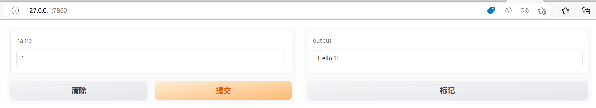
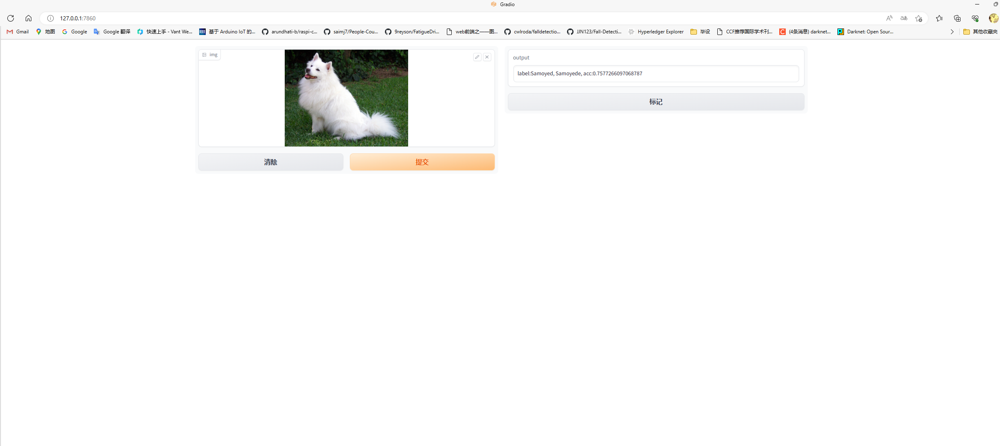

# Web库Gradio

## 1. 简介

Gradio是一个开源库，用于快速原型设计和部署机器学习模型的交互式界面。它提供了简单易用的接口，让用户能够轻松创建和展示机器学习模型，以及与其交互。

gitee地址：[https://gitee.com/mirrors/gradio](https://gitee.com/mirrors/gradio)

官方文档：[https://gradio.app/docs/](https://gradio.app/docs/)

本文涉及的部分代码见XEdu帮助文档配套项目集：[https://www.openinnolab.org.cn/pjlab/project?id=64f54348e71e656a521b0cb5&sc=645caab8a8efa334b3f0eb24#public](https://www.openinnolab.org.cn/pjlab/project?id=64f54348e71e656a521b0cb5&sc=645caab8a8efa334b3f0eb24#public)

## 2. 安装

Gradio可以采用pip命令安装，具体如下：

```python
pip install gradio
```

## 3. 代码示例

下面是一个使用Gradio创建一个简单交互式界面的示例代码：

```python
import gradio as gr

def greet(name):
    return f"Hello {name}!"

iface = gr.Interface(fn=greet, inputs="text", outputs="text")
iface.launch()

```

上面的示例中，定义了一个名为"greet"的函数，它接受一个名字作为输入，并返回一个带有问候语的字符串。然后使用`gr.Interface`创建一个接口，指定输入类型为文本，输出类型也为文本。最后，使用`launch`方法来启动界面。运行效果如下：



在网页中输入文字“xedu”后即可输出“Hello xedu”。函数“greet”的参数就是input的信息，返回的信息就输出到网页，好容易理解。

**技巧强调** 

我们知道浦育平台的容器是“藏”在网页背后的虚拟服务器（电脑），网页和Notebook作为交互接口，我们没有办法直接连接访问。而只要在launch()中增加参数“share=True”，就可以穿透内网直接用域名访问。也就是说，你随时可以把这个代码成为一个网页服务，让所有人都能访问！

如需让同一局域网下的设备访问，则可在最后一句`iface.launch()`中增加参数`server_name`。例如：`iface.launch(server_name="0.0.0.0")`。这样，其他设备就可以通过你的局域网 IP 地址访问该应用了，下同。


## 4. 借助Gradio部署简易AI应用

Gradio提供了多种部署选项，使您能够将您的智能应用部署到各种环境中。您可以将您的智能应用程序共享给其他人使用，无论是作为演示、原型验证还是实际应用。Gradio使部署变得简单而高效，让您能够专注于构建优秀的机器学习模型和交互式界面。

### 借助Gradio部署MMEdu模型

下面是一段Gradio调用MMEdu训练的图像分类模型的代码，运行这段代码，Gradio将启动一个交互式界面，您可以在其中上传图像并查看模型的预测结果。您需确保可以导入MMEdu库，且有MMEdu训练的模型，如何安装MMEdu和使用MMEdu训练模型，可参照[前文](https://xedu.readthedocs.io/zh-cn/master/mmedu.html)。

```python
import gradio as gr
from MMEdu import MMClassification as cls
model = cls(backbone = 'LeNet')
checkpoint='best_accuracy_top-5_epoch_4.pth'
def predict(img):
    result = model.inference(image=img, show=False, checkpoint=checkpoint)
    return str(result)
image = gr.inputs.Image(type="filepath")
iface = gr.Interface(fn=predict, inputs=image, outputs=gr.outputs.Textbox())
iface.launch(share=True)
```

运行效果如下：


您可以根据您的模型进行相应的修改和调整，以适应您的需求。例如对输出结果做一些修饰，参考代码如下：

```python
import gradio as gr
from MMEdu import MMClassification as cls
model = cls(backbone = 'LeNet')
checkpoint='checkpoints/cls_model/hand_gray/latest.pth'
def predict(img):
    result = model.inference(image=img, show=False, checkpoint=checkpoint)
    texts = []
    texts.append('Pred_label: {}'.format(result['pred_label']))
    texts.append('Pred_score: {:.2f}'.format(result['pred_score']))
    texts.append('Pred_label: {}'.format(result['pred_class']))
    text = '\n'.join(texts)
    return text

image = gr.inputs.Image(type="filepath")
iface = gr.Interface(fn=predict, inputs=image, outputs=gr.outputs.Textbox())
iface.launch(share=True)
```

### 借助Gradio部署ONNX模型

使用Gradio部署ONNX模型也是非常简单的，示例代码如下：

补充：ONNX（Open Neural Network Exchange）是一个开放的、跨平台的深度学习模型表示和转换框架。它的目标是解决不同深度学习框架之间的模型兼容性问题，此处使用的ONNX模型推理的代码是借助XEdu团队推出的模型部署工具[BaseDeploy](https://xedu.readthedocs.io/zh-cn/master/basedeploy/introduction.html)，代码较为简洁。关于基于MMEdu训练的模型转换为ONNX的说明可见[最后一步：AI模型转换与部署](https://xedu.readthedocs.io/zh-cn/master/mmedu/model_convert.html#ai)。

```python
import gradio as gr
from XEdu.hub import Workflow as wf

model_path = 'cls.onnx'
def predict(img):
    model = wf(task='mmedu',checkpoint=model_path)
    result = model.inference(img)
    return result
image = gr.inputs.Image(type="filepath")
iface = gr.Interface(fn=predict, inputs=image, outputs=gr.outputs.Textbox())
iface.launch(share=True)
```

运行效果如下：


