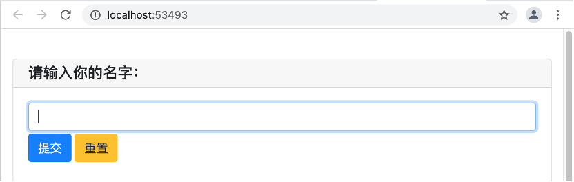

# Web库PyWebIO

## 1. 简介

顾名思义，PyWebIO库是一个基于Web方式来实现输入输出（I/O）的Python库。这是北京航空航天大学在读研究生王伟民同学用业余时间写的库。目前在GitHbu上获得了高达1.6K的Star。它允许用户像编写终端脚本一样来编写Web应用或基于浏览器的GUI应用，而无需具备HTML和JS的相关知识。

Github地址：[https://github.com/wang0618/PyWebIO](https://github.com/wang0618/PyWebIO)

本文涉及的部分代码见XEdu帮助文档配套项目集：[https://www.openinnolab.org.cn/pjlab/project?id=64f54348e71e656a521b0cb5&sc=645caab8a8efa334b3f0eb24#public](https://www.openinnolab.org.cn/pjlab/project?id=64f54348e71e656a521b0cb5&sc=645caab8a8efa334b3f0eb24#public)

## 2. 安装

PyWebIO可以采用pip命令安装，具体如下：

```python
pip install PyWebIO
```

注：MMEdu中已经内置了PyWebIO库。

## 3. 代码示例

PyWebIO提供了一系列命令式的交互函数来在浏览器上获取用户输入和进行输出，相当于将浏览器变成了一个“富文本终端”。如：

```python
from pywebio.input import *
from pywebio.output import *
# 文本输入
s = input('请输入你的名字：')
# 输出文本
put_text('欢迎你，' + s);
```

运行这段代码后，浏览器会自动打开一个本地的网址，出现这样的界面。



图1 初始网页界面

输入姓名再点击“提交”按钮，网页上就会输出相应的文字。这种基于Web页面的“交互”，体验比黑乎乎的终端界面要好很多。

PyWebIO支持常见的网页控件。既然PyWebI的定位就是输入和输出，那么也可以将网页控件分为这两类，部分控件的说明如表1所示。

表1 PyWebIO支持的网页控件（部分）

<table class="docutils align-default">
    <thead>
        <tr class="row-odd">
            <th class="head">类别</th>
            <th class="head">控件</th>
            <th class="head">代码范例</th>  
		</tr >
    </thead>
    <tbody>
        <tr class="row-even">
            <td rowspan="6">输入</td>
            <td>文本</td>
            <td>input("What's your name?")</td>
        </tr>
        <tr class="row-odd">
            <td>下拉选择</td>
            <td>select('Select', ['A', 'B'])</td>
        </tr>
        <tr class="row-even">
            <td>多选</td>
            <td>checkbox("Checkbox", options=['Check me'])</td>
        </tr>
        <tr class="row-odd">
            <td>单选</td>
            <td>radio("Radio", options=['A', 'B', 'C'])</td>
        </tr>
        <tr class="row-even">
            <td>多行文本</td>
            <td>textarea('Text', placeholder='Some text')</td>
        </tr>
        <tr class="row-odd">
            <td>文件上传</td>
            <td>file_upload("Select a file:")</td>
        </tr>
        <tr class="row-even">
            <td rowspan="6">输出</td>
            <td>文本</td>
            <td>put_text("Hello world!");</td>
        </tr>
        <tr class="row-odd">
            <td>表格</td>
            <td>put_table([['Product', 'Price'],['Apple', '$5.5'], ['Banner', '$7'],]);</td>
        </tr>
        <tr class="row-even">
            <td>图像</td>
            <td>put_image(open('python-logo.png', 'rb').read());</td>
        </tr>
        <tr class="row-odd">
            <td>通知消息</td>
            <td>toast('Awesome PyWebIO!!');</td>
        </tr>
        <tr class="row-even">
            <td>文件</td>
            <td>put_file('hello_word.txt', b'hello word!');</td>
        </tr>
        <tr class="row-odd">
            <td>Html代码</td>
            <td>put_html('E = mc<sup>2</sup>');</td>
        </tr>
    </tbody>
</table>


尤其值得称赞的是，PyWebIO还支持MarkDown语法。除了输入输出，PyWebIO还支持布局、协程、数据可视化等特性。通过和其他库的配合，可以呈现更加酷炫的网页效果，如图2所示。


图2 PyWebIO结合第三方库制作的数据可视化效果

如果需要了解更多关于PyWebIO库的资源，请访问github或者官方文档。

文档地址：[https://pywebio.readthedocs.io/](https://pywebio.readthedocs.io/)

## 4. 借助PyWebIO部署简易AI应用

在人工智能教学过程中，我们常常为模型的部署而烦恼。如果训练出来的模型不能有效应用于生活，或者解决一些真实问题，则很难打动学生，激发学习兴趣。

PyWebIO能够将AI模型快速“变身”为Web应用，上传一张照片就能输出识别结果，极大地提高了学生的学习收获感。

例如可以设计一个函数classification实现上传图片文件-使用MMEdu训练的模型进行图片推理-输出推理结果，当然您需确保可以导入MMEdu库，且有MMEdu训练的模型，如何安装MMEdu和使用MMEdu训练模型，可参照[前文](https://xedu.readthedocs.io/zh-cn/master/mmedu.html)。

```python
def classification():
    while True:
        # 文件输入
        s = file_upload("请上传图片:")
        img = cv2.imdecode(np.frombuffer(s['content'], np.uint8),
                           cv2.IMREAD_COLOR)  # s是一个文件对象，content是文件的二进制流，此方法将文件二进制流转换为np数组格式
        cv2.imwrite('latest1.jpg', img)  # 保存图片
        model = cls(backbone='LeNet')
        checkpoint = '../checkpoints/cls_model/hand_gray/latest.pth'
        result = model.inference(image='latest1.jpg', show=False, checkpoint = checkpoint)
        chinese_result = model.print_result(result)
        # 输出文本
        put_text("推理结果：", str(chinese_result))
```

再使用`start_server`方法将这个函数作为Web服务提供，设计端口号

```python
if __name__ == '__main__':
    start_server(classification, port=2222, cdn=False)
```