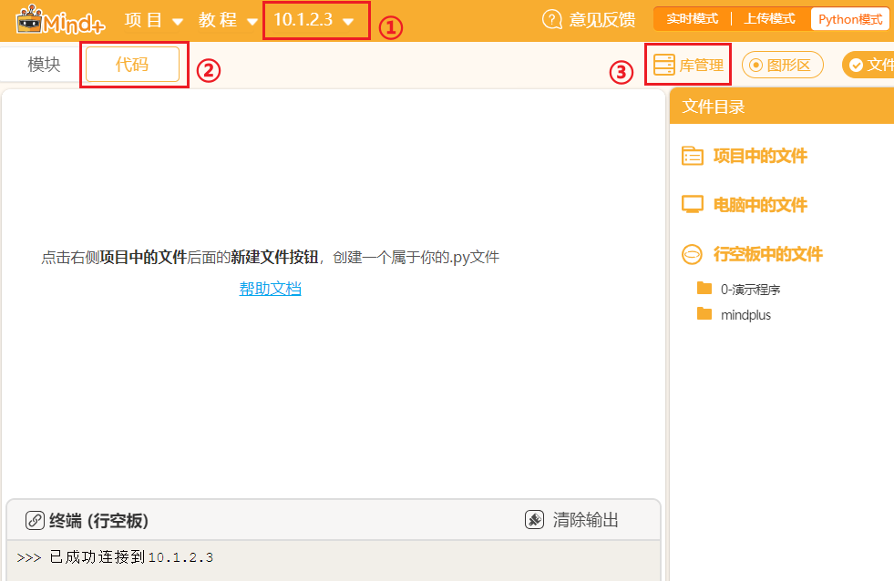
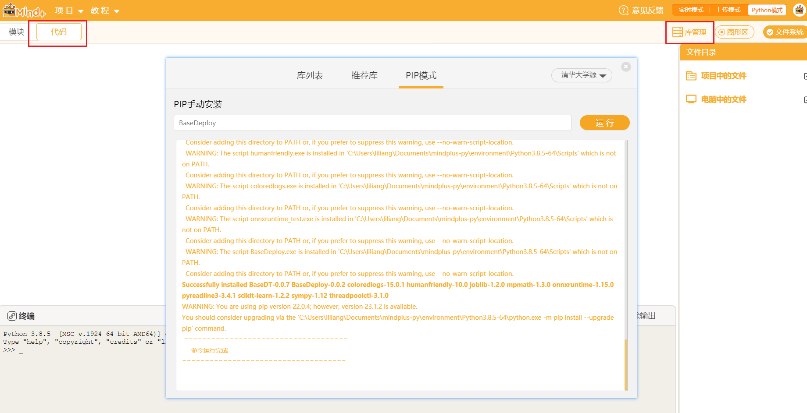

# 开源硬件行空板

## 1.简介

行空板是一款拥有自主知识产权的国产教学用开源硬件，采用微型计算机架构，集成LCD彩屏、WiFi蓝牙、多种常用传感器和丰富的拓展接口。同时，其自带Linux操作系统和python环境，还预装了常用的python库，让广大师生只需两步就能开始python教学。

快速使用教程：[https://www.unihiker.com.cn/wiki/get-started](https://www.unihiker.com.cn/wiki/get-started)

## 2.简单使用教程

### 1.选择合适的编程方式

行空板自身作为一个单板计算机可以直接运行Python代码，同时默认开启了ssh服务及samba文件共享服务，因此可以用任意的文本编辑器编写代码，然后将代码传输到行空板即可运行。

教程：[https://www.unihiker.com.cn/wiki/mindplus](https://www.unihiker.com.cn/wiki/mindplus)

### 2.行空板Python库安装

- 打开MInd+，**连接行空板**，切换到**代码**标签页，点击**库管理**，此时库管理页面左上角显示行空板logo，说明此处显示的是行空板的库管理。

- 如果你需要**卸载库**或者**更新库**则可以在**库列表**中进行操作。

- 如果**推荐库**中没有你需要的，则可以切换到**PIP模式**，在输入框中输入库名字安装，右上角可以切换不同的源，例如此处安装**dominate**则可以输入`dominate`或者完整指令 `pip install dominate`，或者指定版本安装`pip install dominate==2.5.1`,提示**"Successfully installed xxxx"**即表示安装成功。

  

例如可以在行空板安装我们的深度学习工具库[XEduHub](https://xedu.readthedocs.io/zh/master/xedu_hub.html)和模型部署库[BaseDeploy](https://xedu.readthedocs.io/zh/master/basedeploy.html)，Mind+中甚至可以添加XEduHub积木套件和BaseDeploy积木套件，更多说明详见[Mind+中的XEduHub积木块](https://xedu.readthedocs.io/zh/master/xedu_hub/introduction.html#mind-xeduhub)和[Mind+中的BaseDeploy积木块](https://xedu.readthedocs.io/zh/master/basedeploy/introduction.html#mind-basedeploy)。

## 3.部署模型到行空板

参考资料1-AI猜拳机器人：[https://mc.dfrobot.com.cn/thread-315543-1-1.html](https://mc.dfrobot.com.cn/thread-315543-1-1.html)

参考资料2-智能音箱：[https://xedu.readthedocs.io/zh/master/how_to_use/support_resources/works/p4-smartspeaker.html](https://xedu.readthedocs.io/zh/master/how_to_use/support_resources/works/p4-smartspeaker.html)

参考资料3-手搓图像识别硬件部署应用：[https://www.bilibili.com/video/BV1364y1T771?p=3](https://www.bilibili.com/video/BV1364y1T771?p=3)

更多AI用法：[https://www.unihiker.com.cn/wiki/ai_project](https://www.unihiker.com.cn/wiki/ai_project)

在浦育平台硬件工坊也可支持连接行空板，参考项目-行空板与XEdu：[https://openinnolab.org.cn/pjlab/project?id=65bc868615387949b281d622&backpath=/pjedu/userprofile?slideKey=project&type=OWNER#public](https://openinnolab.org.cn/pjlab/project?id=65bc868615387949b281d622&backpath=/pjedu/userprofile?slideKey=project&type=OWNER#public)