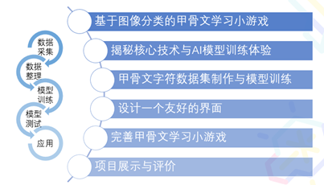

# 课程：趣味甲骨文学习小游戏

## 课程简介

《趣味甲骨文学习小游戏》是一门AI+传统文化主题的项目式学习课程，引导学生亲身参与从数据收集、模型训练到模型部署的完整过程。配合课程设计分成大任务和子任务，大任务是完成一个趣味甲骨文学习小游戏，小任务则围绕项目创作的流程进行拆分，包括主题选择、创意构思、数据准备、模型训练、游戏开发、测试优化等。使学生结合甲骨文的独特魅力，体验现代手写识别技术的神奇。借此项目，鼓励学生激发创意，设计并打造属于自己的甲骨文识别小游戏。在实践中，培养学生的团队合作、项目管理与沟通技巧。

适用范围：初中、高中；具备基本的计算机操作知识，有初步的编程经验。

## 课程内容

**实施成效预期：**

学生能够通过亲自动手实践，更深入地了解甲骨文与手写识别技术。

培养学生的创新思维和团队协作能力。

**项目预期成果【大任务】：**

每个小组将完成一个创意的趣味甲骨文学习小游戏，并能够在班级中展示其功能和特点。

**项目任务【分任务】：**

1.启蒙与体验：体验教师提供的甲骨文分类小游戏，探索其背后的技术原理。

2.主题选择：挑选几种具代表性的甲骨文字符，作为游戏的核心内容。

3.创意构思：思考你的甲骨文学习游戏的玩法、功能与界面设计。

4.数据准备：积极搜集和制作高质量的甲骨文字符图片。

5.模型训练：利用提供的工具或平台，训练一个能准确识别所选甲骨文的模型。

6.游戏开发：根据前期的构思，开始编程和制作你的趣味甲骨文学习小游戏。

7.团队测试：小组成员间先行测试游戏，收集反馈并迅速迭代优化。

8.班级分享：向全班展示你的作品，并积极听取同学们的反馈与建议，进一步完善。

9.举一反三：学以致用，设计自己的AI应用。

## 课程设计

**课程目标：**

需求与数据：认识ImageNet格式数据集；

算法与算力：了解图像分类常见算法和LeNet、体验模型训练超参数调整；

部署与交互：能制作简易的AI模型效果展示应用，掌握简单的用户界面设计技能教学内容。

**课时安排：**

**教学资源设计：**

联网的电脑、Chrome浏览器、浦育平台、XEdu工具。

准备了PPT、学习单。

**学习评价设计：**

**评价标准：**

1.项目完成度：游戏的功能是否齐全、是否运行流畅。

2.团队合作：每个组员的贡献如何，团队之间的沟通与合作是否顺畅。

3.创新性：游戏中有无新颖的功能或设计。

4.演示：展示的清晰度、组织性及与观众的互动情况。

**评价对象：**

1.小组之间的反馈：每个小组都需要对其他小组的项目给出反馈。

2.教师反馈：教师需要对每个小组的项目进行评价，并提供改进的意见。

## 课程链接

[https://www.openinnolab.org.cn/pjedu/courses/courseDetail?courseId=646caecf32f2ea160081ff42&sc=62f34141bf4f550f3e926e0e](https://www.openinnolab.org.cn/pjedu/courses/courseDetail?courseId=646caecf32f2ea160081ff42&sc=62f34141bf4f550f3e926e0e)