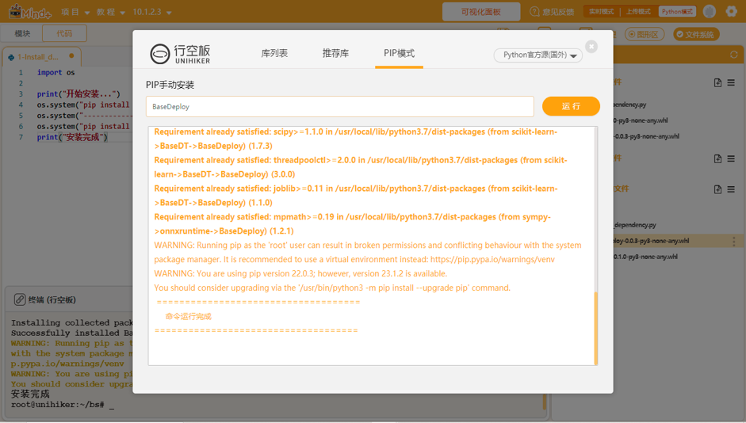
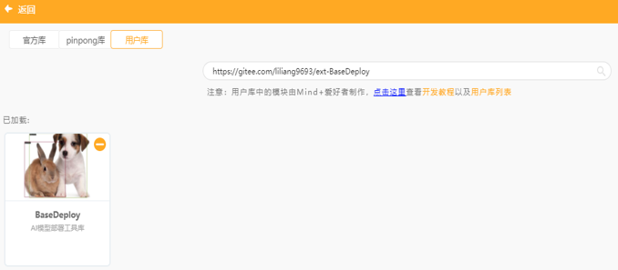
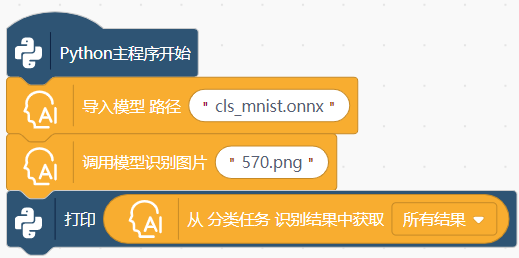

# 项目：在网页上训练一个AI模型并部署
## 项目背景

随着人工智能的发展和普及，深度学习已经成为人工智能的核心内容。越来越多的教育者认识到，不涉及到数据采集、模型训练和部署等内容，几乎不能称之为人工智能教育。为了降低深度学习的技术门槛，一些人工智能学习平台设计了基于Web页面的模型训练功能，即学生不需要编写代码，点点鼠标就能完成从采集数据、训练模型到推理的机器学习流程。我们将这种模型训练方式命名为Web前端模型训练。那么，这种基于网页前端训练出来的AI模型，能不能像其他模型一样，也可以部署到开源硬件，搭建出一个真正的AI应用？为此，我们对这个问题进行了深度探究，并成功实现了将一个通过Web前端训练对AI模型，转换为ONNX并部署到行空板上。

## 一、收集数据训练模型（含图片上传）

提供了Web前端模型训练功能的国内人工智能学习平台，主要有浦育、英荔和腾讯扣叮这几类。在Web前端训练一个AI模型的流程，和常见的机器学习流程是一致的，都要经历数据采集、模型训练和模型推理这三个环节，如图所示。


相对而言，浦育平台（OpenInnoLab）在TensorFlow.js的基础上做了二次开发，功能最为强大。其不仅实现了模型训练和推理演示，还与积木编程无缝融合，学生可以将模型推理结果应用在类似Scratch的编程上，与舞台上的各种角色互动。而英荔平台似乎是谷歌Teachable Machine的镜像网站，除了在线训练模型外，还能够下载训练好模型，并且提供了TensorFlow.js模型和h5模型（Keras框架使用的模型）的转换。

经过分析，通过TensorFlow.js训练的图像分类模型，采用的算法是谷歌团队提出的MobileNet v2。MobileNets系列的本身初衷是" for Mobile Vision Applications"，是一个轻量化的卷积网络模型，可以显著减少计算量和参数量，同时保持较高的准确率来提升效率，能够运行在算力不太高的移动设备上。

## 二、下载并转换模型

虽然英荔平台提供了h5格式的模型下载，而类似树莓派、行空板的开源硬件也能够安装Keras的环境，似乎看起来部署模型很简单。实际上h5模型的加载实在太慢了，一个简单的图像分类模型居然要2分钟才能完成，推理速度也很慢。我们在《当MMEdu遇上行空板——“智能稻草人”项目的后续研究》一文中，已经给出了在行空板上部署ONNX模型的方法。于是，我们在万能的GitHub找到了一个名为“tf2onnx”的库，先将h5模型转换为ONNX模型，然后部署在行空板上。

tf2onnx是一个将TensorFlow（tf-1.x或tf-2.x）、keras、tensorflow.js和tflite模型转换为ONNX的工具库，可通过命令行或Python API进行操作。安装tf2onnx库的同时，还需要部署好tensorflowjs的环境。安装过程有点长，具体安装时间受制于网络速度。

tf2onnx提供了多种转换方式。最方便的是调用命令行，参考命令如“python -m tf2onnx.convert --saved-model tensorflow-model-path --output model.onnx”。也可以调用Python API来完成转换，核心代码并不复杂，十来行代码即可完成。参考代码如下：

```
import tensorflow as tf
import tf2onnx
 
graph_def = tf.GraphDef()
with tf.gfile.GFile('input.pb', 'rb') as f:
    graph_def.ParseFromString(f.read())
 
with tf.Session() as sess:
    tf.import_graph_def(graph_def, name='')
    g = sess.graph
    onnx_model = tf2onnx.convert.from_session(sess, input_names=['input:0'], output_names=['output:0'])
    with open('output.onnx', 'wb') as f:
        f.write(onnx_model.SerializeToString())
```

具体转换流程如下：首先要将Web前端训练的模型下载到本地。下载的模型文件为一个压缩包，解压后可得到model.json和model.weights.bin两个文件。转换时，这两个文件要放在一个文件夹中。为了方便大家使用，我们在浦育平台上建了一个公开项目，只要将模型文件上传到平台，点击项目中的main.ipynb文件，并依次运行代码，不用修改任何路径，报成功转换后即表示运行成功。

参考项目：[https://openinnolab.org.cn/pjlab/project?id=645ddb8fd73dd91bcbf15083&sc=635638d69ed68060c638f979#public](https://openinnolab.org.cn/pjlab/project?id=645ddb8fd73dd91bcbf15083&sc=635638d69ed68060c638f979#public)

## 三、用Python编程完成模型推理

### 方式一：借助XEduHub

转换生成的ONNX模型可借助XEdu团队的XEduHub完成推理，参考代码如下：

```
from XEdu.hub import Workflow as wf
mmcls = wf(task='mmedu',checkpoint='model.onnx')# 指定使用的onnx模型
result, result_img =  mmcls.inference(data='test/0.png',img_type='pil')# 进行模型推理
format_result = mmcls.format_output(lang="zh")# 推理结果格式化输出
mmcls.show(result_img)# 展示推理结果图片
```

### 方式二：借助BaseDeploy

还有第二种推理方式，是借助XEdu团队的BaseDeploy库完成，参考代码如下：

```
import BaseDeploy as bd
model_path = 'model.onnx'
model = bd(model_path)
img = 'test/0.png'
result = model.inference(img)
model.print_result(result)
```

两种方式都兼容，方式二的最大优势见下文。

## 四、用mind积木编程完成模型推理

DFRobot的工程团队为BaseDeploy库设计了积木块，代表我们可以使用mind积木编程完成模型推理。

首先安装库：BaseDeploy



然后加载积木块：切换至“模块”编程—打开扩展—选择用户库—输入库链接—加载积木库。

库链接：[https://gitee.com/liliang9693/ext-BaseDeploy](https://gitee.com/liliang9693/ext-BaseDeploy)



最后编写程序，填写模型名称，将图片传入进行推理仅需4个积木块即可完成（程序里面需要资源文件需先上传）。



模型该如何上传到行空板上？打开**文件系统**，将文件拖入**项目中的文件**即可，在点击**运行**的时候Mind+会将**项目中的文件**里面的所有文件一起上传到行空板的mindplus文件夹中运行。

## 五、在行空板上部署模型

最后，我们可以连接行空板，只需将ONNX模型上传行空板，再编写推理代码，就可实现将模型部署到行空板上，简单操作可查看[部署模型到硬件的教程](https://xedu.readthedocs.io/zh/master/support_resources/model_convert.html#id11)。