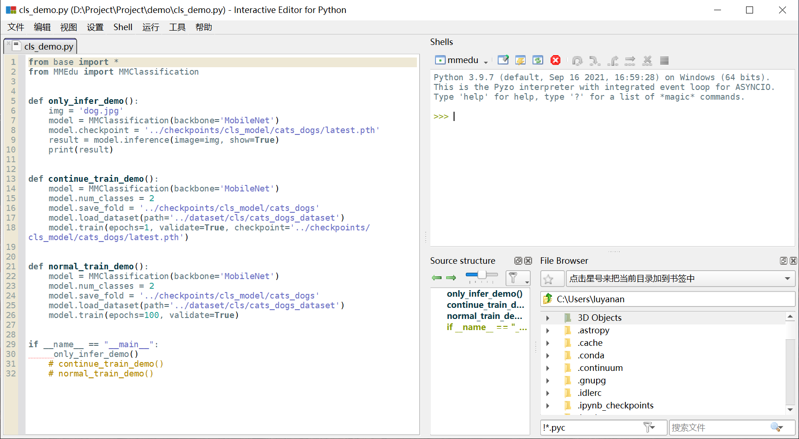
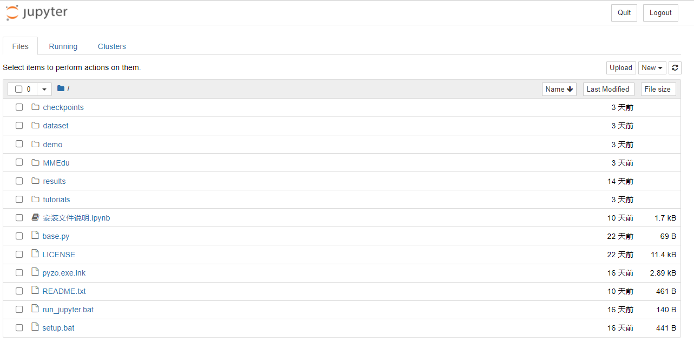
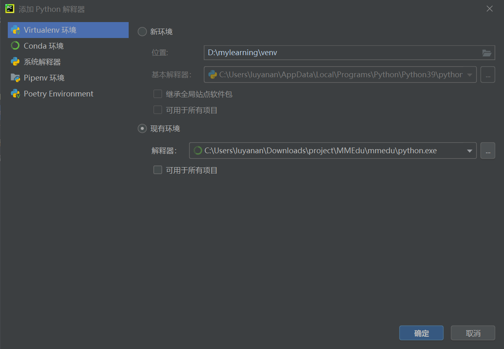
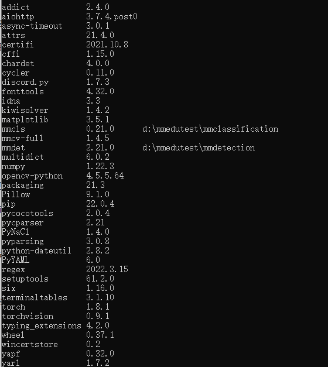

# MMEdu安装和下载

## 1.安装方式介绍

MMEdu有两个版本，分别是：基础版和标准版。

基础版提供快捷安装，即一键安装包。本版本集成了MMClassification（图像分类）和MMDetection（物体检测）两个模块，采用CPU训练（不需要GPU环境）。

标准版对算力要求较高，建议装在有英伟达显卡的电脑上，安装方式有pip安装和容器镜像安装两种。本版本集成了MMClassification（图像分类）、MMDetection（物体检测）、MMEditing（图像编辑）等模块，需要GPU环境支持。

## 2.基础版安装：一键安装包

为方便中小学教学，MMEdu团队提供了一键安装包。只要下载并解压MMEdu的Project文件，即可直接使用。

第一步：下载MMEdu最新版文件，并解压到本地，文件夹目录结构如下图所示。

 

图1 目录结构图

​	1）下载方式一

飞书网盘： https://p6bm2if73b.feishu.cn/drive/folder/fldcnfDtXSQx0PDuUGLWZlnVO3g

​	2）下载方式二

百度网盘：https://pan.baidu.com/s/19lu12-T2GF_PiI3hMbtX-g?pwd=2022 

​       提取码：2022

第二步：运行根目录的“steup.bat”文件，完成环境部署（如下图所示）。


图2 环境部署界面

第三步：您可以根据个人喜好，选择自己习惯的IDE。

1）使用MMEdu自带的Pyzo。

Pyzo是一款好用的Python轻量级IDE。其最突出的两个特点便是是简洁性和交互性。打开根目录下的pyzo.exe文件快捷方式即可打开pyzo，其指向“Tools”中的“pyzo.exe”。使用Pyzo打开“demo”文件夹中的py文件，如“cls_demo.py”，点击“运行”的“将文件作为脚本运行”即可运行代码，界面如下图所示。



图3 Pyzo界面图

2）使用MMEdu自带的Jupyter。

Jupyter Notebook是基于网页的用于交互计算的应用程序。其可被应用于全过程计算：开发、文档编写、运行代码和展示结果。它相对简单，对用户也更加友好，适合初学者。打开根目录下的“run_jupyter.bat”，即自动启动浏览器并显示界面，如下图所示。

图4 jupyter界面图

使用常用工具栏对代码进行操作，如“运行”，可以在单元格中编写文本或者代码（如下图中写了`print("hello")`代码的位置），执行代码的结果也将会在每个单元下方呈现。可以逐个运行单元格，每点击一次，仅运行一个单元格。单元格左侧[*]内的星号变为数字，表示该单元格运行完成。此时可打开“demo”文件夹中的ipynb文件，如“cls_notebook.ipynb”。


图5 jupyter运行界面

3）使用其他IDE。

如果您需要使用其他IDE，那么需要您自己配置Python编译器，配置方法如下。

- 配置环境路径 

①打开您的IDE，如PyCharm、Thonny等。

②配置Python编译器，路径为解压路径下的“MMEdu”文件夹下的“mmedu”文件夹中的“python.exe”文件。 PyCharm环境路径配置如下图所示。



图6 PyCharm的环境路径配置界面

- 执行demo文件 

用IDE打开解压路径下的py文件，如“cls_demo.py”，点击“运行”。运行效果应和pyzo一样。

## 3.标准版安装：pip安装

### 1）安装须知

```shell
python==3.9.7 
numpy==1.22.2 
torch==1.8.1+cu101 # cpu环境只需保证torch==1.8.1
torchvision==0.9.1 
torchaudio==0.8.1
mmcv-full==1.4.5 
mmcls=0.20.1
mmdet==2.21.0
mmpose==0.23.0
```

### 2）安装环境

- **安装python**

下载python，版本号3.9.7，勾选“Add Python 3.9 to PATH”将Python编辑器加入系统环境变量，完成安装。

- **安装anaconda**

anaconda是一个python的发行版，包括了python和很多常见的软件库, 和一个包管理器conda，我们后续可以在conda中创建一个新的虚拟环境来方便我们后续的包管理。可在[清华anaconda镜像源](https://security.feishu.cn/link/safety?target=https%3A%2F%2Fmirrors.tuna.tsinghua.edu.cn%2Fanaconda%2Farchive%2F&scene=ccm&logParams={"location"%3A"ccm_drive"}&lang=zh-CN)下载anaconda的安装包进行安装。

安装时注意勾选“Add Anaconda to the system PATH environment variable”将安装路径自动添加系统环境变量和“Register Anaconda as the system Python3.9”默认使用python的版本。

- **配置虚拟环境**

打开anaconda prompt后输入：

```
conda create -n openmmlab python==3.9.7
```

输入yes之后等待安装完成，然后激活你的新环境开始最后的配置：

```
conda activate openmmlab
```

### 3）安装相关依赖库

可以使用清华源进行pip安装（可以选择在本地安装，也可以激活虚拟环境在虚拟环境中安装）。

- **安装PyTorch 和 torchvision**

```
pip install torch==1.8.1 torchvision==0.9.1 -i https://pypi.tuna.tsinghua.edu.cn/simple
```

- **安装mmcv-full**

```
pip install mmcv-full==1.4.5 -i https://pypi.tuna.tsinghua.edu.cn/simple
```

注：如果您没有GPU加速计算，那么就安装普通版本的mmcv：

```
pip install mmcv
```

- **安装numpy**

```
pip install numpy==1.22.2 -i https://pypi.tuna.tsinghua.edu.cn/simple
```

### 4）安装mm模块

可以从GitHub上克隆mm模块的代码库并安装（同安装相关依赖库，可以选择两种方式安装）。

- **安装git**

下载链接：https://git-scm.com/download/win

- **安装mmcls**

新建文件夹，克隆mmclassification代码库。

```
git clone --branch v0.21.0 http://github.com/open-mmlab/mmclassification.git 
```

复制克隆下来的代码文件夹路径，使用cd命令切换到文件路径。

```
cd mmclassification 
```

安装。

```
pip install -e .
```

- **安装mmdet**

新建文件夹，克隆mmdetection代码库。

```
git clone --branch v2.21.0 https://github.com/open-mmlab/mmdetection.git 
```

复制克隆下来的代码文件夹路径，使用cd命令切换到文件路径。

```
cd mmdetection
```

安装。

```
pip install -v -e .
```

注：若遇“ERROR: Failed cleaning build dir for pycocotools”

解决方式：安装visual studio installer（版本高于2015即可）

下载地址：https://visualstudio.microsoft.com/zh-hans/thank-you-downloading-visual-studio/?sku=Community&channel=Release&version=VS2022&source=VSLandingPage&cid=2030&passive=false

安装时勾选工作负荷-桌面应用和移动应用-使用C++的桌面开发，安装完成后再次启动mmdet安装。

- **安装其他模块**

可以使用一样的安装方法安装其他模块。

### 5）查看已安装的模块

可通过查看已安装的模块，确认是否安装成功，可使用如下命令。

```
pip list
```



 图7 安装列表

## 4.标准版安装：容器镜像安装

敬请期待
