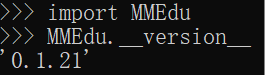

# MMEdu安装和下载

快速了解安装方式
================

根据对算力的依赖程度，MMEdu分为两个版本，分别是：基础版和完整版。

基础版既可以使用pip方式安装，也可以使用"[XEdu一键安装包](https://xedu.readthedocs.io/zh/latest/about/installation.html#id3)"。本版本集成了MMClassification（图像分类）和MMDetection（物体检测）两个模块，采用CPU训练（不需要GPU环境）。

完整版对算力要求较高，建议装在有英伟达显卡的电脑上，安装方式有pip安装和容器镜像安装两种。本版本集成了MMClassification（图像分类）、MMDetection（物体检测）、MMEditing（图像编辑）等模块，需要GPU环境支持。

## 1. 基础版的安装

### 1.1 一键安装包

为方便中小学教学，MMEdu团队提供了[XEdu一键安装包](https://xedu.readthedocs.io/zh/latest/about/installation.html#id3)。只要下载并解压即可直接使用。

**现MMEdu一键安装包已升级为XEdu一键安装包，下文提到的MMEdu文件，应理解为XEdu一键安装包。**

第一步：下载MMEdu（XEdu）最新版文件，并安装到本地，双击exe文件，选择安装路径后，点击Extract即可，安装后自动生成XEdu文件夹，文件夹内目录结构如下图所示。


 1）下载方式（即XEdu下载方式）

飞书网盘：<a href="https://p6bm2if73b.feishu.cn/drive/folder/fldcn67XTwhg8qIFCl8edJBZZQb">https://p6bm2if73b.feishu.cn/drive/folder/fldcn67XTwhg8qIFCl8edJBZZQb</a>

浦源CDN加速：[https://download.openxlab.org.cn/models/yikshing/bash/weight/xedu16](https://download.openxlab.org.cn/models/yikshing/bash/weight/xedu16)

第二步：您可以根据个人喜好，选择自己习惯的IDE。

1）使用XEdu自带的Thonny。

Thonny是一款好用的Python轻量级IDE。其最突出的两个特点便是是简洁性和交互性。打开根目录下的Thonny.bat文件快捷方式即可打开。使用Thonny打开"demo"文件夹中的py文件，如"MMEdu\_cls\_demo.py"，点击"运行"的"将文件作为脚本运行"即可运行代码，界面如下图所示。


2）使用XEdu自带的Jupyter。

Jupyter
Notebook是基于网页的用于交互计算的应用程序。其可被应用于全过程计算：开发、文档编写、运行代码和展示结果。它相对简单，对用户也更加友好，适合初学者。打开根目录下的"jupyter编辑器.bat"，即自动启动浏览器并显示界面，如下图所示。


使用常用工具栏对代码进行操作，如"运行"，可以在单元格中编写文本或者代码（如下图中写了`print("hello")`代码的位置），执行代码的结果也将会在每个单元下方呈现。可以逐个运行单元格，每点击一次，仅运行一个单元格。单元格左侧\[\*\]内的星号变为数字，表示该单元格运行完成。此时可打开"demo"文件夹中的ipynb文件，如"cls\_notebook.ipynb"。


3）使用其他IDE。

如果您需要使用其他IDE，那么需要您自己配置Python编译器，配置方法如下。

-   配置环境路径

①打开您的IDE，如PyCharm、Thonny等。

②配置Python编译器，路径为解压路径下的"MMEdu"文件夹下的"mmedu"文件夹中的"python.exe"文件。
PyCharm环境路径配置如下图所示。


-   执行demo文件

用IDE打开解压路径下的py文件，如"cls\_demo.py"，点击"运行"。运行效果应和pyzo一样。

4）使用cmd安装用户库。

python中最常用的库管理工具pip，可以使用cmd命令行来运行，打开根目录下的"启动cmd.bat"可以打开cmd命令行界面，如下图所示。


在其中输入想要安装的库文件即可，如"pip install rarfile"。

**在2022年9月后，不再维护MMEdu一键安装包，统一更新为XEdu。XEdu于22年9月在世界人工智能大会正式发布，分MMEdu、BaseML、BaseNN三个功能模块，除了一键安装包，发布会上线了以pip方式安装的XEdu。**
如`pip install BaseML BaseNN BaseDT BaseDeploy MMEdu` 

### 1.2 pip安装

当前，我们提供的MMEdu的安装是基础版的pip安装包，可以使用如下命令安装：
`pip install mmedu`或`pip install MMEdu`。

在这一步中，可能会有运行失败的情况，通常是由于依赖库安装失败导致的。

如果提示
**mmcv相关的错误**，可以尝试用：`pip install MMEdu -f https://download.openmmlab.com/mmcv/dist/cpu/torch1.8.0/index.html`
**推荐使用Python3.8 （64位）来进行安装** 。

如果仍然没有解决，请先卸载mmcv-full，然后再次安装。

第一步：`pip uninstall mmcv-full -y`

第二步：
`pip install MMEdu -f https://download.openmmlab.com/mmcv/dist/cpu/torch1.8.0/index.html`

该版本
**不支持CPU训练检测模型**，要想支持，需要升级mmdet库至2.23.0，具体步骤如下：

第一步：`pip uninstall mmdet pycocotools-windows -y`

第二步：`pip install pycocotools`

如果失败，可以考虑以下两种方案 ①下载whl进行本地安装（见<a href="https://aicarrier.feishu.cn/docx/K0D6d8VHLoN1zoxDb72cBlKynjc>">https://aicarrier.feishu.cn/docx/K0D6d8VHLoN1zoxDb72cBlKynjc></a>
）；
②安装Visual Studio进行编译安装。

第三步：`pip install mmdet==2.23.0`

如果想要
**升级为GPU版本**，可以将torch、torchvision和mmcv-full做一次升级。步骤如下：

第一步：确认安装好与电脑GPU适配的CUDA驱动（这里以cuda10.1为例）

第二步：卸载当前安装的版本：`pip uninstall torch torchvision mmcv-full -y`

第三步：安装合适的版本：`pip install torch==1.8.1+cu101 torchvision==0.9.1+cu101 torchaudio==0.8.1 -f https://download.pytorch.org/whl/torch_stable.html`

第四步：安装合适的mmcv-full：`pip install MMEdu -f https://download.openmmlab.com/mmcv/dist/cu101/torch1.8.0/index.html`

至此，已经完成了对MMEdu的GPU升级。

## 2. 完整版安装之pip安装

### 2.1 准备工作

强烈推荐你在Anaconda的基础上安装MMEdu，可以避免很多的版本冲突问题。

### 2.1.1 安装Anaconda

若您已经安装好conda，该步骤可跳过。

**下载**

首先打开Anaconda官网：<a href="https://www.anaconda.com/">https://www.anaconda.com/</a>

点击`Download`开始下载，下载完成后得到exe文件。

**安装**

双击exe文件即可开始安装（一般下载完成后会自动打开安装界面无需点击exe文件，若没有自动打开安装页面再点击此exe文件）。

打开安装界面后，依次选择`Next` -\> `I Agree` -\> `All Users` -\> `Next`
-\> `Next` -\> `Add Anaconda3 to the system PATH environment variable`
-\> `Install` -\> `Next` -\> `Next` -\> `Finish`

### 3.1.2 安装python编辑器

若您已经安装好合适的python编辑器，该步骤可跳过。

此处以安装Thonny为例，其他编辑器例如Pycharm，VScode等也支持，用户自行配置好Python编译器即可。

**下载**

首先打开Thonny官网：<a href="https://thonny.org/">https://thonny.org/</a>

右上角选择合适的操作系统点击下载，此处以windows为例

**安装**

双击exe文件即可开始安装（一般下载完成后会自动打开安装界面无需点击exe文件，若没有自动打开安装页面再点击此exe文件）

打开安装界面后，依次选择`Install for me only` -\> `Next` -\> `Next` -\>
`Next` -\> `Next` -\> `Next` -\> `Install` -\> `Finish`

**运行**

在安装好Thonny之后，在第一次运行的时候，会提示选择界面语言和初始设置，选择'Standard'模式即可。

**配置Thonny的Python解释器**

点击Thonny主界面右下角的Python版本号，可以选择对应的Python解释器，第一次配置点击`Configure inter preter`，弹出的窗口中，第一个下拉栏选择`可选的python3解释器或虚拟环境`，
第二个下拉栏找到自己之前安装的anaconda环境中的python解释器位置。点击确认即可使用该python解释器。

2.2 安装MMEdu(CPU版本)
----------------------

### 2.2.1 Linux安装MMEdu

点击鼠标右键，打开终端。

终端中输入pip install MMEdu即可安装。

``` {.powershell}
$ pip install MMEdu -f https://download.openmmlab.com/mmcv/dist/cpu/torch1.8.0/index.html
```

注：为避免出现版本冲突，建议新建一个conda环境，并在新环境中执行以上命令（注：要求python\<3.9）。

``` {.powershell}
$ conda create -n your_env_name python=3.8
$ conda activate your_env_name
$ pip install MMEdu -f https://download.openmmlab.com/mmcv/dist/cpu/torch1.8.0/index.html
```

注：请将命令中的"your\_env\_name"换成你喜欢的名称，如"mmedu"。

### 2.2.2 Windows安装MMEdu

同时按下win+r，输入cmd，回车，打开一个命令行窗口。

在命令行中使用pip安装即可。

``` {.powershell}
$ pip install MMEdu -f https://download.openmmlab.com/mmcv/dist/cpu/torch1.8.0/index.html
```

注：为避免出现版本冲突，建议新建一个conda环境，并在新环境中执行以上命令（注：要求python\<3.9）。

``` {.powershell}
$ conda create -n your_env_name python=3.8
$ conda activate your_env_name
$ pip install MMEdu -f https://download.openmmlab.com/mmcv/dist/cpu/torch1.8.0/index.html
```

2.3 安装MMEdu(GPU版本)
----------------------

首先安装对应自己cuda版本的pytorch，安装命令可在以下网址中进行查询：<a href="https://pytorch.org/get-started/locally/">https://pytorch.org/get-started/locally/</a>

可以在命令行中使用`nvidia-smi`指令查询自己的cuda版本。

例如，若cuda版本为10.1，想要安装1.8.1版本的pytorch，则安装命令为：

``` {.powershell}
$ pip install torch==1.8.1+cu101 torchvision==0.9.1+cu101 torchaudio==0.8.1 -f https://download.pytorch.org/whl/torch_stable.html
```

其次，根据torch版本和cuda版本安装mmcv。

``` {.powershell}
$ pip install mmcv-full -f https://download.openmmlab.com/mmcv/dist/{cu_version}/{torch_version}/index.html
```

其中 `{cu_version}` 和 `{torch_version}`
根据自身需求替换成实际的版本号。

例如想安装和 `CUDA 10.1`、`PyTorch 1.8.0` 兼容的
`mmcv-full`，使用如下替换过的命令

``` {.powershell}
$ pip install mmcv-full==1.4.5 -f https://download.openmmlab.com/mmcv/dist/cu101/torch1.8.0/index.html
```

最后安装MMEdu。

``` {.powershell}
$ pip install MMEdu -f https://download.openmmlab.com/mmcv/dist/cpu/torch1.8.0/index.html
```

## 3. 完整版安装之docker容器

请参考XEdu的docker容器：[https://xedu.readthedocs.io/zh/master/about/installation.html#docker](https://xedu.readthedocs.io/zh/master/about/installation.html#docker)

## 4. 查看MMEdu版本

打开python终端，执行以下命令即可查看MMEdu版本。当前最新版本是0.1.21。



注：目前版本MMEdu仅支持CPU。

## 5. 卸载MMEdu库

如果MMEdu库出现异常情况，可以尝试使用如下命令卸载MMEdu然后再使用install命令安装。

    $ pip uninstall MMEdu -y
